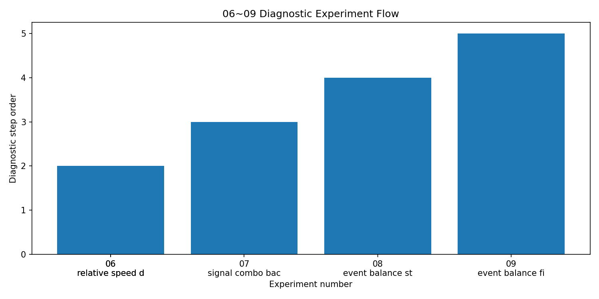
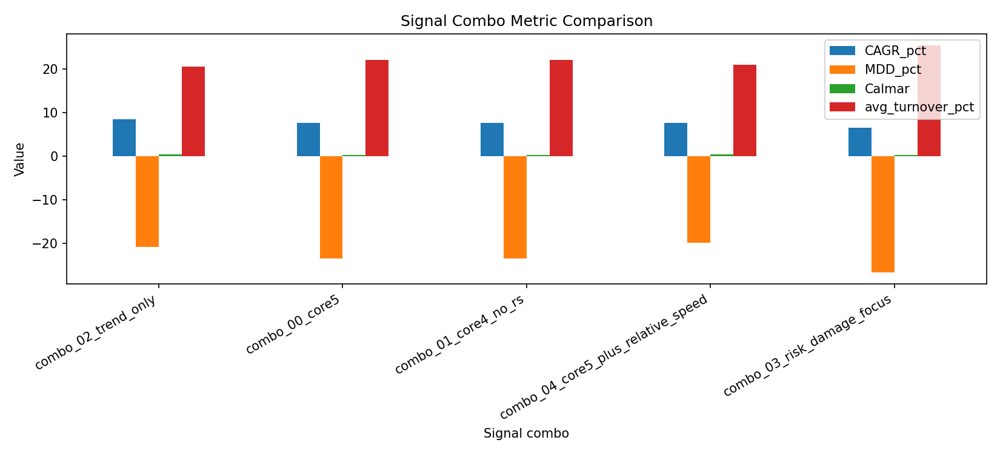
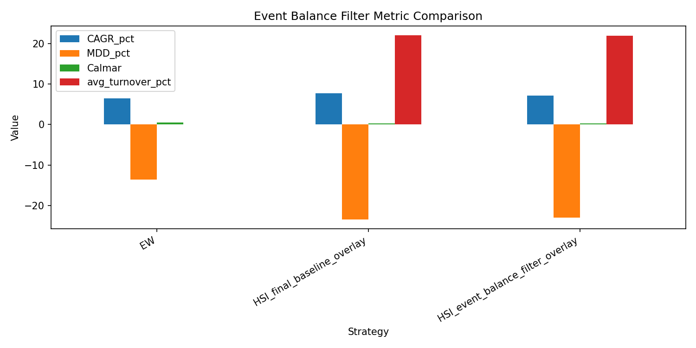
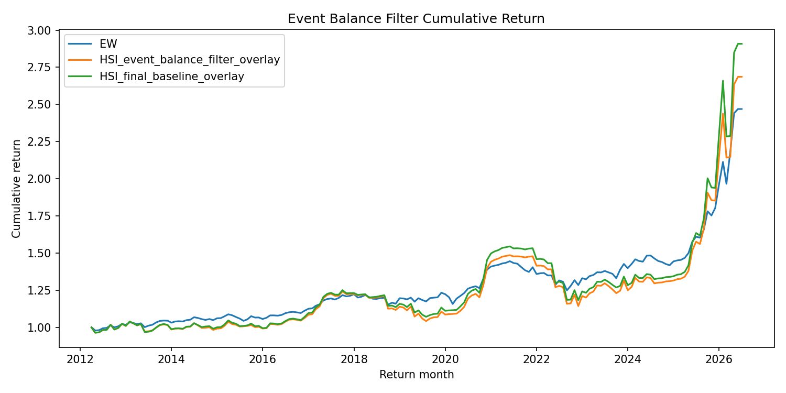
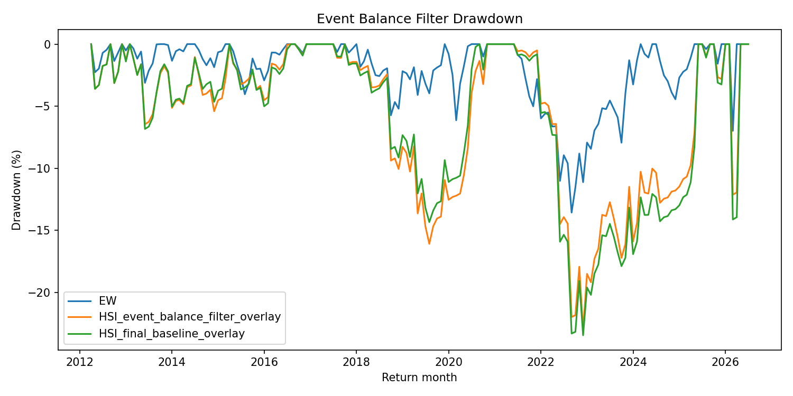

# 06_09_Signal_combo_and_event_balance_diagnostic

## 실험명
**06~09번 Signal combo와 Event balance 진단: HSI 보조 신호가 최종 후보를 바꾸는지 확인**

## 1. 작성 목적

이 보고서는 06번부터 09번까지의 보조 진단 실험을 하나로 정리한다. 핵심 목적은 HSI baseline 이후에 추가한 확장 신호, 상대속도, 신호 조합, 사건균형 필터가 최종 전략 후보를 바꿀 만큼 강한 개선을 만들었는지 확인하는 것이다.

중요한 점은 06~09번이 “최적 조합 탐색”이나 “신호 추가 경쟁”을 목적으로 한 실험이 아니라는 것이다. 이 구간의 역할은 HSI 상태분류가 특정 신호 조합이나 사건균형 보조지표에 과도하게 의존하지 않는지 점검하고, 최종 후보 선정에서 Lambda 부분조정의 필요성을 더 분명히 하는 것이다.

---

## 2. 06~09번 역할 요약

| 번호 | 실험명 | 역할 | 최종 사용 | 판단 |
| --- | --- | --- | --- | --- |
| 06 | extended signal inputs | 신호 후보 확장 | 보조 진단 | 최종 후보를 직접 만들기보다 07번 조합 실험의 입력으로 사용 |
| 06 | relative speed diagnostics | HSI 내부 반응속도 진단 | 보조 진단 | 선행/후행 예측값이 아니라 신호별 반응속도 비교용 |
| 07 | signal combo backtests | 신호 조합 민감도 확인 | 보조 진단 | 일부 조합 성과는 개선되지만 Turnover와 위험지표 기준으로 최종 후보는 아님 |
| 08 | event balance state diagnostic | 사건균형지표와 HSI 상태 정합성 확인 | 해석 보조 | HSI 상태를 대체하지 않고 상태 해석 보조로 제한 |
| 09 | event balance filter backtest | ±5~10%p 보조 비중 조정 실험 | 보조 필터 | 최종 후보를 바꿀 정도의 개선은 확인되지 않음 |



06~09번 실험은 모두 최종 후보를 직접 만드는 실험이라기보다 HSI 구조를 점검하는 보조 실험이다. 특히 relative speed와 event balance는 HSI를 대체하는 신호가 아니라, HSI 내부 신호의 반응 차이와 상태 해석의 정합성을 보는 진단 layer로 둔다.

relative speed(설명: 특정 신호가 같은 ETF의 HSI 중심 흐름보다 빠르게 위험 악화 또는 위험 완화 방향으로 움직이는지 비교하는 값이다.)  
event balance(설명: 위험 누적과 완화 누적의 균형을 보는 보조 지표이다. 본 프로젝트에서는 HSI 상태를 대체하지 않고 해석 보조 또는 작은 비중 조정에만 사용한다.)

---

## 3. 사용 데이터와 원천 파일

| 원천 파일 | 계열 | 행 수 | 포함 전략 | 상태 | 비고 |
| --- | --- | --- | --- | --- | --- |
| main_final_event_balance_filter_backtest_timeseries.csv | event_balance_filter | 516 | EW, HSI_event_balance_filter_overlay, HSI_final_baseline_overlay | OK | 최종 후보 선정 입력으로 사용 |
| main_final_signal_combo_backtest_timeseries.csv | signal_combo | 1032 | EW, combo_00_core5, combo_01_core4_no_rs, combo_02_trend_only, combo_03_risk_damage_focus, combo_04_core5_plus_relative_speed | OK | 최종 후보 선정 입력으로 사용 |

06~09번 결과는 최종 후보 선정 파일에도 일부 반영되어 있다. Signal combo 계열은 `main_final_signal_combo_backtest_timeseries.csv`에서, Event balance filter 계열은 `main_final_event_balance_filter_backtest_timeseries.csv`에서 생성된 결과를 사용하였다.

---

## 4. 기본 신호 방향과 사용 가능성

### 4.1 신호 방향 해석

| 신호 | 원신호 방향 | HSI 부호 | 해석 |
| --- | --- | --- | --- |
| return | 높을수록 양호 | 반전(-) | 수익률↑ → 위험 완화 |
| ma_pos | MA 위=양호 | 반전(-) | 이동평균 상회 → 위험 완화 |
| momentum | 높을수록 양호 | 반전(-) | 모멘텀↑ → 위험 완화 |
| vol | 높을수록 위험 | 유지(+) | 변동성↑ → 위험 악화 |
| rs | 기준 대비 강함=양호 | 반전(-) | 상대강도↑ → 위험 완화 |

HSI는 원신호를 그대로 좋은 값/나쁜 값으로만 사용하지 않는다. 예를 들어 수익률이나 모멘텀이 높으면 위험 완화 방향으로 해석하고, 변동성이 높으면 위험 악화 방향으로 해석한다. 따라서 신호 방향을 잘못 지정하면 HSI 상태분류가 뒤집혀 해석될 수 있다.

### 4.2 신호 availability 요약

| ticker | rows | ret_1m_available_ratio_pct | ret_3m_available_ratio_pct | ma_gap_available_ratio_pct | momentum_available_ratio_pct | volatility_available_ratio_pct | relative_strength_available_ratio_pct | ret_6m_available_ratio_pct | ret_12m_available_ratio_pct | drawdown_available_ratio_pct | shock_count_available_ratio_pct | defensive_rs_available_ratio_pct |
| --- | --- | --- | --- | --- | --- | --- | --- | --- | --- | --- | --- | --- |
| 69500.00 | 3486.00 | 99.40 | 98.19 | 98.31 | 99.40 | 99.43 | 99.40 | 96.39 | 92.77 | 100.00 | 100.00 | 99.43 |
| 114260.00 | 3486.00 | 99.40 | 98.19 | 98.31 | 99.40 | 99.43 | 99.40 | 96.39 | 92.77 | 100.00 | 100.00 | 99.43 |
| 153130.00 | 3486.00 | 99.40 | 98.19 | 98.31 | 99.40 | 99.43 | 99.40 | 96.39 | 92.77 | 100.00 | 100.00 | 99.43 |

신호 availability는 각 ETF별로 HSI 입력 신호가 얼마나 사용 가능한지 보여준다. 신호 조합 실험에서는 모든 신호를 무조건 추가하기보다, 실제로 해석 가능한 신호와 자산 특성을 고려해야 한다.

---

## 5. 06번 확장 신호와 상대속도 진단

06번에서는 기본 HSI 신호 외에 1·3·6·12개월 수익률, 이동평균 gap, 변동성, drawdown, 현금성 자산 대비 상대강도 등 확장 신호 후보를 만들었다. 또한 relative speed 진단을 통해 특정 신호가 HSI 중심 흐름보다 빠르게 위험 악화 또는 위험 완화 방향으로 움직이는지 확인하였다.

다만 상대속도는 선행지표가 아니다. 이 값은 “미래를 예측한다”는 의미가 아니라, HSI 내부에서 빠르게 반응하는 신호와 느리게 반응하는 신호의 차이를 보여주는 진단값이다.

상대속도는 개별 신호 변화량이 HSI 전체 중심 변화량보다 빠른지 느린지를 비교하는 진단값이다. 본 프로젝트에서는 이를 독립적인 미래수익률 예측 신호로 사용하지 않고, HSI 상태 변화가 어떤 내부 신호의 빠른 반응에서 비롯되었는지 설명하는 보조 지표로 해석한다.

---

## 6. 07번 Signal combo 백테스트

Signal combo 실험은 다음 조합을 비교하였다.

| 조합 | 설명 |
|---|---|
| combo_00_core5 | return, ma_pos, momentum, vol, relative strength |
| combo_01_core4_no_rs | core5에서 relative strength 제외 |
| combo_02_trend_only | return, ma_pos, momentum 중심 |
| combo_03_risk_damage_focus | return, ma_pos, vol 중심 |
| combo_04_core5_plus_relative_speed | core5에 relative speed 추가 |

### 6.1 Signal combo 성과 요약

| 전략 | 발표 역할 | CAGR(%) | MDD(%) | Sharpe | Calmar | 평균 Turnover(%) | 최대 Turnover(%) | 판단 | 메모 |
| --- | --- | --- | --- | --- | --- | --- | --- | --- | --- |
| combo_02_trend_only | 신호 조합 진단 | 8.545 | -20.901 | 0.668 | 0.409 | 20.669 | 70.000 | combo_observation_candidate | 신호 조합 변화에 따른 상태분포, 성과, MDD, Turnover 안정성을 보기 위한 진단 후보이다. |
| combo_00_core5 | 신호 조합 진단 | 7.732 | -23.459 | 0.611 | 0.330 | 22.093 | 70.000 | combo_diagnostic_only | 신호 조합 변화에 따른 상태분포, 성과, MDD, Turnover 안정성을 보기 위한 진단 후보이다. |
| combo_01_core4_no_rs | 신호 조합 진단 | 7.732 | -23.459 | 0.611 | 0.330 | 22.093 | 70.000 | combo_diagnostic_only | 신호 조합 변화에 따른 상태분포, 성과, MDD, Turnover 안정성을 보기 위한 진단 후보이다. |
| combo_04_core5_plus_relative_speed | 신호 조합 진단 | 7.699 | -19.864 | 0.618 | 0.388 | 21.017 | 70.000 | combo_diagnostic_only | 신호 조합 변화에 따른 상태분포, 성과, MDD, Turnover 안정성을 보기 위한 진단 후보이다. |
| combo_03_risk_damage_focus | 신호 조합 진단 | 6.522 | -26.724 | 0.529 | 0.244 | 25.523 | 70.000 | combo_diagnostic_only | 신호 조합 변화에 따른 상태분포, 성과, MDD, Turnover 안정성을 보기 위한 진단 후보이다. |



Signal combo 결과에서 일부 조합은 HSI baseline보다 CAGR이 높거나 MDD가 낮아 보일 수 있다. 예를 들어 trend 중심 조합은 성과 측면에서 눈에 띄는 구간이 있다. 그러나 평균 Turnover와 최대 Turnover가 여전히 높고, 최종 후보 선정표에서는 대부분 `exclude_turnover` 또는 보조 진단 성격으로 남았다.

따라서 07번의 결론은 “새 신호 조합이 최종 후보를 대체했다”가 아니라, “HSI 상태분류는 신호 조합에 따라 민감하게 바뀔 수 있으므로 최종 후보 판단에는 Turnover와 위험조정지표가 함께 필요하다”이다.

---

## 7. 08번 Event balance 상태 진단

08번은 사건균형지표와 HSI 상태가 해석상 정합적인지 확인하는 단계이다. 이 단계에서는 백테스트를 하지 않는다. 즉, event balance를 곧바로 전략으로 쓰는 것이 아니라, HSI 상태분류가 위험 누적과 완화 누적의 흐름과 맞물리는지 진단한다.

이 실험의 안전한 해석은 다음과 같다.

```text
event balance는 HSI 상태를 대체하지 않는다.
event balance는 HSI 상태 해석을 보조한다.
event balance는 최종 비중을 크게 뒤집는 신호가 아니다.
```

이 구분은 중요하다. event balance를 독립 신호처럼 크게 쓰면 조합 수가 폭증하고, 과최적화 위험이 커진다. 따라서 본 프로젝트에서는 event balance를 작은 보조 조정 또는 설명 layer로 제한하였다.

---

## 8. 09번 Event balance filter 백테스트

09번에서는 event balance를 HSI 상태별 목표비중에 ±5~10%p 수준으로만 반영하는 soft filter로 실험하였다. 핵심 원칙은 다음과 같다.

| 원칙 | 설명 |
|---|---|
| HSI 5상태가 기본 비중 결정 | event balance가 HSI를 대체하지 않음 |
| 위험 누적이 강하면 | 위험자산 일부를 현금성 자산으로 이동 |
| 완화 누적이 강하면 | 현금성 자산 일부를 위험자산으로 이동 |
| 조정폭 제한 | 5~10%p 이내로 제한 |

### 8.1 Event balance filter 비교표

| 전략 | 계열 | 발표 역할 | CAGR(%) | MDD(%) | Sharpe | Calmar | 평균 Turnover(%) | 최대 Turnover(%) | 판단 | 메모 |
| --- | --- | --- | --- | --- | --- | --- | --- | --- | --- | --- |
| EW | benchmark | 단순 비교 기준 | 6.510 | -13.571 | 0.832 | 0.480 | 0.000 | 0.000 | benchmark_only | 단순 동일가중 비교 기준이다. |
| HSI_final_baseline_overlay | baseline | 즉시비중 baseline | 7.732 | -23.459 | 0.611 | 0.330 | 22.093 | 70.000 | baseline_not_final | HSI 상태를 비중으로 연결하는 기준선이지만, 즉시비중 구조로 인해 MDD와 Turnover 부담이 커 최종 전략으로 단정하지 않는다. |
| HSI_event_balance_filter_overlay | event_balance_filter | 사건균형 보조 필터 | 7.137 | -23.036 | 0.600 | 0.310 | 21.919 | 75.000 | diagnostic_filter_candidate | 사건균형 필터는 실제 작동했으나 개선 폭이 제한적이므로 진단·보조 후보로 해석한다. |
| lambda_0.1 | lambda_partial_adjustment | 느린 부분조정 후보 | 8.655 | -14.744 | 0.793 | 0.587 | 2.515 | 6.017 | primary_review_candidate | MDD와 Turnover 완화가 강한 느린 조정 후보이다. 수익성 둔화 여부를 함께 본다. |
| lambda_0.3 | lambda_partial_adjustment | 균형형 부분조정 후보 | 9.085 | -15.220 | 0.782 | 0.597 | 6.950 | 20.012 | primary_review_candidate | CAGR, MDD, Turnover 균형이 비교적 좋아 우선 검토 후보로 둔다. 최적값으로 단정하지 않는다. |



Event balance filter는 HSI baseline과 비슷한 구조를 유지하면서 일부 비중을 보조 조정한다. 그러나 최종 후보인 Lambda 0.1과 Lambda 0.3에 비해 Turnover와 MDD 부담을 충분히 낮추지 못했다. 따라서 event balance filter는 최종 후보가 아니라 해석 보조 필터로 분류한다.

### 8.2 누적수익률과 Drawdown





누적수익률과 drawdown 경로에서도 event balance filter가 HSI baseline을 완전히 대체할 만큼 뚜렷한 개선을 보인다고 말하기는 어렵다. 특히 목표비중 전환 속도 문제는 event balance가 아니라 Lambda 부분조정에서 더 직접적으로 해결된다.

---

## 9. 최종 해석

06~09번의 핵심 결론은 다음과 같다.

| 구분 | 결론 |
|---|---|
| 확장 신호 | HSI 구조를 풍부하게 설명하지만 최종 후보 자체는 아님 |
| relative speed | 예측 신호가 아니라 HSI 내부 반응속도 진단값 |
| signal combo | 일부 조합은 성과가 개선되지만 Turnover와 위험지표 기준에서 최종 후보는 아님 |
| event balance diagnostic | HSI 상태 해석 보조에는 유용 |
| event balance filter | 작은 비중 조정 실험으로는 최종 후보를 바꾸지 못함 |
| 최종 연결 | Lambda 0.1과 Lambda 0.3이 최종 후보로 유지됨 |

---

## 10. 후속 실험과의 연결

06~09번은 HSI 신호 구조를 더 많이 추가하거나 바꾸는 방향의 실험이었다. 하지만 최종 후보 선정에서는 신호를 더 복잡하게 만드는 것보다, HSI 상태가 실제 ETF 비중으로 반영되는 속도를 조절하는 Lambda 구조가 더 중요한 개선 장치로 남았다.

연결 흐름은 다음과 같다.

```text
00~05번: HSI baseline 구조 확인
06~09번: 신호 조합과 event balance 보조 진단
10번: Lambda 부분조정으로 비중 이동 속도 완화
11번: Theta 상태분류 민감도 확인
12~15번: Macro companion 보조 layer 확인
16~17번: Robustness와 BM alignment 확인
20~23번: 최종 후보 Lambda 0.1 / Lambda 0.3 선정
```

따라서 06~09번은 “실패한 실험”이 아니라, 최종 후보가 왜 더 복잡한 신호 조합이 아니라 Lambda 부분조정으로 좁혀졌는지를 설명해 주는 중요한 중간 실험이다.

---

# 별도 첨부 1. 입출력 구조표

| 구분 | 파일명 | 역할 | 주요 컬럼 | 저장 위치 |
|---|---|---|---|---|
| 입력 | `main_final_monthly_signal_inputs_long.csv` | 기본 HSI 신호 입력 | score_return, score_ma_pos, score_momentum, score_vol, score_rs | `data/processed/` |
| 입력 | `main_final_relative_speed_long.csv` | 상대속도 진단 입력 | signal_velocity, centroid_velocity, relative_velocity | `data/processed/` |
| 입력 | `main_final_hsi_event_balance_monthly.csv` | 사건균형지표 입력 | event_balance, event_intensity | `data/processed/` |
| 출력 | `main_final_signal_combo_backtest_timeseries.csv` | 신호 조합별 백테스트 시계열 | combo_id, strategy_return, turnover | `data/processed/` |
| 출력 | `main_final_event_balance_filter_backtest_timeseries.csv` | event balance filter 백테스트 시계열 | strategy_name, return, turnover | `data/processed/` |
| 출력 | `main_final_06_09_signal_combo_comparison_summary.csv` | 06~09번 보고서용 signal combo 요약표 | CAGR, MDD, Turnover | `output/tables/` |
| 출력 | `main_final_06_09_event_balance_filter_comparison_summary.csv` | event balance filter 비교표 | CAGR, MDD, Turnover | `output/tables/` |
| 출력 | `main_final_06_09_event_balance_timeseries_subset.csv` | event balance 그림용 시계열 subset | cumulative_return, drawdown | `output/tables/` |
| 출력 | `main_final_06_09_diagnostic_role_summary.csv` | 06~09번 역할 요약표 | experiment, role, decision | `output/tables/` |

---

# 별도 첨부 2. 입출력 데이터 분류표

| 데이터 분류 | 파일명 | 설명 | 최종 전략 사용 여부 | 보고서 사용 위치 |
|---|---|---|---|---|
| processed | `main_final_extended_signal_inputs_tidy.csv` | 확장 신호 후보 | 보조 진단 | 06번 설명 |
| processed | `main_final_relative_speed_long.csv` | 상대속도 진단값 | 보조 진단 | 06번 설명 |
| processed | `main_final_signal_combo_backtest_timeseries.csv` | 신호 조합별 백테스트 | 최종 후보 아님 | 07번 설명 |
| processed | `main_final_event_balance_state_diagnostic.csv` | HSI 상태와 event balance 정합성 | 해석 보조 | 08번 설명 |
| processed | `main_final_event_balance_filter_backtest_timeseries.csv` | event balance filter 백테스트 | 최종 후보 아님 | 09번 설명 |
| report_output | `main_final_06_09_signal_combo_comparison_summary.csv` | signal combo 비교 요약 | 사용 | 본문 표 |
| report_output | `main_final_06_09_event_balance_filter_comparison_summary.csv` | event balance filter 비교 요약 | 사용 | 본문 표 |
| report_output | `main_final_06_09_signal_combo_metric_comparison.png` | signal combo 지표 비교 | 사용 | 본문 그림 |
| report_output | `main_final_06_09_event_balance_filter_metric_comparison.png` | event balance filter 지표 비교 | 사용 | 본문 그림 |

---

# 별도 첨부 3. 보고서용 최종 요약 문장

06~09번 실험에서는 HSI baseline 이후 확장 신호, 상대속도, 신호 조합, 사건균형 필터를 순서대로 검토하였다. 일부 신호 조합은 CAGR이나 MDD 측면에서 개선 가능성을 보였지만, Turnover와 위험조정 성과 기준을 함께 적용하면 최종 후보를 바꿀 정도의 안정적인 개선은 확인되지 않았다. Event balance도 HSI 상태 해석을 보조하는 데는 유용했지만, HSI 상태를 대체하거나 최종 비중을 크게 뒤집는 신호로 사용하기에는 제한적이었다. 따라서 06~09번은 최종 후보를 만드는 실험이라기보다, HSI 구조를 점검하고 이후 Lambda 부분조정으로 넘어가는 이유를 설명하는 보조 진단 실험으로 해석한다.

---

# 새로 생성된 산출물 저장 위치 정리

## docs/ 로 옮길 보고서 md 파일

```text
06_09_Signal_combo_and_event_balance_diagnostic.md
```

## output/tables/ 로 옮길 csv 표 파일

```text
main_final_06_09_signal_combo_comparison_summary.csv
main_final_06_09_event_balance_filter_comparison_summary.csv
main_final_06_09_event_balance_timeseries_subset.csv
main_final_06_09_diagnostic_role_summary.csv
```

## output/figures/ 로 옮길 png 그림 파일

```text
main_final_06_09_signal_combo_metric_comparison.png
main_final_06_09_event_balance_filter_metric_comparison.png
main_final_06_09_event_balance_filter_cumulative_return.png
main_final_06_09_event_balance_filter_drawdown.png
main_final_06_09_diagnostic_role_map.png
```

## data/processed/ 로 옮길 파일

```text
없음
```

이번 작업에서 새로 만든 `event_balance_timeseries_subset`은 원천 시계열이 아니라 보고서 그림용 subset이므로 `output/tables/`에 두는 것이 적절하다. 원천 가공 데이터는 기존 `data/processed/` 파일을 그대로 사용한다.
