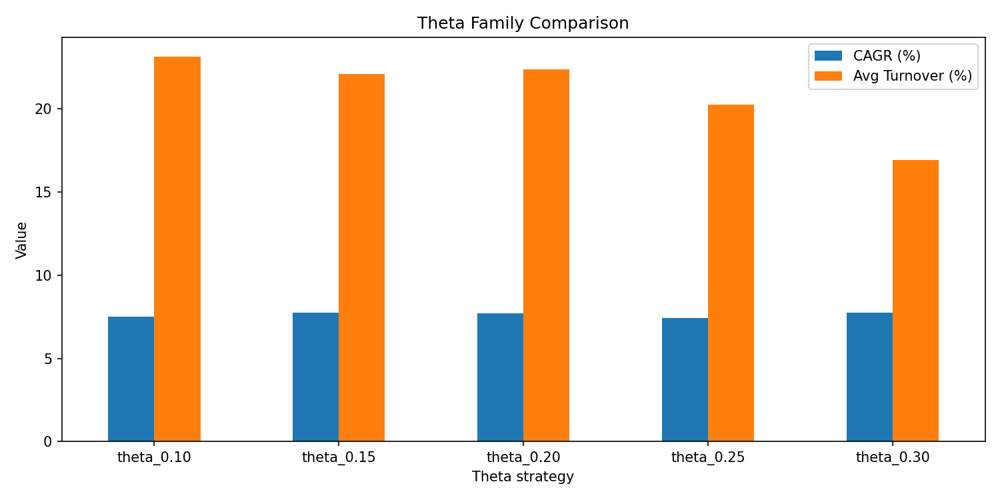
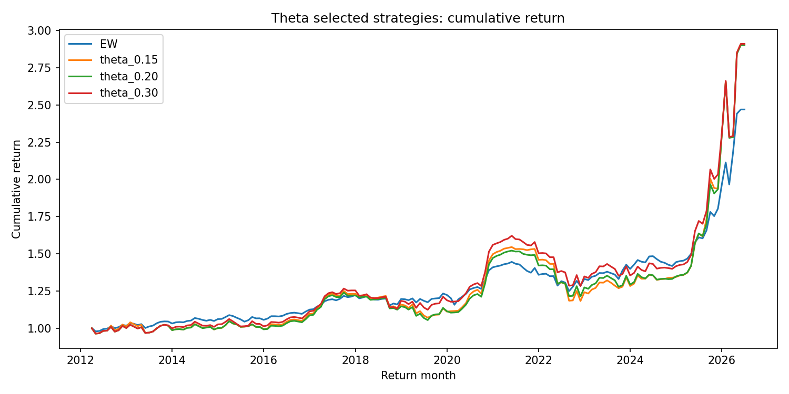
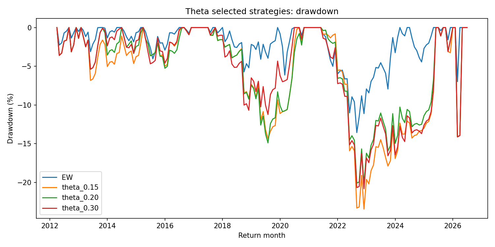
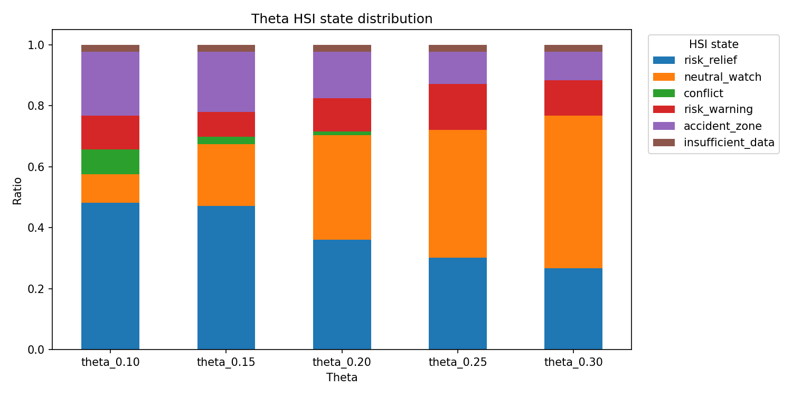

# 11_Theta_sensitivity_experiment

## 실험명
**11번 Theta sensitivity 실험: HSI 상태분류 민감도 조정의 효과 확인**

## 1. 실험 목적

이 실험의 목적은 HSI 상태분류에서 사용하는 **Theta 기준값**을 바꾸었을 때, HSI 상태분포와 ETF 비중 전환, 백테스트 성과가 어떻게 달라지는지 확인하는 것이다.

10번 Lambda 실험이 “HSI 목표비중으로 이동하는 속도”를 조절한 실험이었다면, 11번 Theta 실험은 “HSI 상태판단의 민감도”를 조정한 실험이다. 따라서 11번의 핵심 질문은 다음과 같다.

| 질문 | 확인 방식 |
|---|---|
| Theta 값을 바꾸면 HSI 상태분포가 의미 있게 달라지는가? | 상태별 월 수와 비율 비교 |
| Theta 조정이 CAGR, MDD, Sharpe, Calmar를 개선하는가? | theta별 성과표 비교 |
| Theta 조정이 Turnover 문제를 구조적으로 해결하는가? | theta별 Turnover 비교 |
| 최종 후보 선정의 중심이 Theta인지 Lambda인지 | 10번 Lambda 결과와 비교 해석 |

Theta(설명: HSI 상태를 나눌 때 사용하는 민감도 기준값이다. 값이 달라지면 같은 HSI 점수라도 상태분류가 달라질 수 있다.)  
HSI(설명: Hourglass Signal Index의 약자로, 본 프로젝트에서는 미래수익률 예측기가 아니라 시장상태를 번역하는 가격 기반 상태분류 지표로 사용한다.)

---

## 2. 배경과 이유

HSI 상태분류는 risk_relief, neutral_watch, conflict, risk_warning, accident_zone 등 5개 상태로 시장을 해석한다. 이때 Theta 기준값은 상태를 얼마나 민감하게 나눌지에 영향을 줄 수 있다.

초기 HSI baseline에서는 기준 Theta를 사용했지만, 해당 기준이 너무 민감하거나 둔감하면 상태 전환이 과도해지거나 위험상태를 늦게 포착할 수 있다. 따라서 11번에서는 Theta 값을 여러 후보로 바꾸어, 상태분류 민감도 변화가 실제 포트폴리오 성과와 Turnover에 어떤 영향을 주는지 확인하였다.

다만 이 실험은 HSI 상태판단의 민감도 조정 실험이지, Lambda처럼 비중 이동 속도를 직접 완화하는 실험은 아니다. 따라서 최종 보고서에서는 Theta와 Lambda의 역할을 구분해야 한다.

---

## 3. 사용 데이터

- Theta 실험 그리드: `main_final_theta_experiment_grid.csv`
- Theta별 HSI 상태표: `main_final_theta_hsi_state_table.csv`
- Theta별 ETF 비중표: `main_final_theta_weights.csv`
- Theta별 월별 백테스트 결과: `main_final_theta_backtest_timeseries.csv`
- Theta별 성과 요약표: `main_final_theta_performance_summary.csv`
- Theta별 Turnover 요약표: `main_final_theta_turnover_summary.csv`
- Theta별 상태분포표: `main_final_theta_state_distribution.csv`
- Theta 후보 판단표: `main_final_theta_candidate_judgement.csv`

전략별 월별 결과는 총 1,032행이며, 전략 수 6개와 월별 백테스트 구간이 결합된 결과이다. 수익률은 decimal 기준으로 계산한 뒤, 보고서 표에서는 % 단위로 표시하였다.

---

## 4. 실험 방법

Theta 후보는 다음과 같이 설정하였다.

| theta_id | Theta | accident_extra | conflict band | 사용 점수 | 비중 규칙 | 목적 |
| --- | --- | --- | --- | --- | --- | --- |
| theta_0.10 | 0.100 | 0.200 | 0.200 | score_return, score_ma_pos, score_momentum, score_vol, score_rs | final_baseline_state_target_weights_v1 | HSI 상태분류 민감도 검증 |
| theta_0.15 | 0.150 | 0.200 | 0.200 | score_return, score_ma_pos, score_momentum, score_vol, score_rs | final_baseline_state_target_weights_v1 | HSI 상태분류 민감도 검증 |
| theta_0.20 | 0.200 | 0.200 | 0.200 | score_return, score_ma_pos, score_momentum, score_vol, score_rs | final_baseline_state_target_weights_v1 | HSI 상태분류 민감도 검증 |
| theta_0.25 | 0.250 | 0.200 | 0.200 | score_return, score_ma_pos, score_momentum, score_vol, score_rs | final_baseline_state_target_weights_v1 | HSI 상태분류 민감도 검증 |
| theta_0.30 | 0.300 | 0.200 | 0.200 | score_return, score_ma_pos, score_momentum, score_vol, score_rs | final_baseline_state_target_weights_v1 | HSI 상태분류 민감도 검증 |

각 Theta 후보에 대해 HSI 상태를 다시 분류하고, 동일한 상태별 ETF 목표비중 규칙을 적용해 월별 백테스트를 수행하였다. 비교 기준으로 EW Benchmark도 함께 포함하였다.

```text
HSI 점수
→ Theta 기준에 따른 상태분류
→ 상태별 ETF 목표비중 적용
→ 월별 수익률 백테스트
→ 성과·Turnover·상태분포 비교
```

[Theta 규칙 placeholder] 최종 코드 설명서에서는 `accident_extra`, `conflict_direction_band`, `theta_common`이 HSI 상태분류에 어떻게 작동하는지 대표 함수 또는 조건문 기준으로 별도 설명한다.

---

## 5. 주요 결과

### 5.1 Theta별 성과 요약

| 전략 | Theta | CAGR(%) | 연환산 변동성(%) | MDD(%) | Sharpe | Sortino | Calmar | WinRate(%) |
| --- | --- | --- | --- | --- | --- | --- | --- | --- |
| EW |  | 6.510 | 7.972 | -13.571 | 0.832 | 1.538 | 0.480 | 60.465 |
| theta_0.10 | 0.100 | 7.502 | 13.615 | -21.720 | 0.597 | 0.889 | 0.345 | 65.116 |
| theta_0.15 | 0.150 | 7.732 | 13.666 | -23.459 | 0.611 | 0.950 | 0.330 | 65.116 |
| theta_0.20 | 0.200 | 7.715 | 13.351 | -20.243 | 0.621 | 1.050 | 0.381 | 62.791 |
| theta_0.25 | 0.250 | 7.442 | 12.889 | -20.823 | 0.619 | 1.025 | 0.357 | 61.628 |
| theta_0.30 | 0.300 | 7.737 | 12.917 | -20.823 | 0.640 | 1.080 | 0.372 | 61.047 |

Theta 계열에서 CAGR이 가장 높은 전략은 **theta_0.30**이고, Calmar가 가장 높은 전략은 **theta_0.20**이다. MDD 기준으로 가장 안정적인 Theta 후보는 **theta_0.20**이며, Sharpe 기준으로는 **theta_0.30**이 가장 높다.

그러나 Theta 후보들의 전체 성과 차이는 Lambda 실험에 비해 구조적으로 뚜렷하지 않다. 일부 Theta 값은 MDD를 낮추거나 Calmar를 개선하지만, Turnover 문제가 충분히 완화되지는 않는다. 따라서 Theta는 최종 후보를 결정하는 핵심 축이라기보다 HSI 상태분류 민감도를 확인하는 보조 실험으로 해석한다.

MDD(설명: Maximum Drawdown의 약자이다. 투자기간 중 고점 대비 최대 하락폭을 뜻한다.)  
Calmar(설명: CAGR을 절대 MDD로 나눈 지표이다. 낙폭 대비 수익성을 볼 때 사용한다.)

---

### 5.2 Theta별 Turnover 요약

| 전략 | Theta | 평균 Turnover(%) | 최대 Turnover(%) | 누적 Turnover(%) | Turnover 발생 월 수 |
| --- | --- | --- | --- | --- | --- |
| EW |  | 0.000 | 0.000 | 0.000 | 0.000 |
| theta_0.10 | 0.100 | 23.140 | 70.000 | 3980.000 | 94.000 |
| theta_0.15 | 0.150 | 22.093 | 70.000 | 3800.000 | 94.000 |
| theta_0.20 | 0.200 | 22.384 | 70.000 | 3850.000 | 106.000 |
| theta_0.25 | 0.250 | 20.262 | 70.000 | 3485.000 | 106.000 |
| theta_0.30 | 0.300 | 16.919 | 70.000 | 2910.000 | 91.000 |

Theta별 Turnover를 보면 EW를 제외한 HSI 기반 Theta 후보들은 평균 Turnover가 여전히 높다. 기준 theta_0.15의 평균 Turnover는 22.093%이고, Turnover가 가장 낮은 Theta 후보인 theta_0.30도 평균 Turnover가 16.919% 수준이다.

즉, Theta 조정은 상태분류 경계를 바꾸지만, 목표비중으로 즉시 이동하는 구조 자체를 완화하지는 못한다. 이 점에서 Theta는 Lambda 부분조정보다 Turnover 문제 해결력이 약하다.

Turnover(설명: 포트폴리오 비중이 얼마나 많이 바뀌었는지를 나타내는 회전율이다. 거래비용 부담과 연결된다.)

---

### 5.3 Theta Family Comparison



이 그림은 Theta 후보별 CAGR과 평균 Turnover를 함께 보여준다. 일부 Theta 값에서 CAGR이나 Calmar가 개선되지만, 평균 Turnover는 여전히 높은 수준에 머문다. 따라서 Theta 조정만으로는 HSI baseline의 높은 회전율 문제를 구조적으로 해결하기 어렵다.

---

### 5.4 누적수익률 경로



누적수익률 경로에서는 theta_0.15, theta_0.20, theta_0.30 등 HSI 기반 후보들이 EW보다 높은 누적성과를 보일 수 있다. 그러나 HSI 기반 후보 간 차이는 Lambda 후보에서처럼 운용 성격이 뚜렷하게 분리되지는 않는다.

---

### 5.5 Drawdown 경로



Drawdown 경로를 보면 일부 Theta 값은 기준 theta_0.15보다 MDD를 완화하지만, 즉시 목표비중으로 이동하는 구조가 유지되기 때문에 낙폭과 Turnover가 함께 남는다. 따라서 Theta는 상태분류 민감도 조정에는 의미가 있지만, 실제 운용 안정성 개선의 핵심 장치로 보기에는 제한적이다.

---

### 5.6 HSI 상태분포 변화



| theta_id | Theta | HSI 상태 | 상태명 | 월 수 | 전체 월 수 | 비율(%) |
| --- | --- | --- | --- | --- | --- | --- |
| theta_0.10 | 0.10 | accident_zone | 강한 위험 구간 | 36.00 | 172.00 | 20.93 |
| theta_0.10 | 0.10 | conflict | 신호 충돌 | 14.00 | 172.00 | 8.14 |
| theta_0.10 | 0.10 | insufficient_data | 자료 부족 | 4.00 | 172.00 | 2.33 |
| theta_0.10 | 0.10 | neutral_watch | 중립 관찰 | 16.00 | 172.00 | 9.30 |
| theta_0.10 | 0.10 | risk_relief | 위험 완화 우세 | 83.00 | 172.00 | 48.26 |
| theta_0.10 | 0.10 | risk_warning | 위험 악화 우세 | 19.00 | 172.00 | 11.05 |
| theta_0.15 | 0.15 | accident_zone | 강한 위험 구간 | 34.00 | 172.00 | 19.77 |
| theta_0.15 | 0.15 | conflict | 신호 충돌 | 4.00 | 172.00 | 2.33 |
| theta_0.15 | 0.15 | insufficient_data | 자료 부족 | 4.00 | 172.00 | 2.33 |
| theta_0.15 | 0.15 | neutral_watch | 중립 관찰 | 35.00 | 172.00 | 20.35 |
| theta_0.15 | 0.15 | risk_relief | 위험 완화 우세 | 81.00 | 172.00 | 47.09 |
| theta_0.15 | 0.15 | risk_warning | 위험 악화 우세 | 14.00 | 172.00 | 8.14 |
| theta_0.20 | 0.20 | accident_zone | 강한 위험 구간 | 26.00 | 172.00 | 15.12 |
| theta_0.20 | 0.20 | conflict | 신호 충돌 | 2.00 | 172.00 | 1.16 |
| theta_0.20 | 0.20 | insufficient_data | 자료 부족 | 4.00 | 172.00 | 2.33 |
| theta_0.20 | 0.20 | neutral_watch | 중립 관찰 | 59.00 | 172.00 | 34.30 |
| theta_0.20 | 0.20 | risk_relief | 위험 완화 우세 | 62.00 | 172.00 | 36.05 |
| theta_0.20 | 0.20 | risk_warning | 위험 악화 우세 | 19.00 | 172.00 | 11.05 |
| theta_0.25 | 0.25 | accident_zone | 강한 위험 구간 | 18.00 | 172.00 | 10.47 |
| theta_0.25 | 0.25 | insufficient_data | 자료 부족 | 4.00 | 172.00 | 2.33 |
| theta_0.25 | 0.25 | neutral_watch | 중립 관찰 | 72.00 | 172.00 | 41.86 |
| theta_0.25 | 0.25 | risk_relief | 위험 완화 우세 | 52.00 | 172.00 | 30.23 |
| theta_0.25 | 0.25 | risk_warning | 위험 악화 우세 | 26.00 | 172.00 | 15.12 |
| theta_0.30 | 0.30 | accident_zone | 강한 위험 구간 | 16.00 | 172.00 | 9.30 |
| theta_0.30 | 0.30 | insufficient_data | 자료 부족 | 4.00 | 172.00 | 2.33 |
| theta_0.30 | 0.30 | neutral_watch | 중립 관찰 | 86.00 | 172.00 | 50.00 |
| theta_0.30 | 0.30 | risk_relief | 위험 완화 우세 | 46.00 | 172.00 | 26.74 |
| theta_0.30 | 0.30 | risk_warning | 위험 악화 우세 | 20.00 | 172.00 | 11.63 |

Theta 값이 달라지면 HSI 상태별 월 수가 달라진다. 예를 들어 기준 theta_0.15와 theta_0.20을 비교하면 risk_warning 월 수는 14개월에서 19개월로 달라지고, accident_zone 월 수는 34개월에서 26개월로 달라진다. 이는 Theta가 HSI 상태분류 민감도에 영향을 준다는 것을 보여준다.

다만 상태분포가 바뀐다고 해서 최종 운용 성과가 자동으로 개선되는 것은 아니다. 상태분류가 달라져도 목표비중으로 즉시 이동하는 구조가 유지되면 Turnover 부담이 남기 때문이다.

[상태분포 해석 placeholder] 최종 발표에서는 모든 상태분포를 설명하기보다, theta_0.15와 theta_0.20 또는 theta_0.30처럼 대표 후보 2~3개만 골라 상태분포 변화와 성과 차이를 함께 설명한다.

---

### 5.7 후보 판단표

| 전략 | Theta | CAGR 변화 vs θ=0.15(%p) | MDD 변화 vs θ=0.15(%p) | Turnover 변화 vs θ=0.15(%p) | 판정 | 이유 |
| --- | --- | --- | --- | --- | --- | --- |
| EW |  |  |  |  | benchmark | 동일가중 비교 기준 |
| theta_0.10 | 0.100 | -0.230 | 1.740 | 1.047 | review_turnover | 상태 전환이 잦아 Turnover 확인 필요 |
| theta_0.15 | 0.150 | 0.000 | 0.000 | 0.000 | baseline_theta | 기준 θ |
| theta_0.20 | 0.200 | -0.017 | 3.217 | 0.291 | review_turnover | 상태 전환이 잦아 Turnover 확인 필요 |
| theta_0.25 | 0.250 | -0.290 | 2.636 | -1.831 | review_turnover | 상태 전환이 잦아 Turnover 확인 필요 |
| theta_0.30 | 0.300 | 0.004 | 2.636 | -5.174 | review_turnover | 상태 전환이 잦아 Turnover 확인 필요 |

후보 판단표에서는 일부 Theta 후보가 검토 대상으로 남지만, 대부분 `review_turnover`로 표시된다. 이는 성과 자체보다 Turnover를 추가로 확인해야 한다는 의미이다. 따라서 Theta는 최종 후보 압축의 핵심이라기보다, HSI 상태분류가 특정 기준값에 지나치게 의존하지 않는지 확인하는 robustness 성격이 강하다.

---

## 6. Lambda와 Theta의 차이

10번 Lambda 실험과 11번 Theta 실험은 서로 다른 문제를 다룬다.

| 구분 | Lambda | Theta |
|---|---|---|
| 조정 대상 | 목표비중으로 이동하는 속도 | HSI 상태분류 민감도 |
| 직접 영향 | 실제 ETF 비중 이동 경로 | HSI 상태 월 수와 상태 전환 |
| Turnover 완화 효과 | 직접적 | 제한적 |
| 최종 후보 영향 | Lambda 0.1, 0.3 후보 선정의 핵심 | 보조 민감도 검토 |
| 보고서 역할 | 실행 개선 장치 | 상태분류 robustness 확인 |

즉, Theta를 바꾸면 상태분류는 달라질 수 있지만, 비중 이동을 부드럽게 만드는 직접 장치는 아니다. 반면 Lambda는 HSI 상태분류를 바꾸지 않고도 실제 ETF 비중 이동 경로를 완화한다. 따라서 최종 후보 선정의 중심은 Theta가 아니라 Lambda이다.

---

## 7. 성과 귀인과 해석

11번 실험의 핵심은 다음과 같다.

1. **Theta는 HSI 상태분포에 영향을 준다.**  
   Theta 값이 달라지면 risk_relief, risk_warning, accident_zone 등의 월 수가 달라진다.

2. **일부 성과지표는 개선될 수 있다.**  
   theta_0.20 등 일부 후보는 기준 theta_0.15보다 MDD나 Calmar 측면에서 좋아질 수 있다.

3. **그러나 Turnover 문제는 구조적으로 해결되지 않는다.**  
   Theta는 상태분류 경계를 조정할 뿐, 목표비중으로 즉시 이동하는 구조를 완화하지 않는다.

4. **따라서 Theta는 최종 후보의 중심이 아니다.**  
   최종 전략 후보는 Lambda 0.1과 Lambda 0.3이며, Theta 실험은 HSI 상태분류 민감도와 robustness를 확인하는 보조 실험으로 해석한다.

---

## 8. 한계와 다음 판단

본 실험은 Theta 후보를 0.10~0.30 범위의 사전 설정값으로 비교하였다. 이 범위 밖의 값이나 더 복잡한 상태분류 규칙을 탐색하지는 않았다. 또한 Theta 값이 성과에 미치는 영향은 상태분포와 시장구간에 따라 달라질 수 있으므로, 특정 Theta 값이 모든 기간에서 우월하다고 단정해서는 안 된다.

최종 판단은 다음과 같이 정리한다.

| 항목 | 판단 |
|---|---|
| Theta 조정 | HSI 상태분류 민감도 확인에는 의미 있음 |
| Turnover 완화 | 구조적 해결 효과는 제한적 |
| 최종 후보 여부 | Theta 단독 후보는 최종 중심이 아님 |
| Lambda와의 관계 | Lambda 부분조정이 최종 후보 선정의 핵심 |
| 보고서 역할 | 보조 민감도 및 robustness 실험 |

[후속 연결 placeholder] 10번 Lambda 실험에서는 비중 이동 속도 조정이 핵심 개선 장치임을 확인했고, 11번 Theta 실험에서는 상태분류 민감도 조정만으로는 Turnover 문제가 충분히 해결되지 않음을 확인했다. 이 두 실험을 연결하여 “상태판단보다 실행속도 조절이 최종 운용 가능성에 더 중요했다”는 구조로 설명한다.

---

# 별도 첨부 1. 입출력 구조표

| 구분 | 파일명 | 역할 | 주요 컬럼 | 시점 기준 | 단위 |
|---|---|---|---|---|---|
| 입력 | `main_final_theta_experiment_grid.csv` | Theta 후보 설정표 | theta_common, accident_extra, conflict_direction_band | 실험 설정 | threshold |
| 입력 | `main_final_theta_hsi_state_table.csv` | Theta별 HSI 상태분류 결과 | year_month, theta_id, hsi_state, state_reason | 월말 신호 | state |
| 출력 | `main_final_theta_weights.csv` | Theta별 ETF 목표비중 결과 | strategy_name, theta_id, ETF별 weight | 월별 | weight |
| 출력 | `main_final_theta_backtest_timeseries.csv` | Theta별 월별 백테스트 결과 | strategy_name, strategy_return, turnover, cumulative_return, drawdown | 월별 | decimal / % |
| 출력 | `main_final_theta_performance_summary.csv` | Theta별 성과 요약 | CAGR, MDD, Sharpe, Sortino, Calmar | 전체기간 | % / ratio |
| 출력 | `main_final_theta_turnover_summary.csv` | Theta별 Turnover 요약 | avg_turnover, max_turnover, total_turnover | 전체기간 | % |
| 출력 | `main_final_theta_state_distribution.csv` | Theta별 HSI 상태분포 | hsi_state, months, ratio | 상태별 | count / ratio |
| 출력 | `main_final_theta_candidate_judgement.csv` | Theta 후보 판단표 | decision, reason | 요약 | text |
| 출력 | `main_final_theta_family_comparison.png` | Theta별 CAGR과 Turnover 비교 그림 | theta, CAGR, Turnover | 전체기간 | % |
| 출력 | `main_final_theta_cumulative_return_selected.png` | 대표 Theta 누적수익률 그림 | strategy, cumulative_return | 월별 | cumulative |
| 출력 | `main_final_theta_drawdown_selected.png` | 대표 Theta Drawdown 그림 | strategy, drawdown | 월별 | % |
| 출력 | `main_final_theta_state_distribution.png` | Theta별 HSI 상태분포 그림 | theta, hsi_state, ratio | 상태별 | ratio |

---

# 별도 첨부 2. 입출력 데이터 분류표

| 데이터 분류 | 파일명 | 설명 | 최종 전략 사용 여부 | 보고서 사용 위치 |
|---|---|---|---|---|
| processed | `main_final_theta_experiment_grid.csv` | Theta 후보 설정 데이터 | 사용 | 실험 설정 설명 |
| processed | `main_final_theta_hsi_state_table.csv` | Theta별 HSI 상태분류 결과 | 사용 | 상태분포 해석 |
| model_output | `main_final_theta_weights.csv` | Theta별 ETF 비중 결과 | 사용 | 비중 계산 확인 |
| model_output | `main_final_theta_backtest_timeseries.csv` | Theta별 월별 수익률과 drawdown 결과 | 사용 | 성과 계산 원천 |
| report_output | `main_final_theta_performance_summary.csv` | Theta별 성과표 | 사용 | 본문 표 |
| report_output | `main_final_theta_turnover_summary.csv` | Theta별 Turnover 표 | 사용 | Turnover 해석 |
| report_output | `main_final_theta_state_distribution.csv` | Theta별 상태분포표 | 사용 | 상태분포 해석 |
| report_output | `main_final_theta_candidate_judgement.csv` | Theta 판단표 | 참고 | 결론 보조 |
| report_output | `main_final_theta_family_comparison.png` | Theta family 비교 그림 | 사용 | 시각자료 |
| report_output | `main_final_theta_cumulative_return_selected.png` | 대표 Theta 누적수익률 그림 | 사용 | 시각자료 |
| report_output | `main_final_theta_drawdown_selected.png` | 대표 Theta drawdown 그림 | 사용 | 시각자료 |
| report_output | `main_final_theta_state_distribution.png` | Theta 상태분포 그림 | 사용 | 시각자료 |

---

# 별도 첨부 3. 보고서용 최종 요약 문장

11번 Theta sensitivity 실험에서는 HSI 상태분류의 민감도 기준인 Theta 값을 0.10~0.30 범위에서 조정하여 상태분포와 백테스트 성과 변화를 확인하였다. 실험 결과 Theta 값에 따라 HSI 상태별 월 수와 일부 성과지표는 달라졌지만, 목표비중으로 즉시 이동하는 구조가 유지되기 때문에 Turnover 문제를 구조적으로 해결하지는 못했다. 따라서 Theta 조정은 HSI 상태분류의 robustness를 확인하는 보조 실험으로 해석하고, 최종 후보 선정의 중심은 실제 비중 이동 속도를 직접 조절하는 Lambda 0.1과 Lambda 0.3에 두는 것이 적절하다.
