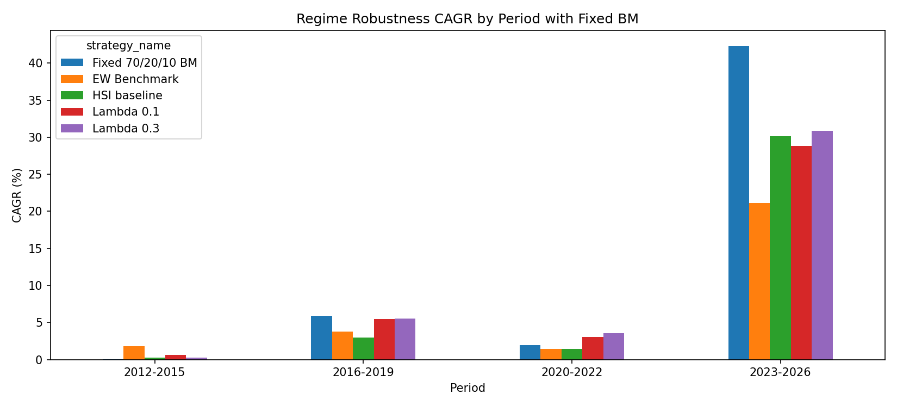
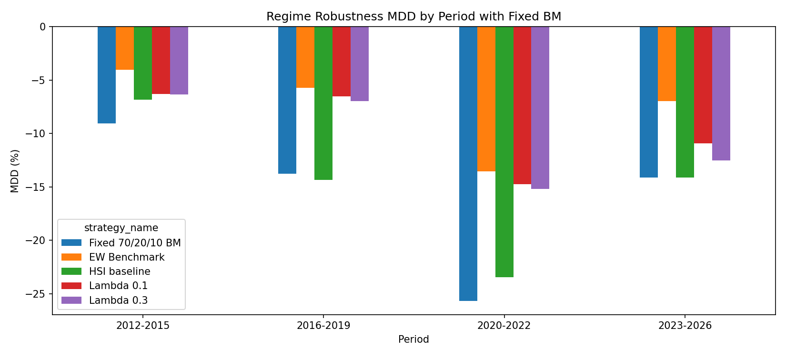
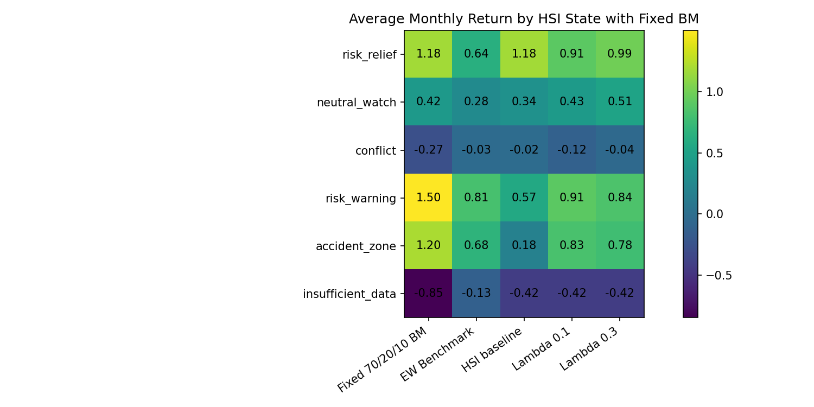
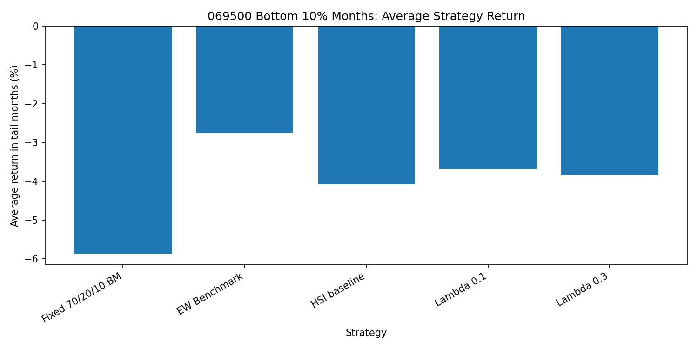

# 16_Regime_robustness_with_fixed_bm

## 실험명
**16번 Regime robustness 보완판: Fixed 70/20/10 BM을 포함한 기간별·상태별·손실월 생존 검증**

## 1. 보완 목적

기존 16번 robustness 보고서는 EW Benchmark, HSI baseline, Lambda 0.1, Lambda 0.3을 중심으로 Lambda 후보의 기간별·상태별·손실월 생존성을 확인하였다. 그러나 최종 보고서 관점에서는 본 프로젝트의 메인 BM인 **Fixed 70/20/10 BM**도 함께 비교해야 한다.

따라서 이 보완판은 16번 robustness의 비교군을 다음과 같이 정렬한다.

| 구분 | 전략 | 역할 |
|---|---|---|
| 메인 BM | Fixed 70/20/10 BM | 주식 70%, 국고채 20%, 단기채권 10% 고정 전략비중 |
| 보조 BM | EW Benchmark | 같은 ETF 3개를 동일비중으로 보유 |
| 내부 기준선 | HSI baseline | HSI 상태를 목표비중에 즉시 반영 |
| 최종 후보 | Lambda 0.1 / Lambda 0.3 | HSI 목표비중으로 이동하는 속도를 완화한 후보 |

BM(설명: Benchmark의 약자이다. 전략 성과를 평가하기 위한 비교 기준이다.)  
MDD(설명: Maximum Drawdown의 약자이다. 투자기간 중 고점 대비 최대 하락폭을 뜻한다.)  
Turnover(설명: 포트폴리오 비중이 얼마나 많이 바뀌었는지를 나타내는 회전율이다.)

---

## 2. 핵심 질문

Fixed BM을 포함한 16번 보완판의 핵심 질문은 다음과 같다.

| 질문 | 확인 방식 |
|---|---|
| Lambda 후보가 Fixed 70/20/10 BM보다 수익률도 높은가? | 전체 CAGR과 기간별 CAGR 비교 |
| Lambda 후보가 Fixed BM보다 낙폭을 줄이는가? | 전체 MDD와 기간별 MDD 비교 |
| EW Benchmark와 비교하면 어떤 성격인가? | Sharpe, MDD, CAGR, Calmar 비교 |
| 큰 손실월에서 Lambda 후보의 방어 효과가 있는가? | 069500 하위 10% 손실월 평균수익률 비교 |
| 최종 후보를 단일 우승 전략으로 말해도 되는가? | BM별 강점과 약점 구분 |

---

## 3. 사용 데이터

이 보완판은 17번 benchmark alignment 산출물을 활용하여 Fixed BM이 포함된 robustness 표를 구성하였다.

- `main_final_benchmark_alignment_summary.csv`
- `main_final_benchmark_alignment_by_period.csv`
- `main_final_benchmark_alignment_by_hsi_state.csv`
- `main_final_benchmark_alignment_tail_event_summary.csv`

보완 과정에서 다음 파일을 새로 생성하였다.

- `main_final_regime_robustness_summary_with_fixed_bm.csv`
- `main_final_regime_robustness_by_period_with_fixed_bm.csv`
- `main_final_regime_robustness_by_hsi_state_with_fixed_bm.csv`
- `main_final_regime_robustness_tail_event_summary_with_fixed_bm.csv`
- `main_final_regime_robustness_decision_note_with_fixed_bm.csv`

---

## 4. 전체 기간 성과 요약

| 전략 | CAGR(%) | 연환산 변동성(%) | MDD(%) | Sharpe | Calmar | WinRate(%) | 평균 Turnover(%) | 역할 |
| --- | --- | --- | --- | --- | --- | --- | --- | --- |
| Fixed 70/20/10 BM | 11.055 | 16.580 | -25.674 | 0.710 | 0.431 | 58.480 | 0.000 | benchmark |
| EW Benchmark | 6.590 | 7.994 | -13.571 | 0.834 | 0.486 | 60.819 | 0.000 | benchmark |
| HSI baseline | 7.827 | 13.705 | -23.459 | 0.613 | 0.334 | 65.497 | 22.018 | baseline |
| Lambda 0.1 | 8.692 | 11.352 | -14.744 | 0.787 | 0.590 | 59.649 | 2.455 | candidate |
| Lambda 0.3 | 9.148 | 12.102 | -15.220 | 0.779 | 0.601 | 60.819 | 6.886 | candidate |

전체 기간 기준으로 Fixed 70/20/10 BM은 CAGR 11.05%로 가장 높다. 그러나 MDD도 -25.67%로 가장 크다. 반면 Lambda 0.1과 Lambda 0.3은 CAGR은 각각 8.69%, 9.15%로 Fixed BM보다 낮지만, MDD를 각각 -14.74%, -15.22% 수준으로 낮춘다.

즉, Lambda 후보는 Fixed BM보다 수익률을 더 높인 전략이 아니라, Fixed BM 대비 낙폭을 줄이고 Calmar를 개선한 방어형 후보로 해석해야 한다.

---

## 5. 기간별 CAGR

기간별 CAGR에서는 상승장이 강한 구간에서 Fixed 70/20/10 BM이 가장 높은 수익률을 보일 수 있다. 특히 주식형 ETF 70%를 고정 보유하는 구조이므로, 위험자산 상승이 큰 구간에서는 Lambda 후보보다 높은 CAGR을 기록하는 것이 자연스럽다.

따라서 이 결과는 Lambda 후보가 상승장 수익률 극대화 전략이 아니라는 점을 보여준다. Lambda 후보는 위험구간에서 낙폭을 줄이는 방어형 overlay 성격으로 해석하는 것이 적절하다.

---

## 6. 기간별 MDD

기간별 MDD에서는 Fixed BM의 낙폭 부담이 더 분명하게 나타난다. Lambda 0.1과 Lambda 0.3은 Fixed BM 대비 전체 MDD를 각각 10.93%p, 10.45%p 완화한다.

이는 HSI-Lambda 구조가 Fixed BM의 수익률을 그대로 따라가는 것이 아니라, 위험상태에 따라 위험자산 노출을 조절하여 손실폭을 줄이는 방향으로 작동했음을 보여준다.

---

## 7. 기간별 성과표

| 기간 | 전략 | CAGR(%) | MDD(%) | Sharpe | Calmar | 평균 Turnover(%) |
| --- | --- | --- | --- | --- | --- | --- |
| 2012-2015 | Fixed 70/20/10 BM | 0.022 | -9.073 | 0.041 | 0.002 | 0.000 |
| 2012-2015 | EW Benchmark | 1.779 | -4.038 | 0.480 | 0.441 | 0.000 |
| 2012-2015 | HSI baseline | 0.282 | -6.835 | 0.075 | 0.041 | 20.889 |
| 2012-2015 | Lambda 0.1 | 0.623 | -6.325 | 0.132 | 0.099 | 1.887 |
| 2012-2015 | Lambda 0.3 | 0.234 | -6.355 | 0.068 | 0.037 | 5.785 |
| 2016-2019 | Fixed 70/20/10 BM | 5.913 | -13.767 | 0.649 | 0.430 | 0.000 |
| 2016-2019 | EW Benchmark | 3.774 | -5.732 | 0.851 | 0.658 | 0.000 |
| 2016-2019 | HSI baseline | 2.987 | -14.340 | 0.467 | 0.208 | 23.854 |
| 2016-2019 | Lambda 0.1 | 5.455 | -6.542 | 0.940 | 0.834 | 2.427 |
| 2016-2019 | Lambda 0.3 | 5.536 | -6.986 | 0.897 | 0.792 | 6.793 |
| 2020-2022 | Fixed 70/20/10 BM | 1.939 | -25.674 | 0.195 | 0.076 | 0.000 |
| 2020-2022 | EW Benchmark | 1.414 | -13.571 | 0.211 | 0.104 | 0.000 |
| 2020-2022 | HSI baseline | 1.463 | -23.459 | 0.174 | 0.062 | 21.667 |
| 2020-2022 | Lambda 0.1 | 3.016 | -14.744 | 0.345 | 0.205 | 2.906 |
| 2020-2022 | Lambda 0.3 | 3.562 | -15.220 | 0.374 | 0.234 | 8.075 |
| 2023-2026 | Fixed 70/20/10 BM | 42.307 | -14.130 | 1.458 | 2.994 | 0.000 |
| 2023-2026 | EW Benchmark | 21.108 | -6.985 | 1.566 | 3.022 | 0.000 |
| 2023-2026 | HSI baseline | 30.176 | -14.130 | 1.255 | 2.136 | 21.429 |
| 2023-2026 | Lambda 0.1 | 28.799 | -10.911 | 1.431 | 2.640 | 2.711 |
| 2023-2026 | Lambda 0.3 | 30.892 | -12.553 | 1.435 | 2.461 | 7.150 |

---

## 8. HSI 상태별 평균 월수익률

HSI 상태별 평균 월수익률은 조건부 평균이다. 즉, 같은 HSI 상태에 해당하는 달만 모아 평균을 낸 것이며, 시간 순서가 이어진 누적수익률이 아니다. 따라서 상태별 평균수익률은 전략의 작동 성격을 이해하는 보조 진단으로 사용해야 한다.

Fixed BM은 주식 비중이 항상 70%이므로 회복 또는 반등 구간에서 높은 평균수익률을 보일 수 있다. 반면 Lambda 후보는 위험자산 비중 복귀가 더 천천히 이루어지므로, 상승장 일부 수익을 포기할 수 있다.

---

## 9. 069500 하위 10% 손실월 진단

| 전략 | 손실월 수 | 평균 손실월 수익률(%) | 중앙 손실월 수익률(%) | 최악 월 수익률(%) | 평균 069500 비중(%) | 평균 Turnover(%) |
| --- | --- | --- | --- | --- | --- | --- |
| Fixed 70/20/10 BM | 18.000 | -5.861 | -5.196 | -14.130 | 70.000 | 0.000 |
| EW Benchmark | 18.000 | -2.754 | -2.274 | -6.985 | 33.333 | 0.000 |
| HSI baseline | 18.000 | -4.075 | -3.964 | -14.130 | 44.444 | 22.222 |
| Lambda 0.1 | 18.000 | -3.685 | -3.173 | -10.911 | 45.157 | 2.864 |
| Lambda 0.3 | 18.000 | -3.833 | -3.300 | -12.553 | 45.413 | 8.355 |

069500 하위 10% 손실월에서 Fixed 70/20/10 BM은 평균 -5.86%의 손실을 기록했다. Lambda 0.1과 Lambda 0.3은 각각 -3.68%, -3.83%로 손실폭을 줄였다.

EW Benchmark는 주식 비중이 약 33.3%로 낮기 때문에 큰 손실월에서 가장 방어적으로 보일 수 있다. 그러나 이는 동적 신호 효과라기보다 낮은 위험자산 비중의 결과로 해석한다.

---

## 10. 판단 보조 메모

| 판단 항목 | 판단 내용 | 값 |
| --- | --- | --- |
| fixed_bm_role | Fixed 70/20/10 BM은 전체 CAGR이 가장 높지만 MDD가 가장 큽니다. 메인 BM으로 유지하되 최종 후보로 분류하지 않습니다. | 11.055 |
| lambda_vs_fixed_mdd | Lambda 0.1은 Fixed BM 대비 MDD를 10.930%p 완화하고, Lambda 0.3은 10.455%p 완화합니다. | 10.930 |
| lambda_low_turnover | Lambda 후보 중 평균 Turnover가 낮은 후보는 Lambda 0.1입니다. | 2.455 |
| lambda_calmar | Lambda 후보 중 Calmar가 높은 후보는 Lambda 0.3입니다. | 0.601 |
| ew_role | EW Benchmark는 MDD와 Sharpe가 강한 보조 BM입니다. Lambda 후보가 모든 안정성 지표에서 EW를 압도한다고 해석하지 않습니다. | 0.834 |

---

## 11. 결론

Fixed 70/20/10 BM을 포함하면 16번 robustness의 해석은 더 분명해진다.

| 전략 | 최종 해석 |
|---|---|
| Fixed 70/20/10 BM | 메인 BM. CAGR은 가장 높지만 MDD가 큼 |
| EW Benchmark | 보조 BM. Sharpe와 MDD가 강한 안정적 단순분산 기준 |
| HSI baseline | 내부 기준선. HSI 즉시 반영의 Turnover와 MDD 부담 확인 |
| Lambda 0.1 | Fixed BM 대비 낙폭을 줄이고 Turnover가 낮은 저회전·보수형 후보 |
| Lambda 0.3 | Fixed BM 대비 낙폭을 줄이며 CAGR과 Calmar가 높은 균형형 후보 |

따라서 최종 발표에서는 Lambda 후보를 “Fixed BM보다 모든 면에서 우월한 전략”으로 말하지 않는다. 더 적절한 표현은 다음과 같다.

> Fixed 70/20/10 BM은 CAGR이 가장 높지만 MDD가 크고, EW Benchmark는 안정성이 높다. Lambda 0.1과 Lambda 0.3은 Fixed BM 대비 낙폭을 줄이고 EW 대비 성장성과 Calmar를 개선하는 방어형 ETF RA 후보로 해석한다.

---

# 별도 첨부 1. 입출력 구조표

| 구분 | 파일명 | 역할 | 주요 컬럼 | 시점 기준 | 단위 |
|---|---|---|---|---|---|
| 입력 | `main_final_benchmark_alignment_summary.csv` | Fixed BM 포함 전체 성과 요약 | strategy_name, CAGR, MDD, Sharpe, Calmar | 전체기간 | % / ratio |
| 입력 | `main_final_benchmark_alignment_by_period.csv` | Fixed BM 포함 기간별 성과 | period, strategy_name, CAGR, MDD | 구간별 | % |
| 입력 | `main_final_benchmark_alignment_by_hsi_state.csv` | Fixed BM 포함 HSI 상태별 성과 | hsi_state, strategy_name, avg_monthly_return | 상태별 | % |
| 입력 | `main_final_benchmark_alignment_tail_event_summary.csv` | Fixed BM 포함 큰 손실월 진단 | tail_months, avg_tail_return | 손실월 기준 | % |
| 출력 | `main_final_regime_robustness_summary_with_fixed_bm.csv` | 보완판 전체 성과표 | strategy_name, CAGR, MDD, Sharpe, Calmar | 전체기간 | % / ratio |
| 출력 | `main_final_regime_robustness_by_period_with_fixed_bm.csv` | 보완판 기간별 성과표 | period, strategy_name, CAGR, MDD | 구간별 | % |
| 출력 | `main_final_regime_robustness_by_hsi_state_with_fixed_bm.csv` | 보완판 HSI 상태별 성과표 | hsi_state, strategy_name, avg_monthly_return | 상태별 | % |
| 출력 | `main_final_regime_robustness_tail_event_summary_with_fixed_bm.csv` | 보완판 큰 손실월 진단표 | strategy_name, avg_tail_return | 손실월 기준 | % |
| 출력 | `main_final_regime_robustness_decision_note_with_fixed_bm.csv` | 보완판 판단 메모 | topic, finding, value | 요약 | text |

---

# 별도 첨부 2. 입출력 데이터 분류표

| 데이터 분류 | 파일명 | 설명 | 최종 전략 사용 여부 | 보고서 사용 위치 |
|---|---|---|---|---|
| report_output | `main_final_benchmark_alignment_summary.csv` | Fixed BM 포함 성과 원천 | 사용 | 보완판 입력 |
| report_output | `main_final_benchmark_alignment_by_period.csv` | Fixed BM 포함 기간별 성과 원천 | 사용 | 기간별 robustness |
| report_output | `main_final_benchmark_alignment_by_hsi_state.csv` | Fixed BM 포함 상태별 성과 원천 | 사용 | 상태별 진단 |
| report_output | `main_final_benchmark_alignment_tail_event_summary.csv` | Fixed BM 포함 손실월 진단 원천 | 사용 | tail event 해석 |
| report_output | `main_final_regime_robustness_summary_with_fixed_bm.csv` | 보완판 전체 성과표 | 사용 | 본문 표 |
| report_output | `main_final_regime_robustness_by_period_with_fixed_bm.csv` | 보완판 기간별 성과표 | 사용 | 본문 표 |
| report_output | `main_final_regime_robustness_by_hsi_state_with_fixed_bm.csv` | 보완판 상태별 성과표 | 사용 | 본문 그림/표 |
| report_output | `main_final_regime_robustness_tail_event_summary_with_fixed_bm.csv` | 보완판 손실월 진단표 | 사용 | 본문 표 |
