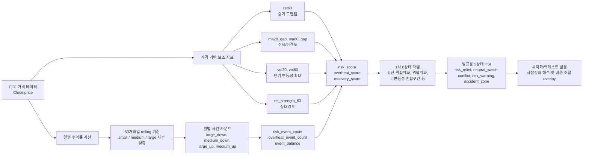
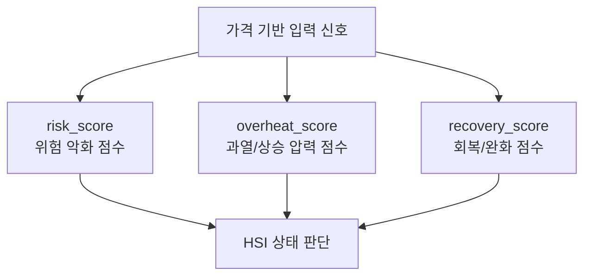
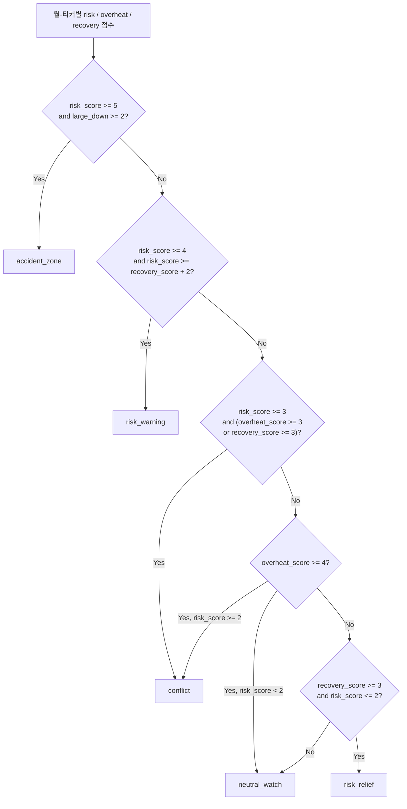
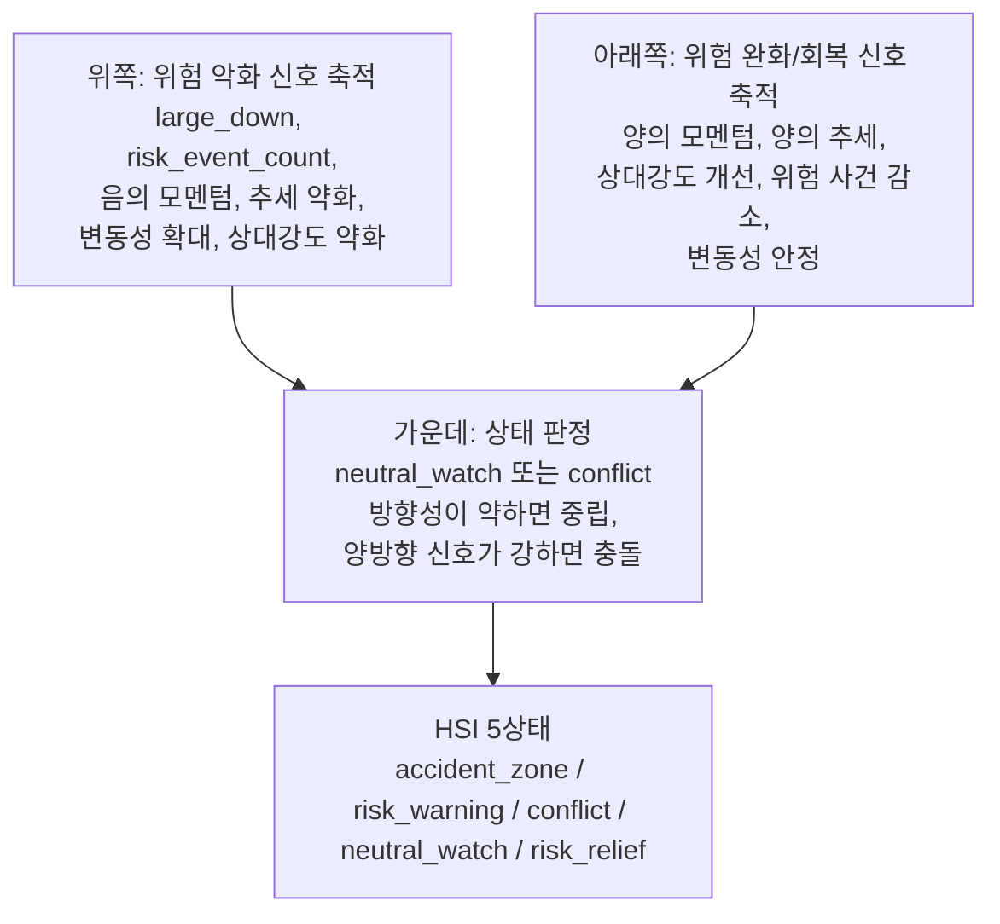
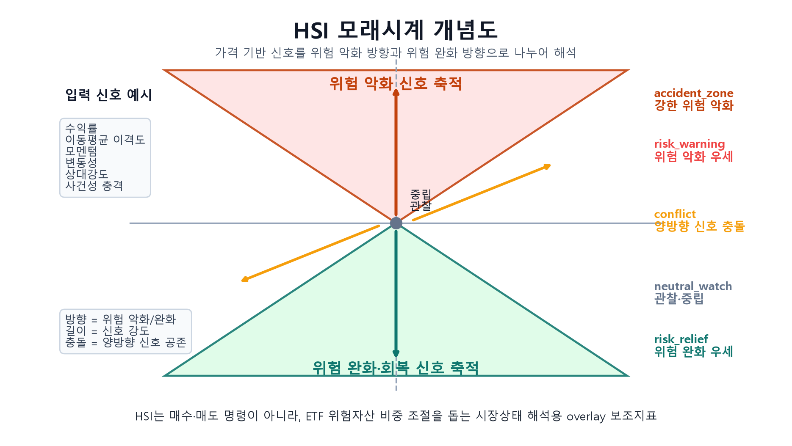

# HSI 입력 신호 변환 구조 시각화 문서

## 문서 목적

이 문서는 가격을 가진 ETF 입력 신호가 어떻게 해석 가능한 HSI 상태로 바뀌는지 설명한다. 핵심은 HSI가 가격 자체를 직접 예측값으로 쓰는 지표가 아니라, 가격에서 파생된 여러 신호를 위험 악화, 과열/충돌, 회복 방향으로 나누어 해석하는 시장상태 지표라는 점이다.

HSI는 여기서 **Hourglass Signal Index**의 약자로 사용한다. 모래시계 구조는 위쪽의 위험 악화 신호, 아래쪽의 위험 완화/회복 신호, 가운데의 중립/충돌 판단을 시각적으로 보여주기 위한 개념도이다.

## 전체 변환 흐름



## 가격 신호가 사건 신호로 바뀌는 과정

일별 수익률은 과거 60거래일의 절대수익률 분포와 비교해 사건 크기를 나눈다. 이때 현재 수익률은 기준 계산에 포함하지 않고, 이전 60거래일 기준으로 판단한다.

| 단계 | 입력 | 변환 기준 | 출력 |
|---|---|---|---|
| 1 | ETF 종가 | 전일 대비 변화율 | 일별 수익률 |
| 2 | 일별 수익률 절대값 | 과거 60거래일 60분위, 90분위 | small / medium / large |
| 3 | 수익률 부호 | 양수, 음수, 0 | up / down / flat |
| 4 | 크기와 방향 결합 | 예: large + down | large_down, medium_up 등 |
| 5 | 월별 집계 | 월-티커 단위 카운트 | 사건 카운트 테이블 |

사건 카운트는 다음처럼 방향성을 가진 압력으로 바뀐다.

```text
risk_event_count = medium_down + 2 * large_down
overheat_event_count = medium_up + 2 * large_up
event_balance = overheat_event_count - risk_event_count
```

즉, 큰 하락은 단순 하락보다 더 강한 위험 악화 신호로 보고, 큰 상승은 단순 상승보다 더 강한 과열/상승 압력으로 본다.

## 가격 기반 보조 지표

HSI는 사건 카운트만 보지 않고, 가격에서 만든 보조 지표도 함께 사용한다.

| 입력 신호 | 의미 | HSI 해석 방향 |
|---|---|---|
| `ret63` | 중기 수익률/모멘텀 | 음수면 위험 악화, 양수면 회복/과열 |
| `ma20_gap` | 20일 이동평균 대비 이격도 | 양수면 추세 양호, 과도하면 과열 후보 |
| `ma60_gap` | 60일 이동평균 대비 이격도 | 장단기 추세 방향 확인 |
| `vol20` | 단기 변동성 | `vol60`보다 크면 변동성 확대 |
| `vol60` | 중기 변동성 | 단기 변동성의 비교 기준 |
| `rel_strength_63` | 상대강도 | 음수면 위험자산 약세, 양수면 회복 우위 |

## HSI 점수화 구조

HSI는 입력 신호를 세 개의 해석 점수로 나눈다.



### risk_score

위험 악화 방향의 신호가 쌓일수록 증가한다.

| 조건 | 점수 |
|---|---:|
| `large_down >= 2` | +2 |
| `medium_down >= 3` | +1 |
| `risk_event_count >= 4` | +1 |
| `ret63 < 0` | +1 |
| `ma20_gap < 0` and `ma60_gap < 0` | +1 |
| `vol20 > vol60` | +1 |
| `rel_strength_63 < 0` | +1 |

### overheat_score

상승 압력이나 과열 가능성이 쌓일수록 증가한다.

| 조건 | 점수 |
|---|---:|
| `large_up >= 2` | +2 |
| `medium_up >= 3` | +1 |
| `overheat_event_count >= 4` | +1 |
| `ret63 > 0` | +1 |
| `ma20_gap > 0` and `ma60_gap > 0` | +1 |
| `ma20_gap`이 과거 기준 상위권 또는 5% 초과 | +1 |
| `vol20 > vol60` | +1 |

### recovery_score

위험 완화 또는 회복 방향의 신호가 쌓일수록 증가한다.

| 조건 | 점수 |
|---|---:|
| `ret63 > 0` | +1 |
| `ma20_gap > 0` and `ma60_gap > 0` | +1 |
| `rel_strength_63 > 0` | +1 |
| `risk_event_count <= 1` | +1 |
| `vol20 <= vol60` | +1 |

## 1차 8상태에서 발표용 5상태로 변환

실험 과정에서는 먼저 8개 상태 라벨을 만들었다. 중간 발표에서는 이를 더 설명하기 쉬운 5상태 HSI 체계로 묶어 사용한다. 원본 8상태 데이터는 보존하고, 발표용 데이터만 별도 디렉토리에 파생해 두었다.

| 발표용 5상태 | 한국어 설명 | 해석 |
|---|---|---|
| `risk_relief` | 위험 완화 우세 | 회복 신호가 우세하고 위험 신호가 약한 구간 |
| `neutral_watch` | 관찰/중립 | 어느 방향도 강하지 않은 구간 |
| `conflict` | 충돌 상태 | 위험 신호와 회복/과열 신호가 동시에 강한 구간 |
| `risk_warning` | 위험 악화 우세 | 위험 신호가 회복 신호보다 뚜렷하게 강한 구간 |
| `accident_zone` | 강한 위험 악화 | 큰 하락 사건과 높은 위험 점수가 동시에 나타난 구간 |

발표용 5상태 변환 규칙은 다음과 같다.



## 모래시계 구조로 본 HSI



기존 발표용 그림 파일:



```text
output/presentation/20260630_state5_midterm/figures/fig00_hsi_hourglass_concept.png
```

## HSI가 아닌 것과 HSI인 것

HSI 자체는 단일 가격 그래프가 아니다. HSI는 여러 가격 기반 입력 신호를 해석 가능한 시장상태로 변환한 결과이다.

| 구분 | 예시 | HSI와의 관계 |
|---|---|---|
| 원천 데이터 | ETF 종가 | HSI의 입력 |
| 중간 신호 | 수익률, 이동평균 이격도, 변동성, 상대강도 | HSI 점수를 만들기 위한 재료 |
| 사건 압력 | P-wave, S-wave, large_down, large_up | HSI의 하위 입력 신호 |
| 내부 점수 | `risk_score`, `overheat_score`, `recovery_score` | HSI의 핵심 계산 구조 |
| 최종 상태 | 5상태 HSI 라벨 | 발표에서 말하는 HSI 결과 |

## 발표 설명 문장

발표에서는 다음처럼 설명할 수 있다.

> HSI는 가격을 그대로 매수/매도 신호로 쓰는 지표가 아닙니다. 먼저 ETF 가격에서 수익률, 이동평균 이격도, 변동성, 상대강도, 상승/하락 사건 카운트를 만들고, 이를 위험 악화 점수, 과열 점수, 회복 점수로 변환합니다. 이후 세 점수의 상대적인 크기와 충돌 여부를 기준으로 시장을 `risk_relief`, `neutral_watch`, `conflict`, `risk_warning`, `accident_zone`의 5상태로 분류합니다. 따라서 HSI는 미래 가격을 직접 예측하는 모델이 아니라, 현재 시장 신호를 해석 가능한 상태로 바꾸는 구조화된 시장상태 지표입니다.

## 백테스트 연결 방식

이후 머신러닝이나 딥러닝 백테스트에서는 HSI를 단독 예측 모델로 보기보다 시장상태 feature 또는 overlay signal로 사용하는 것이 적절하다.

| 활용 방식 | 설명 |
|---|---|
| Feature | 5상태 라벨을 one-hot encoding하거나 세 점수를 연속형 입력으로 사용 |
| Regime split | HSI 상태별로 별도 전략 성과를 비교 |
| Overlay | `risk_warning`, `accident_zone`에서는 위험자산 비중 축소 |
| Validation | 상태별 이후 수익률, 변동성, MDD, 승률을 비교해 HSI의 설명력을 검증 |

## 현재 구현 기준 파일

| 역할 | 파일 |
|---|---|
| 일별 수익률 사건 분류 및 월별 카운트 | `src/04_event_count_index.py` |
| 8상태 HSI 점수화 및 라벨링 | `src/05_hsi_state_classifier.py` |
| 발표용 5상태 파생 데이터 생성 | `src/10_build_presentation_state5_tables.py` |
| 발표용 Streamlit 시각화 | `streamlit_app.py` |
| 발표용 5상태 데이터 | `output/presentation/20260630_state5_midterm/tables/` |
