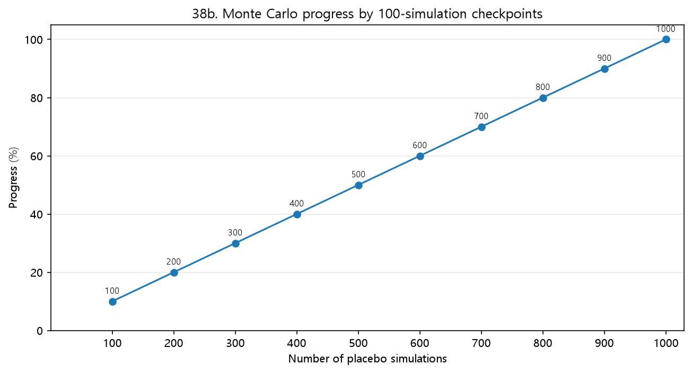
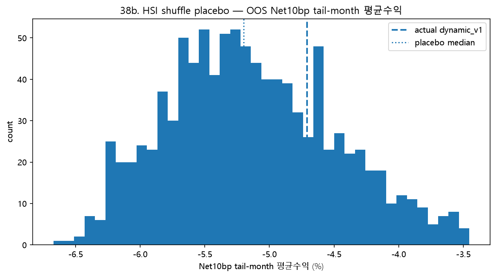

## 13.X HSI 목표비중 Shuffle Placebo Test

### 목적

37번 실험에서는 Final_RA_dynamic_v1과 FixedBM_70_20_10의 수익률 격차를 exposure effect와 timing effect로 분해하였다. 그 결과 BM 대비 CAGR 열위는 주로 평균 위험자산 노출 축소에서 발생했고, timing effect는 양(+)의 방향으로 나타났다. 38b 실험은 이 positive timing effect가 HSI 목표비중의 실제 시간 배치에서 나온 것인지, 아니면 목표비중을 무작위로 배치해도 비슷하게 재현되는지 확인하기 위한 ablation/placebo test이다.

### 37번 exposure/timing 분해와의 연결

37번의 exposure effect는 전략이 평균적으로 FixedBM보다 위험자산을 적게 보유한 데서 발생한 효과이다. 반면 timing effect는 실제 월별 비중이 자기 평균비중에서 벗어난 부분이 해당 월 수익률과 만나 발생한 효과이다. 따라서 HSI 목표비중의 시간 배치를 무작위로 섞으면 평균 노출 구조는 대체로 유지하면서도, 어느 시점에 어떤 목표비중을 사용했는지에 해당하는 timing 정보를 훼손할 수 있다. 이 점에서 38b 실험은 37번에서 관찰된 positive timing effect가 우연한 배치인지 확인하는 후속 검정이다.

### 방법

1. dynamic_v1의 실현 λ_t 시퀀스는 그대로 고정한다. 변동성·rolling drawdown 기반 λ 조절 경로는 손대지 않는다.
2. HSI 목표비중 시퀀스를 4개월 블록 단위로 무작위 셔플한다. 이는 상태의 시간적 지속성 구조를 일부 보존하기 위한 처리이다.
3. 셔플된 HSI 목표비중 w*_shuffled,t와 실제 λ_t를 이용해 placebo 포트폴리오 비중을 재귀적으로 재계산한다.

```text
w_t = w_(t-1) + λ_t × (w*_shuffled,t - w_(t-1))
```

4. 위 과정을 1000회 반복하여 placebo 귀무분포를 만들고, 실제 dynamic_v1의 성과가 이 분포에서 몇 백분위에 위치하는지 확인한다.

### 해석상 주의

이 검정은 HSI 전체의 독립 기여를 완전히 분리하는 최종 증명이 아니다. 실제 λ_t 경로 자체에도 risk_relief 지속 조건처럼 HSI 상태와 연결된 정보가 일부 포함될 수 있기 때문이다. 따라서 본 검정은 HSI 단독 효과를 확정하기보다, HSI 목표비중의 시간 배치가 무작위 배치보다 유리했는지 확인하는 보조 검증으로 해석한다.

### 표와 그림

[표 1. 38b 실험 설계 요약]

| 구분 | 처리 방식 | 해석 |
|---|---|---|
| 고정한 정보 | 실제 dynamic_v1의 λ_t 경로 | 변동성·drawdown 기반 실행속도 경로는 유지 |
| 무작위화한 정보 | HSI 목표비중의 시간 배치 | HSI 방향 정보의 시점성을 제거 |
| 셔플 방식 | 4개월 블록 셔플 | 상태 지속성을 일부 보존 |
| 반복 횟수 | 1000회 | 단일 셔플 우연성 방지 |
| 재구성 점검 | 최대 비중 오차 1.67e-16 | 실제 비중 경로와 replay 가정의 정합성 확인 |
| 판정 기준 | 유리 백분위, 단측 p-value | 실제 dynamic_v1이 placebo 분포에서 어디에 있는지 확인 |

표 1은 38b 실험에서 무엇을 고정하고 무엇을 무작위화했는지 정리한 것이다. 이 실험은 λ 실행속도 조절 자체를 제거하지 않고, HSI 목표비중의 시간 배치만 깨는 방식으로 설계하였다.



[그림 1. Monte Carlo 100회 단위 진행 확인]
그림 1은 placebo simulation이 100회 단위로 누적되어 최종 1000회까지 수행되었음을 보여준다. 이 그림은 최종 결과가 단일 셔플에 의존한 것이 아니라, 반복 표본을 단계적으로 누적해 만든 Monte Carlo 검정 결과임을 시각적으로 확인하기 위한 자료이다.


[그림 2. OOS 핵심 백분위의 누적 안정화 경로]
그림 2는 100회, 200회, ..., 1000회로 placebo 표본을 늘려가며 OOS 핵심 지표의 유리 백분위가 어떻게 변하는지 보여준다. 표본 수가 증가해도 주요 지표의 백분위가 크게 흔들리지 않으면, 최종 1000회 결과가 특정 소수 셔플의 우연에만 의존하지 않았다고 해석할 수 있다.


[그림 3. OOS Net10bp CAGR placebo 분포와 실제 dynamic_v1 위치]
그림 3은 해당 지표의 placebo 분포와 실제 dynamic_v1의 위치를 비교한 것이다. 실제값은 18.58%, placebo 중앙값은 15.23%이며, 유리 백분위는 93.5%ile, 단측 p-value는 0.066로 계산되었다. 실제값이 유리한 상위 구간에 위치할수록 HSI 목표비중의 시간 배치가 무작위 배치보다 유리했음을 시사한다.


[그림 4. OOS Net10bp MDD placebo 분포와 실제 dynamic_v1 위치]
그림 4은 해당 지표의 placebo 분포와 실제 dynamic_v1의 위치를 비교한 것이다. 실제값은 -12.63%, placebo 중앙값은 -18.44%이며, 유리 백분위는 94.4%ile, 단측 p-value는 0.057로 계산되었다. 실제값이 유리한 상위 구간에 위치할수록 HSI 목표비중의 시간 배치가 무작위 배치보다 유리했음을 시사한다.


[그림 5. OOS Net10bp Calmar placebo 분포와 실제 dynamic_v1 위치]
그림 5은 해당 지표의 placebo 분포와 실제 dynamic_v1의 위치를 비교한 것이다. 실제값은 1.471, placebo 중앙값은 0.815이며, 유리 백분위는 96.4%ile, 단측 p-value는 0.037로 계산되었다. 실제값이 유리한 상위 구간에 위치할수록 HSI 목표비중의 시간 배치가 무작위 배치보다 유리했음을 시사한다.



[그림 6. OOS Net10bp tail-month 평균수익 placebo 분포와 실제 dynamic_v1 위치]
그림 6은 해당 지표의 placebo 분포와 실제 dynamic_v1의 위치를 비교한 것이다. 실제값은 -4.71%, placebo 중앙값은 -5.20%이며, 유리 백분위는 74.0%ile, 단측 p-value는 0.261로 계산되었다. 실제값이 유리한 상위 구간에 위치할수록 HSI 목표비중의 시간 배치가 무작위 배치보다 유리했음을 시사한다.


[그림 7. OOS 핵심 지표별 유리 백분위 요약]
그림 7은 OOS 구간의 핵심 지표별 유리 백분위를 요약한 것이다. 수익률 지표와 방어 지표는 값이 클수록 유리하게, 변동성과 Turnover는 값이 낮을수록 유리하게 계산하였다. 따라서 여러 지표가 동시에 높은 유리 백분위에 위치하면, 실제 HSI 목표비중의 시간 배치가 단순 무작위 배치보다 방어형 RA 관점에서 더 안정적으로 작동했을 가능성이 커진다.

[표 2. OOS 핵심 지표별 actual dynamic_v1과 placebo 분포 비교]

| 지표 | 실제값 | Placebo 중앙값 | 차이 | 유리 백분위 | p-value | 해석 |
|---|---|---|---|---|---|---|
| Net10bp CAGR | 18.58% | 15.23% | +3.34%p | 93.5%ile | 0.066 | 실제값이 유리한 상위권: 무작위 배치 대비 유리 |
| Net10bp Calmar | 1.471 | 0.815 | +0.656 | 96.4%ile | 0.037 | 실제값이 유리한 극단 5% 이내: 무작위 배치 대비 매우 유리 |
| Net10bp MDD | -12.63% | -18.44% | +5.81%p | 94.4%ile | 0.057 | 실제값이 유리한 상위권: 무작위 배치 대비 유리 |
| Net10bp Sharpe | 1.031 | 0.937 | +0.094 | 90.4%ile | 0.097 | 실제값이 유리한 상위권: 무작위 배치 대비 유리 |
| Net10bp tail-month 평균수익 | -4.71% | -5.20% | +0.49%p | 74.0%ile | 0.261 | placebo 중하위권: 추가 해석 필요 |
| Net10bp 연환산 변동성 | 18.12% | 16.27% | +1.86%p | 22.4%ile | 0.776 | 실제값이 유리하지 않은 구간: 비용·변동성·회전율 측면 추가 해석 필요 |
| Net10bp 월 승률 | 56.06% | 56.06% | +0.00%p | 54.7%ile | 1.000 | placebo 중앙부: HSI 목표비중 타이밍 우위가 뚜렷하지 않음 |
| 평균 연환산 Turnover | 58.02% | 56.31% | +1.71%p | 37.8%ile | 0.622 | 실제값이 유리하지 않은 구간: 비용·변동성·회전율 측면 추가 해석 필요 |

표 2는 OOS 구간에서 실제 dynamic_v1의 핵심 지표와 placebo 분포의 중앙값을 비교한 것이다. 차이는 실제값에서 placebo 중앙값을 뺀 값이다. % 단위 지표는 %p 차이로, Sharpe와 Calmar는 ratio 차이로 해석한다.

### 결과 해석 기준

- 실제 dynamic_v1이 Calmar, MDD, tail-month 평균수익에서 placebo 유리 백분위 95% 이상이면, HSI 목표비중의 시간 배치가 무작위 배치보다 매우 유리했음을 시사한다.
- 80~95% 구간이면 HSI 목표비중 타이밍이 유리했을 가능성이 있으나, 보조 근거로 해석한다.
- 40~60% 중앙부라면 HSI 목표비중 타이밍 우위가 뚜렷하다고 보기 어렵다.
- Turnover와 변동성은 낮을수록 좋은 지표이므로, 이 두 지표의 유리 백분위는 값이 낮은 쪽을 좋게 평가한다.

### 종합 해석 문장

OOS Net10bp CAGR의 실제값은 18.58%, placebo 중앙값은 15.23%, 유리 백분위는 93.5%ile이다.
OOS Net10bp MDD의 실제값은 -12.63%, placebo 중앙값은 -18.44%, 유리 백분위는 94.4%ile이다.
OOS Net10bp Calmar의 실제값은 1.471, placebo 중앙값은 0.815, 유리 백분위는 96.4%ile이다.
OOS Net10bp tail-month 평균수익의 실제값은 -4.71%, placebo 중앙값은 -5.20%, 유리 백분위는 74.0%ile이다.
OOS 평균 연환산 Turnover의 실제값은 58.02%, placebo 중앙값은 56.31%, 유리 백분위는 37.8%ile이다.

종합하면, 38b 실험은 37번에서 확인된 positive timing effect가 단순한 우연 배치였는지 확인하기 위한 placebo 검정이다. 실제 dynamic_v1이 여러 핵심 지표에서 placebo 분포의 유리한 구간에 위치한다면, HSI 목표비중의 시간 배치가 무작위 배치보다 더 나은 방어 성과를 만들었을 가능성이 있다. 다만 실제 λ_t 경로를 고정했기 때문에 이 결과를 HSI 단독 효과의 최종 증명으로 해석하지 않고, HSI 목표비중 타이밍의 유효성을 확인하는 보조 검증으로 해석한다.
