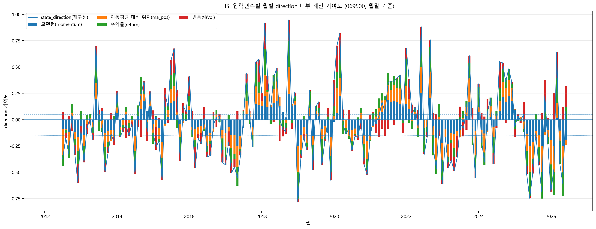
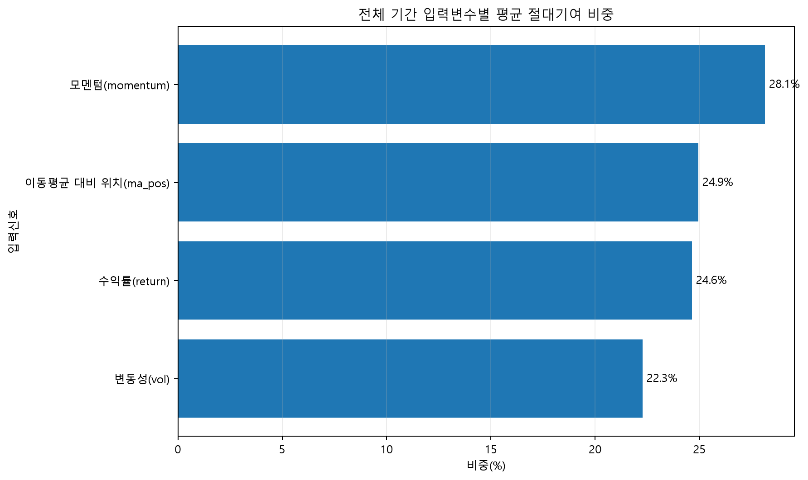
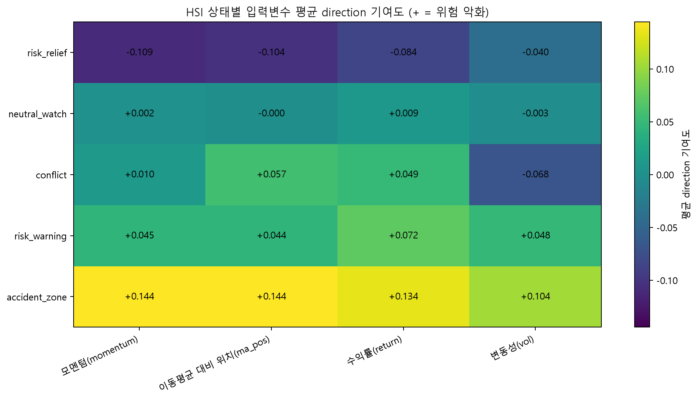
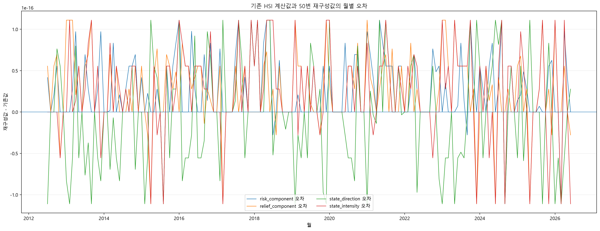

# 50번 HSI 입력변수별 내부 계산 기여도 결과정리

- 생성 시각: 2026-07-12 22:10:50
- 기준 티커: `069500`
- 기준 시점: 월말 HSI 입력신호
- 기준 상태규칙: `04_build_hsi_state5_baseline.py`와 동일

## 1. 분석 목적

기존 최종 산출물에는 HSI 상태분포와 전략성과가 포함되어 있었지만, 각 월의 상태판정 계산값이 입력신호별로 어떻게 구성되었는지를 직접 보여주는 자료는 없었다. 50번 분석은 기존 상태판정식을 변경하지 않고 입력변수별 내부 계산 기여도를 분해한다.

## 2. 문답으로 정리한 분석 범위

### 질문 1. 이 기여도는 무엇을 뜻하는가?

미래수익률 예측에 대한 feature importance가 아니다. 각 입력점수가 direction, intensity, risk_component, relief_component 계산에 얼마나 반영되었는지를 나타내는 내부 계산 기여도이다.

### 질문 2. 왜 별도의 50번 분석을 수행했는가?

기존 HSI 결과가 어떤 입력신호 조합으로 형성되었는지를 설명하고, 변수별 기여 합계가 기존 04번 계산과 일치하는지 검증하기 위해 수행하였다.

### 질문 3. 이 결과로 무엇을 확인할 수 있는가?

월별 direction 구성, 전체 기간 평균 절대기여 비중, 상태별 평균 기여 방향, 그리고 기존 HSI 계산값과 재구성값의 일치 여부를 확인할 수 있다.

### 질문 4. 이 결과로 무엇을 주장할 수 없는가?

각 입력신호가 미래수익률을 독립적으로 예측했다거나, 특정 신호가 전략성과의 인과적 원인이라고 주장할 수 없다.

## 3. 분석대상 범위

본 분석은 대표 위험자산 ETF인 `069500`의 월말 입력신호를 기준으로 한다. 투자대상은 ETF 3종이지만, 이 결과는 세 ETF 신호의 평균이 아니라 포트폴리오 비중조절의 기준이 되는 시장상태 신호의 내부 계산 분해이다.

## 4. 계산식

월 t의 유효 점수 수를 `n_t`, 변수 j의 점수를 `s_j,t`라고 하면:

```text
risk 기여(j,t)      = max(s_j,t, 0)  / (n_t × 10)
relief 기여(j,t)    = max(-s_j,t, 0) / (n_t × 10)
direction 기여(j,t) = s_j,t          / (n_t × 10)
intensity 기여(j,t) = |s_j,t|        / (n_t × 10)

risk_component_t     = Σ risk 기여(j,t)
relief_component_t   = Σ relief 기여(j,t)
state_direction_t    = Σ direction 기여(j,t)
state_intensity_t    = Σ intensity 기여(j,t)
```

## 5. 입력변수별 전체 기간 기여 요약

| score_variable | raw_valid_months | contribution_valid_months | absolute_contribution_share_pct | is_active_in_contribution | exclusion_reason |
|---|---|---|---|---|---|
| score_momentum | 168 | 168 | 28.1437 | True |  |
| score_ma_pos | 169 | 168 | 24.9443 | True |  |
| score_return | 168 | 168 | 24.6401 | True |  |
| score_vol | 168 | 168 | 22.272 | True |  |
| score_rs | 0 | 0 | 0 | False | all_values_missing_or_not_provided |

069500의 score_rs는 전체 기간에서 유효값이 없어 내부 계산 기여도에서 제외되었다. 이는 069500이 상대강도 benchmark인 자기비교 구조와 일치하는 결과로 해석할 수 있다.

- 시각화 제외 또는 N/A 처리 신호: `score_rs`

## 6. 시각화

### 6.1 월별 direction 내부 계산 기여도



### 6.2 전체 기간 평균 절대기여 비중



### 6.3 상태별 입력변수 평균 direction 기여도



## 7. 기존 HSI 계산과의 일치 검증

월별 전체 필드 일치 행은 `172/172`이며, 종합 검증 상태는 `OK`이다.

| audit_item | comparable_rows | mismatch_rows | max_abs_error | status |
|---|---|---|---|---|
| risk_component | 168 | 0 | 1.11022e-16 | OK |
| relief_component | 168 | 0 | 1.11022e-16 | OK |
| state_direction | 168 | 0 | 1.11022e-16 | OK |
| state_intensity | 168 | 0 | 1.11022e-16 | OK |
| valid_score_count | 172 | 0 | 0 | OK |
| hsi_state | 172 | 0 |  | OK |
| missing_months_in_input | 172 | 0 |  | OK |
| missing_months_in_state_table | 172 | 0 |  | OK |
| all_fields_row_match | 172 | 0 |  | OK |



## 8. 해석상 유의사항

전체 기간 평균 비중은 direction 기여도의 절댓값 합을 기준으로 계산한다. 따라서 양수와 음수가 서로 상쇄되는 문제를 피하지만, 미래수익률에 대한 예측력이나 인과효과를 의미하지 않는다.

상태별 평균 기여도는 해당 상태가 만들어진 뒤의 조건부 평균이다. 상태 정의와 내부 계산의 정합성을 설명하는 자료로 사용하며, 독립적인 성과 기여도 분석으로 해석하지 않는다.

## 9. 결론

50번은 새로운 HSI 상태규칙을 추가하는 실험이 아니다. 04번 baseline 상태판정 결과를 입력신호별로 분해하고, 그 합계가 기존 risk/relief, direction, intensity 및 최종 상태와 일치하는지 재현·검증하는 보충 분석이다.
