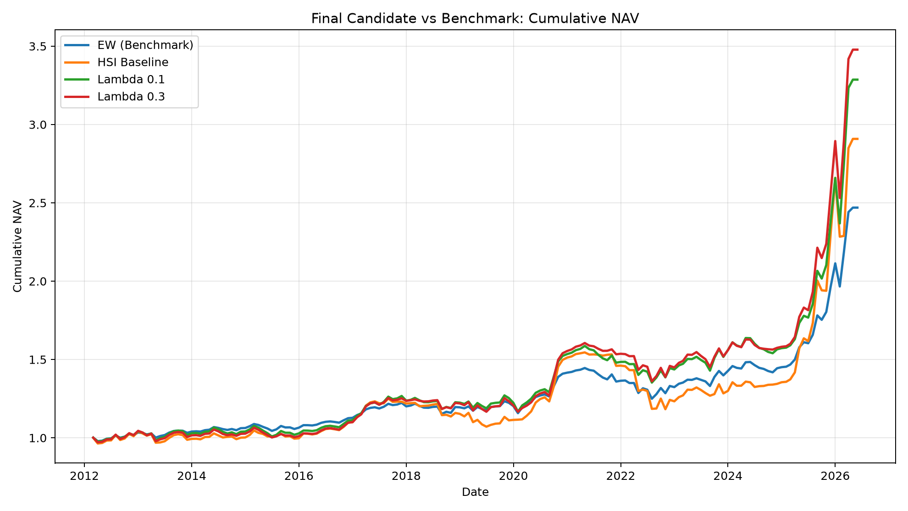
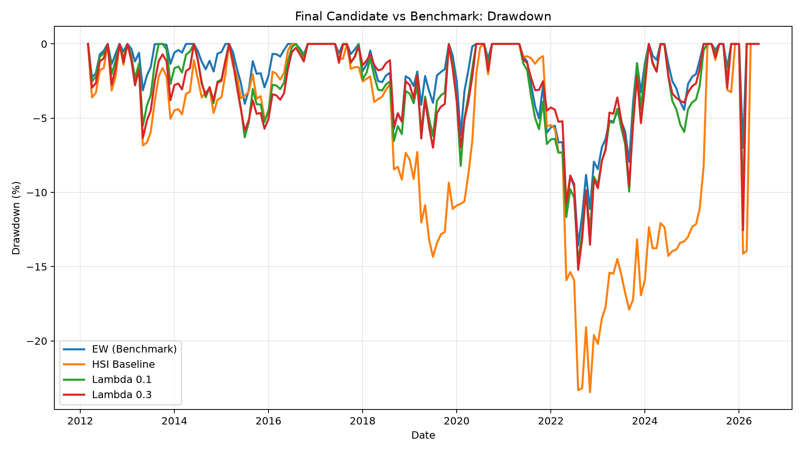
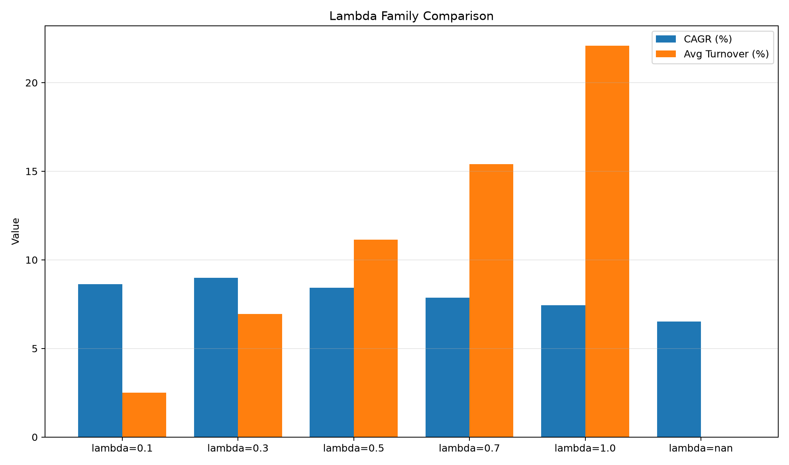
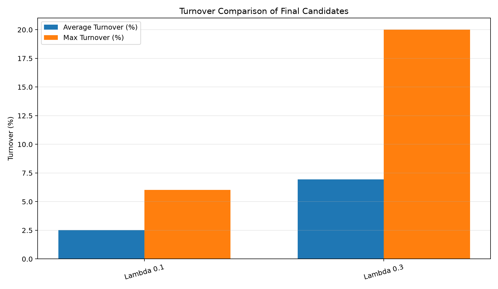
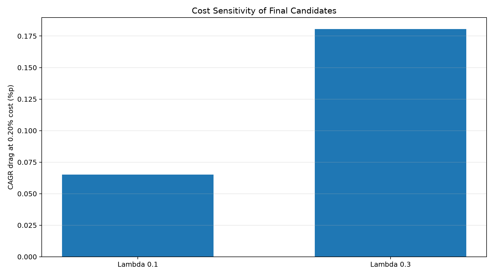
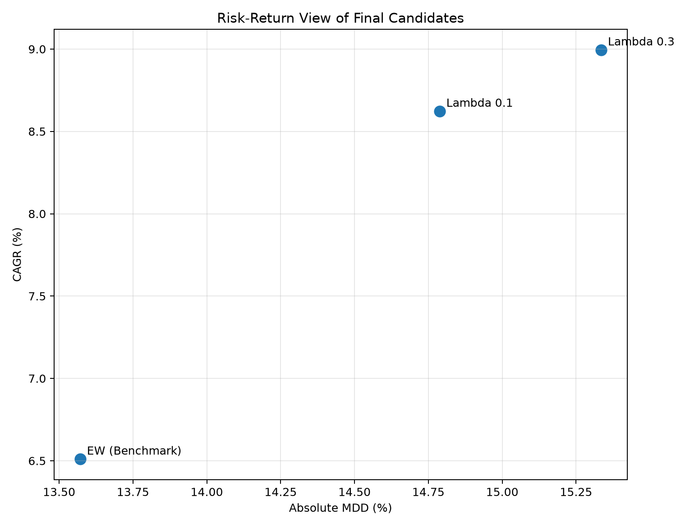

# HSI 기반 ETF 방어형 Overlay 전략 실험 결과보고서  
## 시장상태 분류와 비중 전환 속도 조절이 방어형 자산배분 성과에 미치는 영향

**작성 목적:** 팀 공유 및 결과보고서 초안  
**작성 기준:** 00~21번 실험 파이프라인 산출물  
**분석 대상:** 069500, 114260, 153130  
**주의:** 본 보고서는 수업 및 프로젝트 실험용이며, 특정 ETF에 대한 투자 권유가 아니다.

---

## 1. 연구 목적

본 실험의 목적은 HSI를 미래수익률을 직접 예측하는 모델로 사용하는 것이 아니라, 가격 기반 신호를 종합하여 시장상태를 해석하고 이를 ETF 비중 조절에 연결할 수 있는지 검토하는 데 있다.

본 프로젝트에서 HSI는 여러 가격 기반 신호를 위험 완화, 중립, 신호 충돌, 위험 악화, 강한 위험 구간으로 번역하는 시장상태 해석 지표로 사용된다. 이후 각 HSI 상태를 ETF 목표 비중에 연결하고, 월별 수익률, 최대낙폭, 위험조정성과, Turnover, 거래비용 민감도를 함께 확인하였다.

본 실험의 핵심 질문은 다음과 같다.

1. HSI 상태분류를 ETF 비중 조절에 연결할 수 있는가?
2. HSI 상태를 목표 비중에 즉시 반영할 때 방어형 전략으로 작동하는가?
3. 비중 전환 속도를 조절하는 λ 부분조정 구조가 Turnover와 위험지표를 개선하는가?
4. 최종 후보는 단순 수익률이 아니라 MDD, Calmar, Sharpe, Turnover, 거래비용 민감도 기준을 함께 통과하는가?

본 보고서에서는 HSI를 “수익률 예측기”가 아니라 “시장상태 번역기”로 해석한다. 따라서 결과 해석에서도 특정 전략이 모든 지표에서 우월하다고 단정하기보다, 어떤 구조에서 방어형 Overlay 후보로 검토 가능한지를 중심으로 정리한다.

---

## 2. 실험 데이터와 ETF 구성

본 실험은 데이터 담당자가 제공한 `hsi_data_bundle.xlsx`를 기준 입력으로 사용하였다. 후속 실험에서는 데이터를 새로 다운로드하지 않고, 해당 번들을 후속 실험용 CSV로 분리하여 사용하였다.

분석 대상 ETF는 다음 세 가지로 구성하였다.

| 티커 | ETF명 | 역할 |
|---|---|---|
| 069500 | KODEX 200 | 위험자산 |
| 114260 | KODEX 국고채3년 | 방어 채권 |
| 153130 | KODEX 단기채권PLUS | 현금성 방어자산 |

수익률은 백테스트 계산용 `monthly_return_decimal`과 검토용 `monthly_return_pct`로 구분하였다. 단위 오류를 방지하기 위해 `monthly_return_pct / 100 == monthly_return_decimal` 관계를 확인하였다.

이 점검은 백테스트 성과가 수익률 단위 오류로 과대 또는 과소 계산되는 것을 막기 위한 사전 검증 절차이다.

---

## 3. HSI 상태분류 구조

HSI는 가격 기반 신호를 종합하여 시장상태를 5가지로 분류한다. 본 실험에서 사용한 상태는 다음과 같다.

| HSI 상태 | 해석 | 자산배분 방향 |
|---|---|---|
| `risk_relief` | 위험 완화 우세 | 위험자산 비중 확대 |
| `neutral_watch` | 중립 관찰 | 균형 배분 |
| `conflict` | 신호 충돌 | 중간 방어 |
| `risk_warning` | 위험 악화 우세 | 위험자산 축소 |
| `accident_zone` | 강한 위험 구간 | 현금성 방어자산 중심 |

이 상태분류는 특정 자산의 미래수익률을 직접 예측하기 위한 것이 아니다. HSI는 현재 시장 신호가 위험 완화 방향인지, 위험 악화 방향인지, 또는 서로 충돌하는지를 요약하는 시장상태 번역기 역할을 한다.

### HSI 5상태 분포

04번 실험에서 생성된 HSI 상태분포는 다음과 같다.

| HSI 상태 | 월수 | 비중 |
|---|---:|---:|
| `risk_relief` | 81 | 48.21% |
| `neutral_watch` | 35 | 20.83% |
| `conflict` | 4 | 2.38% |
| `risk_warning` | 14 | 8.33% |
| `accident_zone` | 34 | 20.24% |
| `insufficient_data` | 4 | - |

상태분포를 보면 `risk_relief`가 가장 많이 나타났고, `accident_zone`도 일정 비중을 차지하였다. 반면 `conflict`는 매우 적게 나타났다. 이는 현재 상태분류 기준에서 신호 충돌 구간이 보수적으로 잡히고 있을 가능성을 보여준다. 따라서 HSI 상태분류는 완성된 고정 규칙이라기보다, θ 민감도 실험과 후속 조정이 필요한 기준선으로 해석하였다.

> 추가 권장 시각화: `main_final_hsi_state5_distribution.csv` 기반 HSI 5상태 분포 가로 막대바  
> 권장 파일명: `output/figures/main_final_report_hsi_state_distribution_bar.png`

---

## 4. Baseline 비중 규칙

HSI 상태를 ETF 목표 비중으로 연결하기 위해 다음 baseline 규칙을 사용하였다.

| HSI 상태 | 069500 | 114260 | 153130 | 해석 |
|---|---:|---:|---:|---|
| `risk_relief` | 70% | 20% | 10% | 위험 완화 우세. 위험자산 비중 확대 |
| `neutral_watch` | 50% | 35% | 15% | 중립 관찰. 균형 배분 |
| `conflict` | 35% | 40% | 25% | 신호 충돌. 중간 방어 |
| `risk_warning` | 20% | 45% | 35% | 위험 악화 우세. 방어자산 확대 |
| `accident_zone` | 0% | 30% | 70% | 강한 위험 구간. 현금성 방어자산 중심 |

Baseline 백테스트에서는 월말 HSI 상태를 다음 달 목표 ETF 비중에 즉시 반영하였다. 즉, 월말 HSI 상태가 변하면 다음 달 포트폴리오 목표 비중도 바로 변경된다.

이 구조는 HSI 상태분류를 ETF 자산배분 행동으로 연결하는 가장 직접적인 방식이다. 다만 상태 변화가 곧바로 큰 비중 변화로 이어지기 때문에 Turnover가 커질 가능성이 있다.

---

## 5. 실험 설계

본 실험은 다음 순서로 진행하였다.

| 단계 | 실험 | 목적 |
|---|---|---|
| 1 | 데이터 번들 정리 | HSI 입력자료와 월간 수익률 정리 |
| 2 | 사건균형지표 생성 | HSI 내부 위험/완화 극단 신호 누적 확인 |
| 3 | 월말 신호 정렬 | 월말 신호를 다음 달 수익률에 연결 |
| 4 | HSI 5상태 생성 | HSI를 시장상태 언어로 변환 |
| 5 | Baseline 백테스트 | HSI 상태별 목표 비중 즉시 적용 |
| 6 | 신호 조합 실험 | HSI 입력 조합별 안정성 확인 |
| 7 | 사건균형 필터 실험 | 사건균형지표를 보조 비중 조정으로 사용 |
| 8 | λ 부분조정 실험 | 목표 비중 전환 속도 조절 |
| 9 | θ 민감도 실험 | HSI 상태분류 기준 안정성 확인 |
| 10 | 최종 후보 선별 | Turnover, 거래비용, MDD, Sharpe, Calmar 기준 적용 |
| 11 | 보고서용 표·그림 생성 | 최종 후보 비교표와 시각화 자료 정리 |

특히 본 실험에서는 단순히 CAGR이 높은 후보를 찾기보다, 방어형 Overlay 전략으로 해석 가능한 후보를 찾는 데 초점을 두었다.


---

## 6. Baseline 실험 결과와 한계

Baseline 전략은 HSI 상태를 ETF 목표 비중에 즉시 반영하는 방식이다. 이 방식은 HSI 상태분류를 자산배분 행동으로 연결하는 가장 직접적인 구조이다.

실험 결과, baseline 전략은 EW benchmark보다 CAGR은 높게 나타났지만, MDD와 Turnover가 함께 커지는 문제가 있었다. 즉, HSI 상태분류를 ETF 비중 조절에 연결하는 구조 자체는 가능했지만, 목표 비중으로 즉시 이동하는 방식은 방어형 전략으로 보기에는 부담이 있었다.

이 결과는 다음과 같이 해석할 수 있다.

> HSI 상태분류는 의미가 있었지만, 상태 변화가 곧바로 큰 비중 변화로 이어질 경우 Turnover와 MDD가 커질 수 있다. 따라서 HSI 상태분류와 함께 비중 전환 속도를 조절하는 장치가 필요하다.

### 그림 1. 누적수익률 비교

아래 그림은 EW benchmark, HSI baseline, 최종 후보의 누적 성과 흐름을 비교한다. 이 그림은 HSI overlay 후보가 장기적으로 어떤 성과 흐름을 보였는지 확인하기 위한 자료이다.



그림 해석 시 주의할 점은 누적수익률만으로 전략을 평가하면 안 된다는 것이다. 방어형 Overlay 전략에서는 수익률뿐 아니라 MDD, Turnover, 거래비용 민감도를 함께 확인해야 한다.

### 그림 2. Drawdown 비교

아래 그림은 각 전략의 Drawdown 흐름을 비교한다.



이 그림은 baseline 즉시비중 구조의 한계를 설명할 때 중요하다. HSI 상태를 바로 목표 비중에 반영하는 방식은 성과 개선 가능성은 있었지만, 낙폭과 회전율 측면에서 부담이 있었다. 이후 λ 부분조정 실험은 이 문제를 완화하기 위해 수행하였다.

---

## 7. 신호 조합 및 사건균형 실험 결과

신호 조합 실험에서는 기존 HSI 5지표와 추가 후보를 조합하여 상태분포와 백테스트 성과를 비교하였다. 이 실험의 목적은 최고 수익률 조합을 찾는 것이 아니라, HSI 입력 조합이 달라졌을 때 상태분포, MDD, Turnover가 얼마나 안정적인지 확인하는 것이다.

실험 결과, 일부 조합은 성과 측면에서 참고할 만한 결과를 보였지만, 최종 후보 선별에서는 대부분 Turnover 기준을 통과하지 못했다. 따라서 신호 조합 변경만으로는 포트폴리오 비중 전환 문제를 충분히 해결하기 어렵다고 판단하였다.

사건균형지표는 HSI 입력 신호 내부에서 위험 사건과 완화 사건이 얼마나 누적되는지 확인하기 위한 보조지표로 설계하였다. 이 지표는 외부 사건 달력이 아니라, HSI 내부 신호의 위험/완화 극단 누적을 보여준다.

사건균형 필터 실험에서는 해당 지표를 HSI 상태를 대체하는 신호로 사용하지 않고, 상태별 목표 비중을 ±5~10%p 범위에서 보조 조정하는 방식으로 제한하였다. 그러나 현재 단순 규칙에서는 Turnover와 위험지표 개선이 충분하지 않아 최종 후보로 남지는 못했다.

따라서 사건균형지표는 현재 단계에서는 최종 비중 결정 신호라기보다, HSI 상태 해석을 보조하는 진단 지표로 두는 것이 적절하다.

---

## 8. λ 부분조정 실험 결과

Baseline의 한계를 보완하기 위해 λ 부분조정 실험을 수행하였다. λ 부분조정은 목표 비중으로 즉시 이동하지 않고, 이전 비중에서 목표 비중 방향으로 일부만 이동하는 방식이다.

```text
actual_weight_t = previous_weight + λ × (target_weight_t - previous_weight)
```

λ 값의 해석은 다음과 같다.

| λ | 해석 |
|---:|---|
| 1.0 | 목표 비중으로 즉시 이동 |
| 0.7 | 목표 비중의 70% 반영 |
| 0.5 | 목표 비중의 절반 반영 |
| 0.3 | 천천히 이동 |
| 0.1 | 매우 천천히 이동 |

실험 결과, λ를 낮출수록 Turnover가 크게 완화되었고, 일부 후보에서는 MDD와 Calmar도 개선되었다. 최종 후보 선별에서는 `lambda_0.1`과 `lambda_0.3`이 살아남았다.

### 그림 3. λ별 성과와 평균 Turnover 비교

아래 그림은 λ 값별 CAGR과 평균 Turnover를 비교한다.



이 그림은 이번 실험의 핵심 메시지를 보여준다. HSI 상태분류를 ETF 비중에 연결하는 것만으로는 충분하지 않았고, 상태 변화에 대한 반응 속도를 조절하는 λ가 중요했다.

특히 λ가 1.0에 가까우면 목표 비중으로 빠르게 이동하므로 Turnover가 커질 수 있다. 반면 λ를 낮추면 상태 변화에 천천히 반응하게 되어 Turnover가 완화된다. 다만 λ가 너무 낮으면 위험 상태 변화에 늦게 반응할 수 있으므로, 성과와 안정성의 균형을 함께 확인해야 한다.


---

## 9. 최종 후보 선별 기준

최종 후보는 단순 CAGR 기준이 아니라, 다음 조건을 함께 고려하여 선별하였다.

1. 평균 Turnover와 최대 Turnover가 과도하지 않은가?
2. 거래비용 반영 후 성과가 크게 훼손되지 않는가?
3. MDD가 방어형 전략으로 받아들일 수 있는 수준인가?
4. Sharpe와 Calmar가 함께 양호한가?
5. 특정 설정에만 의존하지 않는가?

거래비용률은 다음 네 가지 가정을 사용하였다.

| 거래비용률 | 해석 |
|---:|---|
| 0.00% | 비용 미반영 기준 |
| 0.05% | 낮은 비용 가정 |
| 0.10% | 보통 비용 가정 |
| 0.20% | 보수적 비용 가정 |

거래비용은 다음과 같이 단순화하였다.

```text
월별 거래비용 = 월별 Turnover × 거래비용률
비용 차감 후 월수익률 = 기존 월수익률 - 월별 거래비용
```

### 후보 판단 분포

20번 최종 후보 선별 결과, 전체 후보는 다음과 같이 분류되었다.

| 판단 결과 | 개수 |
|---|---:|
| `exclude_turnover` | 15 |
| `benchmark` | 5 |
| `final_candidate` | 2 |
| `exclude_risk_metric` | 1 |

이 분포는 본 실험에서 Turnover가 핵심 필터였음을 보여준다. 많은 후보가 수익률 측면에서는 참고할 수 있었지만, 방어형 Overlay 전략으로 보기에는 회전율이 과도했다.

> 추가 권장 시각화: 후보 판단 분포 도넛차트 또는 가로 막대바  
> 권장 파일명: `output/figures/main_final_report_candidate_decision_donut.png`

---

## 10. 최종 후보 선별 결과

최종 후보 선별 결과는 다음과 같다.

| 후보 | CAGR | MDD | Sharpe | Calmar | 평균 Turnover | 최대 Turnover | 20bp 비용 훼손 |
|---|---:|---:|---:|---:|---:|---:|---:|
| Lambda 0.1 | 8.62% | -14.79% | 0.791 | 0.583 | 2.52% | 6.02% | 0.065%p |
| Lambda 0.3 | 8.99% | -15.33% | 0.775 | 0.587 | 6.95% | 20.01% | 0.181%p |
| EW Benchmark | 6.51% | -13.57% | 0.832 | 0.480 | 0.00% | 0.00% | 0.000%p |

`lambda_0.1`은 Turnover와 거래비용 민감도가 매우 낮은 보수적 후보로 해석할 수 있다. `lambda_0.3`은 CAGR과 Calmar가 더 높아 수익성과 방어력의 균형 후보로 해석할 수 있다.

다만 EW benchmark의 Sharpe가 가장 높게 나타났기 때문에, HSI overlay 후보가 모든 성과지표에서 우월하다고 해석해서는 안 된다. 더 적절한 해석은 다음과 같다.

> Lambda 0.1과 Lambda 0.3은 EW보다 CAGR과 Calmar가 높고, Turnover와 거래비용 민감도도 관리 가능한 수준이었다. 다만 EW의 Sharpe가 더 높기 때문에, HSI overlay가 모든 지표에서 우월하다는 결론은 아니다. 현재 결과는 HSI 상태분류와 λ 부분조정 구조를 결합할 경우, 방어형 자산배분 후보로 검토할 가능성이 있다는 의미로 해석한다.

### 그림 4. 최종 후보 Turnover 비교

아래 그림은 최종 후보들의 평균 Turnover와 최대 Turnover를 비교한다.



이 그림은 왜 `lambda_0.1`과 `lambda_0.3`이 살아남았는지 보여준다. 두 후보는 baseline이나 즉시비중 전략에 비해 비중 전환 부담이 낮고, 거래비용 민감도도 관리 가능한 수준이었다.

### 그림 5. 거래비용 민감도 비교

아래 그림은 보수적 비용 가정인 0.20%에서 CAGR이 얼마나 훼손되는지 비교한다.



`lambda_0.1`은 비용 훼손이 매우 작아 저회전·보수형 후보로 해석할 수 있다. `lambda_0.3`은 `lambda_0.1`보다 비용 훼손은 크지만, CAGR과 Calmar가 더 높아 수익성과 방어력의 균형 후보로 볼 수 있다.


---

## 11. 위험-수익 균형 해석

최종 후보는 수익률 하나로만 판단하지 않았다. 방어형 Overlay 전략에서는 CAGR뿐 아니라 MDD와 Calmar를 함께 보는 것이 중요하다.

### 그림 6. 위험-수익 산점도

아래 그림은 후보별 CAGR과 절대 MDD의 관계를 보여준다.



이 그림은 후보의 위치를 직관적으로 보여준다. 일반적으로 같은 MDD 수준이라면 CAGR이 높을수록 좋고, 같은 CAGR이라면 MDD가 낮을수록 안정적이다.

현재 결과에서 `lambda_0.1`은 낮은 Turnover와 안정성을 강조할 수 있는 후보이고, `lambda_0.3`은 성과와 방어력의 균형을 강조할 수 있는 후보이다. EW benchmark는 Sharpe가 높지만, HSI 상태 정보를 사용하지 않는 단순 비교 기준이다.

---

## 12. 종합 해석

최종 후보 선별 결과, `lambda_0.1`과 `lambda_0.3`이 Turnover, 거래비용 민감도, MDD, Sharpe, Calmar 기준을 통과하였다.

다만 EW benchmark의 Sharpe가 가장 높게 나타났기 때문에, HSI overlay 후보가 모든 성과지표에서 우월하다고 해석해서는 안 된다.

본 실험의 핵심 결론은 다음과 같다.

> HSI 상태분류는 ETF 비중 조절에 연결될 수 있었지만, 목표 비중으로 즉시 이동하는 baseline 구조에서는 Turnover와 MDD가 커졌다. 반면 λ 부분조정을 적용하면 비중 전환 속도가 완화되어 Turnover, 거래비용 민감도, MDD 측면에서 더 안정적인 후보가 도출되었다.

따라서 HSI 상태분류 자체보다, HSI 상태 변화에 ETF 비중이 얼마나 빠르게 반응할지 조절하는 λ 구조가 중요하다는 점을 확인하였다.

---

## 13. 한계와 후속 과제

본 실험은 HSI 기반 ETF Overlay 전략의 가능성을 검토한 중간 실험이며, 다음과 같은 한계가 있다.

첫째, 최종 후보는 아직 제한된 ETF 유니버스 안에서 검토되었다. 분석 대상은 069500, 114260, 153130 세 ETF로 구성되어 있으며, 다른 자산군이나 해외 ETF로 일반화하려면 추가 검증이 필요하다.

둘째, 거래비용은 실제 수수료, 스프레드, 체결 비용을 정밀 추정하지 않고 단순화하였다. 본 실험에서는 월별 Turnover에 거래비용률을 곱하는 방식으로 비용 민감도를 확인하였다.

셋째, 사건균형지표는 해석 보조지표로는 의미가 있었지만, 현재의 단순 ±5~10%p 보조 필터 규칙만으로는 최종 후보를 만들기 어려웠다.

넷째, θ 민감도 실험은 수행했지만, θ와 λ를 결합한 제한 Grid Search는 후속 작업으로 남아 있다.

후속 과제는 다음과 같다.

1. θ × λ 제한 Grid Search 수행
2. Turnover 상한을 적용한 후보 재선별
3. 거래비용 민감도 재검토
4. 시장 상승기, 하락기, 충돌 구간별 Robustness 검증
5. 최종 후보를 단정하지 않고 중간 후보로 표현

---

## 14. 결론

본 실험은 HSI를 미래수익률 예측기로 사용하는 대신, 가격 기반 신호를 시장상태로 해석하고 ETF 비중 조절에 연결하는 방어형 Overlay 구조로 검토하였다.

실험 결과, HSI 상태를 ETF 목표 비중에 즉시 반영하는 baseline 구조는 Turnover와 MDD가 커지는 한계를 보였다. 그러나 λ 부분조정을 적용하면 비중 전환 속도가 완화되어 Turnover, 거래비용 민감도, MDD 측면에서 더 안정적인 후보가 도출되었다.

현재 기준에서 `lambda_0.1`과 `lambda_0.3`은 중간 후보로 남았다. `lambda_0.1`은 저회전·보수형 후보이고, `lambda_0.3`은 수익성과 방어력의 균형 후보로 해석할 수 있다.

따라서 현재 단계의 핵심 결론은 다음과 같다.

> HSI는 시장상태를 읽는 장치이고, λ는 그 상태 변화에 ETF 비중이 얼마나 빠르게 반응할지 조절하는 장치이다. HSI Overlay 전략은 상태분류와 비중 전환 속도 조절을 함께 설계할 때 방어형 자산배분 후보로 검토할 수 있다.

---

## 부록 B. 추가 권장 시각화 및 보고서 보완 계획

현재 21번 스크립트에서 생성된 그림은 최종 후보의 누적수익률, Drawdown, λ별 성과와 Turnover, 최종 후보 Turnover, 거래비용 민감도, 위험-수익 산점도를 중심으로 구성되어 있다. 이 그림들은 최종 후보의 성과와 위험 특성을 설명하는 데 충분히 유용하다.

다만 보고서의 앞부분과 최종 후보 선별 과정을 더 직관적으로 보여주기 위해 다음 두 가지 시각화를 추가하면 좋다.

### B.1. HSI 5상태 분포 가로 막대바

**권장 파일명**

```text
output/figures/main_final_report_hsi_state_distribution_bar.png
```

**사용 데이터**

```text
output/tables/main_final_hsi_state5_distribution.csv
```

**배치 위치**

```text
3. HSI 상태분류 구조
→ HSI 5상태 분포 설명 직후
```

**추가 이유**

HSI가 실제로 어떤 시장상태를 많이 생성했는지 보여주기 위해 필요하다. 현재 상태분포에서는 `risk_relief`가 가장 많이 나타났고, `conflict`는 매우 적게 나타났다. 이 결과는 HSI 상태분류 기준이 위험 완화와 강한 위험 구간을 비교적 뚜렷하게 포착했지만, 신호 충돌 구간은 보수적으로 잡고 있을 가능성을 보여준다.

**보고서에 넣을 해석 문장 예시**

```text
HSI 5상태 분포를 보면 risk_relief가 가장 높은 비중을 차지했고, accident_zone도 일정 비중을 보였다. 반면 conflict 상태는 매우 적게 나타났다. 이는 현재 상태분류 기준에서 신호 충돌 구간이 보수적으로 정의되었을 가능성을 시사한다. 따라서 conflict 기준은 후속 θ 민감도 실험과 함께 추가 검토할 필요가 있다.
```

---

### B.2. 후보 판단 분포 도넛차트 또는 가로 막대바

**권장 파일명**

```text
output/figures/main_final_report_candidate_decision_donut.png
```

또는 막대바를 사용할 경우:

```text
output/figures/main_final_report_candidate_decision_bar.png
```

**사용 데이터**

```text
output/tables/main_final_candidate_selection_summary.csv
```

또는 20번 실행 로그의 판단 분포:

| 판단 결과 | 개수 |
|---|---:|
| `exclude_turnover` | 15 |
| `benchmark` | 5 |
| `final_candidate` | 2 |
| `exclude_risk_metric` | 1 |

**배치 위치**

```text
9. 최종 후보 선별 기준
→ 후보 판단 분포 표 직후
```

**추가 이유**

최종 후보가 2개만 남은 이유를 직관적으로 보여주기 위해 필요하다. 특히 대부분의 후보가 `exclude_turnover`로 제외되었기 때문에, 본 실험에서 Turnover가 핵심 필터였다는 메시지를 시각적으로 전달할 수 있다.

**보고서에 넣을 해석 문장 예시**

```text
후보 판단 분포를 보면 전체 후보 중 다수가 Turnover 기준에서 제외되었다. 이는 HSI 상태분류나 신호 조합 자체보다, 상태 변화가 포트폴리오 비중 변화로 이어지는 과정에서 회전율 관리가 중요하다는 점을 보여준다. 최종 후보로 남은 lambda_0.1과 lambda_0.3은 성과지표뿐 아니라 Turnover와 거래비용 민감도 기준을 함께 통과했다는 점에서 의미가 있다.
```

---

### B.3. 도넛차트와 가로 막대바 사용 기준

성과지표 비교에는 도넛차트보다 막대바가 적합하다. CAGR, MDD, Sharpe, Calmar는 전체 합이 의미 있는 구성비가 아니기 때문이다. 따라서 성과지표 비교에는 막대바, 선그래프, 산점도를 사용한다.

도넛차트는 다음처럼 전체 후보가 몇 가지 판단 결과로 나뉘는 경우에만 제한적으로 사용한다.

```text
전체 후보 수
→ final_candidate
→ exclude_turnover
→ exclude_risk_metric
→ benchmark
```

정리하면 다음 기준을 따른다.

| 목적 | 권장 시각화 | 이유 |
|---|---|---|
| HSI 상태별 빈도 비교 | 가로 막대바 | 상태별 크기 차이를 정확히 비교하기 좋음 |
| 후보 판단 결과 분포 | 도넛차트 또는 가로 막대바 | 전체 후보가 어떻게 분류되었는지 보여주기 좋음 |
| 최종 후보 Turnover 비교 | 가로 막대바 | 평균 Turnover와 최대 Turnover를 비교하기 좋음 |
| 누적 성과 흐름 | 선그래프 | 시간 흐름에 따른 성과 변화를 보여주기 좋음 |
| Drawdown 흐름 | 선그래프 | 하락 구간과 회복 흐름을 보기 좋음 |
| 위험-수익 균형 | 산점도 | CAGR과 MDD의 관계를 한눈에 보기 좋음 |

---

### B.4. 최종 보고서 반영 우선순위

추가 시각화를 모두 만들 수 없다면 다음 순서로 우선 반영한다.

1. **HSI 5상태 분포 가로 막대바**  
   - HSI가 어떤 시장상태를 생성했는지 보여주는 기초 그림이다.
2. **후보 판단 분포 차트**  
   - 왜 최종 후보가 2개만 남았는지 설명하는 그림이다.
3. **이미 생성된 21번 그림 6개**  
   - 누적수익률, Drawdown, λ별 비교, Turnover, 비용 민감도, 위험-수익 산점도는 최종 후보 설명에 사용한다.

보고서 완성본에서는 다음 순서로 그림을 배치하는 것이 좋다.

| 보고서 위치 | 그림 | 현재 상태 |
|---|---|---|
| 3장 HSI 상태분류 구조 | HSI 5상태 분포 가로 막대바 | 추가 권장 |
| 6장 Baseline 결과와 한계 | 누적수익률 비교 | 생성 완료 |
| 6장 Baseline 결과와 한계 | Drawdown 비교 | 생성 완료 |
| 8장 λ 부분조정 실험 | λ별 성과와 Turnover 비교 | 생성 완료 |
| 9장 최종 후보 선별 기준 | 후보 판단 분포 차트 | 추가 권장 |
| 10장 최종 후보 선별 결과 | 최종 후보 Turnover 비교 | 생성 완료 |
| 10장 최종 후보 선별 결과 | 거래비용 민감도 비교 | 생성 완료 |
| 11장 위험-수익 균형 해석 | 위험-수익 산점도 | 생성 완료 |

---

## 부록. 주요 용어 정리

- HSI: Hourglass Signal Index. 본 프로젝트에서는 여러 가격 기반 신호를 종합하여 시장상태를 해석하는 지표로 사용하였다.
- Overlay: 기존 포트폴리오 위에 추가로 얹는 비중 조절 규칙이다.
- MDD: Maximum Drawdown. 누적수익률 고점 대비 가장 크게 하락한 비율이다.
- Sharpe: 변동성 대비 초과수익을 보는 위험조정성과 지표이다.
- Calmar: 최대낙폭 대비 수익률을 보는 지표이다.
- Turnover: 리밸런싱 시 포트폴리오 비중이 얼마나 많이 바뀌었는지를 나타내는 지표이다.
- λ 부분조정: 목표 비중으로 즉시 이동하지 않고, 이전 비중에서 목표 비중 방향으로 일부만 이동하는 방식이다.
- θ 민감도: HSI 상태분류 기준값을 바꾸었을 때 결과가 얼마나 안정적인지 확인하는 검증이다.
