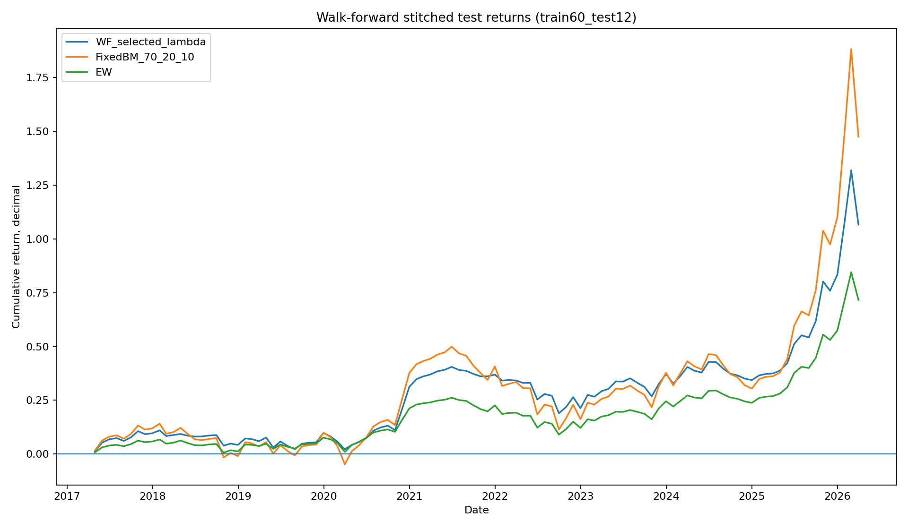
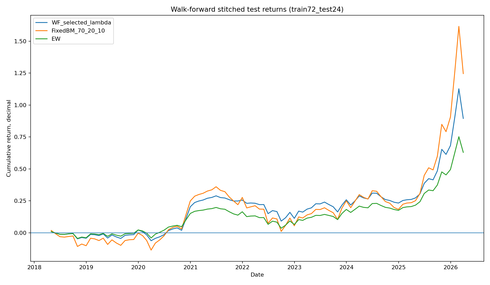
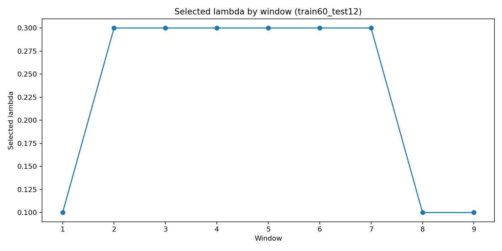
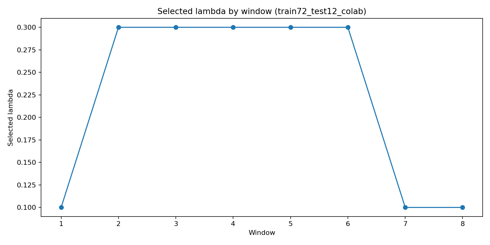
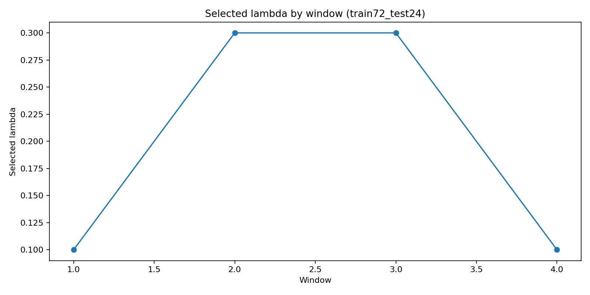

# 19. 간이 Walk-forward Robustness Check 결과 정리

> **삽입 위치 권장:** 최종 보고서의 기존 `13.3 HSI 목표비중 Shuffle Placebo Test` 뒤, 또는 `15. 한계 및 후속 검증 과제` 앞에 별도 절로 배치한다.  
> 권장 절 제목: `13.4 간이 Walk-forward Robustness Check: λ 후보의 시간 안정성 점검`  
> 이 절은 “최적화 결과”가 아니라 “후보 안정성 검증”으로 읽히게 배치해야 한다.

---

## 19.1 실험 목적과 해석 범위

> **삽입 위치:** `13.4` 절의 첫 문단. Shuffle placebo와 attribution 뒤에 넣으면, “사후 검증을 추가로 수행했다”는 흐름이 자연스럽다.

본 실험은 HSI 기반 동적자산배분 전략에서 사용한 λ 후보가 전체기간 성과에만 맞춰진 결과인지 점검하기 위해 수행한 간이 walk-forward robustness check이다. 각 train window에서는 λ 후보군만 비교하고, 선택된 λ를 바로 다음 test window에 고정 적용하였다. 따라서 이 실험의 목적은 λ를 새로 최적화하는 것이 아니라, 기존 후보군이 시간 순서가 분리된 검증 구간에서도 급격히 무너지지 않는지 확인하는 데 있다.

본 실험은 상용 RoboAdvisor 전략을 확정하기 위한 완전한 walk-forward 검증은 아니다. 다만 기존 전체기간 백테스트, 비용 민감도, rolling 36개월 검증, factor loading, attribution, shuffle placebo에 이어, 후보 λ의 시간 안정성을 추가로 점검한 보조 robustness 검증으로 해석한다.

**보고서용 핵심 문장:**  
본 walk-forward 검증은 “최적 파라미터 탐색”이 아니라, 사전에 정한 λ 후보군이 시간순 test 구간에서도 방어형 성격을 유지하는지 확인하기 위한 간이 robustness check이다.

---

## 19.2 실험 설계

> **삽입 위치:** `13.4.1 실험 설계` 또는 `검증 설계` 소절. 과적합 방지 설명과 함께 배치한다.

공식 로컬 실험에서는 72개월 train window와 12개월 test window를 사용하였다. 각 window에서 λ 후보군 `0.1, 0.3, 0.5, 0.7, 1.0`을 train 구간에서만 비교하고, train 구간에서 선택된 λ를 다음 test 구간에 고정 적용하였다. test 결과를 보고 같은 window의 λ를 다시 바꾸지 않았으며, 이 조건은 audit table에서 `walk_forward_no_test_reselection = PASS`로 확인되었다.

Colab 보조 실험에서는 공식 결과를 대체하지 않고, train/test window 길이를 바꾸었을 때 결과가 크게 달라지는지 확인하였다. 세 가지 보조 설정을 사용하였다.

<b>Colab 보조 실험 variant</b> 
① train60_test12: 60개월 train → 12개월 test 
② train72_test12_colab: 72개월 train → 12개월 test 
③ train72_test24: 72개월 train → 24개월 test

이때 모든 실험은 동일한 ETF 3종, 동일한 HSI 상태별 목표비중, 동일한 λ 후보군, 동일한 10bp 거래비용을 사용하였다. 따라서 Colab 실험은 새로운 모델 탐색이 아니라, window 설정 변화에 대한 보조 민감도 확인이다.

---

## 19.3 공식 로컬 walk-forward 결과 해석

> **삽입 위치:** `13.4.2 공식 walk-forward 결과` 소절. 공식 결과를 먼저 설명하고, 그 뒤 Colab 결과를 보조 검증으로 배치한다.

공식 19번 실험에서 72개월 train과 12개월 test를 사용한 결과, 전체 8개 test window가 생성되었다. test 구간을 이어 붙인 WF selected λ의 성과는 CAGR 8.41%, MDD -15.33%, Sharpe 0.691, Calmar 0.548이었다. FixedBM_70_20_10과 비교하면 CAGR은 낮았지만, MDD는 -25.67%에서 -15.33%로 완화되었고 Calmar도 0.415에서 0.548로 높았다. 이는 시간순 test 구간에서도 방어형 성격이 일부 유지되었음을 의미한다.

다만 이 결과를 λ 선택 규칙의 우월성으로 해석해서는 안 된다. 동일 stitched 기간에서 static λ=0.3은 CAGR 9.23%, Calmar 0.602로 WF selected λ보다 높았고, static λ=0.1은 MDD와 Turnover 측면에서 더 안정적이었다. 따라서 공식 walk-forward 결과는 “선택 규칙이 우수하다”는 증거라기보다, “전체기간 후보가 test 구간에서 완전히 붕괴하지는 않았지만, λ 선택 규칙과 Turnover 관리 기준은 추가 보완이 필요하다”는 검증 결과로 해석하는 것이 적절하다.

### 표 19-1. 공식 walk-forward stitched test 성과 요약

> **삽입 위치:** 공식 19번 결과 문단 바로 아래.  
> **강조 색상 기준:** 파란색 = 방어형 장점, 주황색 = 주의할 한계, 초록색 = 비교상 양호.

<table style="border-collapse:collapse; width:100%; font-size:14px;">
<thead>
<tr style="background:#D9EAF7;">
<th style="border:1px solid #999; padding:6px;">전략</th>
<th style="border:1px solid #999; padding:6px;">CAGR</th>
<th style="border:1px solid #999; padding:6px;">MDD</th>
<th style="border:1px solid #999; padding:6px;">Sharpe</th>
<th style="border:1px solid #999; padding:6px;">Calmar</th>
<th style="border:1px solid #999; padding:6px;">평균 연환산 Turnover</th>
<th style="border:1px solid #999; padding:6px;">해석</th>
</tr>
</thead>
<tbody>
<tr>
<td style="border:1px solid #999; padding:6px; font-weight:bold;">WF selected λ</td>
<td style="border:1px solid #999; padding:6px; background:#EAF3F8;">8.41%</td>
<td style="border:1px solid #999; padding:6px; background:#DDEBF7;">-15.33%</td>
<td style="border:1px solid #999; padding:6px;">0.691</td>
<td style="border:1px solid #999; padding:6px; background:#DDEBF7;">0.548</td>
<td style="border:1px solid #999; padding:6px; background:#FCE4D6;">67.80%</td>
<td style="border:1px solid #999; padding:6px;">FixedBM 대비 낙폭 완화. 다만 turnover 부담 존재.</td>
</tr>
<tr>
<td style="border:1px solid #999; padding:6px;">FixedBM_70_20_10</td>
<td style="border:1px solid #999; padding:6px; background:#E2F0D9;">10.64%</td>
<td style="border:1px solid #999; padding:6px; background:#F4CCCC;">-25.67%</td>
<td style="border:1px solid #999; padding:6px;">0.600</td>
<td style="border:1px solid #999; padding:6px;">0.415</td>
<td style="border:1px solid #999; padding:6px;">0.00%</td>
<td style="border:1px solid #999; padding:6px;">수익률은 높지만 낙폭 부담이 큼.</td>
</tr>
<tr>
<td style="border:1px solid #999; padding:6px;">EW</td>
<td style="border:1px solid #999; padding:6px;">6.30%</td>
<td style="border:1px solid #999; padding:6px; background:#E2F0D9;">-13.57%</td>
<td style="border:1px solid #999; padding:6px; background:#E2F0D9;">0.730</td>
<td style="border:1px solid #999; padding:6px;">0.464</td>
<td style="border:1px solid #999; padding:6px;">0.00%</td>
<td style="border:1px solid #999; padding:6px;">안정적이나 상승장 참여는 제한적.</td>
</tr>
<tr>
<td style="border:1px solid #999; padding:6px;">static λ=0.1</td>
<td style="border:1px solid #999; padding:6px;">8.36%</td>
<td style="border:1px solid #999; padding:6px; background:#E2F0D9;">-14.79%</td>
<td style="border:1px solid #999; padding:6px; background:#E2F0D9;">0.707</td>
<td style="border:1px solid #999; padding:6px; background:#E2F0D9;">0.565</td>
<td style="border:1px solid #999; padding:6px; background:#E2F0D9;">33.09%</td>
<td style="border:1px solid #999; padding:6px;">저회전형 후보로 가장 안정적.</td>
</tr>
<tr>
<td style="border:1px solid #999; padding:6px;">static λ=0.3</td>
<td style="border:1px solid #999; padding:6px; background:#E2F0D9;">9.23%</td>
<td style="border:1px solid #999; padding:6px; background:#DDEBF7;">-15.33%</td>
<td style="border:1px solid #999; padding:6px;">0.697</td>
<td style="border:1px solid #999; padding:6px; background:#E2F0D9;">0.602</td>
<td style="border:1px solid #999; padding:6px; background:#FCE4D6;">90.46%</td>
<td style="border:1px solid #999; padding:6px;">성과·Calmar는 좋지만 turnover 부담 큼.</td>
</tr>
</tbody>
</table>

**표 해석:** WF selected λ는 FixedBM보다 낮은 CAGR을 기록했지만 MDD와 Calmar 측면에서는 방어형 성격을 보였다. 그러나 static λ=0.3보다 성과가 우수하지 않았고, static λ=0.1보다 turnover와 MDD 측면에서 불리했다. 따라서 공식 walk-forward 결과는 λ 선택 규칙의 우월성 입증이 아니라, 후보가 시간순 test에서 완전히 붕괴하지 않았다는 보조 근거로 해석한다.

---

## 19.4 Colab 보조 walk-forward 결과

> **삽입 위치:** 공식 19번 결과 뒤, `13.4.3 Colab 보조 window 민감도 실험` 소절로 배치한다.  
> 이 절은 “공식 결과를 보조하는 민감도 확인”임을 첫 문장에 명시한다.

Colab 보조 실험은 로컬 VSCode에서 생성한 공식 19번 결과를 대체하지 않고, train/test window 길이를 바꾸었을 때 결과가 크게 흔들리는지 확인하기 위해 수행하였다. 세 가지 설정을 비교한 결과, WF selected λ의 CAGR은 8.32~8.41%, MDD는 모두 -15.33%, Calmar는 0.543~0.548 수준으로 나타났다. 즉, train/test window 길이를 60/12, 72/12, 72/24로 바꾸어도 결과가 급격히 붕괴하지 않았다.

### 표 19-2. Colab 보조 walk-forward variant별 WF selected λ 성과

> **삽입 위치:** Colab 실험 설명 직후.  
> **강조 색상 기준:** 파란색 = 세 variant 간 안정적으로 반복된 값, 주황색 = turnover 부담.

<table style="border-collapse:collapse; width:100%; font-size:14px;">
<thead>
<tr style="background:#D9EAF7;">
<th style="border:1px solid #999; padding:6px;">variant</th>
<th style="border:1px solid #999; padding:6px;">months</th>
<th style="border:1px solid #999; padding:6px;">CAGR</th>
<th style="border:1px solid #999; padding:6px;">MDD</th>
<th style="border:1px solid #999; padding:6px;">Sharpe</th>
<th style="border:1px solid #999; padding:6px;">Calmar</th>
<th style="border:1px solid #999; padding:6px;">평균 연환산 Turnover</th>
<th style="border:1px solid #999; padding:6px;">해석</th>
</tr>
</thead>
<tbody>
<tr>
<td style="border:1px solid #999; padding:6px; font-weight:bold;">train60_test12</td>
<td style="border:1px solid #999; padding:6px;">108</td>
<td style="border:1px solid #999; padding:6px; background:#DDEBF7;">8.39%</td>
<td style="border:1px solid #999; padding:6px; background:#DDEBF7;">-15.33%</td>
<td style="border:1px solid #999; padding:6px; background:#E2F0D9;">0.721</td>
<td style="border:1px solid #999; padding:6px; background:#DDEBF7;">0.547</td>
<td style="border:1px solid #999; padding:6px; background:#FCE4D6;">71.84%</td>
<td style="border:1px solid #999; padding:6px;">가장 긴 test 합산 기간. 성과 안정적이나 turnover 부담.</td>
</tr>
<tr>
<td style="border:1px solid #999; padding:6px; font-weight:bold;">train72_test12_colab</td>
<td style="border:1px solid #999; padding:6px;">96</td>
<td style="border:1px solid #999; padding:6px; background:#DDEBF7;">8.41%</td>
<td style="border:1px solid #999; padding:6px; background:#DDEBF7;">-15.33%</td>
<td style="border:1px solid #999; padding:6px;">0.691</td>
<td style="border:1px solid #999; padding:6px; background:#DDEBF7;">0.548</td>
<td style="border:1px solid #999; padding:6px; background:#FCE4D6;">67.80%</td>
<td style="border:1px solid #999; padding:6px;">로컬 공식 19번과 같은 설정. 결과 재현 확인.</td>
</tr>
<tr>
<td style="border:1px solid #999; padding:6px; font-weight:bold;">train72_test24</td>
<td style="border:1px solid #999; padding:6px;">96</td>
<td style="border:1px solid #999; padding:6px; background:#DDEBF7;">8.32%</td>
<td style="border:1px solid #999; padding:6px; background:#DDEBF7;">-15.33%</td>
<td style="border:1px solid #999; padding:6px;">0.685</td>
<td style="border:1px solid #999; padding:6px; background:#DDEBF7;">0.543</td>
<td style="border:1px solid #999; padding:6px; background:#FCE4D6;">60.36%</td>
<td style="border:1px solid #999; padding:6px;">24개월 test에서도 방어형 성격 유지.</td>
</tr>
</tbody>
</table>

**표 해석:** 세 variant 모두 CAGR, MDD, Calmar가 비슷한 범위에 머물렀다. 이는 WF selected λ 결과가 단일 train/test window 설정에만 의존한 것은 아닐 가능성을 보조적으로 보여준다. 다만 평균 연환산 Turnover는 60~72% 수준으로 여전히 높아, 상용 운용 관점에서는 추가적인 회전율 관리 규칙이 필요하다.

---

## 19.5 선택 λ 빈도 해석

> **삽입 위치:** Colab 성과표 바로 뒤.  
> 이 표는 “λ=0.1/0.3 후보 유지”의 근거로 사용한다.

Colab 보조 실험에서 선택된 λ는 모두 0.1 또는 0.3에 집중되었다. 0.5, 0.7, 1.0과 같은 고속 조정 후보는 선택되지 않았다. 이는 기존 전체기간 분석에서 남긴 저회전형 λ=0.1과 균형형 λ=0.3 후보가 walk-forward window 설정을 바꾸어도 주요 후보로 유지되었음을 보여준다.

### 표 19-3. Colab 보조 실험의 선택 λ 빈도

<table style="border-collapse:collapse; width:70%; font-size:14px;">
<thead>
<tr style="background:#D9EAF7;">
<th style="border:1px solid #999; padding:6px;">variant</th>
<th style="border:1px solid #999; padding:6px;">λ=0.1 선택 횟수</th>
<th style="border:1px solid #999; padding:6px;">λ=0.3 선택 횟수</th>
<th style="border:1px solid #999; padding:6px;">해석</th>
</tr>
</thead>
<tbody>
<tr>
<td style="border:1px solid #999; padding:6px;">train60_test12</td>
<td style="border:1px solid #999; padding:6px; background:#E2F0D9;">3</td>
<td style="border:1px solid #999; padding:6px; background:#E2F0D9;">6</td>
<td style="border:1px solid #999; padding:6px;">λ=0.3 중심, 일부 보수형 λ=0.1 선택.</td>
</tr>
<tr>
<td style="border:1px solid #999; padding:6px;">train72_test12_colab</td>
<td style="border:1px solid #999; padding:6px; background:#E2F0D9;">3</td>
<td style="border:1px solid #999; padding:6px; background:#E2F0D9;">5</td>
<td style="border:1px solid #999; padding:6px;">로컬 공식 결과와 유사한 선택 구조.</td>
</tr>
<tr>
<td style="border:1px solid #999; padding:6px;">train72_test24</td>
<td style="border:1px solid #999; padding:6px; background:#E2F0D9;">2</td>
<td style="border:1px solid #999; padding:6px; background:#E2F0D9;">2</td>
<td style="border:1px solid #999; padding:6px;">긴 test에서도 λ=0.1/0.3만 선택.</td>
</tr>
</tbody>
</table>

**표 해석:** 선택 λ가 0.1과 0.3에 집중된 점은 기존 후보 압축 결과와 일관된다. 따라서 λ=0.1과 λ=0.3은 단순히 전체기간 성과표에서 임의로 고른 값이라기보다, 여러 train/test window에서도 반복적으로 등장한 후보로 볼 수 있다. 다만 이 결과는 λ=0.1/0.3이 최적이라는 뜻이 아니라, 고속 조정 λ보다 안정적인 후보로 반복 선택되었다는 의미로 제한해 해석한다.

---

## 19.6 그림 해석

> **삽입 위치:** 표 19-2와 표 19-3 뒤.  
> 그림은 표의 시각적 보조 근거로 배치한다. 표 해석과 같은 순서로 설명한다.

### 그림 19-1. train60_test12 누적수익률 경로

> **그림 삽입 위치:** Colab variant 성과표 뒤 첫 번째 그림. train window를 짧게 했을 때의 결과를 보여준다.

train60_test12에서는 WF selected λ가 FixedBM보다 낮은 누적수익률 경로를 보였지만, EW보다 높은 구간이 많았다. FixedBM은 2025~2026 상승장에서 가장 크게 상승했으나, 전체적으로 변동성과 낙폭 부담이 큰 경로를 보였다. WF selected λ는 FixedBM과 EW 사이의 중간 경로를 형성하며, 방어형 overlay의 절충적 성격을 보였다.

### 그림 19-2. train72_test12_colab 누적수익률 경로

> **그림 삽입 위치:** 공식 로컬 19번 결과를 Colab에서 재현하는 그림으로 배치한다.

train72_test12_colab은 로컬 공식 19번과 같은 window 설정이다. 누적수익률 경로는 train60_test12와 유사하게 FixedBM보다 낮지만 EW보다 높은 중간 경로를 보였다. 이는 공식 19번 결과가 Colab 환경에서도 재현되었고, 결과가 실행 환경에만 의존하지 않았음을 보조적으로 보여준다.

### 그림 19-3. train72_test24 누적수익률 경로

> **그림 삽입 위치:** 24개월 test window로 확장한 결과로, window 길이 변화에 대한 민감도 그림으로 배치한다.

train72_test24에서도 WF selected λ는 FixedBM보다 낮은 수익률 경로를 보였지만 EW보다 높은 누적수익률 경로를 유지했다. test window를 24개월로 늘려도 MDD와 Calmar가 크게 변하지 않았다는 표 19-2의 결과와 일관된다. 따라서 24개월 test 설정에서도 방어형 중간 경로는 유지되었다고 해석할 수 있다.

### 그림 19-4. 선택 λ 경로

> **그림 삽입 위치:** 선택 λ 빈도표 뒤. λ=0.1/0.3 집중 현상을 시각적으로 보여준다.

선택 λ 경로를 보면 세 variant 모두 0.1과 0.3만 선택되었다. 특히 중간 window에서는 λ=0.3이 반복적으로 선택되었고, 후반부 일부 window에서는 λ=0.1이 선택되었다. λ=0.5, 0.7, 1.0은 선택되지 않았으므로, 고속 조정 후보보다 완만한 부분조정 후보가 train window 기준에서 더 자주 살아남았다. 이는 기존 최종 후보였던 λ=0.1과 λ=0.3의 해석과 일치한다.

---

## 19.7 Audit 및 검증 증거

> **삽입 위치:** 19번 절의 마지막 소절. `검증 증거` 또는 `Audit 결과`로 배치한다.

Colab audit에서는 수익률 단위, HSI 상태 로딩, 목표비중 합계, 파라미터 고정 여부를 확인하였다. 수익률 최대 절댓값은 0.349432로 decimal 단위 범위 안에 있었고, HSI 상태는 `main_final_portfolio_composition_dynamic_v1.csv`에서 `state_mode=applied`로 171개가 정상 로딩되었다. 목표비중 합계 오류는 0으로 확인되었으며, λ 후보군과 상태별 목표비중, 거래비용 10bp가 parameter lock에 기록되었다.

### 표 19-4. Colab 보조 실험 audit 요약

<table style="border-collapse:collapse; width:100%; font-size:14px;">
<thead>
<tr style="background:#D9EAF7;">
<th style="border:1px solid #999; padding:6px;">검증 항목</th>
<th style="border:1px solid #999; padding:6px;">상태</th>
<th style="border:1px solid #999; padding:6px;">근거</th>
<th style="border:1px solid #999; padding:6px;">보고서 해석</th>
</tr>
</thead>
<tbody>
<tr>
<td style="border:1px solid #999; padding:6px;">return_unit_decimal</td>
<td style="border:1px solid #999; padding:6px; background:#E2F0D9; font-weight:bold;">PASS</td>
<td style="border:1px solid #999; padding:6px;">max_abs_return=0.349432</td>
<td style="border:1px solid #999; padding:6px;">수익률이 percent가 아니라 decimal 단위로 처리됨.</td>
</tr>
<tr>
<td style="border:1px solid #999; padding:6px;">hsi_state_loaded</td>
<td style="border:1px solid #999; padding:6px; background:#E2F0D9; font-weight:bold;">PASS</td>
<td style="border:1px solid #999; padding:6px;">state_mode=applied, non_null_states=171</td>
<td style="border:1px solid #999; padding:6px;">HSI 상태가 적용월 기준으로 정상 로딩됨.</td>
</tr>
<tr>
<td style="border:1px solid #999; padding:6px;">weight_sum_1</td>
<td style="border:1px solid #999; padding:6px; background:#E2F0D9; font-weight:bold;">PASS</td>
<td style="border:1px solid #999; padding:6px;">max_abs_sum_error=0</td>
<td style="border:1px solid #999; padding:6px;">목표비중 합계가 1로 유지됨.</td>
</tr>
<tr>
<td style="border:1px solid #999; padding:6px;">parameter_lock</td>
<td style="border:1px solid #999; padding:6px; background:#E2F0D9; font-weight:bold;">PASS</td>
<td style="border:1px solid #999; padding:6px;">λ 후보, 비용, 상태별 목표비중 저장</td>
<td style="border:1px solid #999; padding:6px;">사후적으로 후보군을 임의 변경하지 않았음을 기록.</td>
</tr>
</tbody>
</table>

**Audit 해석:** Colab 보조 실험은 공식 결과를 대체하지는 않지만, 수익률 단위와 상태 로딩, 비중합계, 파라미터 고정 측면에서는 재현 가능한 검증 증거를 남겼다. 공식 19번 로컬 audit의 `walk_forward_no_test_reselection` 항목과 함께 해석하면, 본 실험은 과거 train 구간에서 후보를 고르고 다음 test 구간에 고정 적용했다는 점을 보조적으로 뒷받침한다.

---

## 19.8 최종 결론

> **삽입 위치:** 19번 절의 마지막 결론 문단. 이후 `15. 한계 및 후속 과제`로 이어지게 한다.

공식 19번 walk-forward와 Colab 보조 variant 실험을 종합하면, λ 후보는 시간순 test 구간에서 완전히 붕괴하지 않았고, train/test window 길이를 바꾸어도 CAGR, MDD, Calmar가 유사한 범위에 머물렀다. 또한 선택 λ가 대부분 0.1과 0.3에 집중되어, 기존 최종 후보였던 저회전형 λ=0.1과 균형형 λ=0.3의 해석과 일관성을 보였다.

그러나 이 결과는 HSI 전략이나 λ 선택 규칙의 우월성을 확정하는 증거는 아니다. FixedBM은 상승장에서 더 높은 수익률을 보였고, EW는 일부 안정성 지표에서 여전히 강점을 보였다. 또한 WF selected λ의 평균 연환산 Turnover는 여전히 높아, 상용 운용 단계에서는 회전율 제약, 거래비용, 세금, 슬리피지, 실제 주문 가능성 등을 추가로 반영해야 한다.

따라서 본 실험은 상용 RA 전략 검증 완료가 아니라, 교육용 방어형 RoboAdvisor prototype에서 λ 후보가 단일 전체기간 성과에만 의존하지 않았을 가능성을 확인한 보조 robustness 검증으로 해석한다.

**최종 보고서용 한 문장:**  
공식 및 Colab 보조 walk-forward 검증 결과, λ=0.1/0.3 후보는 window 설정 변화에도 반복적으로 선택되었고 test 구간에서 성과가 급격히 붕괴하지 않았지만, 이는 상용 RA 수준의 확정 검증이 아니라 방어형 prototype 후보의 시간 안정성을 점검한 보조 근거로 해석한다.

---

# 부록 A. 최종 보고서 삽입 위치 요약

| 보고서 위치 | 넣을 내용 | 목적 |
|---|---|---|
| `13.3 Shuffle Placebo Test` 뒤 | `13.4 간이 Walk-forward Robustness Check` 신설 | 과적합 방어 검증 흐름 강화 |
| `13.4.1 실험 설계` | train/test window, λ 후보, test 재선택 금지 설명 | 검증 설계 투명화 |
| `13.4.2 공식 19번 결과` | 공식 로컬 72/12 결과표와 해석 | 주 결과 제시 |
| `13.4.3 Colab 보조 variant` | train60/12, train72/12, train72/24 비교표 | window 민감도 확인 |
| `13.4.4 선택 λ 빈도` | λ=0.1/0.3 선택 빈도표 | 기존 후보 선별과 연결 |
| `13.4.5 그림 해석` | 누적수익률 3개, 선택 λ 3개 그림 | 표 결과의 시각적 보조 |
| `13.4.6 Audit` | return unit, state loading, weight sum, parameter lock | 오류·과적합 방어 증거 |
| `15. 한계 및 후속 과제` | 상용 RA 검증 미완료, turnover 관리 필요 | 과장 방지 |

# 부록 B. 최종 보고서에서 피할 표현과 사용할 표현

| 피할 표현 | 사용할 표현 |
|---|---|
| walk-forward로 최적화했다 | 간이 walk-forward robustness check를 수행했다 |
| λ=0.3이 최적이다 | λ=0.1/0.3이 반복적으로 주요 후보로 선택되었다 |
| HSI 우수성이 입증되었다 | test 구간에서 방어형 성격이 일부 유지되었다 |
| 상용 RA 검증이 완료되었다 | 교육용 RA prototype 후보의 시간 안정성을 보조 점검했다 |
| FixedBM보다 우월하다 | FixedBM보다 CAGR은 낮지만 MDD와 Calmar는 개선되었다 |
