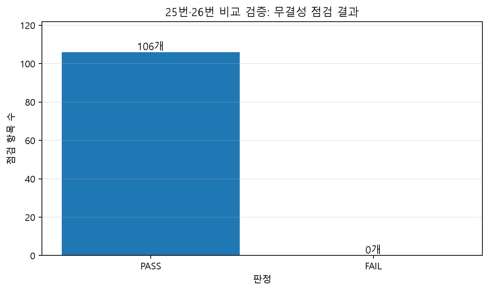
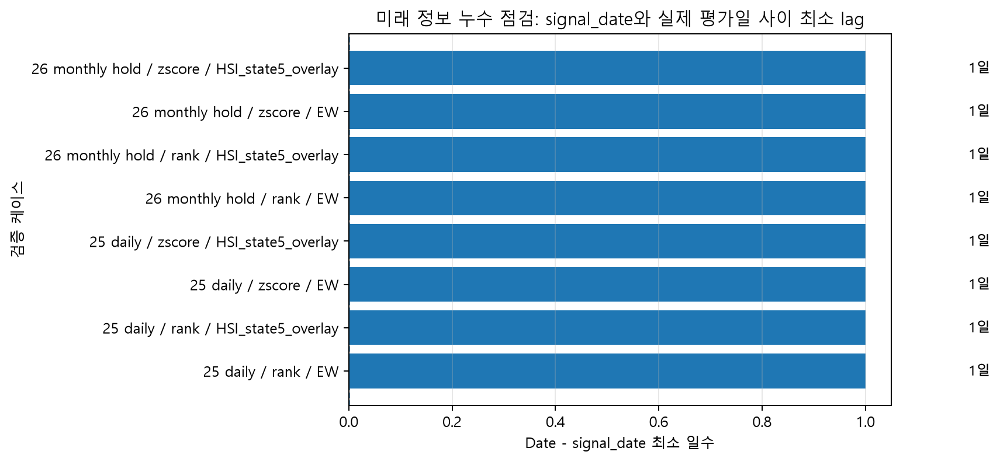
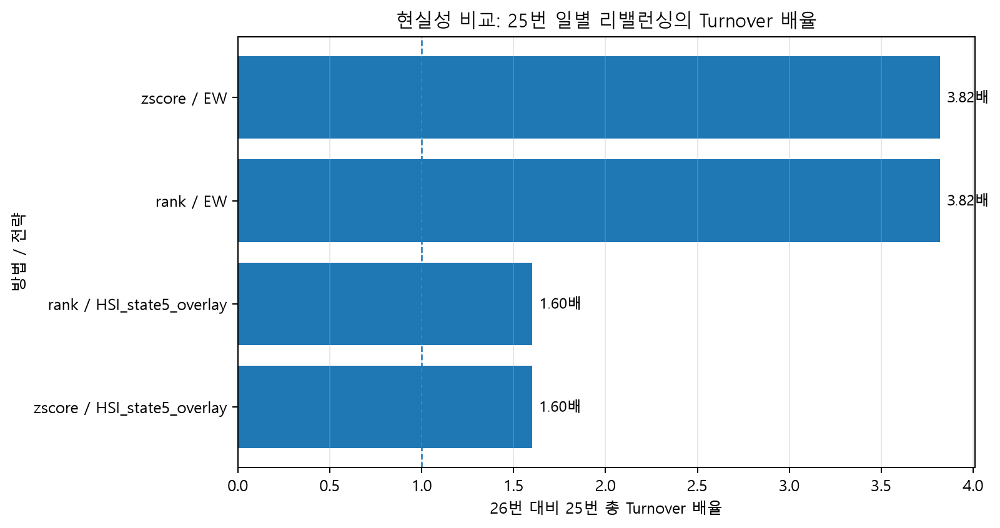
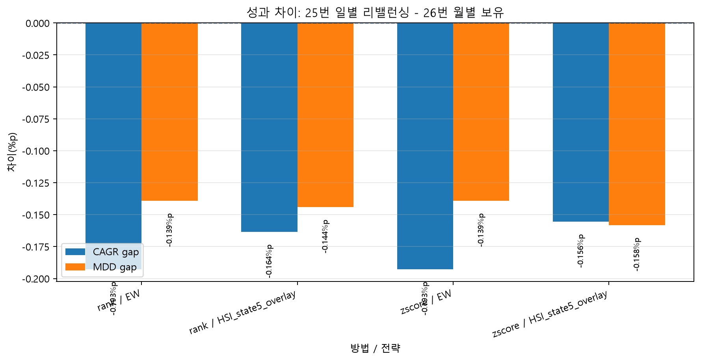
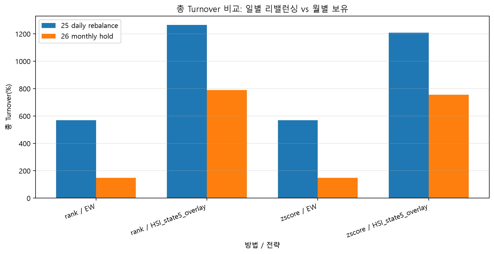
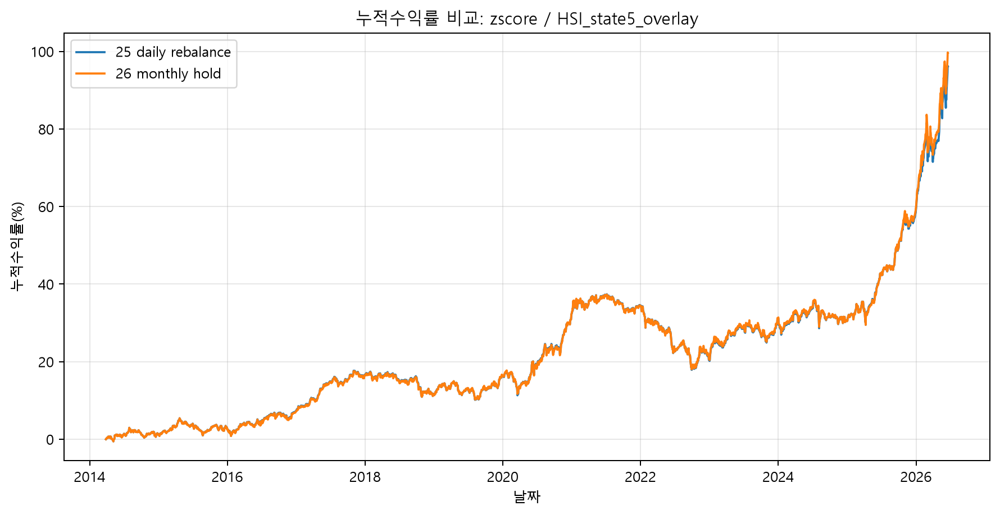
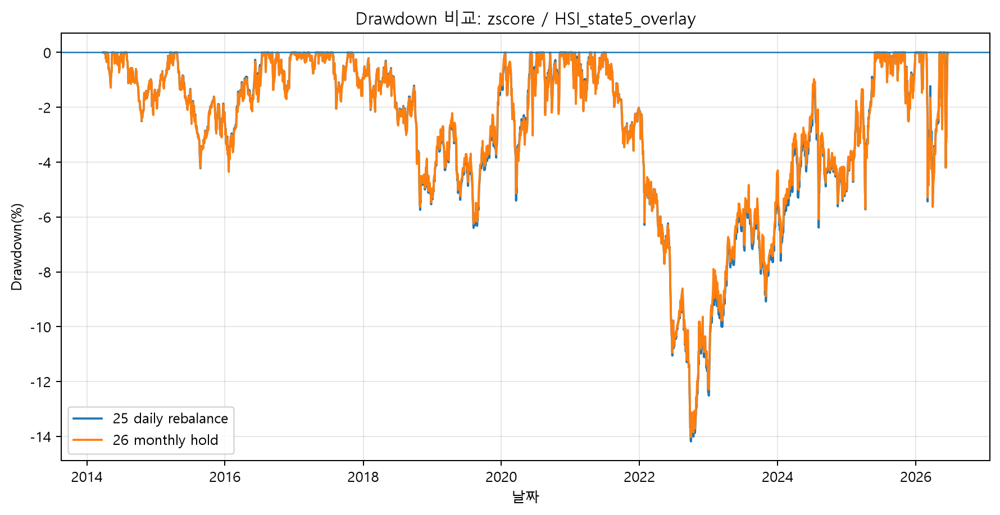
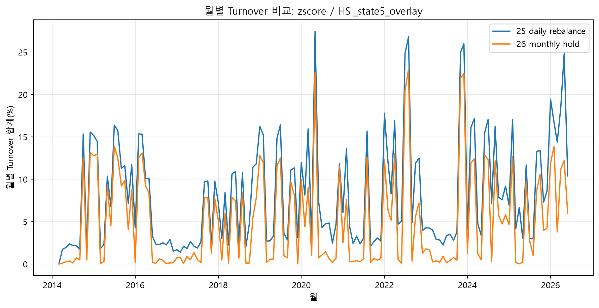

# 25번·26번 기반 현실성 및 무결성 시각화 보고 노트

## 1. 검증 목적

본 프로젝트는 월말 HSI 상태를 이용하여 다음 월의 ETF 목표비중을 정하는 월간 자산배분 전략이다. 따라서 일별 가격 자료를 사용하더라도, 매 거래일 목표비중을 다시 맞추는 가정은 실제 월간 운용 구조보다 거래 빈도를 높게 잡는 실험적 가정에 가깝다.

이에 따라 25번 스크립트는 일별 리밸런싱 민감도 실험으로, 26번 스크립트는 월초 리밸런싱 후 월중 보유를 가정하는 현실성 검증으로 구분하였다. 이후 27번과 28번 스크립트를 통해 두 방식의 계산 무결성과 성과 차이를 함께 확인하였다.

## 2. 무결성 및 미래정보 누수 점검

무결성 점검 결과, 총 106개 점검 항목 중 PASS 106개, FAIL 0개로 확인되었다. 또한 signal_date와 실제 평가일 Date의 시차를 확인한 결과, 최소 lag는 1일이며 look-ahead fail count는 0건으로 집계되었다.

이 결과는 월말 신호가 같은 달 수익률에 섞이지 않고, 다음 기간의 평가일에 적용되었음을 보여준다. 따라서 본 비교는 신호와 수익률의 시점 정렬 측면에서 중대한 미래정보 누수 없이 수행된 것으로 해석할 수 있다.

## 3. 현실성 비교: 성과보다 Turnover 차이가 핵심

대표 케이스인 zscore/HSI_state5_overlay 기준으로, 25번 일별 리밸런싱 방식은 26번 월별 보유 방식에 비해 CAGR 차이가 -0.1555%p, MDD 차이가 -0.1582%p로 나타났다. 반면 총 Turnover는 453.5935%p 높고, 배율로는 1.6004배 수준이었다.

즉, 일별 리밸런싱은 성과를 뚜렷하게 개선하지 못하면서 거래 빈도와 거래 부담을 크게 증가시켰다. 이는 25번 결과를 최종 운용 성과로 보기보다는 실행가정 민감도 또는 대조군으로 해석해야 함을 의미한다.

## 4. 경로 비교: 누적수익률, Drawdown, 월별 Turnover

아래 그림은 대표 케이스 zscore/HSI_state5_overlay에 대해 25번과 26번의 경로를 직접 비교한 것이다.

누적수익률과 drawdown 경로는 두 방식이 같은 HSI 목표비중 체계를 공유하지만, 리밸런싱 실행가정에 따라 월중 평가 경로와 거래 부담이 달라질 수 있음을 보여준다. 특히 월별 Turnover 비교는 25번의 일별 재조정 가정이 불필요하게 높은 거래량을 만들 수 있음을 시각적으로 확인시켜 준다.

## 5. 결론

25번·26번 비교 검증 결과, 본 프로젝트의 최종 현실성 평가는 26번 월별 보유 + 일별 평가 방식을 중심으로 해석하는 것이 타당하다. 25번은 매 거래일 목표비중을 유지하는 이론적·실험적 가정에 가깝고, 실제 비교 결과에서도 성과 개선보다는 Turnover 증가 효과가 더 두드러졌다. 반면 26번은 월초 리밸런싱 이후 보유수량과 평가금액을 통해 일별 포트폴리오 가치를 재계산하므로, 본 프로젝트의 월간 HSI 자산배분 구조와 더 잘 부합한다.

따라서 이번 검증은 HSI 전략이 단순히 백테스트 결과만 제시한 것이 아니라, 미래정보 누수, 계산 무결성, 리밸런싱 실행가정, Turnover 부담을 함께 점검했다는 점을 보여준다. 이 결과는 전략의 미래 성과를 보장하는 것은 아니지만, 보고서에서 백테스트 결과의 현실성과 계산 신뢰도를 보완하는 근거로 사용할 수 있다.

## 생성 그림 목록

- `output/figures/main_v2_25_26_fig01_integrity_pass_fail.png`
- `output/figures/main_v2_25_26_fig02_lookahead_min_lag_days.png`
- `output/figures/main_v2_25_26_fig03_turnover_ratio.png`
- `output/figures/main_v2_25_26_fig04_cagr_mdd_gap.png`
- `output/figures/main_v2_25_26_fig05_total_turnover_comparison.png`
- `output/figures/main_v2_25_26_fig06_cumulative_return_zscore_HSI_state5_overlay.png`
- `output/figures/main_v2_25_26_fig07_drawdown_zscore_HSI_state5_overlay.png`
- `output/figures/main_v2_25_26_fig08_monthly_turnover_zscore_HSI_state5_overlay.png`