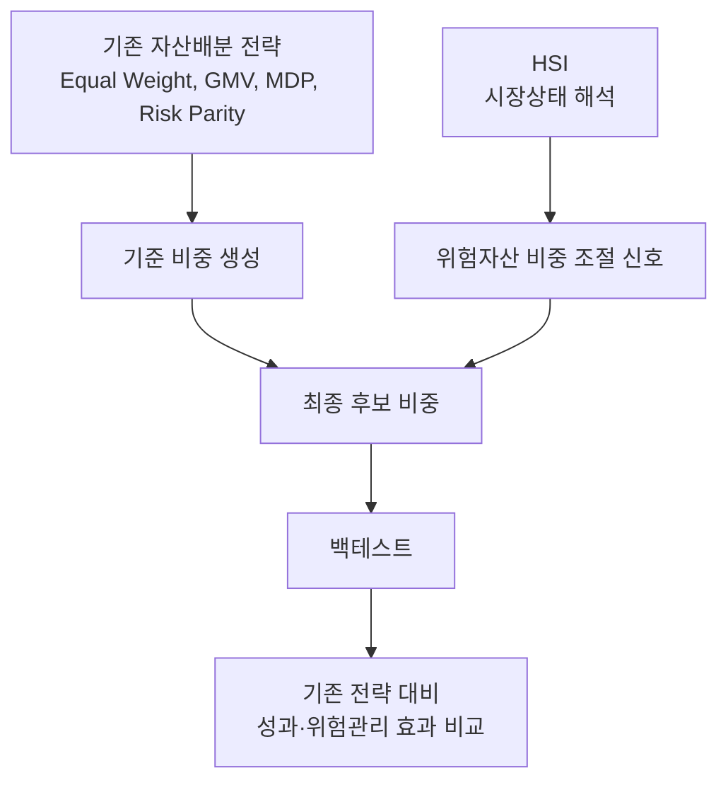

# 권보성 파트 발표구조·시각화 실행 정리

## 1. 프로젝트 전체 스토리라인

발표 스토리라인은 다음 순서로 고정한다.

1. 문제의식
   - 기존 자산배분 전략은 비중 결정 규칙을 제공하지만, 여러 가격 신호가 동시에 충돌하는 시장상태를 직관적으로 설명하기 어렵다.
   - 프로젝트의 핵심 질문은 "HSI를 시장상태 해석 및 위험자산 비중 조절 보조지표로 사용할 수 있는가?"이다.

2. HSI 아이디어
   - HSI는 매수·매도 명령이 아니라 market timing 보조지표이다.
   - 가격 기반 신호의 방향성, 강도, 충돌도를 요약해 위험악화, 과열, 회복 후보 같은 상태명으로 해석한다.
   - 모래시계 구조는 위험 신호와 기회 신호가 동시에 존재할 수 있음을 설명하는 시각적 출발점으로 사용한다.

3. 데이터
   - 한국 상장 ETF 가격 데이터를 중심으로 사용한다.
   - 사건 달력은 코로나 급락, 금리 인상, 2차전지 과열, 글로벌 기술주 충격 등 주요 시장 국면을 해석하기 위한 기준 구간으로 사용한다.

4. 실험설계
   - ETF 가격 데이터에서 수익률, 사건 등급, 월별 사건 카운트, HSI 상태명을 생성한다.
   - 설계용 기간과 검증용 기간을 나누어 상태 분포가 특정 기간에만 과도하게 맞는지 확인한다.
   - 향후 백테스트 단계에서는 HSI 상태별 위험자산 비중 조절 규칙을 비교 전략 위에 덧붙여 검증한다.

5. 결과 검증
   - 현재 1차 결과는 사건 구간별 HSI 상태 해석과 기간별 상태 안정성 확인이다.
   - 최종 결과에서는 누적수익률, Drawdown, 성과지표, 리밸런싱 비중 변화 그래프로 HSI 보조 규칙의 효과를 검증한다.

## 2. 프로젝트 전체 구조도

## 3. HSI의 위치

HSI는 기존 전략을 대체하는 독립 전략이 아니라, 기존 전략의 결과 비중을 시장상태에 따라 보조적으로 조정하는 장치로 설명한다.

발표 표현은 다음 문장으로 통일한다.

> HSI는 기존 자산배분 전략을 대체하는 전략이 아니라, 여러 가격 기반 신호를 요약해 시장상태를 해석하고 위험자산 비중 조절에 참고하는 market timing 보조지표이다.

## 4. 기존 자산배분 전략과 HSI의 관계

| 구분 | 기존 자산배분 전략 | HSI |
| --- | --- | --- |
| 역할 | ETF 비중을 산출하는 기준 전략 | 시장상태를 해석하는 보조 신호 |
| 예시 | Equal Weight, GMV, MDP, Risk Parity | 위험악화, 과열 후보, 회복 후보 등 상태명 |
| 직접 산출물 | 자산별 기준 비중 | 위험자산 확대·축소·관찰 판단 근거 |
| 검증 방식 | 전략별 성과지표 비교 | 기존 전략에 적용했을 때 위험관리 개선 여부 확인 |
| 발표상 위치 | 비교 대상 및 기준선 | 기준 전략을 보완하는 설명 변수 |

핵심 메시지는 "HSI가 기존 전략보다 무조건 우수하다"가 아니라 "HSI를 덧붙였을 때 위험관리와 시장상태 해석이 개선되는지 검증한다"로 둔다.

## 5. 모래시계 구조 배치

모래시계 구조는 발표 초반의 HSI 아이디어 설명 파트에 배치한다.

- 권장 위치: 3~4번째 슬라이드
- 목적: HSI 수식이나 상태명으로 들어가기 전, 위험 신호와 기회 신호가 동시에 존재할 수 있다는 직관 제공
- 사용 방식: 최종 계산식처럼 강조하지 않고, HSI 설계의 시각적 출발점으로 설명
- 연결 문장: "실제 구현에서는 이 아이디어를 표준화 점수와 신호 강도 중심으로 단순화해 상태명을 만든다."

## 6. HSI 시각화 방향

현재 바로 발표에 사용할 수 있는 핵심 그래프는 다음 순서로 둔다.

| 우선순위 | 그래프 | 파일 | 발표용 역할 |
| ---: | --- | --- | --- |
| 1 | HSI 상태 점수와 사건 주석 | `output/figures/fig14_hsi_state_score_with_event_annotations.png` | HSI가 주요 사건 구간에서 어떤 상태 변화를 보였는지 설명 |
| 2 | P파/S파 사건 압력과 사건 주석 | `output/figures/fig13_p_s_wave_with_event_annotations.png` | 위험 신호와 회복·과열 신호가 같이 움직이는 구조 설명 |
| 3 | 고변동성 혼합구간과 사건 주석 | `output/figures/fig15_mixed_zone_with_event_annotations.png` | 0 근처 또는 혼합 상태가 단순 중립이 아님을 설명 |
| 4 | HSI 상태명 분포 | `output/figures/fig12_hsi_state_distribution.png` | 전체 기간에서 상태명이 얼마나 나타났는지 요약 |

백테스트가 완성되면 다음 그래프를 후반부 검증 파트에 추가한다.

- 누적수익률 그래프
- Drawdown 그래프
- 전략별 성과지표 요약표
- HSI 적용 전후 리밸런싱 비중 변화 그래프

## 7. 발표용 도식과 보고서용 도식 구분

| 용도 | 기준 | 포함 내용 |
| --- | --- | --- |
| 발표용 | 한 장에서 메시지가 바로 보여야 함 | 전체 흐름도, HSI 위치도, 핵심 사건 주석 그래프 |
| 보고서용 | 재현성과 세부 기준을 설명해야 함 | 지표 정의, 상태명 기준, 기간 분리 기준, 결과표 전체 |

발표용 도식은 텍스트를 줄이고, "문제 → HSI → 검증" 흐름을 강조한다. 보고서용 도식은 각 지표와 산출 파일의 경로를 남겨 재현성을 보강한다.

## 8. 핵심 그래프와 보조 그래프 구분

핵심 그래프는 발표 본문에 넣고, 보조 그래프는 부록 또는 Q&A 대비 자료로 둔다.

| 구분 | 그래프 |
| --- | --- |
| 핵심 그래프 | `fig14_hsi_state_score_with_event_annotations.png`, `fig13_p_s_wave_with_event_annotations.png`, `fig12_hsi_state_distribution.png` |
| 보조 그래프 | `fig15_mixed_zone_with_event_annotations.png`, `fig09_p_s_wave_event_pressure.png`, `fig10_two_sided_shock_mixed_zone.png`, `fig11_hsi_state_score_trend.png` |

발표 시간이 짧아지면 `fig14`와 `fig12`만 남긴다. 발표 시간이 충분하면 `fig13`을 추가해 모래시계 구조와 연결한다.

## 9. 발표 슬라이드 흐름 초안

1. 제목
   - HSI 기반 ETF 자산배분 전략 성과 비교 및 검증

2. 문제의식
   - 기존 전략은 비중은 만들 수 있지만 시장상태 해석에는 한계가 있다.

3. 프로젝트 질문
   - HSI를 market timing 보조지표로 활용할 수 있는가?

4. HSI 아이디어
   - 모래시계 구조로 위험 신호와 기회 신호의 공존 설명

5. HSI의 위치
   - 기존 전략 대체물이 아니라 비중 조절 참고 신호

6. 데이터와 사건 구간
   - 한국 상장 ETF 가격 데이터와 주요 사건 달력

7. HSI 생성 흐름
   - 가격 데이터 → 입력 신호 → 상태 분류 → 사건 구간 해석

8. HSI 상태명
   - 강한 위험악화, 위험악화, 고변동성 혼합구간, 과열 후보, 회복 후보 등

9. 핵심 결과 1
   - HSI 상태 점수와 사건 주석 그래프

10. 핵심 결과 2
    - P파/S파 또는 혼합구간 그래프

11. 상태 분포 요약
    - 전체 기간 상태명 분포 그래프

12. 백테스트 확장 계획
    - HSI 상태별 위험자산 비중 조절 규칙과 비교 전략 검증

13. 기대 검증 기준
    - 누적수익률, MDD, 변동성, Sharpe, Sortino, Calmar, 위기구간 방어력

14. 한계와 주의 표현
    - 예측 또는 검증 완료가 아니라 탐색적 보조지표로 설명

15. 결론
    - HSI는 시장상태 해석과 위험자산 비중 조절을 연결하는 실험적 보조지표

## 10. 구조 변경 시 수정 규칙

프로젝트 구조가 바뀌면 발표 흐름도 함께 수정한다. 특히 아래 경우에는 이 문서와 발표자료를 같이 갱신한다.

- HSI 기준이나 상태명이 바뀌는 경우
- 비교 전략이 줄거나 늘어나는 경우
- 데이터 결과가 예상과 다르게 나오는 경우
- 발표 시간이 조정되는 경우
- 백테스트 산출물이 추가되는 경우

수정 우선순위는 다음과 같다.

1. HSI 정의 문장
2. 전체 구조도
3. 핵심 그래프 배치
4. 슬라이드 흐름
5. 보고서용 상세 설명

## 11. 권보성 체크리스트 실행 상태

| 번호 | 항목 | 실행 상태 |
| ---: | --- | --- |
| 9 | 프로젝트 전체 스토리라인 정리 | 완료 |
| 10 | HSI의 market timing 보조지표 위치 시각화 | 완료 |
| 11 | 기존 자산배분 전략과 HSI 관계 표현 | 완료 |
| 12 | 모래시계 구조 발표 배치 결정 | 완료 |
| 13 | 우선 시각화 그래프 결정 | 완료 |
| 14 | 발표용 도식과 보고서용 상세 도식 구분 | 완료 |
| 15 | 핵심 그래프와 보조 그래프 구분 | 완료 |
| 16 | 구조 변경 시 발표 흐름 수정 규칙 공유 | 완료 |

