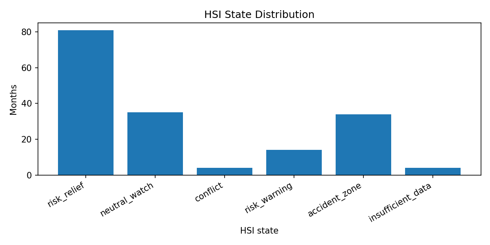

# 04_HSI_state5_baseline

## 실험명
**04번 HSI 5상태 baseline 생성**

## 1. 목적

04번 단계의 목적은 월말 HSI 신호를 5개의 시장상태로 번역하는 것이다. 이 단계는 아직 ETF 비중을 계산하거나 백테스트를 수행하지 않는다. 시장상태표를 만들고, 다음 달 수익률과 연결 가능한지 확인하는 전처리 단계이다.

## 2. 생성 상태

| HSI 상태 | 한글 해석 | 의미 |
|---|---|---|
| risk_relief | 위험 완화 우세 | 위험 완화 신호가 우세한 상태 |
| neutral_watch | 중립 관찰 | 위험과 완화가 약하거나 균형인 상태 |
| conflict | 신호 충돌 | 위험 신호와 완화 신호가 동시에 강한 상태 |
| risk_warning | 위험 악화 우세 | 위험 악화 신호가 우세한 상태 |
| accident_zone | 강한 위험 구간 | 위험 신호가 매우 강한 상태 |
| insufficient_data | 자료 부족 | 유효 신호 수가 부족한 상태 |

## 3. 분류 규칙 요약

04번 baseline은 위험 성분과 완화 성분을 나누어 계산한다.

```text
risk_component = 위험 악화 방향 점수의 합 / 유효 점수 수
relief_component = 위험 완화 방향 점수의 합 / 유효 점수 수
state_direction = risk_component - relief_component
state_intensity = risk_component + relief_component
```

기본 기준값은 다음과 같다.

| 기준 | 값 | 의미 |
|---|---:|---|
| theta_common | 0.15 | 위험 또는 완화 성분이 의미 있게 활성화되는 기준 |
| accident_extra | 0.20 | 강한 위험 구간을 구분하기 위한 추가 기준 |
| direction_margin | 0.05 | 위험/완화 우세 방향을 구분하는 최소 차이 |
| conflict_direction_band | 0.20 | 위험·완화가 동시에 강할 때 충돌로 보는 방향 차이 범위 |
| min_valid_score_count | 3 | 상태분류에 필요한 최소 유효 점수 수 |

## 4. HSI 상태 분포

| HSI 상태 | 한글 상태 | 월 수 | 전체 비중(%) | 유효월 비중(%) |
| --- | --- | --- | --- | --- |
| risk_relief | 위험 완화 우세 | 81.00 | 47.09 | 48.21 |
| neutral_watch | 중립 관찰 | 35.00 | 20.35 | 20.83 |
| conflict | 신호 충돌 | 4.00 | 2.33 | 2.38 |
| risk_warning | 위험 악화 우세 | 14.00 | 8.14 | 8.33 |
| accident_zone | 강한 위험 구간 | 34.00 | 19.77 | 20.24 |
| insufficient_data | 자료 부족 | 4.00 | 2.33 |  |



상태분포를 보면 위험 완화 우세와 중립 관찰이 많은 편이지만, 위험 악화 우세와 강한 위험 구간도 충분히 존재한다. 즉 HSI 상태는 단순히 항상 방어적이거나 항상 공격적인 신호가 아니라, 기간별 시장상태를 구분하는 번역 장치로 사용된다.

## 5. 결론

04번 단계의 핵심은 HSI를 미래수익률 예측기가 아니라 시장상태 번역기로 정의했다는 점이다. 이 상태표가 05번 baseline allocation의 입력이 되고, 이후 Lambda 실험에서는 같은 상태표를 유지한 채 목표비중으로 이동하는 속도만 조절한다.
