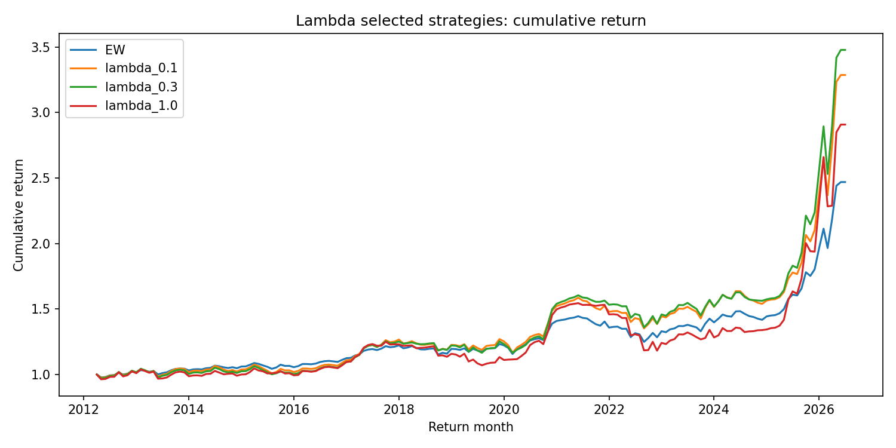
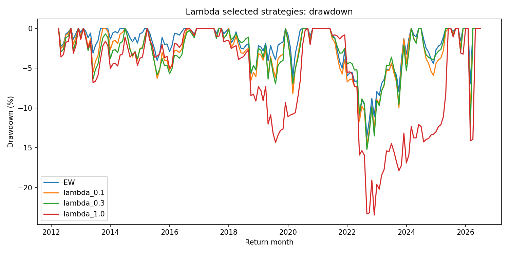
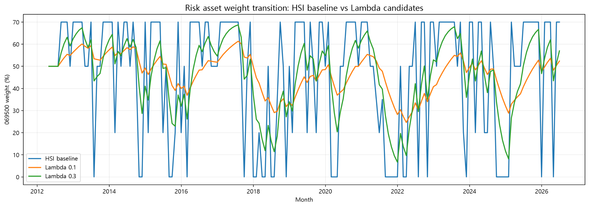

# 10_Inertia_lambda_experiment

## 실험명
**10번 Inertia Lambda 실험: HSI 목표비중으로 이동하는 속도를 조절하는 부분조정 실험**

## 1. 실험 목적

이 실험의 목적은 HSI 상태분류가 산출한 ETF 목표비중으로 포트폴리오가 **얼마나 빠르게 이동해야 하는지**를 확인하는 것이다.  

HSI baseline은 시장상태가 바뀔 때 목표비중으로 즉시 이동한다. 이 구조는 상태 변화에 빠르게 반응한다는 장점이 있지만, 비중 변화가 커져 Turnover*와 거래비용 부담이 커질 수 있다. 따라서 10번 실험에서는 Lambda* 값을 조절하여, 이전 비중과 목표비중 사이의 차이 중 일부만 반영하는 부분조정 구조를 검토하였다.

Turnover(설명: 포트폴리오 비중이 얼마나 많이 바뀌었는지를 나타내는 회전율이다. 거래비용 부담과 연결된다.)  
Lambda(설명: HSI 목표비중으로 한 번에 이동하지 않고, 이전 비중과 목표비중의 차이 중 일부만 반영하도록 조절하는 부분조정 계수이다.)

---

## 2. 배경과 이유

본 프로젝트의 핵심은 HSI를 미래수익률 예측기가 아니라 **시장상태 번역기**로 사용하는 것이다. HSI는 현재 시장상태를 5개 상태로 분류하고, 각 상태에 맞는 ETF 목표비중을 제시한다. 그러나 목표비중으로 즉시 이동하면 월별 리밸런싱에서 위험자산 비중이 급격히 바뀔 수 있다.

따라서 10번 실험에서는 HSI 상태분류 자체는 유지하되, 목표비중으로 이동하는 속도만 조절하였다. 이때 사용한 부분조정 규칙은 다음과 같다.

```text
이번 달 실제 비중 = 이전 달 실제 비중 + λ × (이번 달 HSI 목표비중 - 이전 달 실제 비중)
```

λ가 1.0이면 HSI 목표비중으로 즉시 이동하고, λ가 작을수록 목표비중으로 천천히 이동한다. 즉, λ는 신호의 방향을 바꾸는 값이 아니라 **비중 이동 속도**를 조절하는 값이다.

[수식 표기 placeholder] 최종 코드 설명서에서는 위 식을 코드 변수명 기준으로 `current_weight`, `previous_weight`, `target_weight`, `lambda_value`와 연결하여 정리한다.

---

## 3. 사용 데이터

- ETF 월간 수익률 데이터: `main_final_monthly_return_decimal.csv`
- HSI 상태별 목표비중 데이터: `main_final_baseline_rebalance_weights.csv`
- Lambda 전략별 월별 백테스트 결과: `main_final_lambda_backtest_timeseries.csv`
- Lambda 성과 요약표: `main_final_lambda_performance_summary.csv`
- Lambda Turnover 요약표: `main_final_lambda_turnover_summary.csv`
- Lambda 후보 판단표: `main_final_lambda_candidate_judgement.csv`
- 비용 민감도 요약표: `main_final_report_candidate_cost_pivot.csv`
- 전체 후보 비용 민감도 상세표: `main_final_candidate_all_cost_sensitivity.csv`

전략별 월별 결과는 총 1,032행이며, 전략 수 6개와 월별 백테스트 구간이 결합된 결과이다. 수익률은 decimal 기준으로 계산한 뒤, 보고서 표에서는 % 단위로 표시하였다.

---

## 4. 실험 방법

본 실험에서는 다음 전략들을 비교하였다.

| 전략 | 설명 |
|---|---|
| EW | 동일 ETF 유니버스를 단순 동일비중으로 보유하는 비교 기준 |
| lambda_0.1 | 목표비중 변화의 10%만 반영하는 매우 느린 부분조정 후보 |
| lambda_0.3 | 목표비중 변화의 30%를 반영하는 균형형 부분조정 후보 |
| lambda_0.5 | 목표비중 변화의 50%를 반영하는 중간 반응 후보 |
| lambda_0.7 | 목표비중 변화의 70%를 반영하는 빠른 반응 후보 |
| lambda_1.0 | 목표비중으로 즉시 이동하는 HSI baseline에 가까운 후보 |

핵심 비교는 Lambda가 커질수록 CAGR, MDD, Turnover, Calmar가 어떻게 변하는지 확인하는 것이다.

---

## 5. 주요 결과

### 5.1 Lambda 계열 성과 요약

| 전략 | Lambda | CAGR(%) | 연환산 변동성(%) | MDD(%) | Sharpe | Sortino | Calmar | WinRate(%) |
| --- | --- | --- | --- | --- | --- | --- | --- | --- |
| EW |  | 6.510 | 7.972 | -13.571 | 0.832 | 1.538 | 0.480 | 60.465 |
| lambda_0.1 | 0.100 | 8.655 | 11.258 | -14.744 | 0.793 | 1.575 | 0.587 | 59.302 |
| lambda_0.3 | 0.300 | 9.085 | 12.049 | -15.220 | 0.782 | 1.412 | 0.597 | 60.465 |
| lambda_0.5 | 0.500 | 8.577 | 12.200 | -17.519 | 0.735 | 1.198 | 0.490 | 61.628 |
| lambda_0.7 | 0.700 | 8.065 | 12.511 | -19.965 | 0.682 | 1.048 | 0.404 | 61.628 |
| lambda_1.0 | 1.000 | 7.732 | 13.666 | -23.459 | 0.611 | 0.950 | 0.330 | 65.116 |

Lambda 계열에서 CAGR이 가장 높은 전략은 **lambda_0.3**이고, Calmar가 가장 높은 전략은 **lambda_0.3**이다. 반면 MDD 기준으로 가장 안정적인 Lambda 후보는 **lambda_0.1**이며, 평균 Turnover가 가장 낮은 Lambda 후보는 **lambda_0.1**이다.

전체적으로 Lambda 0.1과 Lambda 0.3은 EW보다 높은 CAGR을 보이면서도, 높은 Lambda 값에 비해 MDD와 Turnover 부담을 낮춘다. 반면 Lambda 0.7 또는 Lambda 1.0처럼 빠르게 반응하는 후보는 목표비중 변화에 민감하게 움직이므로 Turnover와 MDD 부담이 커진다.

MDD(설명: Maximum Drawdown의 약자이다. 투자기간 중 고점 대비 최대 하락폭을 뜻한다.)  
Calmar(설명: CAGR을 절대 MDD로 나눈 지표이다. 낙폭 대비 수익성을 볼 때 사용한다.)

---

### 5.2 Lambda별 Turnover 요약

| 전략 | Lambda | 평균 Turnover(%) | 최대 Turnover(%) | 누적 Turnover(%) | Turnover 발생 월 수 |
| --- | --- | --- | --- | --- | --- |
| EW |  | 0.000 | 0.000 | 0.000 | 0.000 |
| lambda_0.1 | 0.100 | 2.515 | 6.017 | 432.581 | 171.000 |
| lambda_0.3 | 0.300 | 6.950 | 20.012 | 1195.345 | 171.000 |
| lambda_0.5 | 0.500 | 11.138 | 34.830 | 1915.707 | 171.000 |
| lambda_0.7 | 0.700 | 15.406 | 48.990 | 2649.850 | 171.000 |
| lambda_1.0 | 1.000 | 22.093 | 70.000 | 3800.000 | 103.000 |

Turnover 결과는 Lambda의 역할을 가장 명확하게 보여준다. Lambda가 커질수록 목표비중으로 더 빨리 이동하므로 평균 Turnover가 증가한다. 특히 lambda_0.1의 평균 Turnover는 2.515%이고, lambda_0.3은 6.950%이다. 반면 더 높은 Lambda 값에서는 Turnover가 빠르게 증가한다.

---

### 5.3 Lambda Family Comparison


이 그림은 Lambda 값별 CAGR과 평균 Turnover의 trade-off를 보여준다. Lambda 0.3은 Lambda 0.1보다 CAGR이 높지만 Turnover도 높다. Lambda 0.5 이상에서는 Turnover 증가가 뚜렷해지며, CAGR은 오히려 둔화되는 모습을 보인다. 따라서 최종 후보는 극단적으로 빠른 반응값이 아니라, 낮은 Turnover와 성과의 균형을 보이는 Lambda 0.1과 Lambda 0.3으로 좁히는 것이 적절하다.

---

### 5.4 선택 후보 판단표

| 전략 | Lambda | CAGR 변화 vs λ=1(%p) | MDD 변화 vs λ=1(%p) | Turnover 변화 vs λ=1(%p) | 판정 | 이유 |
| --- | --- | --- | --- | --- | --- | --- |
| EW |  |  |  |  | benchmark | 동일가중 비교 기준 |
| lambda_0.1 | 0.100 | 0.923 | 8.715 | -19.578 | candidate | Turnover가 감소하고 MDD 악화가 제한적 |
| lambda_0.3 | 0.300 | 1.353 | 8.240 | -15.143 | candidate | Turnover가 감소하고 MDD 악화가 제한적 |
| lambda_0.5 | 0.500 | 0.845 | 5.940 | -10.955 | candidate | Turnover가 감소하고 MDD 악화가 제한적 |
| lambda_0.7 | 0.700 | 0.332 | 3.495 | -6.687 | candidate | Turnover가 감소하고 MDD 악화가 제한적 |
| lambda_1.0 | 1.000 | 0.000 | 0.000 | 0.000 | baseline_lambda | 목표 비중 즉시 이동 기준 |

후보 판단표에서도 Lambda 0.1과 Lambda 0.3은 후보로 남는다. Lambda 0.1은 Turnover 감소가 가장 뚜렷하고 MDD 악화가 제한적인 보수형 후보로 볼 수 있다. Lambda 0.3은 Lambda 0.1보다 Turnover는 높지만 CAGR과 Calmar가 더 높아 균형형 후보로 해석할 수 있다.

[후보 압축 placeholder] 후보 판단표에는 Lambda 0.5와 Lambda 0.7도 candidate로 표시될 수 있으나, 최종 보고서에서는 Turnover와 비용 민감도, 16번 robustness, 17번 BM alignment 결과까지 종합하여 Lambda 0.1과 Lambda 0.3을 우선 후보로 제시한다.

---

### 5.5 누적수익률 경로



누적수익률 경로에서는 Lambda 0.1과 Lambda 0.3이 EW보다 높은 성장 경로를 보인다. Lambda 1.0은 빠르게 반응하는 구조이지만, 누적 성과와 위험지표 측면에서 Lambda 0.1 또는 Lambda 0.3보다 최종 후보로 적합하지 않다. 이는 단순히 HSI 목표비중에 빠르게 이동하는 것이 항상 좋은 결과로 이어지지는 않음을 보여준다.

---

### 5.6 Drawdown 경로



Drawdown 경로에서는 Lambda 0.1과 Lambda 0.3이 HSI 즉시 이동에 가까운 높은 Lambda 구조보다 낙폭을 완화하는 모습을 보인다. 특히 위험구간에서 비중 이동을 부드럽게 만들면, 급격한 포트폴리오 전환으로 인한 성과 불안정성을 줄일 수 있다.

---

### 5.7 위험자산 비중 이동 비교



위 그림은 069500 위험자산 비중이 HSI baseline과 Lambda 후보에서 어떻게 다르게 움직이는지 보여준다. HSI baseline은 상태 변화에 따라 069500 비중이 급격하게 이동한다. 반면 Lambda 0.1과 Lambda 0.3은 이전 비중의 영향을 남겨 두기 때문에 비중 이동이 더 완만하다. 특히 Lambda 0.1은 가장 부드러운 이동을 보이며, Lambda 0.3은 HSI 변화에 더 빠르게 반응한다.

---

### 5.8 거래비용 민감도

| 출처 | 전략 | 보고서 표시명 | 0bp CAGR(%) | 5bp CAGR(%) | 10bp CAGR(%) | 20bp CAGR(%) |
| --- | --- | --- | --- | --- | --- | --- |
| baseline | EW | EW (Benchmark) | 6.510 | 6.510 | 6.510 | 6.510 |
| lambda | EW | EW (Benchmark) | 6.510 | 6.510 | 6.510 | 6.510 |
| lambda | lambda_0.1 | Lambda 0.1 | 8.655 | 8.639 | 8.623 | 8.590 |
| lambda | lambda_0.3 | Lambda 0.3 | 9.085 | 9.040 | 8.995 | 8.905 |

비용 민감도에서도 Lambda 0.1과 Lambda 0.3의 성격이 다르게 나타난다. Lambda 0.1은 Turnover가 낮아 비용 증가에 상대적으로 강하고, Lambda 0.3은 더 높은 CAGR을 얻는 대신 거래비용 drag가 더 크게 나타난다. 따라서 투자자 성향에 따라 Lambda 0.1은 보수형 후보, Lambda 0.3은 균형형 후보로 나눌 수 있다.

---

## 6. 성과 귀인과 해석

10번 실험의 핵심은 HSI 상태분류 자체보다, 그 상태가 ETF 비중으로 반영되는 **속도**가 성과와 운용 안정성에 큰 영향을 준다는 점이다.

해석은 다음과 같다.

1. **Lambda 1.0은 빠르지만 과격하다.**  
   목표비중으로 즉시 이동하기 때문에 HSI baseline과 유사한 성격을 가지며, Turnover와 MDD 부담이 커진다.

2. **Lambda 0.1은 저회전·보수형 후보이다.**  
   목표비중으로 매우 천천히 이동하므로 Turnover와 비용 민감도가 낮다. 다만 회복 구간에서는 주식 비중 복귀가 느려 일부 수익을 놓칠 수 있다.

3. **Lambda 0.3은 균형형 후보이다.**  
   Lambda 0.1보다 더 빠르게 HSI 신호를 반영하여 CAGR과 Calmar가 높지만, Turnover와 MDD는 조금 더 커진다.

4. **높은 Lambda가 항상 더 좋은 것은 아니다.**  
   Lambda 0.5 이상에서는 Turnover가 빠르게 증가하고, 성과 개선이 그만큼 따라오지 않는다. 따라서 단순히 반응 속도를 높이는 것이 아니라, 운용 가능성을 고려해 적절한 속도를 선택해야 한다.

---

## 7. 한계와 다음 판단

10번은 Lambda 값에 따른 성과와 Turnover의 trade-off를 확인한 실험이다. 다만 이 실험만으로 최종 후보를 확정하기보다, 이후 16번 robustness, 17번 BM alignment, 15번 macro overlay sensitivity 결과와 함께 해석해야 한다.

최종 판단은 다음과 같이 정리한다.

| 후보 | 해석 |
|---|---|
| Lambda 0.1 | 저회전·보수형 후보. 비용 민감도와 큰 손실월 방어에 강점 |
| Lambda 0.3 | 수익성·Calmar 균형형 후보. HSI 신호 반영 속도와 성과의 균형 |
| Lambda 0.5 이상 | Turnover 부담이 커져 최종 우선 후보에서는 제외 |
| Lambda 1.0 | HSI baseline에 가까운 즉시 이동 구조. 과격한 기준선 성격 |

[후속 연결 placeholder] 16번에서는 Lambda 0.1과 Lambda 0.3이 기간별·상태별·큰 손실월에서 버티는지 검증하고, 17번에서는 Fixed 70/20/10 BM과 EW Benchmark를 함께 두고 최종 비교 기준을 정렬한다.

---

# 별도 첨부 1. 입출력 구조표

| 구분 | 파일명 | 역할 | 주요 컬럼 | 시점 기준 | 단위 |
|---|---|---|---|---|---|
| 입력 | `main_final_monthly_return_decimal.csv` | ETF 월간 수익률 | `year_month`, `069500`, `114260`, `153130` | 월별 | decimal |
| 입력 | `main_final_baseline_rebalance_weights.csv` | HSI 상태별 목표비중 | `year_month`, `hsi_state`, ETF별 목표비중 | 월말 신호 | weight |
| 출력 | `main_final_lambda_backtest_timeseries.csv` | Lambda 전략별 월별 수익률과 비중 결과 | `strategy_name`, `lambda_value`, `return_year_month`, `strategy_return`, `turnover`, ETF별 비중 | 월별 | decimal / weight |
| 출력 | `main_final_lambda_performance_summary.csv` | Lambda별 성과 요약 | CAGR, MDD, Sharpe, Sortino, Calmar | 전체기간 | % / ratio |
| 출력 | `main_final_lambda_turnover_summary.csv` | Lambda별 Turnover 요약 | avg_turnover, max_turnover, total_turnover | 전체기간 | % |
| 출력 | `main_final_lambda_candidate_judgement.csv` | Lambda 후보 판단표 | decision, reason | 전체기간 | text / numeric |
| 출력 | `main_final_report_candidate_cost_pivot.csv` | 비용 민감도 요약표 | cost_0bp, cost_5bp, cost_10bp, cost_20bp | 비용 가정별 | CAGR % |
| 출력 | `main_final_report_lambda_family_comparison.png` | Lambda별 CAGR과 Turnover 비교 그림 | lambda, CAGR, Turnover | 전체기간 | % |
| 출력 | `main_final_lambda_cumulative_return_selected.png` | 대표 Lambda 누적수익률 그림 | strategy, cumulative_return | 월별 | cumulative |
| 출력 | `main_final_lambda_drawdown_selected.png` | 대표 Lambda Drawdown 그림 | strategy, drawdown | 월별 | % |
| 출력 | `main_final_lambda_weight_transition_01_03.png` | HSI baseline과 Lambda 후보의 069500 비중 이동 그림 | month, weight_069500 | 월별 | % |

---

# 별도 첨부 2. 입출력 데이터 분류표

| 데이터 분류 | 파일명 | 설명 | 최종 전략 사용 여부 | 보고서 사용 위치 |
|---|---|---|---|---|
| processed | `main_final_monthly_return_decimal.csv` | ETF 월간 수익률 계산용 데이터 | 사용 | 백테스트 수익률 계산 |
| processed | `main_final_baseline_rebalance_weights.csv` | HSI 상태와 목표비중 데이터 | 사용 | Lambda 비중 계산 |
| model_output | `main_final_lambda_backtest_timeseries.csv` | Lambda별 월별 수익률과 비중 결과 | 사용 | 성과 계산 원천 |
| report_output | `main_final_lambda_performance_summary.csv` | Lambda별 성과표 | 사용 | 본문 표 |
| report_output | `main_final_lambda_turnover_summary.csv` | Lambda별 Turnover 표 | 사용 | Turnover 해석 |
| report_output | `main_final_lambda_candidate_judgement.csv` | 후보 판단표 | 사용 | 후보 압축 근거 |
| report_output | `main_final_report_candidate_cost_pivot.csv` | 비용 민감도 요약표 | 사용 | 거래비용 해석 |
| report_output | `main_final_report_lambda_family_comparison.png` | Lambda family 비교 그림 | 사용 | 시각자료 |
| report_output | `main_final_lambda_cumulative_return_selected.png` | 대표 Lambda 누적수익률 그림 | 사용 | 시각자료 |
| report_output | `main_final_lambda_drawdown_selected.png` | 대표 Lambda drawdown 그림 | 사용 | 시각자료 |
| report_output | `main_final_lambda_weight_transition_01_03.png` | 위험자산 비중 이동 그림 | 사용 | 시각자료 |

---

# 별도 첨부 3. 보고서용 최종 요약 문장

10번 Lambda 실험에서는 HSI 상태분류 자체를 바꾸지 않고, HSI 목표비중으로 이동하는 속도만 조절하였다. 실험 결과 Lambda 값이 커질수록 HSI 신호에 빠르게 반응하지만 Turnover와 MDD 부담이 커지는 경향이 나타났다. Lambda 0.1은 낮은 Turnover와 비용 민감도 측면에서 보수형 후보로, Lambda 0.3은 CAGR과 Calmar가 높은 균형형 후보로 해석된다. 반면 Lambda 0.5 이상은 Turnover 증가에 비해 성과 개선이 제한적이므로 최종 우선 후보에서 제외하였다. 따라서 본 프로젝트의 핵심 개선은 HSI 상태분류 자체보다, 시장상태가 ETF 비중으로 반영되는 속도를 조절하는 Lambda 부분조정 구조에 있다.
