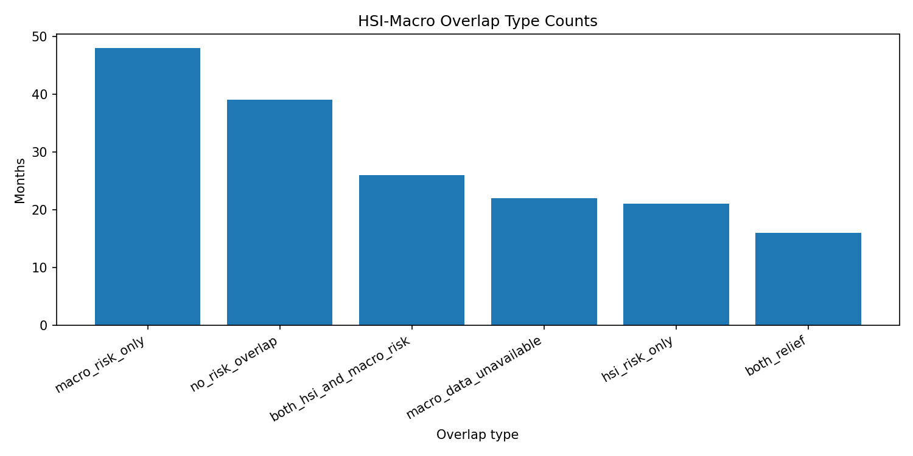
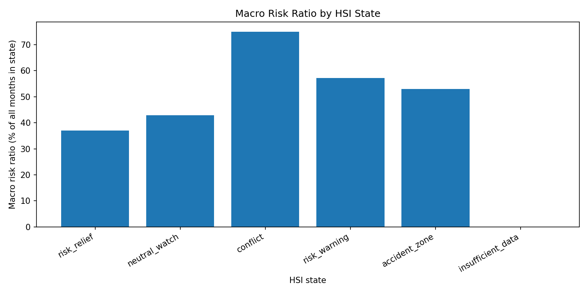
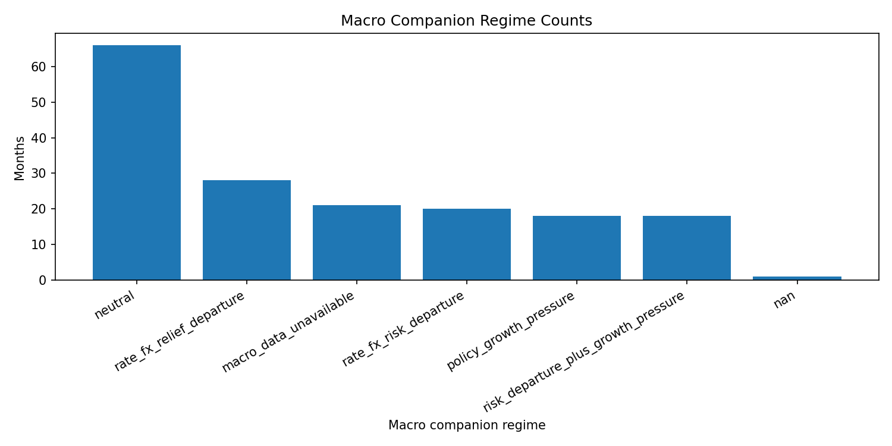
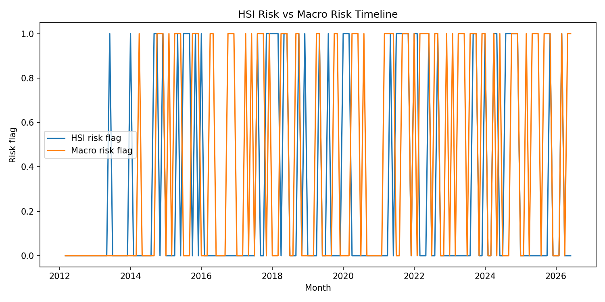
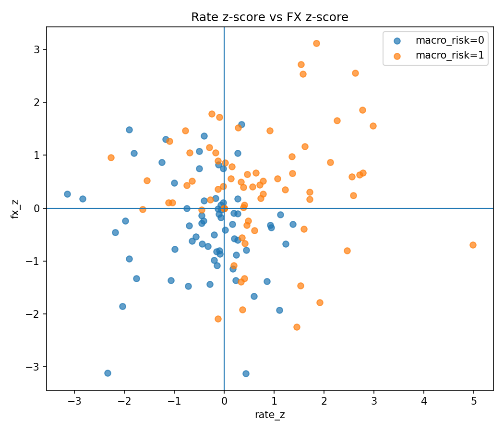

# 12_13_Macro_companion_diagnostic

## 실험명
**12~13번 Macro companion diagnostic: HSI 상태와 macro companion의 겹침 및 차이 진단**

## 1. 실험 목적

이 보고서는 12번 macro companion 변수 생성과 13번 HSI-macro 결합 진단을 하나로 묶어 정리한다. 목적은 macro companion이 HSI 상태분류를 대체할 수 있는 독립 신호인지, 아니면 HSI 상태 해석을 보조하는 외생 위험 진단 layer인지 확인하는 것이다.

핵심 질문은 다음과 같다.

| 질문 | 확인 방식 |
|---|---|
| macro companion은 HSI risk와 얼마나 겹치는가? | HSI risk, macro risk, both risk, HSI-only, macro-only 월 수 비교 |
| macro companion은 어떤 HSI 상태에서 자주 risk를 표시하는가? | HSI 상태별 macro risk 비율 확인 |
| macro companion은 HSI를 대체할 만큼 강한가? | overlap 구조와 이후 14·15번 성과 실험 연결 |
| GDP는 최종 전략 신호로 남기는가? | GDP의 계절성·기저효과·발표 지연 문제를 고려해 비교·진단용으로 제한 |

macro companion(설명: HSI 상태분류를 대체하지 않고, 금리·환율 등 외생 거시환경을 이용해 위험상태 해석을 보조하는 신호이다.)  
overlap(설명: HSI risk와 macro risk가 같은 달에 동시에 발생하는지 보는 겹침 구조이다.)

---

## 2. 배경과 이유

HSI는 가격 기반 신호를 종합해 시장상태를 5개 상태로 분류한다. 하지만 금리 상승, 환율 상승, 성장 둔화와 같은 외생 macro 압력은 가격 신호와 완전히 같은 속도로 움직이지 않을 수 있다. 따라서 12번에서는 금리·환율·GDP 등 macro 후보 변수를 월별 보조 신호로 정리했고, 13번에서는 이 macro companion이 HSI 상태와 얼마나 겹치는지 진단하였다.

다만 본 프로젝트의 중심은 HSI 상태분류와 ETF 비중 조절이다. 따라서 macro companion은 처음부터 HSI를 대체하는 주신호가 아니라, HSI 판단을 보조하는 진단 layer로 설계하였다.

---

## 3. 사용 데이터

- macro companion 월별 변수표: `main_final_macro_companion_features_monthly.csv`
- HSI-macro 결합 월별 진단표: `main_final_hsi_macro_companion_joined_monthly.csv`
- HSI-macro 결합 품질 점검표: `main_final_hsi_macro_companion_quality_check.csv`
- macro companion 단독 품질 점검표: `main_final_macro_companion_quality_check.csv`
- macro companion 신호 요약표: `main_final_macro_companion_signal_summary.csv`

보고서 작성 과정에서 다음 보조 산출물을 새로 생성하였다.

- `main_final_hsi_macro_overlap_summary.csv`
- `main_final_hsi_macro_overlap_type_summary.csv`
- `main_final_hsi_state_macro_risk_summary.csv`
- `main_final_macro_companion_regime_summary.csv`
- `main_final_macro_companion_signal_summary_extended.csv`
- `main_final_hsi_macro_companion_diagnostic_note.md`

---

## 4. 데이터 품질 점검

### 4.1 HSI-macro 결합 품질 점검

| 점검 항목 | 결과 | 상태 | 비고 |
| --- | --- | --- | --- |
| hsi_rows | 172 | OK | HSI 상태표 월 수 |
| macro_rows | 171 | OK | macro companion feature 월 수 |
| joined_rows | 172 | OK | HSI 월 기준으로 macro를 붙인 결과 row 수 |
| date_range | 2012-03 ~ 2026-06 | OK | 진단 대상 기간 |
| macro_data_available_months | 150 | OK | 금리·환율 기반 macro companion 계산 가능 월 수 |
| gdp_data_available_months | 144 | OK | GDP lagged 성장률 사용 가능 월 수 |
| hsi_risk_months | 48 | OK | HSI가 risk_warning 또는 accident_zone인 월 수 |
| macro_risk_months | 74 | OK | macro companion이 위험형 보조 신호를 낸 월 수 |
| both_hsi_and_macro_risk_months | 26 | OK | HSI 위험과 macro 위험이 동시에 나타난 월 수 |
| macro_support_ratio_within_hsi_risk | 0.5417 | OK | HSI 위험 월 중 macro 위험도 함께 나타난 비율 |

### 4.2 macro companion 단독 품질 점검

| 점검 항목 | 결과 | 상태 | 비고 |
| --- | --- | --- | --- |
| row_count | 171 | OK | main_final 월 기준으로 정렬된 macro companion row 수 |
| date_range | 2012-04 ~ 2026-06 | OK | macro companion feature coverage |
| missing_count_rate_level | 21 | OK | rate_level 결측치 수 |
| missing_count_rate_change_1m | 22 | OK | rate_change_1m 결측치 수 |
| missing_count_usdkrw | 21 | OK | usdkrw 결측치 수 |
| missing_count_usdkrw_return_1m | 22 | OK | usdkrw_return_1m 결측치 수 |
| missing_count_gdp_growth_decimal_lagged | 27 | OK | gdp_growth_decimal_lagged 결측치 수 |
| missing_count_gdp_growth_pct_lagged | 27 | OK | gdp_growth_pct_lagged 결측치 수 |
| missing_count_rate_fx_departure | 21 | OK | rate_fx_departure 결측치 수 |
| missing_count_macro_defense_addon | 21 | OK | macro_defense_addon 결측치 수 |
| rate_fx_departure_range | 0.0000 ~ 1.0000 | OK | 이탈률은 0~1 범위여야 합니다. |
| macro_defense_addon_max | 0.0250 | OK | 방어 보조값은 최대 0.03으로 제한합니다. |

품질 점검 결과, HSI 월별 상태표는 172개월이고 macro companion feature는 171개월이다. HSI 월 기준으로 macro 데이터를 결합한 결과 joined table은 172행으로 구성되며, macro 데이터가 실제로 사용 가능한 월은 150개월이다. 따라서 초기 구간의 macro 결측은 별도 `macro_data_unavailable` 상태로 구분하여 해석한다.

[품질점검 placeholder] raw macro 원자료의 날짜 기준 컬럼은 데이터 담당자 확인 결과를 최종 문서에 반영한다.

---

## 5. macro companion 신호 요약

| 신호 | 1 발생 수 | 비율(%) |
| --- | --- | --- |
| macro_data_available | 150.00 | 87.72 |
| gdp_data_available | 144.00 | 84.21 |
| rate_up_flag | 72.00 | 42.11 |
| fx_up_flag | 81.00 | 47.37 |
| gdp_below_2_flag | 72.00 | 42.11 |
| gdp_stable_2_3_flag | 3.00 | 1.75 |
| rate_fx_risk_departure_flag | 38.00 | 22.22 |
| rate_fx_relief_departure_flag | 28.00 | 16.37 |
| policy_growth_pressure_flag | 36.00 | 21.05 |
| regime_neutral | 66.00 | 38.60 |
| regime_rate_fx_relief_departure | 28.00 | 16.37 |
| regime_macro_data_unavailable | 21.00 | 12.28 |
| regime_rate_fx_risk_departure | 20.00 | 11.70 |
| regime_policy_growth_pressure | 18.00 | 10.53 |
| regime_risk_departure_plus_growth_pressure | 18.00 | 10.53 |

macro companion에서는 금리 상승, 환율 상승, rate-fx departure, GDP 관련 보조 flag 등이 함께 계산된다. 그러나 GDP는 분기자료이고 계절성·기저효과·발표 지연 문제가 있어 최종 전략의 직접 비중 조정 신호로 사용하지 않고 비교·진단용으로 제한하였다.

[GDP 처리 placeholder] 최종 보고서에서는 “GDP는 초기 비교 변수로 검토했으나 최종 비중 조정 신호에서는 제외했다”는 데이터 담당 검토 의견을 함께 연결한다.

---

## 6. HSI risk와 macro risk의 전체 overlap

| 전체 월 수 | macro 사용 가능 월 | HSI risk 월 | macro risk 월 | 둘 다 risk 월 | HSI-only risk 월 | macro-only risk 월 | 둘 다 비위험/중립 월 | macro 불가 월 | HSI risk 중 macro 동시 risk(%) | macro risk 중 HSI 동시 risk(%) |
| --- | --- | --- | --- | --- | --- | --- | --- | --- | --- | --- |
| 172.00 | 150.00 | 48.00 | 74.00 | 26.00 | 21.00 | 48.00 | 55.00 | 22.00 | 54.17 | 35.14 |

전체 172개월 중 HSI risk 월은 48개월, macro risk 월은 74개월이다. 두 신호가 동시에 risk를 표시한 월은 26개월이다. HSI risk 월 중 macro도 risk였던 비율은 54.17%이고, macro risk 월 중 HSI도 risk였던 비율은 35.14%이다.

이 결과는 macro companion이 HSI와 일부 겹치지만 완전히 같은 신호는 아님을 보여준다. 특히 macro-only risk 월이 48개월 존재하므로, macro companion은 HSI가 위험으로 분류하지 않은 구간에서도 외생 macro 압력을 표시할 수 있다.

---

## 7. overlap 유형별 진단



| overlap 유형 | 월 수 | 전체 비율(%) | macro 가능 월 | HSI risk 월 | macro risk 월 | 평균 rate_z | 평균 fx_z | 평균 defense addon |
| --- | --- | --- | --- | --- | --- | --- | --- | --- |
| both_hsi_and_macro_risk | 26.000 | 15.116 | 26.000 | 26.000 | 26.000 | 0.661 | 0.832 | 0.012 |
| both_relief | 16.000 | 9.302 | 16.000 | 0.000 | 0.000 | -0.801 | -1.116 | 0.000 |
| hsi_risk_only | 21.000 | 12.209 | 21.000 | 21.000 | 0.000 | -0.318 | 0.244 | 0.000 |
| macro_data_unavailable | 22.000 | 12.791 | 0.000 | 1.000 | 0.000 |  |  | 0.000 |
| macro_risk_only | 48.000 | 27.907 | 48.000 | 0.000 | 48.000 | 0.681 | 0.153 | 0.012 |
| no_risk_overlap | 39.000 | 22.674 | 39.000 | 0.000 | 0.000 | -0.143 | -0.302 | 0.000 |

overlap 유형별로 보면 `macro_risk_only`, `hsi_risk_only`, `both_hsi_and_macro_risk`, `both_relief_or_neutral`, `macro_data_unavailable`이 구분된다. 이 구분은 14번 macro overlay에서 overlay strength를 다르게 적용하는 근거가 된다.

다만 macro_risk_only가 존재한다고 해서 macro가 HSI보다 우월하다는 뜻은 아니다. macro companion은 가격 기반 HSI와 다른 속도로 움직이는 외생 위험 보조층으로 해석하는 것이 안전하다.

---

## 8. HSI 상태별 macro risk 비율



| HSI 상태 | 상태명 | 월 수 | macro 가능 월 | macro risk 월 | 전체 기준 macro risk 비율(%) | 가능 월 기준 macro risk 비율(%) | 동시 risk 월 | 불일치 월 | 평균 defense addon |
| --- | --- | --- | --- | --- | --- | --- | --- | --- | --- |
| accident_zone | 강한 위험 구간 | 34.000 | 33.000 | 18.000 | 52.941 | 54.545 | 18.000 | 15.000 | 0.006 |
| conflict | 신호 충돌 | 4.000 | 4.000 | 3.000 | 75.000 | 75.000 | 0.000 | 3.000 | 0.011 |
| insufficient_data | 자료 부족 | 4.000 | 0.000 | 0.000 | 0.000 |  | 0.000 | 0.000 | 0.000 |
| neutral_watch | 중립 관찰 | 35.000 | 30.000 | 15.000 | 42.857 | 50.000 | 0.000 | 15.000 | 0.005 |
| risk_relief | 위험 완화 우세 | 81.000 | 69.000 | 30.000 | 37.037 | 43.478 | 0.000 | 30.000 | 0.005 |
| risk_warning | 위험 악화 우세 | 14.000 | 14.000 | 8.000 | 57.143 | 57.143 | 8.000 | 6.000 | 0.008 |

HSI 상태별로 보면 risk_warning, accident_zone과 같은 위험 상태뿐 아니라 risk_relief, neutral_watch에서도 macro risk가 일부 발생한다. 이는 macro companion이 HSI 상태와 완전히 동일한 위험구간만 표시하지 않는다는 뜻이다.

특히 risk_relief 상태에서 macro risk가 나타나는 경우는 가격 기반 HSI는 위험 완화로 판단하지만, 금리·환율 측면에서는 아직 부담이 남아 있는 구간으로 해석할 수 있다. 이런 구간은 최종 비중을 뒤집는 신호라기보다, 보고서에서 “해석 보조”로 설명하는 것이 적절하다.

---

## 9. macro companion regime 분포



| macro regime | 월 수 | 전체 비율(%) | macro risk 월 | macro relief 월 | 평균 rate_z | 평균 fx_z | 평균 rate-fx departure | 평균 defense addon |
| --- | --- | --- | --- | --- | --- | --- | --- | --- |
| macro_data_unavailable | 21.000 | 12.209 | 0.000 | 0.000 |  |  |  | 0.000 |
| neutral | 66.000 | 38.372 | 18.000 | 0.000 | -0.271 | 0.187 | 0.444 | 0.001 |
| policy_growth_pressure | 18.000 | 10.465 | 18.000 | 0.000 | 0.965 | -0.969 | 0.378 | 0.010 |
| rate_fx_relief_departure | 28.000 | 16.279 | 0.000 | 28.000 | -0.727 | -0.903 | 0.981 | 0.000 |
| rate_fx_risk_departure | 20.000 | 11.628 | 20.000 | 0.000 | 1.235 | 0.936 | 0.981 | 0.010 |
| risk_departure_plus_growth_pressure | 18.000 | 10.465 | 18.000 | 0.000 | 1.163 | 0.897 | 0.986 | 0.025 |
| nan | 1.000 | 0.581 | 0.000 | 0.000 |  |  |  | 0.000 |

macro companion regime 분포는 macro 데이터가 사용 가능한 월과 불가능한 월, risk/relief/neutral 성격을 구분해 보여준다. 이 분포는 macro companion이 일부 구간에서만 활성화되는 보조 신호임을 보여준다.

---

## 10. HSI risk와 macro risk의 월별 흐름



월별 risk flag 흐름을 보면 HSI risk와 macro risk가 동시에 나타나는 구간도 있지만, 서로 다른 시점에 켜지는 구간도 존재한다. 이는 두 신호가 같은 정보를 반복하는 것이 아니라, 가격 기반 시장상태와 외생 macro 압력을 서로 다른 관점에서 보여준다는 의미이다.

---

## 11. 금리 z-score와 환율 z-score 진단



금리 z-score와 환율 z-score 산점도는 macro risk flag가 어떤 방향의 압력에서 발생했는지 확인하기 위한 보조 그림이다. 금리와 환율이 동시에 상승 압력을 보이는 구간은 정책·유동성 부담과 원화 약세 부담이 함께 나타나는 위험형 macro 환경으로 해석할 수 있다.

[산점도 해석 placeholder] 최종 발표에서는 산점도 자체보다 “금리와 환율이 같은 방향으로 위험 압력을 보일 때 macro risk로 해석했다”는 문장 중심으로 설명한다.

---

## 12. 14번·15번 실험과의 연결

12~13번 진단에서 macro companion은 HSI와 일부 겹치지만 완전히 같은 신호는 아니라는 점이 확인되었다. 그래서 14번에서는 HSI baseline 위에 macro companion을 soft overlay로 얹어 보았고, 15번에서는 Lambda 후보 위에 no-GDP 금리·환율 중심 macro overlay를 다시 검토하였다.

연결 구조는 다음과 같다.

```text
12번: macro companion feature 생성
13번: HSI와 macro companion overlap 진단
14번: HSI baseline 위 macro soft overlay 실험
15번: Lambda 후보 위 no-GDP macro overlay 민감도 실험
```

그 결과 14번과 15번 모두에서 macro overlay는 최종 후보를 뒤집을 정도의 성과 개선을 보이지 않았다. 따라서 macro companion은 최종 전략의 중심 신호가 아니라 보조 진단 layer로 분류하는 것이 적절하다.

---

## 13. 결론

12~13번 실험의 결론은 다음과 같다.

| 항목 | 판단 |
|---|---|
| macro companion의 역할 | HSI를 대체하는 신호가 아니라 외생 위험 보조 진단 layer |
| HSI와의 관계 | 일부 겹치지만 macro-only risk와 HSI-only risk가 모두 존재 |
| GDP 처리 | 최종 직접 비중 조정 신호에서는 제외하고 비교·진단용으로 제한 |
| 14번 연결 | HSI baseline 위 soft overlay 가능성 확인 |
| 15번 연결 | Lambda 후보 위 no-GDP macro overlay도 최종 후보를 바꾸지 못함 |
| 최종 판단 | macro는 최종 후보가 아니라 보조 진단 실험으로 분류 |

[팀 합의 placeholder] macro companion을 최종 후보가 아니라 보조 진단 layer로 두는 표현은 최종 발표 전 팀 합의 문구로 정리한다.

---

# 별도 첨부 1. 입출력 구조표

| 구분 | 파일명 | 역할 | 주요 컬럼 | 시점 기준 | 단위 |
|---|---|---|---|---|---|
| 입력 | `main_final_macro_companion_features_monthly.csv` | macro companion 월별 변수표 | rate_z, fx_z, GDP 관련 flag, macro_defense_addon | 월별 | z-score / flag |
| 입력 | `main_final_hsi_macro_companion_joined_monthly.csv` | HSI 상태와 macro 신호 결합표 | hsi_state, hsi_risk_flag, macro_risk_flag, overlap_type | 월별 | state / flag |
| 입력 | `main_final_hsi_macro_companion_quality_check.csv` | 결합 품질 점검표 | check_item, result, status | 요약 | text |
| 입력 | `main_final_macro_companion_quality_check.csv` | macro 단독 품질 점검표 | check_item, result, status | 요약 | text |
| 출력 | `main_final_hsi_macro_overlap_summary.csv` | HSI-macro risk 겹침 요약 | hsi_risk_months, macro_risk_months, both risk | 전체기간 | count / % |
| 출력 | `main_final_hsi_macro_overlap_type_summary.csv` | overlap 유형별 요약 | overlap_type, months, avg_rate_z, avg_fx_z | 유형별 | count / z-score |
| 출력 | `main_final_hsi_state_macro_risk_summary.csv` | HSI 상태별 macro risk 요약 | hsi_state, macro_risk_months, ratio | 상태별 | count / % |
| 출력 | `main_final_macro_companion_regime_summary.csv` | macro regime 분포 요약 | macro_companion_regime, months | regime별 | count / % |
| 출력 | `main_final_macro_companion_signal_summary_extended.csv` | macro flag 발생 비율 요약 | signal, count, ratio | 전체기간 | count / % |
| 출력 | `main_final_hsi_macro_companion_diagnostic_note.md` | 12~13번 요약 노트 | purpose, conclusion | 요약 | text |

---

# 별도 첨부 2. 입출력 데이터 분류표

| 데이터 분류 | 파일명 | 설명 | 최종 전략 사용 여부 | 보고서 사용 위치 |
|---|---|---|---|---|
| processed | `main_final_macro_companion_features_monthly.csv` | macro companion 월별 feature | 진단 사용 | macro 신호 설명 |
| processed | `main_final_hsi_macro_companion_joined_monthly.csv` | HSI와 macro 결합 데이터 | 진단 사용 | overlap 분석 |
| quality_check | `main_final_hsi_macro_companion_quality_check.csv` | HSI-macro 결합 품질 점검 | 참고 | 데이터 품질 |
| quality_check | `main_final_macro_companion_quality_check.csv` | macro 단독 품질 점검 | 참고 | 데이터 품질 |
| report_output | `main_final_hsi_macro_overlap_summary.csv` | 전체 risk overlap 요약 | 사용 | 본문 표 |
| report_output | `main_final_hsi_macro_overlap_type_summary.csv` | overlap 유형별 요약 | 사용 | 본문 표 |
| report_output | `main_final_hsi_state_macro_risk_summary.csv` | HSI 상태별 macro risk 요약 | 사용 | 본문 표 |
| report_output | `main_final_macro_companion_regime_summary.csv` | macro regime 분포 | 사용 | 본문 표 |
| report_output | `main_final_hsi_macro_overlap_type_counts.png` | overlap 유형별 월 수 그림 | 사용 | 시각자료 |
| report_output | `main_final_hsi_state_macro_risk_ratio.png` | HSI 상태별 macro risk 비율 그림 | 사용 | 시각자료 |
| report_output | `main_final_macro_companion_regime_counts.png` | macro regime 월 수 그림 | 사용 | 시각자료 |
| report_output | `main_final_hsi_macro_risk_timeline.png` | HSI와 macro risk 월별 흐름 | 사용 | 시각자료 |
| report_output | `main_final_macro_rate_fx_z_scatter.png` | 금리·환율 z-score 산점도 | 참고 | macro 구조 설명 |

---

# 별도 첨부 3. 보고서용 최종 요약 문장

12~13번 macro companion 진단에서는 HSI 상태분류와 macro companion risk flag가 어느 정도 겹치는지 확인하였다. 전체 172개월 중 HSI risk 월은 48개월, macro risk 월은 74개월이며, 두 신호가 동시에 risk를 표시한 월은 26개월이었다. HSI risk 중 macro도 risk였던 비율은 54.17%로 나타나, macro companion은 HSI와 일부 겹치지만 완전히 같은 신호는 아님을 확인하였다. 따라서 macro companion은 HSI를 대체하는 최종 전략 신호가 아니라, 금리·환율 등 외생 거시 압력을 해석하는 보조 진단 layer로 두는 것이 적절하다.
