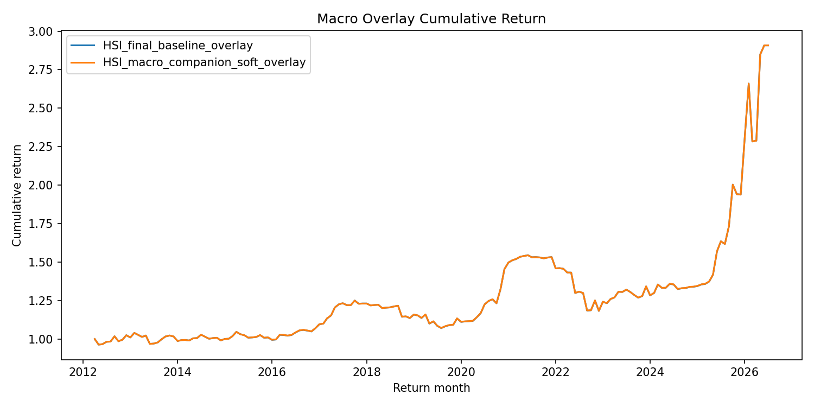
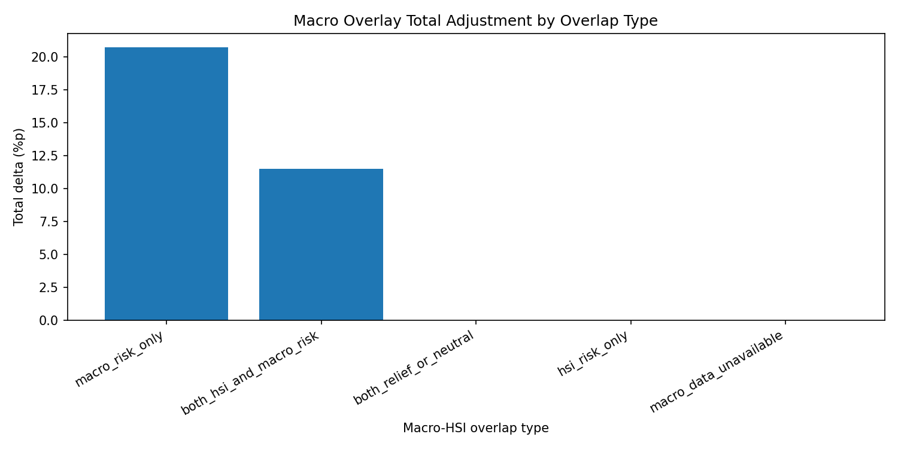
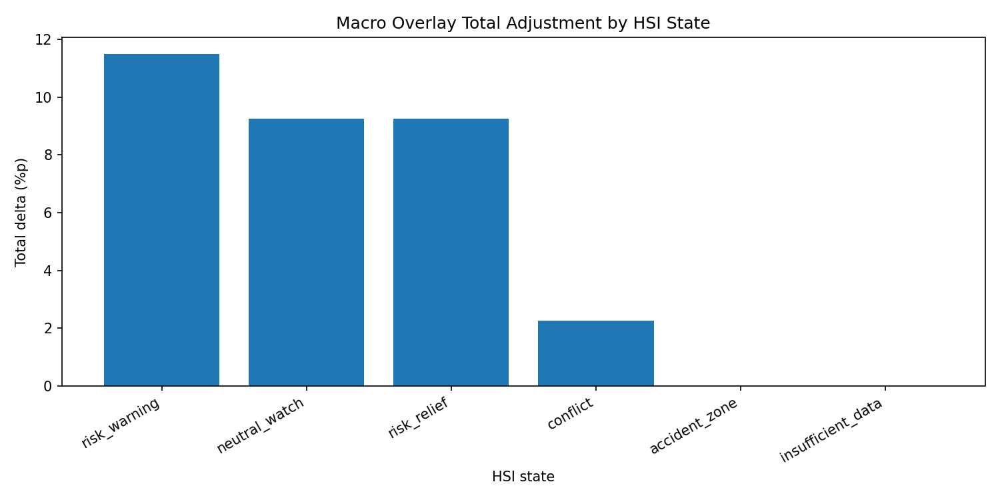

# 14_Macro_companion_overlay

## 실험명
**14번 Macro companion overlay 실험: HSI baseline 위 soft macro overlay 보조 실험**

## 1. 실험 목적

이 실험의 목적은 HSI baseline 위에 macro companion을 약하게 얹었을 때, 기존 HSI baseline의 성과를 크게 훼손하지 않으면서 MDD와 위험조정지표가 일부 개선되는지 확인하는 것이다.

14번은 최종 후보를 새로 만드는 실험이라기보다, **HSI baseline 위에 외생 macro 위험을 보조적으로 반영할 수 있는지 확인한 soft overlay 실험**이다.

macro companion(설명: HSI 상태분류를 대체하지 않고, 금리·환율·GDP 등 외생 거시환경을 이용해 위험자산 비중을 소폭 조정하는 보조 신호이다.)  
soft overlay(설명: 기존 전략을 바꾸지 않고, 그 위에 작은 보정값을 얹는 방식이다.)  
MDD(설명: Maximum Drawdown의 약자이다. 투자기간 중 고점 대비 최대 하락폭을 뜻한다.)

---

## 2. 배경과 이유

HSI baseline은 가격 기반 신호를 이용해 시장상태를 분류하고, 해당 상태에 따라 ETF 목표비중을 산출한다. 그러나 가격 기반 신호만으로는 금리 상승, 환율 상승, 성장 둔화와 같은 외생 macro 압력을 충분히 설명하지 못할 수 있다.

따라서 14번에서는 HSI baseline을 유지한 채, macro risk가 관측되는 경우 위험자산인 069500 비중을 소폭 줄이고 방어자산인 114260과 153130으로 일부 이동시키는 구조를 실험하였다. 단, macro companion은 HSI를 대체하는 독립 신호가 아니라 HSI 판단 위에 얹는 보조 신호로 제한하였다.

[GDP 포함 가능성 placeholder] 14번은 초기 macro overlay 실험이므로 GDP가 macro_defense_addon 구성에 포함되었을 가능성이 있다. 최종 no-GDP 검증은 15번 Lambda + macro overlay sensitivity에서 별도로 확인하였다.

---

## 3. 사용 데이터

- HSI baseline 비중 데이터: `main_final_baseline_rebalance_weights.csv`
- HSI-macro 결합 데이터: `main_final_hsi_macro_companion_joined_monthly.csv`
- ETF 월간 수익률 데이터: `main_final_monthly_return_decimal.csv`
- 성과 요약표: `main_final_macro_overlay_performance_summary.csv`
- 비중 조정 요약표: `main_final_macro_overlay_weight_adjustment_summary.csv`
- overlap별 조정표: `main_final_macro_overlay_weight_adjustment_by_overlap.csv`
- HSI 상태별 조정표: `main_final_macro_overlay_weight_adjustment_by_state.csv`
- 전략별 월별 백테스트 결과: `main_final_macro_overlay_backtest_timeseries.csv`
- macro overlay 조정 후 비중표: `main_final_macro_overlay_weights.csv`

수익률 단위는 decimal 기준으로 계산한 뒤, 보고서 표에서는 % 단위로 표시하였다. 전략 적용 시점은 월말 HSI 및 macro 정보를 다음 월 수익률에 적용하는 월간 리밸런싱 구조를 따른다.

---

## 4. 실험 방법

14번의 기본 흐름은 다음과 같다.

```text
HSI baseline 목표비중
→ macro risk flag 확인
→ macro_defense_addon × overlay_strength 계산
→ 069500 비중을 소폭 축소
→ 축소분을 114260과 153130으로 배분
→ 월별 수익률 백테스트
```

macro overlay는 HSI baseline을 대체하지 않는다. HSI가 먼저 시장상태를 판단하고, macro companion은 해당 판단 위에서 위험자산 비중을 아주 약하게 조정한다.

[macro overlay 규칙 placeholder] 코드 설명서에서는 `macro_overlay_delta = macro_defense_addon × overlay_strength` 구조와 069500 축소분을 114260/153130으로 배분하는 규칙을 별도로 정리한다.

---

## 5. 주요 결과

### 5.1 성과 요약

| 전략 | CAGR(%) | 연환산 변동성(%) | MDD(%) | Sharpe | Sortino | Calmar | WinRate(%) | CAGR 차이(%p) | MDD 차이(%p) | Sharpe 차이 | Calmar 차이 |
| --- | --- | --- | --- | --- | --- | --- | --- | --- | --- | --- | --- |
| HSI_final_baseline_overlay | 7.7323 | 13.6661 | -23.4594 | 0.6111 | 0.9502 | 0.3296 | 65.1163 | 0.0000 | 0.0000 | 0.0000 | 0.0000 |
| HSI_macro_companion_soft_overlay | 7.7318 | 13.6460 | -23.3629 | 0.6118 | 0.9515 | 0.3309 | 65.1163 | -0.0005 | 0.0965 | 0.0007 | 0.0013 |

HSI baseline 대비 macro soft overlay는 CAGR이 -0.0005%p 낮아졌지만, MDD는 0.0965%p 개선되었다. Sharpe는 0.0007, Calmar는 0.0013 개선되었다.

즉, macro overlay는 성과를 크게 바꾸지는 않았지만, 기존 HSI baseline을 거의 훼손하지 않으면서 일부 위험지표를 아주 소폭 개선하는 방향으로 작동하였다.

---

### 5.2 누적수익률 비교



누적수익률 경로는 두 전략이 거의 겹쳐 움직인다. 이는 macro overlay의 보정폭이 매우 작고, HSI baseline 자체를 대체하지 않도록 설계되었기 때문이다. 따라서 14번 결과는 macro overlay가 독립적인 성과 원천이라기보다, HSI baseline 위에 얹은 약한 방어 보정임을 보여준다.

---

### 5.3 전체 비중 조정 요약

| 구간 | 월 수 | macro 사용 가능 월 | macro risk 월 | 실제 조정 월 | 평균 조정폭(%p) | 최대 조정폭(%p) | 누적 조정폭(%p) | 평균 strength |
| --- | --- | --- | --- | --- | --- | --- | --- | --- |
| all | 172.000 | 150.000 | 74.000 | 56.000 | 0.188 | 2.500 | 32.250 | 0.247 |

전체 172개월 중 macro 데이터가 사용 가능한 월은 150개월이고, macro risk가 관측된 월은 74개월이다. 실제 비중 조정이 발생한 월은 56개월이다. 평균 조정폭은 0.1875%p, 최대 조정폭은 2.5000%p로 작다. 이는 macro overlay가 강한 비중 전환이 아니라 soft overlay로 작동했음을 의미한다.

---

### 5.4 overlap 유형별 비중 조정



| overlap 구분 | 월 수 | macro 사용 가능 월 | macro risk 월 | 실제 조정 월 | 평균 조정폭(%p) | 최대 조정폭(%p) | 누적 조정폭(%p) | 평균 strength |
| --- | --- | --- | --- | --- | --- | --- | --- | --- |
| both_hsi_and_macro_risk | 26.000 | 26.000 | 26.000 | 8.000 | 0.442 | 2.500 | 11.500 | 1.000 |
| both_relief_or_neutral | 55.000 | 55.000 | 0.000 | 0.000 | 0.000 | 0.000 | 0.000 | 0.000 |
| hsi_risk_only | 21.000 | 21.000 | 0.000 | 0.000 | 0.000 | 0.000 | 0.000 | 0.000 |
| macro_data_unavailable | 22.000 | 0.000 | 0.000 | 0.000 | 0.000 | 0.000 | 0.000 | 0.000 |
| macro_risk_only | 48.000 | 48.000 | 48.000 | 48.000 | 0.432 | 1.250 | 20.750 | 0.344 |

overlap 유형별로 보면 `macro_risk_only`에서 48개월 모두 조정이 발생했고, 누적 조정폭은 20.75%p였다. `both_hsi_and_macro_risk`에서는 26개월 중 8개월만 실제 조정이 발생했고, 누적 조정폭은 11.50%p였다.

이는 macro risk가 HSI risk와 완전히 같은 신호가 아니라, 일부 구간에서 HSI보다 넓거나 느린 외생 위험 압력을 포착했음을 시사한다. 다만 macro_risk_only 조정은 HSI 판단을 뒤집는 것이 아니라, HSI baseline 위에 작은 방어 보정으로만 반영되었다.

---

### 5.5 HSI 상태별 비중 조정



| HSI 상태 | 월 수 | macro 사용 가능 월 | macro risk 월 | 실제 조정 월 | 평균 조정폭(%p) | 최대 조정폭(%p) | 누적 조정폭(%p) | 평균 strength |
| --- | --- | --- | --- | --- | --- | --- | --- | --- |
| accident_zone | 34.000 | 33.000 | 18.000 | 0.000 | 0.000 | 0.000 | 0.000 | 0.529 |
| conflict | 4.000 | 4.000 | 3.000 | 3.000 | 0.563 | 1.250 | 2.250 | 0.375 |
| insufficient_data | 4.000 | 0.000 | 0.000 | 0.000 | 0.000 | 0.000 | 0.000 | 0.000 |
| neutral_watch | 35.000 | 30.000 | 15.000 | 15.000 | 0.264 | 1.250 | 9.250 | 0.214 |
| risk_relief | 81.000 | 69.000 | 30.000 | 30.000 | 0.114 | 0.625 | 9.250 | 0.093 |
| risk_warning | 14.000 | 14.000 | 8.000 | 8.000 | 0.821 | 2.500 | 11.500 | 0.571 |

HSI 상태별로 보면 `risk_warning`의 평균 조정폭이 가장 크고, `risk_relief`, `neutral_watch`, `conflict`에서도 조정이 발생했다. 반면 `accident_zone`은 macro risk 월이 있었지만 실제 조정 월 수는 0으로 나타났다. 이는 accident_zone의 기존 069500 목표비중이 이미 0에 가까워 추가로 줄일 위험자산 비중이 없었기 때문이다.

따라서 accident_zone에서 조정이 없었다는 것은 macro overlay가 작동하지 않았다는 뜻이 아니라, HSI baseline이 이미 충분히 방어적으로 설정되어 있어 추가 조정 여지가 없었다는 뜻으로 해석한다.

---

### 5.6 최근 비중 조정 예시

| 신호월 | 수익률 적용월 | HSI 상태 | macro 가능 | macro risk | macro addon | overlap | strength | 조정폭 | 기존 069500 | 조정 후 069500 | 조정 후 114260 | 조정 후 153130 |
| --- | --- | --- | --- | --- | --- | --- | --- | --- | --- | --- | --- | --- |
| 2025-09 | 2025-10 | risk_relief | 1.0000 | 1.0000 | 0.0100 | macro_risk_only | 0.2500 | 0.0025 | 0.7000 | 0.6975 | 0.2008 | 0.1017 |
| 2025-10 | 2025-11 | risk_relief | 1.0000 | 1.0000 | 0.0250 | macro_risk_only | 0.2500 | 0.0063 | 0.7000 | 0.6937 | 0.2019 | 0.1044 |
| 2025-11 | 2025-12 | accident_zone | 1.0000 | 1.0000 | 0.0250 | both_hsi_and_macro_risk | 1.0000 | 0.0000 | 0.0000 | 0.0000 | 0.3000 | 0.7000 |
| 2025-12 | 2026-01 | risk_relief | 1.0000 | 0.0000 | 0.0000 | both_relief_or_neutral | 0.0000 | 0.0000 | 0.7000 | 0.7000 | 0.2000 | 0.1000 |
| 2026-01 | 2026-02 | risk_relief | 1.0000 | 0.0000 | 0.0000 | both_relief_or_neutral | 0.0000 | 0.0000 | 0.7000 | 0.7000 | 0.2000 | 0.1000 |
| 2026-02 | 2026-03 | risk_relief | 1.0000 | 0.0000 | 0.0000 | both_relief_or_neutral | 0.0000 | 0.0000 | 0.7000 | 0.7000 | 0.2000 | 0.1000 |
| 2026-03 | 2026-04 | accident_zone | 1.0000 | 1.0000 | 0.0100 | both_hsi_and_macro_risk | 1.0000 | 0.0000 | 0.0000 | 0.0000 | 0.3000 | 0.7000 |
| 2026-04 | 2026-05 | risk_relief | 1.0000 | 0.0000 | 0.0000 | both_relief_or_neutral | 0.0000 | 0.0000 | 0.7000 | 0.7000 | 0.2000 | 0.1000 |
| 2026-05 | 2026-06 | risk_relief | 1.0000 | 1.0000 | 0.0100 | macro_risk_only | 0.2500 | 0.0025 | 0.7000 | 0.6975 | 0.2008 | 0.1017 |
| 2026-06 | 2026-07 | conflict | 1.0000 | 1.0000 | 0.0100 | macro_risk_only | 0.5000 | 0.0050 | 0.3500 | 0.3450 | 0.4015 | 0.2535 |

최근 월별 비중표를 보면 macro risk가 발생해도 HSI 상태와 기존 069500 비중에 따라 조정폭이 달라진다. 예를 들어 accident_zone에서는 overlay_strength가 높더라도 기존 위험자산 비중이 이미 낮으면 `macro_overlay_delta`가 0이 될 수 있다.

[사례 설명 placeholder] 최종 발표자료에서는 최근 월 중 한두 사례만 선택해 “HSI 상태 → macro risk 여부 → 069500 조정폭 → 최종 ETF 비중” 순서로 설명하면 좋다.

---

## 6. 성과 귀인과 해석

14번 실험의 핵심은 macro overlay가 HSI baseline을 대체하지 않았다는 점이다. macro overlay는 독립적인 수익률 예측 신호가 아니라, HSI 상태판단 위에 외생 위험을 약하게 반영하는 보조 장치로 작동하였다.

해석은 다음과 같다.

1. **성과 개선 폭은 매우 작다.**  
   CAGR은 거의 변하지 않았고, MDD·Sharpe·Calmar가 아주 소폭 개선되었다.

2. **비중 조정폭도 매우 작다.**  
   평균 조정폭은 0.1875%p로 작고, 최대 조정폭도 2.5000%p에 그쳤다.

3. **macro_risk_only 구간이 존재한다.**  
   macro는 HSI와 완전히 같은 신호가 아니며, 일부 구간에서는 HSI가 위험으로 보지 않는 시점에도 외생 위험 압력을 표시했다.

4. **accident_zone에서 조정이 없는 것은 자연스럽다.**  
   HSI baseline이 이미 위험자산 비중을 크게 낮춘 상태에서는 macro가 추가로 줄일 위험자산 비중이 없다.

5. **최종 후보를 바꾸지는 못한다.**  
   14번은 HSI baseline 위 soft overlay 가능성을 확인한 보조 실험이며, 이후 15번 no-GDP Lambda+macro 실험에서도 macro overlay는 최종 후보를 바꾸지 못했다.

---

## 7. 한계와 다음 판단

14번은 초기 macro overlay 실험이므로, macro_defense_addon에 GDP 또는 기타 macro 구성요소가 포함되었을 가능성이 있다. 따라서 14번만으로 최종 macro 전략의 타당성을 주장하기보다, 15번 no-GDP Lambda+macro 민감도 실험과 함께 해석해야 한다.

최종 판단은 다음과 같이 정리한다.

| 항목 | 판단 |
|---|---|
| 14번 macro overlay | HSI baseline 위 soft overlay 보조 실험 |
| 성과 효과 | MDD, Sharpe, Calmar 아주 소폭 개선 |
| 수익률 효과 | CAGR은 거의 동일하거나 아주 소폭 하락 |
| 비중 조정폭 | 평균 조정폭이 작아 강한 전략 변화는 아님 |
| 최종 후보 여부 | 최종 후보 아님. diagnostic 보조 실험 |
| 후속 연결 | 15번 no-GDP Lambda+macro 실험에서 macro 최종 후보화 실패 확인 |

[15번 연결 placeholder] 15번 보고서와 연결할 때는 “14번은 HSI baseline 위 soft overlay 가능성 확인, 15번은 Lambda 후보 위 no-GDP macro overlay 민감도 확인”으로 역할을 구분한다.

[팀 합의 placeholder] macro overlay를 최종 후보가 아니라 보조 진단 실험으로 분류하는 방향은 수치상 타당하지만, 최종 발표에서는 팀 합의 문구로 정리한다.

---

# 별도 첨부 1. 입출력 구조표

| 구분 | 파일명 | 역할 | 주요 컬럼 | 시점 기준 | 단위 |
|---|---|---|---|---|---|
| 입력 | `main_final_baseline_rebalance_weights.csv` | HSI baseline 목표비중 | `year_month`, `hsi_state`, ETF별 목표비중 | 월말 신호 | weight |
| 입력 | `main_final_hsi_macro_companion_joined_monthly.csv` | HSI와 macro companion 결합 정보 | `macro_risk_flag`, `macro_defense_addon`, `macro_hsi_overlap_type` | 월말 macro | flag / score |
| 입력 | `main_final_monthly_return_decimal.csv` | ETF 월간 수익률 | `year_month`, `069500`, `114260`, `153130` | 월별 | decimal |
| 출력 | `main_final_macro_overlay_performance_summary.csv` | baseline과 macro overlay 성과 비교 | CAGR, MDD, Sharpe, Sortino, Calmar | 전체기간 | % / ratio |
| 출력 | `main_final_macro_overlay_weight_adjustment_summary.csv` | macro overlay 비중 조정 전체 요약 | adjusted_months, avg_delta, max_delta | 전체기간 | %p |
| 출력 | `main_final_macro_overlay_weight_adjustment_by_overlap.csv` | HSI-macro overlap 유형별 조정 요약 | segment, macro_risk_months, adjusted_months | overlap별 | %p |
| 출력 | `main_final_macro_overlay_weight_adjustment_by_state.csv` | HSI 상태별 조정 요약 | hsi_state, macro_risk_months, adjusted_months | 상태별 | %p |
| 출력 | `main_final_macro_overlay_backtest_timeseries.csv` | 전략별 월별 백테스트 결과 | strategy_name, return_month, strategy_return, cumulative_return | 월별 | decimal |
| 출력 | `main_final_macro_overlay_weights.csv` | macro overlay 적용 후 ETF 비중표 | weight_069500, weight_114260, weight_153130 | 월별 | weight |
| 출력 | `main_final_macro_companion_overlay_note.md` | 실험 목적과 결론 요약 노트 | purpose, conclusion | 요약 | text |

---

# 별도 첨부 2. 입출력 데이터 분류표

| 데이터 분류 | 파일명 | 설명 | 최종 전략 사용 여부 | 보고서 사용 위치 |
|---|---|---|---|---|
| processed | `main_final_baseline_rebalance_weights.csv` | HSI baseline 목표비중 데이터 | 사용 | baseline 비중 기준 |
| processed | `main_final_hsi_macro_companion_joined_monthly.csv` | HSI와 macro companion 결합 데이터 | 사용 | macro risk 판단 |
| processed | `main_final_monthly_return_decimal.csv` | ETF 월간 수익률 계산용 데이터 | 사용 | 백테스트 수익률 계산 |
| model_output | `main_final_macro_overlay_backtest_timeseries.csv` | baseline과 macro overlay 월별 수익률 결과 | 사용 | 성과 계산 원천 |
| model_output | `main_final_macro_overlay_weights.csv` | macro overlay 적용 후 ETF 비중 결과 | 사용 | 비중 조정 해석 |
| report_output | `main_final_macro_overlay_performance_summary.csv` | 성과 요약표 | 사용 | 본문 표 |
| report_output | `main_final_macro_overlay_weight_adjustment_summary.csv` | 비중 조정 요약표 | 사용 | 조정폭 해석 |
| report_output | `main_final_macro_overlay_weight_adjustment_by_overlap.csv` | overlap별 조정표 | 사용 | HSI-macro 관계 해석 |
| report_output | `main_final_macro_overlay_weight_adjustment_by_state.csv` | HSI 상태별 조정표 | 사용 | 상태별 해석 |
| report_output | `main_final_macro_companion_overlay_note.md` | 14번 요약 노트 | 사용 | 결론 요약 |

---

# 별도 첨부 3. 보고서용 최종 요약 문장

14번 macro companion overlay 실험에서는 HSI baseline 위에 외생 macro 위험을 약하게 반영하는 soft overlay 구조를 적용하였다. 실험 결과 macro overlay는 HSI baseline 대비 CAGR을 거의 변화시키지 않았고, MDD·Sharpe·Calmar를 아주 소폭 개선하였다. 전체 172개월 중 실제 비중 조정이 발생한 달은 56개월이었으며, 평균 조정폭은 0.1875%p로 작았다. 따라서 14번은 최종 후보를 대체하는 독립 전략이 아니라, HSI baseline 위에서 macro companion을 보조적으로 얹을 수 있는지 확인한 diagnostic 실험으로 해석한다.
