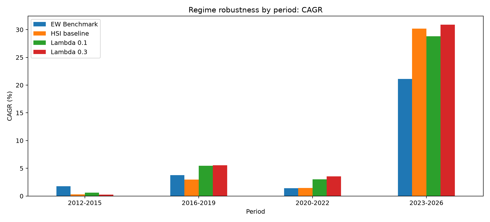
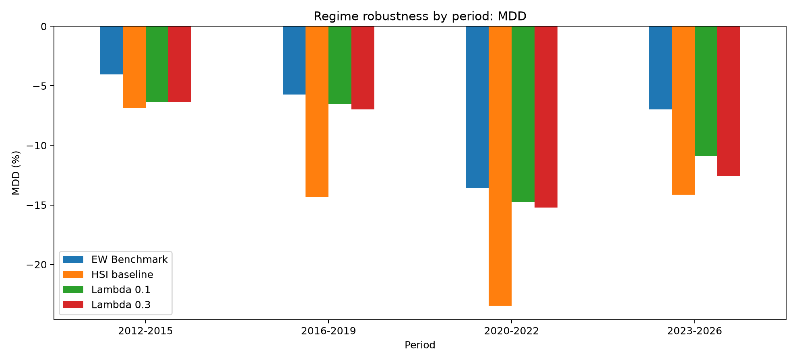
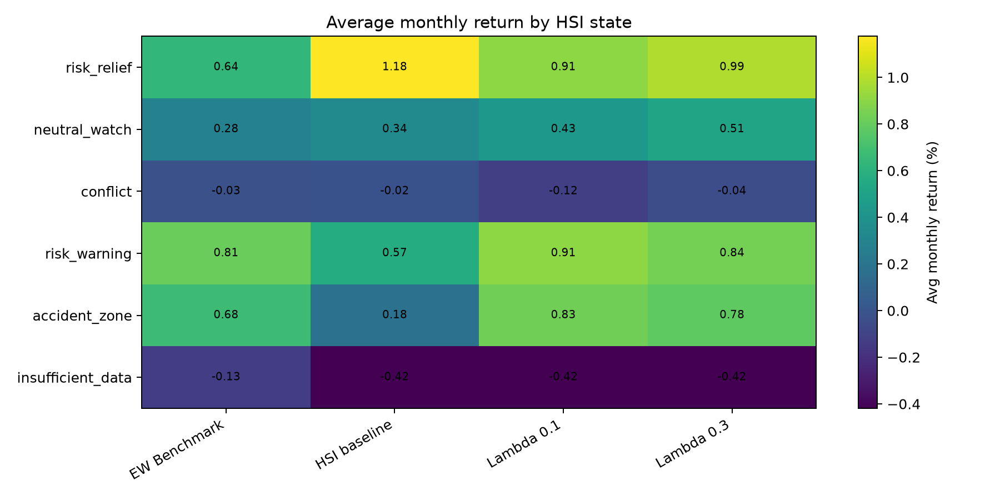

# 16_Regime_robustness

## 실험명
**16번 Regime robustness 실험: Lambda 후보의 기간별·상태별·손실월 생존 검증**

## 1. 실험 목적

이 실험의 목적은 10번 및 20번 계열 실험에서 남은 **Lambda 0.1**과 **Lambda 0.3** 후보가 전체 기간 성과에서만 좋아 보인 것인지, 아니면 기간별·HSI 상태별·큰 손실월에서도 비교적 안정적으로 버틸 수 있는지 확인하는 것이다.

16번은 새로운 전략 후보를 추가하는 실험이 아니라, 기존 후보를 흔들어 보는 검증 실험이다. 따라서 본 실험의 핵심 질문은 다음과 같다.

| 질문 | 확인 방식 |
|---|---|
| Lambda 후보가 특정 기간에만 좋아 보이는가? | 2012~2015, 2016~2019, 2020~2022, 2023~2026 구간별 성과 비교 |
| HSI 상태별로 후보의 강점과 약점이 다른가? | HSI 5상태 및 insufficient_data 구간별 평균 월수익률 비교 |
| 큰 손실월에서 방어 효과가 있는가? | 069500 하위 10% 손실월의 평균 포트폴리오 수익률 비교 |
| Lambda 0.1과 Lambda 0.3의 역할이 다른가? | Turnover, MDD, CAGR, Calmar의 상대 비교 |

---

## 2. 배경과 이유

앞선 실험에서 HSI baseline은 시장상태를 ETF 목표비중으로 연결할 수 있음을 보여주었지만, 목표비중으로 즉시 이동하기 때문에 MDD*와 Turnover* 부담이 크게 나타났다. 이에 Lambda 부분조정 구조를 도입하여 이전 비중과 목표비중의 차이 중 일부만 반영하도록 만들었다.

16번 실험은 이 Lambda 구조가 단순히 전체 기간 성과표에서만 좋아 보인 것이 아니라, 여러 시장 구간과 HSI 상태에서도 해석 가능한 성격을 가지는지 점검하기 위해 수행하였다.

MDD(설명: Maximum Drawdown의 약자이다. 투자기간 중 고점 대비 최대 하락폭을 뜻한다.)  
Turnover(설명: 포트폴리오 비중이 얼마나 많이 바뀌었는지를 나타내는 회전율이다. 거래비용 부담과 연결된다.)  
Lambda(설명: HSI 목표비중으로 한 번에 이동하지 않고, 이전 비중과 목표비중의 차이 중 일부만 반영하도록 조절하는 부분조정 계수이다.)

---

## 3. 사용 데이터

- ETF 월간 수익률 데이터: `main_final_monthly_return_decimal.csv`
- HSI 상태별 목표비중 데이터: `main_final_baseline_rebalance_weights.csv`
- 전략별 월별 수익률 산출 데이터: `main_final_regime_robustness_strategy_timeseries.csv`
- 전체 성과 요약표: `main_final_regime_robustness_summary.csv`
- 기간별 성과표: `main_final_regime_robustness_by_period.csv`
- HSI 상태별 성과표: `main_final_regime_robustness_by_hsi_state.csv`
- 큰 손실월 진단표: `main_final_regime_robustness_tail_event_summary.csv`
- 큰 손실월 목록: `main_final_regime_robustness_tail_months.csv`
- 판단 보조표: `main_final_regime_robustness_decision_note.csv`

수익률은 decimal 기준으로 계산한 뒤, 보고서 표에서는 % 단위로 표시하였다. 전략 적용 시점은 월말 HSI 상태를 다음 월 수익률에 적용하는 월간 리밸런싱 구조를 따른다.

---

## 4. 실험 방법

본 실험에서는 다음 4개 전략을 비교하였다.

| 전략 | 역할 |
|---|---|
| EW Benchmark | 동일 ETF 유니버스를 단순 동일비중으로 보유하는 보조 BM |
| HSI baseline | HSI 상태를 목표비중에 즉시 반영한 내부 기준선 |
| Lambda 0.1 | 목표비중과 이전 비중의 차이 중 10%만 반영하는 저회전 후보 |
| Lambda 0.3 | 목표비중과 이전 비중의 차이 중 30%를 반영하는 균형형 후보 |

기간별 robustness는 다음 네 구간으로 나누어 확인하였다.

| 기간 | 해석 |
|---|---|
| 2012~2015 | 초기 구간 |
| 2016~2019 | 중간 구간 |
| 2020~2022 | 시장 충격 및 변동성 확대가 포함된 구간 |
| 2023~2026 | 최근 상승 구간 |

[기간 분할 기준 placeholder] 위 구간 구분은 초기·중간·충격·최근 구간을 나누어 전략의 시기별 강건성을 보기 위한 1차 분할이다. 최종 발표자료에서는 팀 합의에 따라 기간명 또는 구간 해석 문구를 더 간결하게 수정할 수 있다.

---

## 5. 주요 결과

### 5.1 전체 기간 성과 요약

| 전략 | CAGR(%) | 연환산 변동성(%) | MDD(%) | Sharpe | Calmar | WinRate(%) | 평균 Turnover(%) | 역할 |
| --- | --- | --- | --- | --- | --- | --- | --- | --- |
| EW Benchmark | 6.59 | 7.99 | -13.57 | 0.83 | 0.49 | 60.82 | 0.00 | benchmark |
| HSI baseline | 7.83 | 13.70 | -23.46 | 0.61 | 0.33 | 65.50 | 22.02 | baseline |
| Lambda 0.1 | 8.69 | 11.35 | -14.74 | 0.79 | 0.59 | 59.65 | 2.46 | candidate |
| Lambda 0.3 | 9.15 | 12.10 | -15.22 | 0.78 | 0.60 | 60.82 | 6.89 | candidate |

전체 기간 기준으로 **Lambda 0.3**는 Lambda 후보 중 CAGR이 가장 높고, **Lambda 0.3**는 Calmar 기준에서도 우위에 있다. 반면 **Lambda 0.1**는 평균 Turnover가 가장 낮아 저회전 후보로 해석된다.

16번 결과의 핵심은 하나의 Lambda 후보가 모든 기준에서 절대적으로 우월하다는 것이 아니라, **Lambda 0.1과 Lambda 0.3의 운용 성격이 다르게 나타났다는 점**이다. Lambda 0.1은 보수형·저회전 후보이고, Lambda 0.3은 수익성·Calmar 균형형 후보로 해석할 수 있다.

Calmar(설명: CAGR을 절대 MDD로 나눈 지표이다. 낙폭 대비 수익성을 볼 때 사용한다.)

---

### 5.2 기간별 CAGR

기간별 CAGR을 보면 2016~2019, 2020~2022, 2023~2026 구간에서 Lambda 후보들이 HSI baseline 또는 EW Benchmark와 다른 성격을 보인다. 특히 2023~2026년 최근 상승 구간에서는 Lambda 0.3이 Lambda 0.1보다 더 높은 CAGR을 보이며, HSI 신호에 상대적으로 빠르게 반응하는 균형형 후보의 성격이 나타난다.

반면 2012~2015 구간처럼 수익률 차이가 크지 않은 구간에서는 EW Benchmark 또는 Lambda 후보의 차이가 제한적으로 나타난다. 따라서 기간별 CAGR은 Lambda 0.3의 수익성 장점을 보여주지만, 단독 지표로 최종 우열을 판단하기보다는 MDD와 함께 해석해야 한다.

---

### 5.3 기간별 MDD

기간별 MDD에서는 HSI baseline의 즉시 이동 구조가 부담으로 나타난다. 특히 2016~2019와 2020~2022 구간에서 HSI baseline은 큰 낙폭을 보였고, Lambda 후보는 이 낙폭을 완화하였다. 기간별 Lambda 후보 간 MDD 우위 횟수는 **Lambda 0.1=4회**로 정리된다.

이는 Lambda 구조가 HSI 상태분류 자체를 바꾸는 것이 아니라, 목표비중으로 이동하는 속도를 조절하여 손실폭과 회전율 부담을 완화하는 역할을 한다는 점을 보여준다.

---

### 5.4 기간별 성과표

| 기간 | 전략 | CAGR(%) | MDD(%) | Sharpe | Calmar | 평균 Turnover(%) |
| --- | --- | --- | --- | --- | --- | --- |
| 2012-2015 | EW Benchmark | 1.78 | -4.04 | 0.48 | 0.44 | 0.00 |
| 2012-2015 | HSI baseline | 0.28 | -6.83 | 0.07 | 0.04 | 20.89 |
| 2012-2015 | Lambda 0.1 | 0.62 | -6.32 | 0.13 | 0.10 | 1.89 |
| 2012-2015 | Lambda 0.3 | 0.23 | -6.35 | 0.07 | 0.04 | 5.79 |
| 2016-2019 | EW Benchmark | 3.77 | -5.73 | 0.85 | 0.66 | 0.00 |
| 2016-2019 | HSI baseline | 2.99 | -14.34 | 0.47 | 0.21 | 23.85 |
| 2016-2019 | Lambda 0.1 | 5.45 | -6.54 | 0.94 | 0.83 | 2.43 |
| 2016-2019 | Lambda 0.3 | 5.54 | -6.99 | 0.90 | 0.79 | 6.79 |
| 2020-2022 | EW Benchmark | 1.41 | -13.57 | 0.21 | 0.10 | 0.00 |
| 2020-2022 | HSI baseline | 1.46 | -23.46 | 0.17 | 0.06 | 21.67 |
| 2020-2022 | Lambda 0.1 | 3.02 | -14.74 | 0.34 | 0.20 | 2.91 |
| 2020-2022 | Lambda 0.3 | 3.56 | -15.22 | 0.37 | 0.23 | 8.08 |
| 2023-2026 | EW Benchmark | 21.11 | -6.98 | 1.57 | 3.02 | 0.00 |
| 2023-2026 | HSI baseline | 30.18 | -14.13 | 1.25 | 2.14 | 21.43 |
| 2023-2026 | Lambda 0.1 | 28.80 | -10.91 | 1.43 | 2.64 | 2.71 |
| 2023-2026 | Lambda 0.3 | 30.89 | -12.55 | 1.43 | 2.46 | 7.15 |

---

### 5.5 HSI 상태별 평균 월수익률

| HSI 상태 | EW Benchmark | HSI baseline | Lambda 0.1 | Lambda 0.3 |
| --- | --- | --- | --- | --- |
| risk_relief | 0.64 | 1.18 | 0.91 | 0.99 |
| neutral_watch | 0.28 | 0.34 | 0.43 | 0.51 |
| conflict | -0.03 | -0.02 | -0.12 | -0.04 |
| risk_warning | 0.81 | 0.57 | 0.91 | 0.84 |
| accident_zone | 0.68 | 0.18 | 0.83 | 0.78 |
| insufficient_data | -0.13 | -0.42 | -0.42 | -0.42 |

HSI 상태별 평균 월수익률을 보면, `risk_relief`에서는 HSI baseline이 가장 높은 평균 월수익률을 보인다. 이는 risk_relief 상태에서 목표 주식 비중이 높아지고, HSI baseline은 목표비중으로 즉시 이동하기 때문이다. 반면 Lambda 후보는 목표비중으로 천천히 이동하므로 회복 구간에서 일부 수익을 늦게 따라갈 수 있다.

`neutral_watch`에서는 Lambda 0.3이 상대적으로 높은 평균 월수익률을 보이며, `risk_warning` 및 `accident_zone`에서는 Lambda 후보가 HSI baseline보다 반등 참여 측면에서 더 나은 평균 수익률을 보인다. 다만 HSI 상태별 평균수익률은 상태별 표본 수 차이의 영향을 받을 수 있으므로, 단순 평균만으로 전략 우열을 단정하지 않는다.

[해석 유의 placeholder] 상태별 평균 수익률은 조건부 평균이며, 시간 순서가 이어진 누적수익률이 아니다. 따라서 HSI 상태별 결과는 전략의 작동 성격을 이해하기 위한 보조 진단으로 사용한다.

---

### 5.6 HSI 상태별 표본 수

| HSI 상태 | 월 수 |
| --- | --- |
| risk_relief | 81 |
| neutral_watch | 35 |
| conflict | 3 |
| risk_warning | 14 |
| accident_zone | 34 |
| insufficient_data | 4 |

[표본 수 보완 예정] 위 표본 수는 `by_hsi_state` 산출물의 months 컬럼을 기준으로 정리하였다. 최종 보고서에서는 원천 HSI 상태표의 상태별 월 수와 일치하는지 한 번 더 확인하면 좋다.

---

### 5.7 069500 하위 10% 손실월 진단

| 전략 | 손실월 수 | 평균 손실월 수익률(%) | 중앙 손실월 수익률(%) | 최악 월 수익률(%) | 손실월 내 승률(%) | 평균 069500 비중(%) | 평균 Turnover(%) |
| --- | --- | --- | --- | --- | --- | --- | --- |
| EW Benchmark | 18.00 | -2.75 | -2.27 | -6.98 | 0.00 | 33.33 | 0.00 |
| HSI baseline | 18.00 | -4.08 | -3.96 | -14.13 | 22.22 | 44.44 | 22.22 |
| Lambda 0.1 | 18.00 | -3.68 | -3.17 | -10.91 | 0.00 | 45.16 | 2.86 |
| Lambda 0.3 | 18.00 | -3.83 | -3.30 | -12.55 | 0.00 | 45.41 | 8.36 |

[tail event 정의 placeholder] 본 실험에서는 069500 월수익률 하위 10% 구간을 큰 손실월, 즉 tail event로 정의하였다.

큰 손실월 기준으로 보면 Lambda 0.1과 Lambda 0.3은 HSI baseline 대비 손실폭을 완화하거나, 적어도 HSI baseline의 즉시 이동 구조와 다른 방어 성격을 보여준다. 판단 보조표에서도 069500 하위 10% 손실월 평균 수익률이 가장 나은 Lambda 후보는 Lambda 0.1로 정리되었다. 따라서 Lambda 0.1은 저회전·방어형 후보로 해석하는 것이 적절하다.

---

### 5.8 큰 손실월 목록 미리보기

| ret_069500 |
| --- |
| -0.08 |
| -0.05 |
| -0.08 |
| -0.05 |
| -0.06 |
| -0.12 |
| -0.07 |
| -0.06 |
| -0.11 |
| -0.09 |

[사례 보완 placeholder] 발표자료에는 모든 tail month를 넣기보다, 대표 손실월 2~3개만 골라 HSI 상태와 각 전략의 비중 변화를 함께 설명하는 방식이 적절하다.

---

## 6. 성과 귀인과 해석

16번 실험의 핵심은 Lambda 후보가 무너지지 않았다는 점이다. 다만 두 후보의 성격은 서로 다르다.

1. **HSI baseline은 내부 기준선으로 남는다.**  
   HSI 상태를 목표비중으로 즉시 연결하는 구조는 시장상태 해석 가능성을 보여주지만, Turnover와 MDD 부담이 크다.

2. **Lambda 0.1은 저회전·방어형 후보이다.**  
   전체 기간 평균 Turnover가 낮고, 기간별 MDD 및 큰 손실월 진단에서 상대적으로 안정적인 모습을 보인다.

3. **Lambda 0.3은 수익성·Calmar 균형형 후보이다.**  
   전체 CAGR과 Calmar가 Lambda 후보 중 가장 높아, HSI 신호에 조금 더 빠르게 반응하는 균형형 후보로 볼 수 있다.

4. **EW Benchmark는 여전히 중요한 비교 기준이다.**  
   EW Benchmark는 단순하지만 안정적인 비교 기준이며, 일부 안정성 지표에서 강할 수 있다. 따라서 HSI-Lambda 후보가 모든 지표에서 우월하다고 단정하지 않는다.

---

## 7. 판단 보조 메모

| 판단 항목 | 판단 내용 | 값 |
| --- | --- | --- |
| overall_calmar | 전체 기간 Calmar 기준 우위 후보는 Lambda 0.3입니다. | 0.601 |
| overall_turnover | 전체 기간 평균 Turnover가 낮은 Lambda 후보는 Lambda 0.1입니다. | 2.455 |
| overall_cagr | 전체 기간 CAGR이 높은 Lambda 후보는 Lambda 0.3입니다. | 9.148 |
| period_mdd_count | 기간별 abs MDD 기준 Lambda 우위 횟수: Lambda 0.1=4 |  |
| tail_event_avg_return | 069500 하위 10% 손실월 평균 수익률이 가장 나은 Lambda 후보는 Lambda 0.1입니다. | -3.685 |

---

## 8. 한계와 다음 판단

본 실험은 Lambda 후보의 1차 robustness 검토이다. 기간별·상태별·손실월 기준으로 후보의 성격을 확인했지만, 모든 시장환경에서 동일하게 우월하다고 말할 수는 없다. 특히 상태별 평균수익률은 표본 수 차이와 상태 발생 시점의 영향을 받는다.

따라서 본 실험의 결론은 다음과 같이 정리한다.

| 후보 | 최종 해석 |
|---|---|
| Lambda 0.1 | 낮은 Turnover와 큰 손실월 방어에 강점이 있는 저회전·보수형 후보 |
| Lambda 0.3 | 전체 CAGR과 Calmar가 높은 수익성·균형형 후보 |
| HSI baseline | 즉시 비중 이동 기준선. 최종 후보보다 내부 비교 기준에 가까움 |
| EW Benchmark | 단순하지만 안정적인 보조 비교 기준 |

[추가 검증 필요] 본 결과는 robustness의 1차 확인 결과이며, 향후 walk-forward 검증, 다른 기간 분할, 거래비용 수준 변화, 동적 Lambda 구조 등을 통해 추가 확인할 수 있다.

---

# 별도 첨부 1. 입출력 구조표

| 구분 | 파일명 | 역할 | 주요 컬럼 | 시점 기준 | 단위 |
|---|---|---|---|---|---|
| 입력 | `main_final_monthly_return_decimal.csv` | ETF 월간 수익률 | `year_month`, `069500`, `114260`, `153130` | 월별 | decimal |
| 입력 | `main_final_baseline_rebalance_weights.csv` | HSI 상태별 목표비중 및 기준 정보 | `year_month`, `hsi_state`, ETF별 목표비중 | 월말 신호 | weight |
| 출력 | `main_final_regime_robustness_strategy_timeseries.csv` | 4개 전략 월별 수익률 재구성 결과 | `strategy_name`, `portfolio_return`, ETF별 비중 | 월별 | decimal / weight |
| 출력 | `main_final_regime_robustness_summary.csv` | 전체 기간 성과 요약 | CAGR, MDD, Sharpe, Calmar, Turnover | 전체기간 | % / ratio |
| 출력 | `main_final_regime_robustness_by_period.csv` | 기간별 robustness 결과 | period, strategy_name, CAGR, MDD, Turnover | 구간별 | % / ratio |
| 출력 | `main_final_regime_robustness_by_hsi_state.csv` | HSI 상태별 조건부 진단 | hsi_state, avg_monthly_return, MDD | HSI 상태별 | % |
| 출력 | `main_final_regime_robustness_tail_event_summary.csv` | 069500 하위 10% 손실월 진단 | tail_months, avg_tail_return, avg_weight_069500 | 손실월 기준 | % |
| 출력 | `main_final_regime_robustness_tail_months.csv` | 손실월 목록 | month, 069500 return 등 | 손실월 기준 | % / decimal |
| 출력 | `main_final_regime_robustness_decision_note.csv` | 판단 보조 메모 | topic, finding, value | 요약 | text / numeric |
| 출력 | `main_final_regime_robustness_period_cagr.png` | 기간별 CAGR 그림 | period, strategy | 구간별 | % |
| 출력 | `main_final_regime_robustness_period_mdd.png` | 기간별 MDD 그림 | period, strategy | 구간별 | % |
| 출력 | `main_final_regime_robustness_state_avg_return_heatmap.png` | HSI 상태별 평균 월수익률 heatmap | hsi_state, strategy | 상태별 | % |

---

# 별도 첨부 2. 입출력 데이터 분류표

| 데이터 분류 | 파일명 | 설명 | 최종 전략 사용 여부 | 보고서 사용 위치 |
|---|---|---|---|---|
| processed | `main_final_monthly_return_decimal.csv` | ETF 월간 수익률 계산용 데이터 | 사용 | 백테스트 수익률 계산 |
| processed | `main_final_baseline_rebalance_weights.csv` | HSI 상태와 목표비중 데이터 | 사용 | HSI baseline 및 Lambda 비중 계산 |
| model_output | `main_final_regime_robustness_strategy_timeseries.csv` | 전략별 월별 수익률과 비중 결과 | 사용 | 성과 계산 원천 |
| report_output | `main_final_regime_robustness_summary.csv` | 전체 기간 성과표 | 사용 | 본문 표 |
| report_output | `main_final_regime_robustness_by_period.csv` | 기간별 성과표 | 사용 | robustness 설명 |
| report_output | `main_final_regime_robustness_by_hsi_state.csv` | HSI 상태별 성과표 | 사용 | 상태별 해석 |
| report_output | `main_final_regime_robustness_tail_event_summary.csv` | 큰 손실월 진단표 | 사용 | 방어력 설명 |
| report_output | `main_final_regime_robustness_tail_months.csv` | 큰 손실월 목록 | 참고 | 대표 사례 선정 |
| report_output | `main_final_regime_robustness_decision_note.csv` | 자동 판단 보조표 | 참고 | 결론 보조 |
| report_output | `main_final_regime_robustness_period_cagr.png` | 기간별 CAGR 그림 | 사용 | 시각자료 |
| report_output | `main_final_regime_robustness_period_mdd.png` | 기간별 MDD 그림 | 사용 | 시각자료 |
| report_output | `main_final_regime_robustness_state_avg_return_heatmap.png` | HSI 상태별 평균 월수익률 그림 | 사용 | 시각자료 |

---

# 별도 첨부 3. 보고서용 최종 요약 문장

16번 robustness 검토 결과, HSI baseline은 HSI 상태를 ETF 비중으로 즉시 연결할 수 있음을 보여주었으나 MDD와 Turnover 부담이 컸다. 반면 Lambda 0.1과 Lambda 0.3은 비중 이동 속도를 완화하여 후보로 남았다. Lambda 0.1은 낮은 Turnover와 큰 손실월 방어 측면에서 보수형 후보로, Lambda 0.3은 전체 CAGR과 Calmar가 높은 균형형 후보로 해석된다. 다만 EW Benchmark가 일부 안정성 지표에서 강하기 때문에, HSI-Lambda 후보가 모든 지표에서 절대적으로 우월하다고 단정하기보다 투자 목적에 따라 후보의 성격을 구분하는 것이 적절하다.
