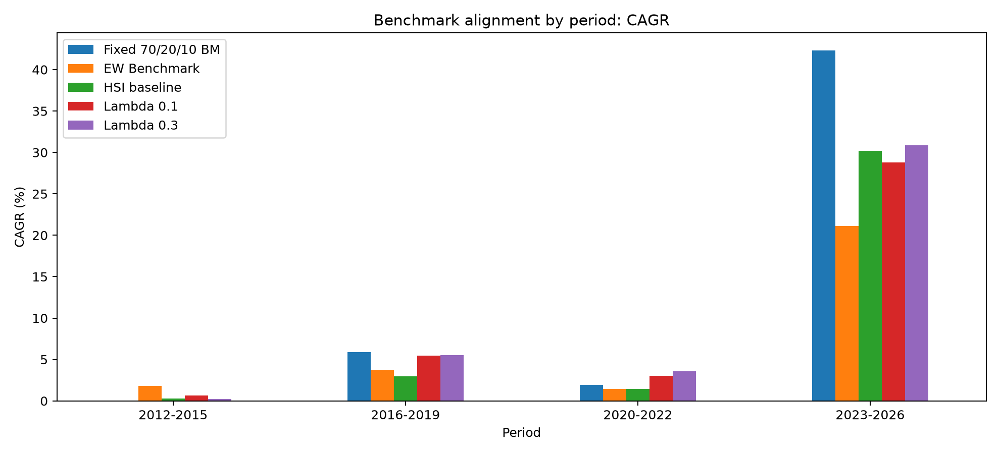
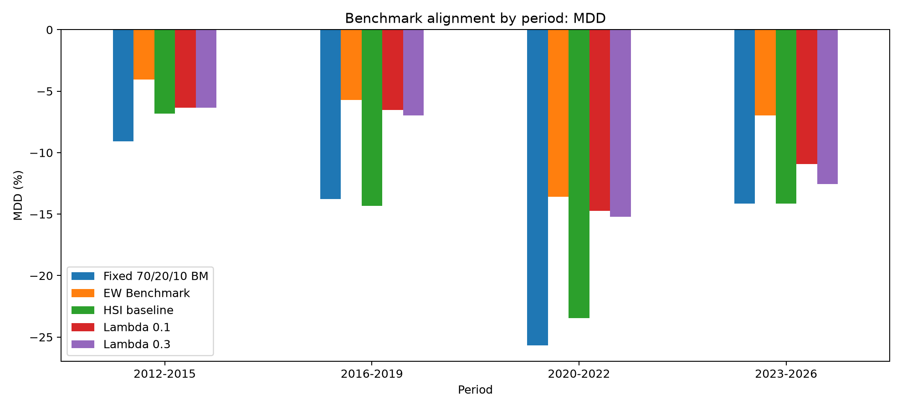
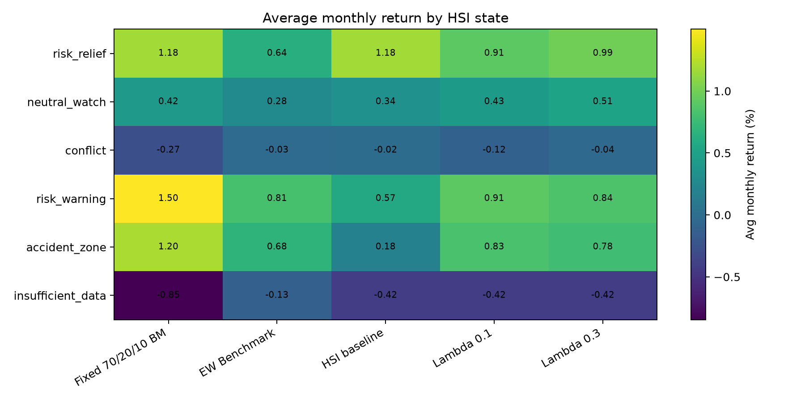

# 17_Benchmark_alignment

## 실험명
**17번 Benchmark alignment 실험: Fixed 70/20/10 BM과 EW Benchmark를 함께 둔 최종 비교 기준 정렬**

## 1. 실험 목적

이 실험의 목적은 기존 비교군에 **Fixed 70/20/10 BM**을 추가하여, 최종 후보인 **Lambda 0.1**과 **Lambda 0.3**이 어떤 기준 대비 강하고 약한지를 명확히 정리하는 것이다.

기존 16번 robustness 실험에서는 EW Benchmark, HSI baseline, Lambda 0.1, Lambda 0.3을 비교하였다. 그러나 RA 개발 보고서에서는 BM* 선정 이유가 중요하므로, 본 실험에서는 동일 ETF 유니버스를 전략적 기준비중으로 고정 보유하는 **Fixed 70/20/10 BM**을 메인 BM으로 추가하였다.

BM(설명: Benchmark의 약자이다. 전략 성과가 좋은지 나쁜지 판단하기 위한 비교 기준이다.)

---

## 2. 배경과 이유

본 프로젝트의 투자철학은 시장상태에 따라 주식형 ETF, 채권형 ETF, 단기채권형 ETF의 비중을 조절하는 방어형 ETF RoboAdvisor이다. 따라서 단순히 주가지수 하나와 비교하는 것보다, 같은 ETF 유니버스를 고정비중으로 보유했을 때와 비교하는 것이 전략의 효과를 더 잘 보여준다.

본 실험에서는 비교 기준을 네 층으로 나누었다.

| 구분 | 전략명 | 역할 |
|---|---|---|
| 메인 BM | Fixed 70/20/10 BM | 전략적 기준비중. 주식 70%, 국고채 20%, 단기채권 10% |
| 보조 BM | EW Benchmark | 동일 ETF 유니버스를 단순 동일비중으로 보유 |
| 내부 기준선 | HSI baseline | HSI 상태를 목표비중에 즉시 반영 |
| 최종 후보 | Lambda 0.1 / Lambda 0.3 | HSI 목표비중으로 천천히 이동하는 부분조정 후보 |

이 구분을 통해 전략 성과가 ETF 선택 자체에서 나온 것인지, HSI와 Lambda를 이용한 동적 비중조절에서 나온 것인지 분리해서 설명할 수 있다.

---

## 3. 사용 데이터

- ETF 월간 수익률 데이터: `main_final_monthly_return_decimal.csv`
- HSI 상태별 목표비중 데이터: `main_final_baseline_rebalance_weights.csv`
- 비교 전략 산출 데이터: `main_final_benchmark_alignment_strategy_timeseries.csv`
- 성과 요약표: `main_final_benchmark_alignment_summary.csv`
- 기간별 성과표: `main_final_benchmark_alignment_by_period.csv`
- HSI 상태별 성과표: `main_final_benchmark_alignment_by_hsi_state.csv`
- 큰 손실월 진단표: `main_final_benchmark_alignment_tail_event_summary.csv`

수익률 단위는 decimal 기준으로 계산한 뒤, 보고서 표에서는 % 단위로 표시하였다. 전략 적용 시점은 월말 신호를 다음 월 수익률에 적용하는 월간 리밸런싱 구조를 따른다.

---

## 4. 실험 방법

본 실험에서는 다음 5개 전략의 월별 수익률을 동일한 방식으로 계산하였다.

1. **Fixed 70/20/10 BM**  
   - 069500 KODEX 200: 70%  
   - 114260 KODEX 국고채3년: 20%  
   - 153130 KODEX 단기채권: 10%

2. **EW Benchmark**  
   - 세 ETF를 각각 1/3씩 보유한다.

3. **HSI baseline**  
   - HSI 5상태에 따라 산출된 목표비중으로 즉시 이동한다.

4. **Lambda 0.1**  
   - 이전 비중과 HSI 목표비중의 차이 중 10%만 반영한다.

5. **Lambda 0.3**  
   - 이전 비중과 HSI 목표비중의 차이 중 30%를 반영한다.

Lambda(설명: HSI 목표비중으로 한 번에 이동하지 않고, 이전 비중과 목표비중의 차이 중 일부만 반영하도록 조절하는 부분조정 계수이다.)

---

## 5. 주요 결과

### 5.1 전체 기간 성과 요약

| 전략 | CAGR(%) | 연환산 변동성(%) | MDD(%) | Sharpe | Calmar | WinRate(%) | 평균 Turnover(%) | 역할 |
| --- | --- | --- | --- | --- | --- | --- | --- | --- |
| Fixed 70/20/10 BM | 11.05 | 16.58 | -25.67 | 0.71 | 0.43 | 58.48 | 0.00 | benchmark |
| EW Benchmark | 6.59 | 7.99 | -13.57 | 0.83 | 0.49 | 60.82 | 0.00 | benchmark |
| HSI baseline | 7.83 | 13.70 | -23.46 | 0.61 | 0.33 | 65.50 | 22.02 | baseline |
| Lambda 0.1 | 8.69 | 11.35 | -14.74 | 0.79 | 0.59 | 59.65 | 2.46 | candidate |
| Lambda 0.3 | 9.15 | 12.10 | -15.22 | 0.78 | 0.60 | 60.82 | 6.89 | candidate |

전체 기간 기준으로 **Fixed 70/20/10 BM**은 CAGR 11.05%로 가장 높았지만, MDD는 -25.67%로 가장 컸다. 반면 **Lambda 0.1**과 **Lambda 0.3**은 CAGR은 각각 8.69%, 9.15%로 Fixed BM보다 낮았지만, MDD를 각각 -14.74%, -15.22% 수준으로 낮췄다. Calmar 역시 Lambda 0.1은 0.590, Lambda 0.3은 0.601로 Fixed BM의 0.431보다 높았다.

MDD(설명: Maximum Drawdown의 약자이다. 투자기간 중 고점 대비 최대 하락폭을 뜻한다.)  
Calmar(설명: CAGR을 절대 MDD로 나눈 지표이다. 낙폭 대비 수익성을 볼 때 사용한다.)  
Turnover(설명: 포트폴리오 비중이 얼마나 많이 바뀌었는지를 나타내는 회전율이다. 거래비용 부담과 연결된다.)

---

### 5.2 기간별 CAGR

기간별 CAGR을 보면 2023~2026년 강한 상승 구간에서 Fixed 70/20/10 BM이 가장 높은 성과를 보였다. 이는 주식형 ETF를 70% 고정 보유한 전략이 상승장에서 가장 큰 수익률을 얻을 수 있음을 의미한다. 반면 Lambda 후보는 HSI 상태 변화에 따라 위험자산 비중을 조절하므로 상승장에서 일부 수익을 포기할 수 있다.

---

### 5.3 기간별 MDD

기간별 MDD에서는 Lambda 후보의 장점이 더 명확하다. 특히 2020~2022년과 같이 시장 충격이 컸던 구간에서 Fixed 70/20/10 BM은 큰 낙폭을 보였지만, Lambda 0.1과 Lambda 0.3은 낙폭을 크게 완화하였다. 이는 Lambda 구조가 수익률을 극대화하기 위한 장치라기보다, 위험구간에서 손실폭을 줄이기 위한 실행 개선 장치임을 보여준다.

---

### 5.4 기간별 성과표

| 기간 | 전략 | CAGR(%) | MDD(%) | Sharpe | Calmar | 평균 Turnover(%) |
| --- | --- | --- | --- | --- | --- | --- |
| 2012-2015 | Fixed 70/20/10 BM | 0.02 | -9.07 | 0.04 | 0.00 | 0.00 |
| 2012-2015 | EW Benchmark | 1.78 | -4.04 | 0.48 | 0.44 | 0.00 |
| 2012-2015 | HSI baseline | 0.28 | -6.83 | 0.07 | 0.04 | 20.89 |
| 2012-2015 | Lambda 0.1 | 0.62 | -6.32 | 0.13 | 0.10 | 1.89 |
| 2012-2015 | Lambda 0.3 | 0.23 | -6.35 | 0.07 | 0.04 | 5.79 |
| 2016-2019 | Fixed 70/20/10 BM | 5.91 | -13.77 | 0.65 | 0.43 | 0.00 |
| 2016-2019 | EW Benchmark | 3.77 | -5.73 | 0.85 | 0.66 | 0.00 |
| 2016-2019 | HSI baseline | 2.99 | -14.34 | 0.47 | 0.21 | 23.85 |
| 2016-2019 | Lambda 0.1 | 5.45 | -6.54 | 0.94 | 0.83 | 2.43 |
| 2016-2019 | Lambda 0.3 | 5.54 | -6.99 | 0.90 | 0.79 | 6.79 |
| 2020-2022 | Fixed 70/20/10 BM | 1.94 | -25.67 | 0.19 | 0.08 | 0.00 |
| 2020-2022 | EW Benchmark | 1.41 | -13.57 | 0.21 | 0.10 | 0.00 |
| 2020-2022 | HSI baseline | 1.46 | -23.46 | 0.17 | 0.06 | 21.67 |
| 2020-2022 | Lambda 0.1 | 3.02 | -14.74 | 0.34 | 0.20 | 2.91 |
| 2020-2022 | Lambda 0.3 | 3.56 | -15.22 | 0.37 | 0.23 | 8.08 |
| 2023-2026 | Fixed 70/20/10 BM | 42.31 | -14.13 | 1.46 | 2.99 | 0.00 |
| 2023-2026 | EW Benchmark | 21.11 | -6.98 | 1.57 | 3.02 | 0.00 |
| 2023-2026 | HSI baseline | 30.18 | -14.13 | 1.25 | 2.14 | 21.43 |
| 2023-2026 | Lambda 0.1 | 28.80 | -10.91 | 1.43 | 2.64 | 2.71 |
| 2023-2026 | Lambda 0.3 | 30.89 | -12.55 | 1.43 | 2.46 | 7.15 |

---

### 5.5 HSI 상태별 평균 월수익률

| HSI 상태 | Fixed 70/20/10 BM | EW Benchmark | HSI baseline | Lambda 0.1 | Lambda 0.3 |
| --- | --- | --- | --- | --- | --- |
| risk_relief | 1.18 | 0.64 | 1.18 | 0.91 | 0.99 |
| neutral_watch | 0.42 | 0.28 | 0.34 | 0.43 | 0.51 |
| conflict | -0.27 | -0.03 | -0.02 | -0.12 | -0.04 |
| risk_warning | 1.50 | 0.81 | 0.57 | 0.91 | 0.84 |
| accident_zone | 1.20 | 0.68 | 0.18 | 0.83 | 0.78 |
| insufficient_data | -0.85 | -0.13 | -0.42 | -0.42 | -0.42 |

HSI 상태별 평균 월수익률을 보면, `risk_relief`와 같은 회복 또는 완화 상태에서는 주식 비중이 높은 Fixed 70/20/10 BM과 HSI baseline의 평균수익률이 높게 나타난다. 반면 Lambda 후보는 목표비중으로 천천히 이동하기 때문에 상승 또는 회복 구간에서 일부 수익을 놓칠 수 있다.

`accident_zone`에서도 Fixed BM의 평균 월수익률이 높게 나타나는 구간이 있다. 이는 HSI 상태가 반드시 해당 월의 실현수익률 하락만을 의미하는 것이 아니라, 가격 기반 위험상태를 분류한 결과이기 때문이다. 일부 사고상태 월은 이미 하락 후 반등이 시작된 달일 수 있다. 따라서 HSI 상태별 평균수익률은 단독으로 우열을 판단하기보다, MDD와 함께 해석해야 한다.

---

### 5.6 069500 하위 10% 손실월 진단

| 전략 | 손실월 수 | 평균 손실월 수익률(%) | 중앙 손실월 수익률(%) | 최악 월 수익률(%) | 평균 069500 비중(%) | 평균 Turnover(%) |
| --- | --- | --- | --- | --- | --- | --- |
| Fixed 70/20/10 BM | 18.00 | -5.86 | -5.20 | -14.13 | 70.00 | 0.00 |
| EW Benchmark | 18.00 | -2.75 | -2.27 | -6.98 | 33.33 | 0.00 |
| HSI baseline | 18.00 | -4.08 | -3.96 | -14.13 | 44.44 | 22.22 |
| Lambda 0.1 | 18.00 | -3.68 | -3.17 | -10.91 | 45.16 | 2.86 |
| Lambda 0.3 | 18.00 | -3.83 | -3.30 | -12.55 | 45.41 | 8.36 |

069500 하위 10% 손실월 기준으로 보면 Fixed 70/20/10 BM의 평균 손실월 수익률은 -5.86%였다. Lambda 0.1과 Lambda 0.3은 각각 -3.68%, -3.83%로 손실폭을 줄였다. EW Benchmark는 주식 비중이 낮아 손실폭이 가장 작았지만, 이는 동적 신호 효과라기보다 낮은 위험자산 비중의 결과로 해석된다.

---

## 6. 성과 귀인과 해석

17번 실험의 핵심은 Lambda 후보가 Fixed 70/20/10 BM보다 수익률이 높다는 것이 아니다. 오히려 Fixed BM은 전체 CAGR이 가장 높았다. 그러나 그 대가로 MDD가 가장 크게 나타났다.

따라서 본 실험의 해석은 다음과 같다.

1. **Fixed 70/20/10 BM은 수익률 극대화형 기준선이다.**  
   주식형 ETF 70%를 고정 보유하기 때문에 상승장에서 가장 강하지만, 하락구간에서는 낙폭이 크다.

2. **EW Benchmark는 안정적인 단순분산 기준선이다.**  
   주식형 ETF 비중이 약 33.3%로 낮기 때문에 MDD와 Sharpe 측면에서 강하다. 다만 수익률은 낮다.

3. **HSI baseline은 내부 기준선이다.**  
   HSI 상태를 목표비중에 즉시 반영하기 때문에 Turnover가 높고, MDD 부담도 크다. 따라서 최종 후보라기보다 HSI 상태분류가 비중으로 연결될 수 있음을 보여주는 기준선으로 해석한다.

4. **Lambda 0.1은 저회전·방어형 후보이다.**  
   Fixed BM 대비 CAGR은 낮지만 MDD와 큰 손실월 평균 손실을 줄였고, 평균 Turnover도 낮다.

5. **Lambda 0.3은 균형형 후보이다.**  
   Lambda 0.1보다 CAGR과 Calmar가 높지만, Turnover와 MDD는 조금 더 크다. 따라서 반응성과 수익성의 균형 후보로 해석한다.

---

## 7. 판단 보조 메모

| 판단 항목 | 판단 내용 | 값 |
| --- | --- | --- |
| overall_calmar | 전체 기간 Calmar 기준 우위 Lambda 후보는 Lambda 0.3입니다. | 0.601 |
| overall_turnover | 전체 기간 평균 Turnover가 낮은 Lambda 후보는 Lambda 0.1입니다. | 2.455 |
| overall_cagr | 전체 기간 CAGR이 높은 Lambda 후보는 Lambda 0.3입니다. | 9.148 |
| vs_fixed_bm_Lambda 0.1 | Lambda 0.1는 Fixed 70/20/10 BM 대비 CAGR -2.362%p, MDD 10.930%p, Calmar 0.159 차이를 보입니다. | -2.362 |
| vs_fixed_bm_Lambda 0.3 | Lambda 0.3는 Fixed 70/20/10 BM 대비 CAGR -1.907%p, MDD 10.455%p, Calmar 0.170 차이를 보입니다. | -1.907 |
| period_mdd_count | 기간별 abs MDD 기준 Lambda 우위 횟수: Lambda 0.1=4 |  |
| tail_event_avg_return | 069500 하위 10% 손실월 평균 수익률이 가장 나은 Lambda 후보는 Lambda 0.1입니다. | -3.685 |

---

## 8. 한계와 다음 판단

본 실험은 BM 정렬을 위한 비교 실험이므로, 특정 전략의 절대적 우월성을 주장하기 위한 실험은 아니다. Fixed 70/20/10 BM은 상승장에서 강하고, EW Benchmark는 안정성이 높으며, Lambda 후보는 낙폭 대비 성과와 운용 안정성에서 장점을 보였다. 따라서 최종 보고서에서는 전략을 단일 우승 후보로 제시하기보다, 투자 목적에 따라 역할을 구분하는 것이 적절하다.

최종 판단은 다음과 같이 정리한다.

| 전략 | 최종 해석 |
|---|---|
| Fixed 70/20/10 BM | 메인 BM. 상승장에서 강하지만 MDD가 큼 |
| EW Benchmark | 보조 BM. 안정적인 단순분산 기준 |
| HSI baseline | 내부 기준선. HSI 즉시 반영의 한계 확인 |
| Lambda 0.1 | 저회전·방어형 후보 |
| Lambda 0.3 | 수익성·Calmar 균형형 후보 |

---

# 별도 첨부 1. 입출력 구조표

| 구분 | 파일명 | 역할 | 주요 컬럼 | 시점 기준 | 단위 |
|---|---|---|---|---|---|
| 입력 | `main_final_monthly_return_decimal.csv` | ETF 월간 수익률 | `year_month`, `069500`, `114260`, `153130` | 월별 | decimal |
| 입력 | `main_final_baseline_rebalance_weights.csv` | HSI 상태별 목표비중 및 기준 정보 | `year_month`, `hsi_state`, ETF별 목표비중 | 월말 신호 | weight |
| 출력 | `main_final_benchmark_alignment_strategy_timeseries.csv` | 5개 전략 월별 수익률 재구성 결과 | `strategy_name`, `portfolio_return`, ETF별 비중 | 월별 | decimal / weight |
| 출력 | `main_final_benchmark_alignment_summary.csv` | 전체 기간 성과 요약 | CAGR, MDD, Sharpe, Calmar, Turnover | 전체기간 | % / ratio |
| 출력 | `main_final_benchmark_alignment_by_period.csv` | 기간별 robustness 결과 | period, strategy_name, CAGR, MDD, Turnover | 구간별 | % / ratio |
| 출력 | `main_final_benchmark_alignment_by_hsi_state.csv` | HSI 상태별 조건부 진단 | hsi_state, avg_monthly_return, MDD | HSI 상태별 | % |
| 출력 | `main_final_benchmark_alignment_tail_event_summary.csv` | 069500 하위 10% 손실월 진단 | tail_months, avg_tail_return, avg_weight_069500 | 손실월 기준 | % |
| 출력 | `main_final_benchmark_alignment_decision_note.csv` | 판단 보조 메모 | topic, finding, value | 요약 | text / numeric |
| 출력 | `main_final_benchmark_alignment_period_cagr.png` | 기간별 CAGR 그림 | period, strategy | 구간별 | % |
| 출력 | `main_final_benchmark_alignment_period_mdd.png` | 기간별 MDD 그림 | period, strategy | 구간별 | % |
| 출력 | `main_final_benchmark_alignment_state_avg_return_heatmap.png` | HSI 상태별 평균 월수익률 heatmap | hsi_state, strategy | 상태별 | % |

---

# 별도 첨부 2. 입출력 데이터 분류표

| 데이터 분류 | 파일명 | 설명 | 최종 전략 사용 여부 | 보고서 사용 위치 |
|---|---|---|---|---|
| processed | `main_final_monthly_return_decimal.csv` | ETF 월간 수익률 계산용 데이터 | 사용 | 백테스트 수익률 계산 |
| processed | `main_final_baseline_rebalance_weights.csv` | HSI 상태와 목표비중 데이터 | 사용 | HSI baseline 및 Lambda 비중 계산 |
| model_output | `main_final_benchmark_alignment_strategy_timeseries.csv` | 전략별 월별 수익률과 비중 결과 | 사용 | 성과 계산 원천 |
| report_output | `main_final_benchmark_alignment_summary.csv` | 전체 기간 성과표 | 사용 | 본문 표 |
| report_output | `main_final_benchmark_alignment_by_period.csv` | 기간별 성과표 | 사용 | robustness 설명 |
| report_output | `main_final_benchmark_alignment_by_hsi_state.csv` | HSI 상태별 성과표 | 사용 | 상태별 해석 |
| report_output | `main_final_benchmark_alignment_tail_event_summary.csv` | 큰 손실월 진단표 | 사용 | 방어력 설명 |
| report_output | `main_final_benchmark_alignment_decision_note.csv` | 자동 판단 보조표 | 참고 | 결론 보조 |
| report_output | `main_final_benchmark_alignment_period_cagr.png` | 기간별 CAGR 그림 | 사용 | 시각자료 |
| report_output | `main_final_benchmark_alignment_period_mdd.png` | 기간별 MDD 그림 | 사용 | 시각자료 |
| report_output | `main_final_benchmark_alignment_state_avg_return_heatmap.png` | HSI 상태별 평균 월수익률 그림 | 사용 | 시각자료 |

---

# 별도 첨부 3. 보고서용 최종 요약 문장

17번 Benchmark alignment 실험에서는 메인 BM인 Fixed 70/20/10 BM, 보조 BM인 EW Benchmark, 내부 기준선인 HSI baseline, 그리고 최종 후보인 Lambda 0.1과 Lambda 0.3을 동일한 월별 수익률 기준으로 비교하였다. Fixed 70/20/10 BM은 전체 CAGR 11.05%로 가장 높았지만 MDD가 -25.67%로 컸다. 반면 Lambda 0.1과 Lambda 0.3은 각각 CAGR 8.69%, 9.15%로 Fixed BM보다 낮았으나, MDD를 -14.74%, -15.22% 수준으로 낮추고 Calmar를 0.590, 0.601로 개선하였다. 이는 HSI-Lambda 전략이 수익률 극대화 전략이라기보다, 위험자산 노출을 조절하여 낙폭 대비 성과를 개선하는 방어형 ETF RA 구조임을 보여준다.
