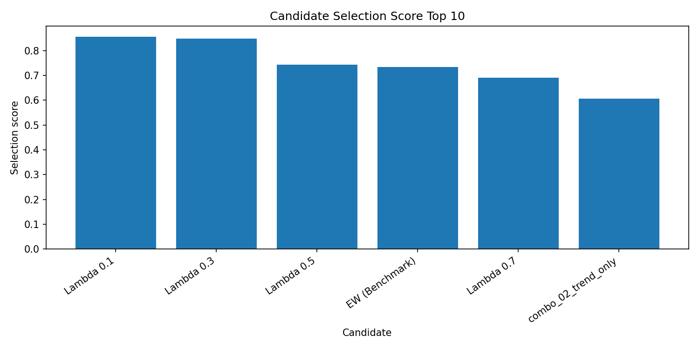
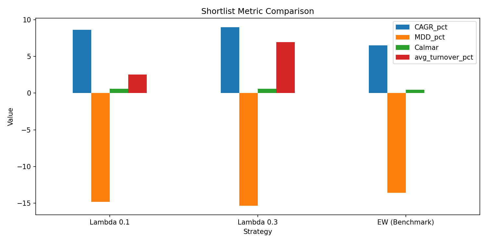
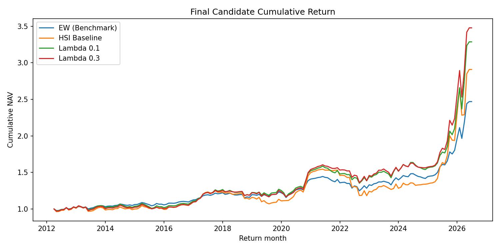
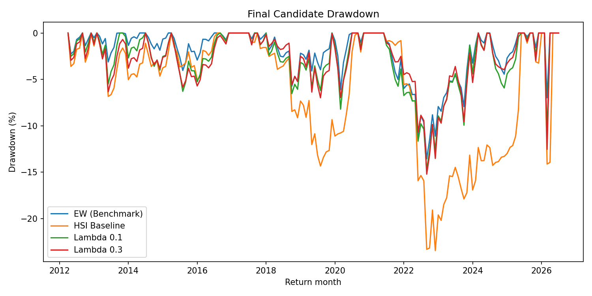
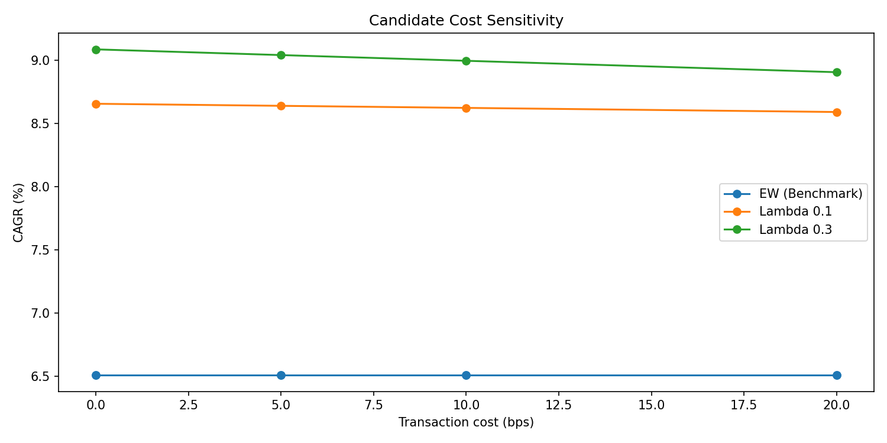

# 20_23_Final_candidate_selection

## 실험명
**20~23번 Final candidate selection: 거래비용·Turnover·위험조정 성과를 반영한 최종 후보 선정**

## 1. 실험 목적

이 보고서는 20번, 21번, 23번 계열의 후보 선정 산출물을 하나로 묶어 최종 후보를 정리한다. 목적은 HSI baseline, event balance filter, signal combo, theta, lambda 등 여러 실험 계열에서 나온 후보들을 같은 기준으로 비교하고, 최종 보고서에 제시할 후보를 압축하는 것이다.

최종 후보 선정에서 사용한 핵심 기준은 다음과 같다.

| 기준 | 의미 |
|---|---|
| CAGR | 장기 성장성 |
| MDD | 최대 낙폭 관리 |
| Sharpe | 변동성 대비 수익 |
| Calmar | 낙폭 대비 수익 |
| Turnover | 운용 가능성과 거래비용 부담 |
| 비용 민감도 | 거래비용이 들어가도 후보가 유지되는지 |
| robustness proxy | 여러 실험 계열에서 안정적으로 후보 성격이 유지되는지 |

CAGR(설명: 연평균 복리수익률이다. 전체 기간 동안 연평균 어느 정도 성장했는지 보여준다.)  
MDD(설명: Maximum Drawdown의 약자이다. 투자기간 중 고점 대비 최대 하락폭을 뜻한다.)  
Turnover(설명: 포트폴리오 비중이 얼마나 많이 바뀌었는지를 나타내는 회전율이다. 거래비용 부담과 연결된다.)

---

## 2. 배경과 이유

앞선 실험에서 HSI baseline은 시장상태를 ETF 비중으로 연결할 수 있음을 보여주었지만, 목표비중으로 즉시 이동하기 때문에 MDD와 Turnover 부담이 컸다. Event balance, signal combo, theta, macro companion도 각각 보조 진단 또는 민감도 실험으로 검토되었다.

그러나 최종 후보는 단순히 CAGR이 높은 전략이 아니라, 실제 운용 가능성을 고려해야 한다. 따라서 20~23번에서는 거래비용과 Turnover를 반영하고, MDD·Sharpe·Calmar 등 위험조정 성과를 함께 비교하여 후보를 압축하였다.

---

## 3. 사용 데이터

후보 선정에는 다음 원천 파일들이 사용되었다.

| 원천 파일 | 계열 | 행 수 | 포함 전략 | 상태 | 비고 |
| --- | --- | --- | --- | --- | --- |
| main_final_baseline_backtest_timeseries.csv | baseline | 344 | EW, HSI_final_baseline_overlay | OK | 최종 후보 선정 입력으로 사용 |
| main_final_event_balance_filter_backtest_timeseries.csv | event_balance_filter | 516 | EW, HSI_event_balance_filter_overlay, HSI_final_baseline_overlay | OK | 최종 후보 선정 입력으로 사용 |
| main_final_lambda_backtest_timeseries.csv | lambda | 1032 | EW, lambda_0.1, lambda_0.3, lambda_0.5, lambda_0.7, lambda_1.0 | OK | 최종 후보 선정 입력으로 사용 |
| main_final_signal_combo_backtest_timeseries.csv | signal_combo | 1032 | EW, combo_00_core5, combo_01_core4_no_rs, combo_02_trend_only, combo_03_risk_damage_focus, combo_04_core5_plus_relative_speed | OK | 최종 후보 선정 입력으로 사용 |
| main_final_theta_backtest_timeseries.csv | theta | 1032 | EW, theta_0.10, theta_0.15, theta_0.20, theta_0.25, theta_0.30 | OK | 최종 후보 선정 입력으로 사용 |

각 원천 파일은 baseline, event balance filter, lambda, signal combo, theta 계열의 월별 백테스트 결과를 담고 있다. 이 파일들을 하나의 후보군으로 모은 뒤, 비용 민감도와 Turnover 필터를 적용해 최종 후보를 판정하였다.

---

## 4. 후보 선정 절차

후보 선정 절차는 다음과 같이 정리할 수 있다.

```text
각 실험 계열의 월별 백테스트 결과 수집
→ 동일 기간·동일 성과지표 기준으로 정렬
→ 거래비용 10bp 기준 성과 계산
→ Turnover 필터 적용
→ MDD, Sharpe, Calmar 기준 확인
→ 비용 민감도 확인
→ selection_score 산출
→ final_candidate / benchmark / exclude로 구분
```

여기서 `final_candidate`는 최종 보고서의 전략 후보이고, `benchmark`는 비교 기준이다. `exclude_turnover` 또는 `exclude_risk_metric`은 후보군에서 제외된 이유를 표시한다.

[선택 점수 placeholder] 최종 코드 설명서에서는 `selection_score`가 어떤 항목을 가중해 계산되는지 코드 기준으로 별도 정리한다.

---

## 5. 후보 판정 분포

| 최종 판정 | 개수 |
| --- | --- |
| exclude_turnover | 15 |
| benchmark | 5 |
| final_candidate | 2 |
| exclude_risk_metric | 1 |

최종 후보 판정 결과, `final_candidate`는 Lambda 0.1과 Lambda 0.3이다. EW는 benchmark로 남고, 나머지 후보들은 Turnover 또는 위험지표 기준에서 제외되었다.

---

## 6. 최종 shortlist

| 보고서 전략명 | 계열 | 10bp 반영 CAGR(%) | MDD(%) | Sharpe | Calmar | 평균 Turnover(%) | 20bp CAGR(%) | 20bp 비용 drag(%p) | 선택 점수 | 최종 판정 | 판정 이유 |
| --- | --- | --- | --- | --- | --- | --- | --- | --- | --- | --- | --- |
| Lambda 0.1 | lambda | 8.623 | -14.788 | 0.791 | 0.583 | 2.515 | 8.590 | 0.065 | 0.856 | final_candidate | Turnover, 비용, MDD, Sharpe, Calmar, robustness proxy를 통과함 |
| Lambda 0.3 | lambda | 8.995 | -15.335 | 0.775 | 0.587 | 6.950 | 8.905 | 0.181 | 0.849 | final_candidate | Turnover, 비용, MDD, Sharpe, Calmar, robustness proxy를 통과함 |
| EW (Benchmark) | baseline | 6.510 | -13.571 | 0.832 | 0.480 | 0.000 | 6.510 | 0.000 | 0.733 | benchmark | 동일가중 비교 기준 |

10bp 거래비용을 반영한 최종 shortlist에서는 Lambda 0.1과 Lambda 0.3이 최종 후보로 남았다. EW Benchmark는 후보가 아니라 비교 기준이다.

- **Lambda 0.1**은 평균 Turnover가 낮고, 비용 민감도도 작아 저회전·보수형 후보로 해석된다.
- **Lambda 0.3**은 Lambda 0.1보다 CAGR과 Calmar가 높아 수익성·Calmar 균형형 후보로 해석된다.
- **EW Benchmark**는 Sharpe와 MDD가 강한 단순 비교 기준이므로, 최종 후보와 함께 반드시 제시한다.

---

## 7. 발표용 shortlist와 내부 기준선

| 순위 | 전략 | 계열 | 발표 역할 | CAGR(%) | MDD(%) | Sharpe | Calmar | 평균 Turnover(%) | 판단 | 메모 |
| --- | --- | --- | --- | --- | --- | --- | --- | --- | --- | --- |
| 1.000 | HSI_final_baseline_overlay | baseline | 즉시비중 baseline | 7.732 | -23.459 | 0.611 | 0.330 | 22.093 | reference | HSI 상태를 비중으로 연결하는 기준선이지만, 즉시비중 구조로 인해 MDD와 Turnover 부담이 커 최종 전략으로 단정하지 않는다. |
| 2.000 | EW | benchmark | 단순 비교 기준 | 6.510 | -13.571 | 0.832 | 0.480 | 0.000 | reference | 단순 동일가중 비교 기준이다. |
| 3.000 | lambda_0.1 | lambda_partial_adjustment | 느린 부분조정 후보 | 8.655 | -14.744 | 0.793 | 0.587 | 2.515 | primary_review_candidate | MDD와 Turnover 완화가 강한 느린 조정 후보이다. 수익성 둔화 여부를 함께 본다. |
| 4.000 | lambda_0.3 | lambda_partial_adjustment | 균형형 부분조정 후보 | 9.085 | -15.220 | 0.782 | 0.597 | 6.950 | primary_review_candidate | CAGR, MDD, Turnover 균형이 비교적 좋아 우선 검토 후보로 둔다. 최적값으로 단정하지 않는다. |
| 5.000 | lambda_0.5 | lambda_partial_adjustment | 중간 부분조정 후보 | 8.577 | -17.519 | 0.735 | 0.490 | 11.138 | secondary_review_candidate | 즉시비중과 느린 조정 사이의 중간 후보이다. |
| 6.000 | HSI_event_balance_filter_overlay | event_balance_filter | 사건균형 보조 필터 | 7.137 | -23.036 | 0.600 | 0.310 | 21.919 | diagnostic_filter_candidate | 사건균형 필터는 실제 작동했으나 개선 폭이 제한적이므로 진단·보조 후보로 해석한다. |

23번 발표용 shortlist에는 HSI baseline, EW Benchmark, Lambda 후보, Event balance filter 등이 함께 정리되어 있다. 이 표는 최종 후보만 보여주는 것이 아니라, 프로젝트 흐름상 어떤 전략이 기준선이고 어떤 전략이 보조 진단인지 설명하기 위한 표이다.

여기서 HSI baseline은 즉시비중 기준선이고, Event balance filter는 해석 보조 필터이며, Lambda 0.1과 Lambda 0.3이 실제 최종 후보이다.

---

## 8. 후보 비교 상위표

| 보고서 전략명 | 계열 | 10bp 반영 CAGR(%) | MDD(%) | Sharpe | Calmar | 평균 Turnover(%) | 최대 Turnover(%) | 20bp 비용 drag(%p) | 선택 점수 | 최종 판정 |
| --- | --- | --- | --- | --- | --- | --- | --- | --- | --- | --- |
| Lambda 0.1 | lambda | 8.623 | -14.788 | 0.791 | 0.583 | 2.515 | 6.017 | 0.065 | 0.856 | final_candidate |
| Lambda 0.3 | lambda | 8.995 | -15.335 | 0.775 | 0.587 | 6.950 | 20.012 | 0.181 | 0.849 | final_candidate |
| Lambda 0.5 | lambda | 8.433 | -17.688 | 0.724 | 0.477 | 11.138 | 34.830 | 0.288 | 0.743 | exclude_risk_metric |
| EW (Benchmark) | theta | 6.510 | -13.571 | 0.832 | 0.480 | 0.000 | 0.000 | 0.000 | 0.733 | benchmark |
| EW (Benchmark) | signal_combo | 6.510 | -13.571 | 0.832 | 0.480 | 0.000 | 0.000 | 0.000 | 0.733 | benchmark |
| EW (Benchmark) | lambda | 6.510 | -13.571 | 0.832 | 0.480 | 0.000 | 0.000 | 0.000 | 0.733 | benchmark |
| EW (Benchmark) | event_balance_filter | 6.510 | -13.571 | 0.832 | 0.480 | 0.000 | 0.000 | 0.000 | 0.733 | benchmark |
| EW (Benchmark) | baseline | 6.510 | -13.571 | 0.832 | 0.480 | 0.000 | 0.000 | 0.000 | 0.733 | benchmark |
| Lambda 0.7 | lambda | 7.867 | -20.189 | 0.667 | 0.390 | 15.406 | 48.990 | 0.396 | 0.690 | exclude_turnover |
| combo_02_trend_only | signal_combo | 8.279 | -21.272 | 0.650 | 0.389 | 20.669 | 70.000 | 0.531 | 0.607 | exclude_turnover |
| Theta 0.30 | theta | 7.521 | -21.179 | 0.624 | 0.355 | 16.919 | 70.000 | 0.432 | 0.591 | exclude_turnover |
| combo_04_core5_plus_relative_speed | signal_combo | 7.430 | -20.257 | 0.600 | 0.367 | 21.017 | 70.000 | 0.536 | 0.523 | exclude_turnover |

후보 비교표를 보면 Lambda 0.1과 Lambda 0.3은 selection_score 기준으로 가장 높은 위치에 있다. Lambda 0.5는 성과 자체는 나쁘지 않지만 MDD와 위험조정지표가 약해지고, Lambda 0.7 이상과 HSI baseline은 Turnover 부담이 커서 제외된다.

---

## 9. Turnover 필터 결과

| 전략 | 계열 | 10bp 반영 CAGR(%) | MDD(%) | Sharpe | Calmar | 평균 Turnover(%) | 최대 Turnover(%) | Turnover 필터 |
| --- | --- | --- | --- | --- | --- | --- | --- | --- |
| EW | baseline | 6.510 | -13.571 | 0.832 | 0.480 | 0.000 | 0.000 | strict_pass |
| HSI_final_baseline_overlay | baseline | 7.450 | -23.862 | 0.592 | 0.312 | 22.093 | 70.000 | fail |
| EW | event_balance_filter | 6.510 | -13.571 | 0.832 | 0.480 | 0.000 | 0.000 | strict_pass |
| HSI_event_balance_filter_overlay | event_balance_filter | 6.858 | -23.426 | 0.580 | 0.293 | 21.919 | 75.000 | fail |
| HSI_final_baseline_overlay | event_balance_filter | 7.450 | -23.862 | 0.592 | 0.312 | 22.093 | 70.000 | fail |
| EW | lambda | 6.510 | -13.571 | 0.832 | 0.480 | 0.000 | 0.000 | strict_pass |
| lambda_0.1 | lambda | 8.623 | -14.788 | 0.791 | 0.583 | 2.515 | 6.017 | strict_pass |
| lambda_0.3 | lambda | 8.995 | -15.335 | 0.775 | 0.587 | 6.950 | 20.012 | strict_pass |
| lambda_0.5 | lambda | 8.433 | -17.688 | 0.724 | 0.477 | 11.138 | 34.830 | flex_pass |
| lambda_0.7 | lambda | 7.867 | -20.189 | 0.667 | 0.390 | 15.406 | 48.990 | fail |
| lambda_1.0 | lambda | 7.450 | -23.862 | 0.592 | 0.312 | 22.093 | 70.000 | fail |
| EW | signal_combo | 6.510 | -13.571 | 0.832 | 0.480 | 0.000 | 0.000 | strict_pass |

Turnover 필터는 최종 후보 선정에서 매우 중요한 역할을 했다. HSI baseline, theta 후보, signal combo 후보 중 일부는 CAGR이 나쁘지 않더라도 평균 Turnover 또는 최대 Turnover가 높아 최종 후보에서 제외되었다. 이는 본 프로젝트가 단순 성과표가 아니라 실제 ETF 리밸런싱 가능성을 고려했음을 보여준다.

---

## 10. 선택 점수 상위 10개 후보



선택 점수 기준으로도 Lambda 0.1과 Lambda 0.3이 가장 앞선다. 다만 이 점수는 최종 우열을 단정하기 위한 절대 점수가 아니라, 후보 압축을 위한 보조 기준으로 사용한다.

---

## 11. 최종 후보 성과 비교



최종 후보 비교에서 Lambda 0.1은 낮은 Turnover와 안정성, Lambda 0.3은 높은 CAGR과 Calmar가 장점이다. EW Benchmark는 Turnover가 없고 Sharpe가 높지만, CAGR과 Calmar는 Lambda 후보보다 낮다.

---

## 12. 최종 후보 누적수익률



누적수익률 경로를 보면 Lambda 0.1과 Lambda 0.3은 EW Benchmark보다 높은 장기 성장 경로를 보인다. HSI baseline은 상태분류를 즉시 비중으로 연결한 기준선이지만, Turnover와 MDD 부담 때문에 최종 후보가 아니라 내부 기준선으로 해석한다.

---

## 13. 최종 후보 Drawdown



Drawdown 경로에서는 EW Benchmark가 안정적인 구간도 있지만, Lambda 후보들은 HSI baseline의 큰 낙폭을 완화하면서 더 높은 CAGR과 Calmar를 보였다. 따라서 최종 후보는 단일 우승 전략이 아니라, 투자 성향별로 나뉘는 두 후보로 제시하는 것이 적절하다.

---

## 14. 거래비용 민감도

| 계열 | 전략 | 0bp CAGR(%) | 5bp CAGR(%) | 10bp CAGR(%) | 20bp CAGR(%) |
| --- | --- | --- | --- | --- | --- |
| baseline | EW (Benchmark) | 6.510 | 6.510 | 6.510 | 6.510 |
| lambda | EW (Benchmark) | 6.510 | 6.510 | 6.510 | 6.510 |
| lambda | Lambda 0.1 | 8.655 | 8.639 | 8.623 | 8.590 |
| lambda | Lambda 0.3 | 9.085 | 9.040 | 8.995 | 8.905 |



거래비용 민감도에서는 Lambda 0.1이 Lambda 0.3보다 비용 drag가 작다. Lambda 0.3은 더 높은 CAGR을 보이지만 Turnover가 더 높아 비용 증가에 더 민감하다. 따라서 Lambda 0.1은 보수형 후보, Lambda 0.3은 균형형 후보로 해석한다.

---

## 15. 최종 판단

최종 판단은 다음과 같다.

| 전략 | 최종 역할 |
|---|---|
| EW Benchmark | 단순 비교 기준. Sharpe와 MDD가 강함 |
| HSI baseline | 내부 기준선. HSI 즉시 반영의 한계 확인 |
| Lambda 0.1 | 저회전·보수형 최종 후보 |
| Lambda 0.3 | 수익성·Calmar 균형형 최종 후보 |
| Event balance filter | 해석 보조에는 유용하지만 최종 후보는 아님 |
| Theta 후보 | 상태분류 민감도 검토용 보조 실험 |
| Macro companion | 최종 후보가 아니라 보조 진단 layer |
| Signal combo | 신호 조합 진단용 보조 실험 |

---

## 16. 성과 귀인과 해석

20~23번 후보 선정에서 가장 중요한 결론은 HSI 상태분류 자체만으로는 충분하지 않았다는 점이다. HSI baseline은 시장상태를 ETF 목표비중으로 연결하는 기준선 역할을 했지만, 즉시 이동 구조 때문에 Turnover와 MDD 부담이 컸다.

반면 Lambda 부분조정은 HSI 상태분류를 바꾸지 않고, 목표비중으로 이동하는 속도만 완화하였다. 이 단순한 실행 구조가 Turnover와 MDD를 낮추면서도 EW보다 높은 CAGR과 Calmar를 유지했다. 따라서 본 프로젝트의 핵심 개선 요인은 새로운 신호를 계속 추가한 것이 아니라, HSI 상태가 실제 ETF 비중으로 반영되는 속도를 조절한 데 있다.

---

## 17. 한계와 다음 판단

본 후보 선정은 과거 백테스트 결과에 기반한 실험이며, 실제 운용 성과를 보장하지 않는다. 또한 비용 민감도는 단순화된 거래비용 가정을 사용하므로 실제 시장 체결비용, 세금, 슬리피지까지 완전히 반영한 것은 아니다.

그럼에도 불구하고 본 실험은 최종 후보를 다음과 같이 정리한다.

| 후보 | 최종 해석 |
|---|---|
| Lambda 0.1 | 낮은 Turnover와 비용 민감도에 강한 저회전·보수형 후보 |
| Lambda 0.3 | 더 높은 CAGR과 Calmar를 보이는 수익성·균형형 후보 |

[최종 발표 placeholder] 발표에서는 “최종 단일 우승 전략”이 아니라 “투자 성향별 두 후보”로 제시한다. 보수형 투자자에게는 Lambda 0.1, 수익성과 반응성을 조금 더 원하는 투자자에게는 Lambda 0.3을 제시하는 구성이 적절하다.

---

# 별도 첨부 1. 입출력 구조표

| 구분 | 파일명 | 역할 | 주요 컬럼 | 시점 기준 | 단위 |
|---|---|---|---|---|---|
| 입력 | `main_final_baseline_backtest_timeseries.csv` | EW와 HSI baseline 월별 결과 | strategy_return, turnover, cumulative_return | 월별 | decimal / weight |
| 입력 | `main_final_event_balance_filter_backtest_timeseries.csv` | Event balance filter 후보 결과 | strategy_name, event_adjustment, return | 월별 | decimal |
| 입력 | `main_final_lambda_backtest_timeseries.csv` | Lambda 후보 월별 결과 | lambda_value, strategy_return, turnover | 월별 | decimal / weight |
| 입력 | `main_final_signal_combo_backtest_timeseries.csv` | 신호 조합 후보 결과 | combo_id, combo_name, return | 월별 | decimal |
| 입력 | `main_final_theta_backtest_timeseries.csv` | Theta 후보 월별 결과 | theta_common, strategy_return, turnover | 월별 | decimal |
| 출력 | `main_final_candidate_final_judgement.csv` | 최종 후보 판정표 | final_decision, selection_score, decision_reason | 전체기간 | text / score |
| 출력 | `main_final_report_candidate_shortlist.csv` | 최종 shortlist | Lambda 0.1, Lambda 0.3, EW | 전체기간 | % / ratio |
| 출력 | `main_final_report_candidate_comparison_table.csv` | 후보 비교표 | CAGR, MDD, Sharpe, Calmar, Turnover | 전체기간 | % / ratio |
| 출력 | `main_final_candidate_turnover_filtered.csv` | Turnover 필터 결과 | turnover_filter_status | 전체기간 | % |
| 출력 | `main_final_report_candidate_cost_pivot.csv` | 비용 민감도 요약 | cost_0bp, cost_5bp, cost_10bp, cost_20bp | 비용 가정별 | CAGR % |
| 출력 | `main_final_candidate_source_inventory.csv` | 후보 원천 파일 목록 | source_file, source_type, strategies | 요약 | text |
| 출력 | `main_final_candidate_selection_score_top10.png` | 선택 점수 상위 후보 그림 | selection_score | 전체기간 | score |
| 출력 | `main_final_candidate_shortlist_metric_comparison.png` | 최종 후보 지표 비교 그림 | CAGR, MDD, Calmar, Turnover | 전체기간 | % / ratio |
| 출력 | `main_final_candidate_cumulative_return_selected.png` | 최종 후보 누적수익률 그림 | cumulative NAV | 월별 | cumulative |
| 출력 | `main_final_candidate_drawdown_selected.png` | 최종 후보 drawdown 그림 | drawdown | 월별 | % |
| 출력 | `main_final_candidate_cost_sensitivity.png` | 비용 민감도 그림 | cost bps, CAGR | 비용 가정별 | % |

---

# 별도 첨부 2. 입출력 데이터 분류표

| 데이터 분류 | 파일명 | 설명 | 최종 전략 사용 여부 | 보고서 사용 위치 |
|---|---|---|---|---|
| processed/model_output | baseline/lambda/theta/signal/event backtest timeseries | 후보 선정 원천 월별 결과 | 사용 | 후보 통합 |
| report_output | `main_final_candidate_final_judgement.csv` | 최종 후보 판정표 | 사용 | 본문 핵심 |
| report_output | `main_final_report_candidate_shortlist.csv` | 최종 shortlist | 사용 | 본문 핵심 |
| report_output | `main_final_report_candidate_comparison_table.csv` | 후보 비교표 | 사용 | 후보 비교 |
| report_output | `main_final_candidate_turnover_filtered.csv` | Turnover 필터 결과 | 사용 | 제외 사유 |
| report_output | `main_final_report_candidate_cost_pivot.csv` | 비용 민감도 요약 | 사용 | 비용 해석 |
| report_output | `main_final_candidate_source_inventory.csv` | 원천 파일 목록 | 참고 | 부록 |
| report_output | `main_final_report_candidate_timeseries_subset.csv` | 최종 후보 시계열 subset | 사용 | 누적수익률·drawdown 그림 |

---

# 별도 첨부 3. 보고서용 최종 요약 문장

20~23번 최종 후보 선정에서는 baseline, event balance filter, lambda, signal combo, theta 계열 후보를 같은 기준으로 모아 거래비용, Turnover, MDD, Sharpe, Calmar, 비용 민감도를 함께 비교하였다. 그 결과 Lambda 0.1과 Lambda 0.3이 최종 후보로 남았다. Lambda 0.1은 낮은 Turnover와 비용 민감도에 강한 저회전·보수형 후보이고, Lambda 0.3은 더 높은 CAGR과 Calmar를 보이는 수익성·균형형 후보이다. EW Benchmark는 Sharpe와 MDD 측면에서 여전히 강한 비교 기준이므로, 최종 보고서에서는 HSI-Lambda 후보의 절대적 우월성을 주장하기보다 투자 목적에 따라 두 후보의 성격을 구분하여 제시한다.
