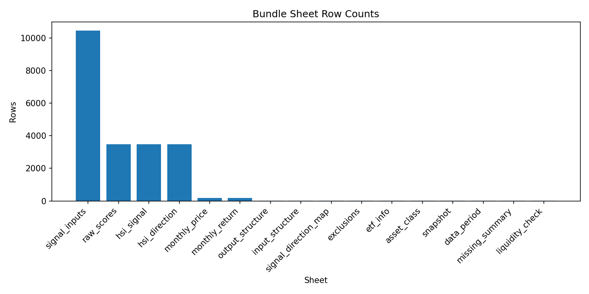
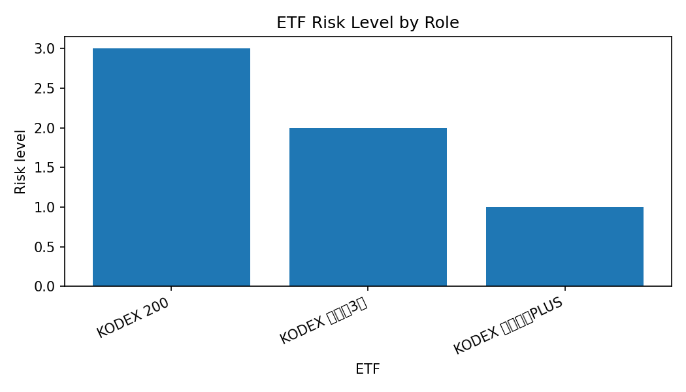

# 00_Project_config_and_data_check

## 실험명
**00번 최종 프로젝트 설정 및 데이터 번들 점검**

## 1. 목적

00번 단계의 목적은 전략을 실행하기 전에 프로젝트 기준을 고정하는 것이다. 이 단계에서는 ETF 유니버스, 데이터 번들, 수익률 단위 규칙, 리밸런싱 기준, 후속 실험의 역할 구분을 확인한다.

이 단계는 전략 성과를 비교하는 실험이 아니다. 이후 01~23번 실험이 같은 입력과 같은 기준으로 실행될 수 있도록 출발점을 고정하는 관리 단계이다.

## 2. 핵심 점검 결과

| 점검 항목 | 결과 | 상태 | 비고 |
| --- | --- | --- | --- |
| bundle_file | hsi_data_bundle.xlsx | OK | 기준 데이터 번들 |
| sheet_count | 16 | OK | 엑셀 번들 시트 수 |
| monthly_price_period | 2012-03~2026-06 | OK | 월말 가격 기간 |
| monthly_return_period | 2012-04~2026-06 | OK | 월간 수익률 기간 |
| etf_count | 3 | OK | 최종 ETF 유니버스 개수 |
| baseline_months | 172 | OK | HSI baseline 월별 관측치 |

## 3. 데이터 번들 시트 구성

| 시트명 | 행 수 | 열 수 | 상태 |
| --- | --- | --- | --- |
| input_structure | 12 | 8 | OK |
| output_structure | 14 | 8 | OK |
| etf_info | 3 | 8 | OK |
| asset_class | 3 | 15 | OK |
| monthly_price | 172 | 4 | OK |
| monthly_return | 171 | 4 | OK |
| signal_inputs | 10458 | 13 | OK |
| raw_scores | 3486 | 16 | OK |
| hsi_direction | 3486 | 4 | OK |
| hsi_signal | 3486 | 4 | OK |
| signal_direction_map | 5 | 4 | OK |
| snapshot | 3 | 11 | OK |
| data_period | 3 | 8 | OK |
| missing_summary | 3 | 6 | OK |
| liquidity_check | 3 | 11 | OK |
| exclusions | 4 | 3 | OK |

## 4. 최종 ETF 유니버스

| 티커 | ETF | 자산군 | 추종자산 | 위험그룹 | 위험등급 | 역할 | 데이터 시작 | HSI 커버리지 | NA 신호 |
| --- | --- | --- | --- | --- | --- | --- | --- | --- | --- |
| 69500 | KODEX 200 | 국내주식 | 주식형 | 고위험 | 3 | 위험자산 | 2012-03-07 | 5/5 | 없음 |
| 114260 | KODEX 국고채3년 | 국내채권 | 채권형 | 저위험 | 2 | 안전자산 | 2012-03-07 | 5/5 | 없음 |
| 153130 | KODEX 단기채권PLUS | 단기채권/현금성 | 채권형 | 초저위험 | 1 | 현금성자산 | 2012-03-07 | 3/5 | ma_pos, momentum |

본 프로젝트의 ETF 유니버스는 위험자산, 안전자산, 현금성 자산의 3개 축으로 구성된다. 069500은 국내 주식 위험자산, 114260은 국고채 기반 안전자산, 153130은 단기채권/현금성 방어자산으로 사용한다.

## 5. 데이터 기간과 품질

| 티커 | ETF | 상장일 | 실제 시작 | 종료 | 거래일수 | 실제 연수 | 상태 |
| --- | --- | --- | --- | --- | --- | --- | --- |
| 69500.0 | KODEX 200 | 2002-10-14 | 2012-03-07 | 2026-06-29 | 3486.0 | 13.8 | 시작 9년 이상 지연 |
| 114260.0 | KODEX 국고채3년 | 2009-07-29 | 2012-03-07 | 2026-06-29 | 3486.0 | 13.8 | 시작 2년 이상 지연 |
| 153130.0 | KODEX 단기채권PLUS | 2012-03-07 | 2012-03-07 | 2026-06-29 | 3486.0 | 13.8 | 정상 |

| 티커 | ETF | 전체 행 | 결측 수 | 결측률 | 보정 |
| --- | --- | --- | --- | --- | --- |
| 69500 | KODEX 200 | 3486 | 0 | 0.0% | 적용됨 (load_price_data 내부) |
| 114260 | KODEX 국고채3년 | 3486 | 0 | 0.0% | 적용됨 (load_price_data 내부) |
| 153130 | KODEX 단기채권PLUS | 3486 | 0 | 0.0% | 적용됨 (load_price_data 내부) |

| 티커 | ETF | 평균 거래량 | 평균 거래대금 | 통과 | 상태 |
| --- | --- | --- | --- | --- | --- |
| 69500 | KODEX 200 | 21330477 | 2489592713010 | 1 | 기준 충족 |
| 114260 | KODEX 국고채3년 | 49208 | 3025783305 | 1 | 기준 충족 |
| 153130 | KODEX 단기채권PLUS | 39859 | 4504422454 | 1 | 기준 충족 |

## 6. 제외 후보

| 티커 | ETF | 제외 사유 |
| --- | --- | --- |
| 148020 | KOSEF 국고채10년 | 자산군 내 HSI 커버리지 점수 열위로 미선정 |
| 395160 | TIGER KOFR금리액티브(합성) | 데이터 연수 부족(4년 < 기준 10년) |
| 69500 | KODEX 200 | 데이터 기간 점검: 시작 9년 이상 지연 |
| 114260 | KODEX 국고채3년 | 데이터 기간 점검: 시작 2년 이상 지연 |

제외 후보는 프로젝트 실패가 아니라 유니버스 통제의 일부이다. 데이터 연수, 자산군 내 커버리지, HSI 신호 적용 가능성을 기준으로 최종 3개 ETF를 남긴다.

## 7. 결론

00번 단계에서는 후속 실험의 기준 입력이 되는 `hsi_data_bundle.xlsx`가 확인되었고, ETF 유니버스와 데이터 기간, 결측치, 유동성 점검을 정리하였다. 이 단계의 핵심 산출물은 전략 성과표가 아니라 “이후 실험이 같은 데이터 기준에서 출발한다”는 재현성 근거이다.

ETF 유니버스(설명: 전략에 포함할 수 있는 투자 대상 목록이다.)  
재현성(설명: 같은 입력과 같은 코드로 다시 실행했을 때 같은 결과를 얻을 수 있는 성질이다.)
