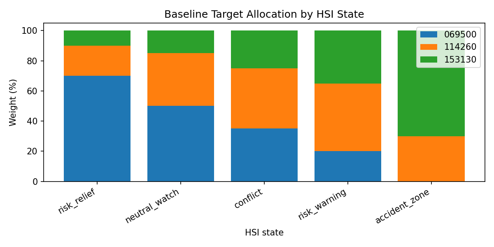
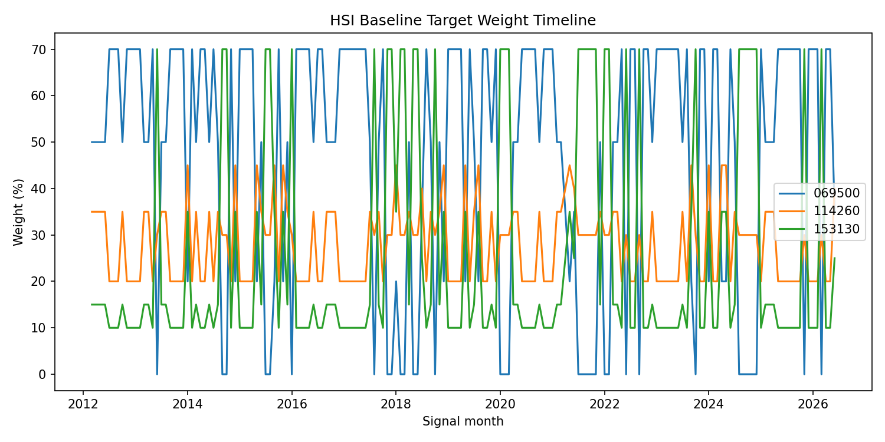
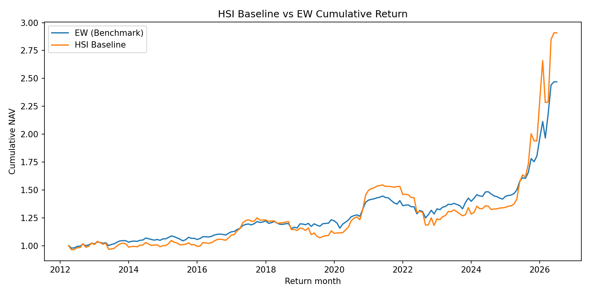
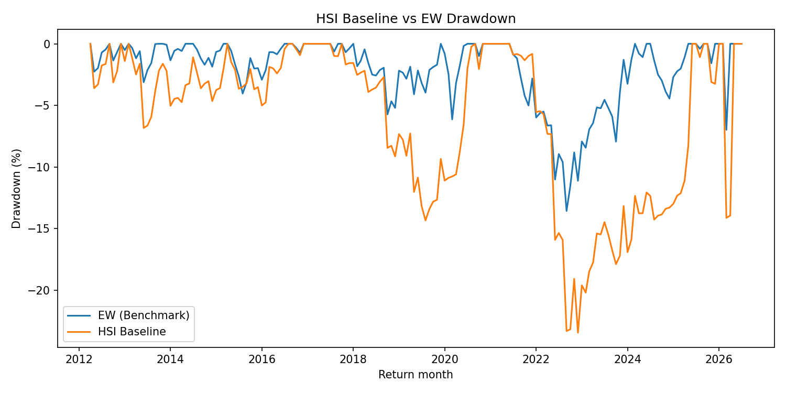

# 05_Baseline_allocation_backtest

## 실험명
**05번 HSI baseline 목표비중 백테스트**

## 1. 목적

05번 단계의 목적은 04번에서 만든 HSI 5상태를 ETF 목표비중으로 변환하고, 월말 신호를 다음 달 수익률에 적용하여 baseline 백테스트를 수행하는 것이다.

이 단계의 목적은 최종 우수 전략을 확정하는 것이 아니다. HSI 상태분류가 실제 ETF 비중 조절과 성과지표 계산으로 연결되는지를 확인하는 기준선 실험이다.

## 2. HSI 상태별 목표비중

| HSI 상태 | 한글 상태 | 069500 | 114260 | 153130 | 규칙 |
| --- | --- | --- | --- | --- | --- |
| risk_relief | 위험 완화 우세 | 0.70 | 0.20 | 0.10 | 위험자산 비중을 가장 높게 둔다. |
| neutral_watch | 중립 관찰 | 0.50 | 0.35 | 0.15 | 주식과 방어자산을 균형 배분한다. |
| conflict | 신호 충돌 | 0.35 | 0.40 | 0.25 | 신호 충돌 시 주식 비중을 낮춘다. |
| risk_warning | 위험 악화 우세 | 0.20 | 0.45 | 0.35 | 방어자산 중심으로 이동한다. |
| accident_zone | 강한 위험 구간 | 0.00 | 0.30 | 0.70 | 현금성 자산 비중을 가장 높인다. |

위험 완화 상태에서는 069500 비중이 높고, 강한 위험 구간에서는 153130 비중이 높다. 즉 HSI 상태는 ETF 목표비중으로 직접 번역된다.

## 3. 월별 비중 변화

HSI baseline은 상태가 바뀌면 목표비중으로 즉시 이동한다. 이 구조는 상태 변화에 빠르게 반응할 수 있지만, Turnover가 커질 수 있다는 단점이 있다. 이후 Lambda 실험은 이 한계를 줄이기 위해 도입된다.

## 4. 성과 요약

| 전략 | 역할 | 월 수 | CAGR(%) | 연변동성(%) | MDD(%) | Sharpe | Sortino | Calmar | 승률(%) | 평균 Turnover(%) |
| --- | --- | --- | --- | --- | --- | --- | --- | --- | --- | --- |
| EW | 단순 동일가중 benchmark | 172.000 | 6.510 | 7.972 | -13.571 | 0.832 | 1.538 | 0.480 | 60.465 | 0.000 |
| HSI_final_baseline_overlay | HSI 5상태 즉시비중 baseline | 172.000 | 7.732 | 13.666 | -23.459 | 0.611 | 0.950 | 0.330 | 65.116 | 22.093 |

## 5. 누적수익률 비교

HSI baseline은 EW benchmark보다 높은 CAGR을 보였지만, 위험지표와 Turnover를 함께 보면 단순히 최종 후보로 채택하기 어렵다.

## 6. Drawdown 비교

HSI baseline은 목표비중으로 즉시 이동하기 때문에 시장상태 변화에 민감하게 반응한다. 그러나 MDD와 Turnover 부담이 커져 최종 후보로 바로 쓰기보다는 “내부 기준선”으로 두는 것이 적절하다.

## 7. 신호월과 수익률 적용월 예시

| 신호월 | 적용 수익률월 | HSI 상태 | 한글 상태 | 전략수익률 | Turnover | 069500 | 114260 | 153130 |
| --- | --- | --- | --- | --- | --- | --- | --- | --- |
| 2012-03 | 2012-04 | insufficient_data | 자료 부족 | 0.0002 | 0.0000 | 0.5000 | 0.3500 | 0.1500 |
| 2012-04 | 2012-05 | insufficient_data | 자료 부족 | -0.0360 | 0.0000 | 0.5000 | 0.3500 | 0.1500 |
| 2012-05 | 2012-06 | insufficient_data | 자료 부족 | 0.0032 | 0.0000 | 0.5000 | 0.3500 | 0.1500 |
| 2012-06 | 2012-07 | insufficient_data | 자료 부족 | 0.0159 | 0.0000 | 0.5000 | 0.3500 | 0.1500 |
| 2012-07 | 2012-08 | risk_relief | 위험 완화 우세 | 0.0012 | 0.2000 | 0.7000 | 0.2000 | 0.1000 |
| 2012-08 | 2012-09 | risk_relief | 위험 완화 우세 | 0.0350 | 0.0000 | 0.7000 | 0.2000 | 0.1000 |
| 2012-09 | 2012-10 | risk_relief | 위험 완화 우세 | -0.0314 | 0.0000 | 0.7000 | 0.2000 | 0.1000 |
| 2012-10 | 2012-11 | neutral_watch | 중립 관찰 | 0.0096 | 0.2000 | 0.5000 | 0.3500 | 0.1500 |
| 2012-11 | 2012-12 | risk_relief | 위험 완화 우세 | 0.0295 | 0.2000 | 0.7000 | 0.2000 | 0.1000 |
| 2012-12 | 2013-01 | risk_relief | 위험 완화 우세 | -0.0140 | 0.0000 | 0.7000 | 0.2000 | 0.1000 |
| 2013-01 | 2013-02 | risk_relief | 위험 완화 우세 | 0.0289 | 0.0000 | 0.7000 | 0.2000 | 0.1000 |
| 2013-02 | 2013-03 | risk_relief | 위험 완화 우세 | -0.0115 | 0.0000 | 0.7000 | 0.2000 | 0.1000 |

## 8. 결론

05번 baseline 실험은 HSI 상태분류가 ETF 비중 조절로 연결될 수 있음을 보여준다. 그러나 즉시비중 방식은 Turnover와 MDD 부담이 크다. 따라서 최종 전략 개선의 방향은 HSI 상태분류를 완전히 바꾸는 것이 아니라, 같은 HSI 상태를 더 부드럽게 ETF 비중으로 반영하는 것이다. 이 문제의식이 10번 Lambda 부분조정 실험으로 이어진다.

Baseline(설명: 이후 개선 실험과 비교하기 위한 기준선 전략이다.)  
Lambda 부분조정(설명: 목표비중으로 한 번에 이동하지 않고, 현재 비중에서 목표비중 방향으로 일부만 이동하는 방식이다.)
