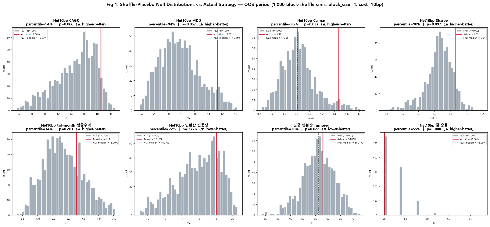
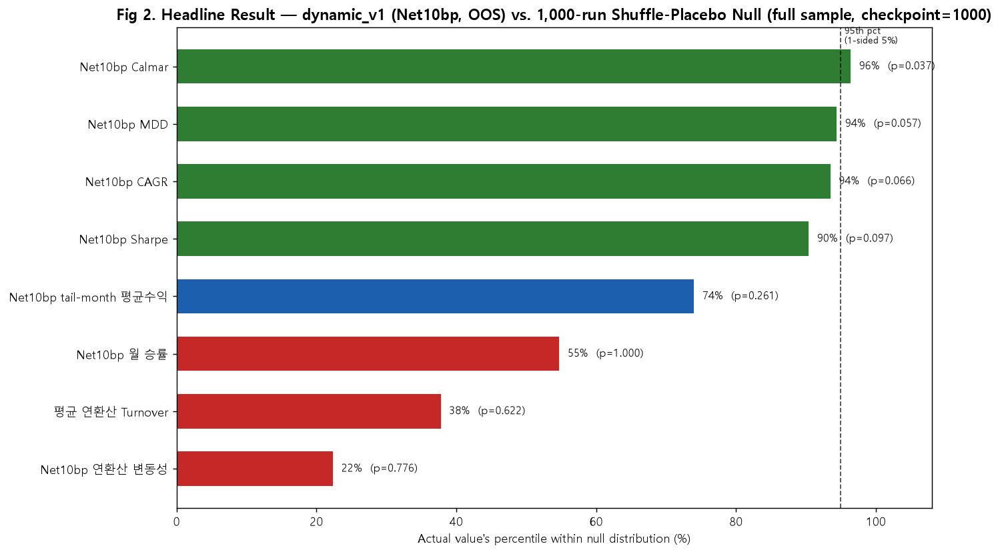
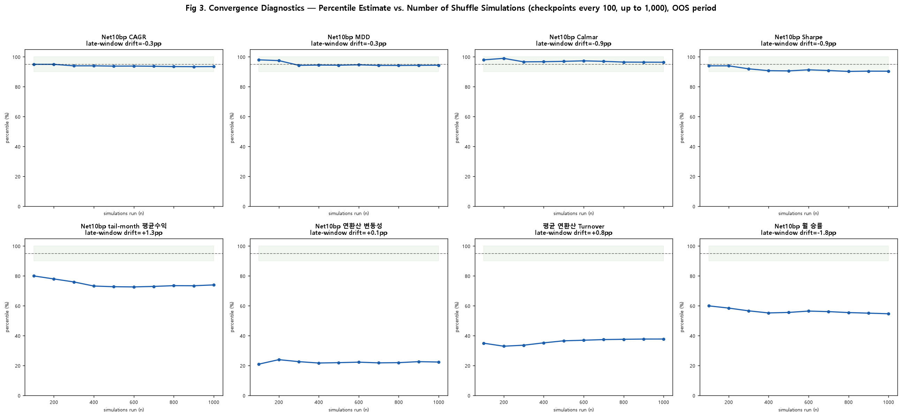
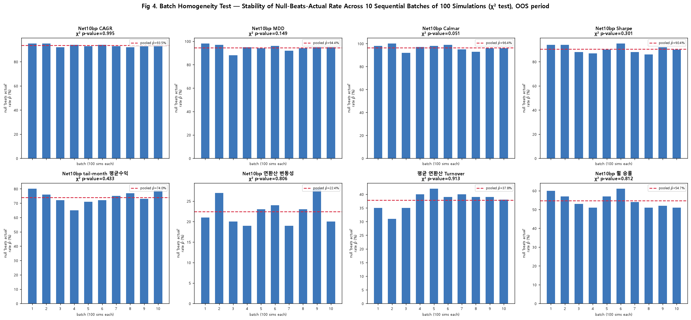
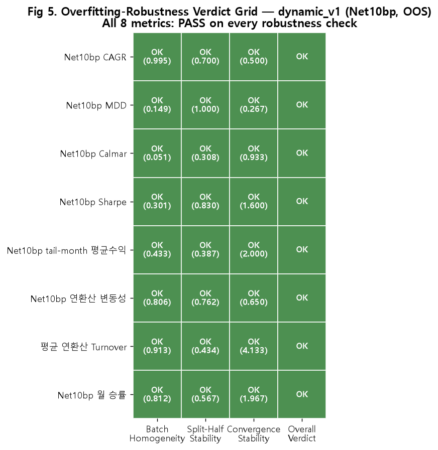

# Experiment 38: HSI Target-Weight Shuffle-Placebo Testing (Net10bp)

## 1. 개요
HSI 동적 배분 메커니즘의 과최적화(overfitting) 여부를 검증하기 위해
1,000회 블록 셔플(block_size=4) 플라시보 테스트를 Net10bp 비용 조건 하에서 수행하였다.
8개 지표(Calmar, MDD, CAGR, Sharpe, tail-month avg, turnover, volatility, monthly win rate)를 대상으로 함.

## 2. Fig 1 — Null Distribution & OOS 비교

CAGR, MDD, Calmar, Sharpe의 실제 값은 귀무분포 상위 10% 구간에 위치. turnover, win rate 등 보조지표는 유의한 우위 없음.

## 3. Fig 2 — Headline Percentile / p-value

| 지표 | 명목 p-value | 유의성(95%) |
|---|---|---|
| Calmar | 0.037 | ✅ 유의 |
| MDD | 0.057 | ▲ 경계 |
| CAGR | 0.066 | ▲ 경계 |
| Sharpe | 0.097 | ✕ |
| Tail-month avg | 0.261 | ✕ |
| Turnover | 0.622 | ✕ |
| Volatility | 0.776 | ✕ |
| Monthly win rate | 1.000 | ✕ |

Bonferroni 보정(임계값 ≈0.00625) 적용 시 유의한 지표 없음.

## 4. Fig 3 — Convergence Diagnostics

전 지표 안정적 수렴, late-window drift는 ±2pp 이내 (예: Calmar -0.9pp, Turnover +0.8pp).

## 5. Fig 4 — Batch Homogeneity

8개 지표 모두 Chi-square 검정 p>0.05 통과. Calmar는 p=0.051로 경계값 → "cautiously robust" 해석 필요.

## 6. Fig 5 — Overfitting Verdict Grid

8개 지표 모두 Batch Homogeneity / Split-Half Stability / Convergence Stability 항목에서 "OK/PASS" 판정.
※ Stability 컬럼은 p-value가 아닌 decision score (예: Turnover 4.133)임에 유의.

## 7. 결론 및 향후 과제
- Calmar만 95% 유의수준 통과, MDD·CAGR는 경계선. Bonferroni 보정 시 전 지표 유의성 소실.
- HSI 3-way 구조 vs. 단순 리스크오프 규칙 간 기여도(attribution) 불분명.
- 향후: Naive Volatility Targeting, MA Crossover, Fixed DD Trigger 대비 벤치마킹으로 Calmar 개선의 원천 분리 필요.
