# HSI 기반 ETF 방어형 Overlay RoboAdvisor 프로젝트 결과보고서  
## 시장상태 해석 기반 동적 자산배분과 λ 실행속도 조절 전략

**작성자:** 김근형  
**팀명:** 3조 — 권보성, 김근형, 추주원, 김민호  
**제출일:** 2026-07-07  
**강의명 / 프로젝트명:** 나만의 로보어드바이저 만들기  
**분석 대상:** 국내 ETF 3종 기반 방어형 자산배분 전략  
**최종 산출물 기준:** 2026-07-07 재실행 `main_final_*` 산출물  

---

# 목차

1. 프로젝트 개요  
2. 용어 설명: 프로젝트 내부 용어와 변수명  
3. 전략 설계: HSI 상태해석과 ETF Overlay  
4. 유니버스와 BM 구성  
5. SAA / TAA / λ 실행 구조  
6. 데이터와 입력자료 검증  
7. 백테스트 설계와 검증 절차  
8. 리밸런싱 구성 비중 분석  
9. IS/OOS/FULL 성과 분석과 3년 rolling 성과추이  
10. 회전율·거래비용·슬리피지 민감도 및 매수/매도 Turnover 점검   
11. Factor loading과 rolling factor exposure  
12. Dynamic λ와 MacroRisk 확장안  
13. Adoption decision과 최종 RA 포트폴리오 비교
14. 최종 결론  
15. 한계와 후속 과제  

---

# 1. 프로젝트 개요

HSI 기반 ETF 방어형 Overlay 전략을 RoboAdvisor형 자산배분 규칙으로 구현하고, 백테스트와 후속 검증을 통해 전략의 성과와 한계를 확인하였다. 핵심 목적은 특정 월의 수익률을 직접 예측하는 것이 아니라, 시장상태를 해석하고 그 상태에 따라 위험자산, 채권형 방어자산, 현금성 방어자산의 비중을 조정하는 규칙을 만드는 것이다.

핵심 질문은 다음과 같다.

> HSI 상태를 이용해 위험자산 비중을 조절하고, λ 실행속도를 통해 목표비중으로 이동하는 속도를 조절하면, 고정비중 BM 대비 낙폭과 위험조정 성과를 개선할 수 있는가?

단순히 “성과가 좋았다”는 결과만 제시하지 않았다. 전략 후보들이 실제로 어떤 방식으로 비중을 바꾸었는지, 성과가 특정 구간에만 의존하지 않는지, 회전율이 과도하지 않은지, 비용을 차감해도 해석 가능한 결과가 남는지, 최종 후보를 어떤 기준으로 판단했는지 함께 정리하였다.

핵심 프레이밍은 “수익률 알파”가 아니라 “낙폭 통제 엣지”이다. FixedBM_70_20_10은 전체 구간에서 가장 높은 CAGR을 기록했지만, 동시에 가장 큰 MDD를 보였다. 반면 HSI 기반 λ 전략은 CAGR을 극대화하기보다 위험자산 비중의 이동 속도를 조절하여 낙폭과 변동성을 완화하는 데 초점을 둔다. 따라서 성과 해석은 단순 수익률 우위가 아니라, 방어형 참여자에게 필요한 위험조정 성과와 낙폭 관리 능력을 중심으로 진행한다. 또한 최종 성과표 하나에만 의존하지 않기 위해 월별 수익률 흐름과 3년 rolling 성과추이를 추가로 확인하였다. 이를 통해 특정 구간의 성과가 전체 판단을 왜곡하지 않는지, 3년 단위로 보았을 때 음수 누적수익률 구간이 반복되는지 함께 점검하였다.

---

# 2. 용어 설명: 프로젝트 내부 용어와 변수명

아래 용어들은 이 전략을 구현하고 검증하는 과정에서 사용한 내부 변수명과 전략명이다. 일반적인 금융용어도 일부 포함되어 있지만, 여기서는 프로젝트 안에서 어떤 의미로 사용했는지를 기준으로 설명한다.

| 용어 | 쉬운 설명 |
|---|---|
| HSI | 시장상태를 구분하기 위해 사용한 상태지표이다. 수익률을 직접 예측하는 모델로 쓰지 않고, 위험 완화·중립·위험 경고·사고 구간처럼 시장상태를 나누는 기준으로 사용하였다. |
| Overlay | 기존 자산배분 위에 얹는 조정 규칙을 의미한다. 여기서는 주식·채권·현금성 ETF의 기본 배분 위에 HSI 상태와 λ 실행속도 규칙을 얹어 비중을 조정한다. |
| 유니버스 | 전략이 투자할 수 있는 자산의 범위이다. 유니버스는 069500, 114260, 153130 세 ETF로 제한하였다. |
| 069500 | KODEX 200 ETF이다. 위험자산 역할을 맡는다. |
| 114260 | KODEX 국고채3년 ETF이다. 채권형 방어자산 역할을 맡는다. |
| 153130 | KODEX 단기채권PLUS ETF이다. 현금성 방어자산 역할을 맡는다. |
| FixedBM_70_20_10 | 069500 70%, 114260 20%, 153130 10%로 고정한 기준 포트폴리오이다. 전략 성과를 비교하기 위한 주된 BM으로 사용하였다. |
| EW | Equal Weight의 약자이다. 세 ETF에 동일한 비중을 두는 보조 BM이다. |
| SAA | Strategic Asset Allocation의 약자이다. 장기 기준 배분 또는 정책적 기준 비중을 의미한다. |
| TAA | Tactical Asset Allocation의 약자이다. 시장상태에 따라 단기적으로 목표비중을 바꾸는 전술적 배분을 의미한다. |
| λ | 목표비중으로 이동하는 속도이다. λ가 크면 목표비중에 빠르게 가까워지고, λ가 작으면 천천히 이동한다. |
| target_w | HSI 상태가 제시한 목표비중이다. 예를 들어 위험 경고 상태에서는 위험자산 목표비중이 낮아진다. |
| 실제 비중 | 전월 비중에서 target_w로 한 번에 이동하지 않고, λ만큼 이동한 뒤의 포트폴리오 비중이다. |
| lambda_0.1 | 매월 λ=0.1을 적용한 전략이다. 목표비중으로 천천히 이동하는 보수적인 실행 규칙이다. |
| lambda_0.3 | 매월 λ=0.3을 적용한 전략이다. lambda_0.1보다 목표비중에 더 빠르게 반응한다. |
| asym_up0.1_down0.3 | 위험자산 비중을 늘릴 때와 줄일 때 다른 λ를 쓰는 비대칭 전략이다. up은 위험자산 비중을 다시 늘리는 방향, down은 위험자산 비중을 줄이는 방향을 의미한다. |
| dynamic_v1 | 시장상태 변수에 따라 월별 λ를 다르게 적용한 시변 λ 전략이다. 고정 λ 하나를 계속 쓰는 것이 아니라, 조건에 따라 λ=0.1, 0.3, 0.5 중 하나를 사용한다. |
| dynamic_v1_macro | dynamic_v1에 MacroRisk 조건을 추가한 확장안이다. 금리와 환율 위험이 동시에 관찰되는 달에는 고위험 조건을 더 보수적으로 반영한다. |
| MacroRisk | 금리 상승 flag와 환율 상승 flag를 더한 단순 거시위험 점수이다. 값이 2이면 금리와 환율 위험이 동시에 관찰된 달로 해석한다. |
| rate_up_flag | 금리 상승 압력이 관찰된 달을 1로 표시한 변수이다. |
| fx_up_flag | 환율 상승 압력이 관찰된 달을 1로 표시한 변수이다. |
| Turnover | 리밸런싱 때 포트폴리오 비중이 얼마나 많이 바뀌었는지를 나타내는 지표이다. 기본 Turnover는 자산별 비중 변화의 절대값 합을 2로 나눈 one-way 기준으로 계산하며, 이는 매수 또는 매도 한쪽 기준의 거래 규모로 해석한다. |
| 슬리피지 | 실제 거래가격이 기대한 가격과 달라지면서 발생하는 비용이다. 이 프로젝트에서는 슬리피지를 직접 측정하지 않고, Turnover × 비용률 방식으로 비용 민감도를 점검하였다. |
| MDD | Maximum Drawdown의 약자이다. 투자 기간 중 고점 대비 가장 크게 하락한 정도를 의미한다. 방어형 전략에서는 중요한 지표이다. |
| Calmar | CAGR을 MDD와 함께 보는 위험조정 성과지표이다. 같은 수익률이라도 낙폭이 작으면 Calmar가 높아진다. |
| tail-month | 위험자산 수익률이 특히 나빴던 달을 의미한다. 나쁜 시장 구간에서 전략이 얼마나 방어했는지 보기 위해 사용하였다. |
| IS | In-Sample의 약자이다. 전략을 설계하고 확인한 구간이다. |
| OOS | Out-of-Sample의 약자이다. 전략을 새 구간에서 평가하기 위한 검증 구간이다. |
| FULL | IS와 OOS를 합친 전체 기간이다. |
| factor loading | 전략 수익률이 Market, Bond, Volatility, MacroRisk 같은 요인에 얼마나 노출되어 있었는지 보는 회귀 분석 결과이다. |
| rolling factor exposure | 일정 기간을 굴려가며 factor loading을 반복 계산한 것이다. 시간에 따라 전략의 시장·채권·변동성 노출이 어떻게 변했는지 확인하기 위해 사용하였다. |
| audit | 여기서는 “감사”라는 엄격한 회계감사 뜻보다, 입력자료와 계산 규칙이 의도대로 맞는지 확인하는 점검 절차를 의미한다. |
| adoption decision | 최종 후보를 고르기 위한 판정 절차이다. OOS 10bp 비용차감 기준으로 Calmar, MDD, tail-month 방어력, Turnover를 함께 확인하였다. |
| non-inferiority | “반드시 더 우월하다”를 입증하는 방식이 아니라, 정해진 기준보다 크게 밀리지 않는지 확인하는 방식이다. 방어형 RoboAdvisor 후보가 기존 대칭 λ 후보보다 위험조정 성과와 회전율 측면에서 크게 뒤처지지 않는지 확인하기 위해 사용하였다. |
| 누적수익률 | 특정 기간 동안 전략의 자산가치가 시작점 대비 얼마나 증가하거나 감소했는지를 나타내는 지표이다. 월별 수익률을 차례로 복리 누적하여 계산한다. |
| Sharpe | 수익률을 변동성과 함께 보는 위험조정 성과지표이다. 이 프로젝트에서는 무위험수익률을 0으로 두고, 연환산 수익률을 연환산 변동성으로 나누어 해석하였다. |
| 3년 rolling 성과 | 매월 36개월 구간을 하나씩 이동시키며 누적수익률, CAGR, 변동성, MDD, Sharpe를 반복 계산한 결과이다. 특정 한 기간의 최종 성과에만 의존하지 않고 전략의 시간별 안정성을 확인하기 위해 사용하였다. |
---

# 3. 전략 설계: HSI 상태해석과 ETF Overlay

전략의 출발점은 HSI를 미래 수익률 예측모형으로 사용하는 것이 아니라, 시장상태를 해석하는 상태분류 도구로 사용하는 것이다. HSI 상태는 시장이 위험 완화, 중립 관찰, 충돌, 위험 경고, 사고 구간 중 어디에 가까운지를 판단하고, 각 상태에 따라 위험자산·채권형 방어자산·현금성 방어자산의 목표비중을 다르게 설정한다.

HSI 상태별 목표비중은 다음과 같다.

| HSI 상태 | 069500 | 114260 | 153130 | 해석 |
|---|---:|---:|---:|---|
| risk_relief | 70% | 20% | 10% | 위험 완화, 위험자산 참여 확대 |
| neutral_watch | 50% | 35% | 15% | 중립 관찰 |
| conflict | 35% | 40% | 25% | 신호 충돌, 방어 비중 확대 |
| risk_warning | 20% | 45% | 35% | 위험 경고, 위험자산 축소 |
| accident_zone | 0% | 30% | 70% | 사고 구간, 현금성 방어 강화 |
| insufficient_data | 이전 비중 유지 | 이전 비중 유지 | 이전 비중 유지 | 정보 부족 구간 |

[표 1. HSI 상태별 ETF 목표비중]

이 구조에서 HSI는 “목표비중 w*”를 결정한다. 그러나 실제 포트폴리오가 목표비중으로 바로 이동하는 것은 아니다. λ가 현재비중과 목표비중 사이의 이동 속도를 조절한다.

```text
새 비중 = 이전 비중 + λ × (목표비중 - 이전 비중)
```

λ가 1이면 목표비중까지 즉시 이동하고, λ가 0.3이면 현재비중과 목표비중 차이의 30%만 이동한다. 따라서 λ는 전략의 공격성·방어성·회전율을 조절하는 실행속도 변수이다.

단일 λ를 사용하는 대칭 전략, 위험자산을 늘릴 때와 줄일 때 다른 λ를 사용하는 비대칭 전략, 그리고 시장상태 변수에 따라 λ를 월별로 바꾸는 dynamic 전략을 비교하였다. 이 구조는 단순히 “어떤 ETF를 살 것인가”가 아니라, “시장상태가 바뀔 때 목표비중으로 얼마나 빠르게 이동할 것인가”를 함께 다룬다는 점에서 RoboAdvisor형 Overlay 전략에 가깝다.

---

# 4. 유니버스와 BM 구성

ETF 유니버스는 다음 3개 자산으로 구성된다.

| 티커 | 자산 역할 | 해석 |
|---|---|---|
| 069500 | 위험자산 | KODEX 200, 주식시장 참여 자산 |
| 114260 | 채권형 방어자산 | KODEX 국고채3년, 중기 국채 방어자산 |
| 153130 | 현금성 방어자산 | KODEX 단기채권PLUS, 현금성 방어자산 |

[표 2. ETF 유니버스]

모든 전략과 BM은 동일한 3개 ETF 유니버스 안에서 비교하였다. 이는 성과 차이가 유니버스 선택에서 발생한 것인지, 비중 조절 규칙에서 발생한 것인지 혼재되지 않도록 하기 위한 통제이다. 유니버스가 달라지면 전략 성과도 크게 달라질 수 있으므로, 자산 범위를 고정한 뒤 λ 실행 규칙의 차이를 비교하였다.

성과 비교를 위해 두 가지 BM을 사용하였다.

| BM | 구성 | 역할 |
|---|---|---|
| FixedBM_70_20_10 | 069500 70%, 114260 20%, 153130 10% | 주된 비교 기준 |
| EW | 세 ETF 동일비중 | 보조 비교 기준 |

[표 3. BM 구성]

FixedBM_70_20_10은 위험자산 참여도가 높은 기준 포트폴리오이다. 따라서 상승장에서는 성과가 높을 수 있지만, 위험자산 하락 구간에서는 MDD가 커질 수 있다. EW는 세 ETF를 동일하게 보유하는 단순 비교 기준이다. FixedBM을 주된 BM으로 두고, EW는 보조 기준으로 활용하였다.

---

# 5. SAA / TAA / λ 실행 구조

전략은 SAA, TAA, λ 실행속도의 3층 구조로 해석할 수 있다.

첫째, SAA는 장기 기준 배분 또는 정책 앵커이다. HSI 중립상태의 목표비중인 50/35/15를 정책적 중립 상태로 해석할 수 있으며, FixedBM_70_20_10은 성과 비교를 위한 기준 포트폴리오로 사용하였다.

둘째, TAA는 HSI 상태 변화에 따른 목표비중 조정이다. 예를 들어 risk_relief 상태에서는 069500 비중을 70%까지 허용하고, risk_warning 상태에서는 069500 비중을 20%로 낮추며, accident_zone 상태에서는 위험자산 비중을 0%까지 낮춘다. 즉, HSI 상태별 목표비중 w*가 전술적 자산배분 역할을 한다.

셋째, λ는 TAA 목표비중이 실제 포트폴리오에 반영되는 속도이다. 고정 λ 전략에서는 모든 월에 같은 λ를 사용한다. 예를 들어 lambda_0.1은 모든 월에 λ=0.1을 사용하고, lambda_0.3은 모든 월에 λ=0.3을 사용한다. 반면 dynamic_v1은 연환산 변동성, rolling drawdown, risk_relief 지속 조건에 따라 월별 λ를 다르게 설정한다. dynamic_v1_macro는 여기에 MacroRisk 조건을 추가한 확장안이다.

이 구조는 단순한 고정비중 전략도 아니고, 특정 ETF를 매수·매도하는 단기매매 전략도 아니다. 시장상태에 따라 목표비중을 바꾸고, 그 목표비중으로 이동하는 속도를 λ로 조절하는 방어형 자산배분 규칙이다.

---

# 6. 데이터와 입력자료 검증

백테스트 결과를 해석하기 전에 먼저 입력자료가 전략 검증에 사용할 수 있는 상태인지 확인하였다. 데이터 수집 및 전처리 단계에서 수익률 단위, 날짜 정렬, 결측값, 비중 계산 오류가 발생하면 이후 성과는 신뢰하기 어렵다. 따라서 가격 자료, 수익률 자료, factor input 자료에 대해 별도의 점검 절차를 수행하였다.

첫째, 월말 가격 자료에서 수익률을 재계산하고, 백테스트 입력 파일인 `main_final_monthly_return_decimal.csv`와 비교하였다. 공통 검증 구간은 2012-04-30부터 2026-06-30까지 총 171개월이며, 최대 절대오차는 0.000000499609로 1e-6 허용오차 이내였다. 따라서 가격 자료와 백테스트 입력 수익률은 실질적으로 일치한다고 판단하였다.

둘째, 수익률 단위를 검증하였다. 백테스트는 decimal 수익률을 기준으로 작동하므로, pct 단위와 decimal 단위가 혼용되면 성과가 크게 왜곡될 수 있다. 이에 따라 decimal 파일과 pct 파일의 변환 관계를 확인하였다.

셋째, 시점 정합성을 검증하였다. 적용 규칙은 `t월 신호 → t+1월 수익률`이다. 특정 월 말에 관측 가능한 HSI 상태와 위험조건은 다음 달 수익률에만 적용된다. 이는 미래 정보를 사용하지 않기 위한 핵심 규칙이다.

넷째, factor input 원칙 점검을 수행하였다. Market, Bond, Momentum, Volatility, MacroRisk의 계산 기준을 고정하였고, GDP처럼 공시 지연 가능성이 있는 변수는 1차 E24 factor loading에서 제외하였다. MacroRisk는 금리 상승 flag와 환율 상승 flag의 단순 합으로 제한하였다. 이는 복잡한 사후 최적화 score를 만들지 않기 위한 조치이다.

입력자료 검증은 단순히 파일이 존재하는지 확인하는 수준이 아니라, 가격-수익률 재현성, 수익률 단위, 시점 정합성, factor input 정의, 미래정보 사용 가능성을 함께 점검한 절차이다.

---

# 7. 백테스트 설계와 검증 절차

초기 검토 단계에서는 Calmar, Sharpe, Turnover, 비용 민감도를 하나의 Score로 합산하는 방식도 고려하였다. 그러나 이 방식은 각 항목의 가중치 a, b, c를 어떻게 정하느냐에 따라 결과가 달라질 수 있고, 결과를 본 뒤 가중치를 조정하면 과적합 위험이 커질 수 있다. 따라서 최종 백테스트에서는 해당 Score식을 사용하지 않았다.

최종 검증에서는 λ 후보를 사전에 정한 뒤, OOS 구간 10bp 비용차감 성과를 기준으로 Calmar, MDD, tail-month 방어력, 평균 Turnover의 네 조건을 각각 확인하였다. 즉, 하나의 종합점수로 후보를 고른 것이 아니라, 방어형 RoboAdvisor 후보로서 크게 밀리지 않는지를 비열등 조건으로 판정하였다.

백테스트 성과가 좋게 나온 후보를 사후적으로 고르는 방식을 피하기 위해, 실험 순서와 판정 기준을 분리하였다. λ 후보와 비대칭 λ grid는 결과를 본 뒤 새로 만든 것이 아니라, 사전에 정한 범위 안에서 비교하였다. 비대칭 λ 수행 문서에서도 λ grid와 dynamic λ 규칙을 사전등록하고, CAGR 단독 기준이 아니라 MDD, Calmar, Turnover, 비용 민감도, tail-month 방어력, OOS/walk-forward 검증을 함께 확인해야 한다고 정리되어 있다.

주요 검증 절차는 다음과 같다.

| 검증 항목 | 목적 | 처리 내용 |
|---|---|---|
| Smoke test | 기본 계산 규칙 확인 | Turnover 규약, t→t+1 적용, 비중 합계 1 유지 확인 |
| 가격-수익률 재계산 | 입력 수익률 재현성 확인 | 가격에서 월수익률 재계산 후 기존 수익률 파일과 비교 |
| Factor input 점검 | 팩터 입력 원칙 확인 | Market, Bond, Momentum, Volatility, MacroRisk 정의 고정 |
| IS/OOS 분리 | 전체기간 의존 방지 | IS와 OOS 성과를 분리해 비교 |
| Walk-forward | 구간별 안정성 확인 | 후보별 rolling 평가 수행 |
| 비용 민감도 | 회전율 높은 후보의 취약성 확인 | 0bp, 5bp, 10bp, 20bp 비용 차감 |
| Adoption decision | 후보 채택 기준 명확화 | OOS 10bp net 기준 비열등 판정 |
| 연도별 Turnover 점검 | 과도한 매매 여부 확인 | 월별 one-way Turnover를 연도별로 합산하고, 100%, 200% 기준으로 점검 |
| 연단위 매수/매도 Turnover 분리 | 회전율 계산 방식 명확화 | 연간 매수 Turnover, 매도 Turnover, one-way Turnover, double-sided Turnover를 분리 산출 |
| 3년 rolling 성과 점검 | 시간별 성과 안정성 확인 | 36개월 rolling window로 누적수익률, CAGR, 변동성, MDD, Sharpe, 음수 누적수익률 구간 수 확인 |

[표 4. 백테스트 검증 절차]

이러한 절차는 과적합 가능성을 완전히 제거했다는 의미는 아니다. 그러나 임의 score 합산, 사후 파라미터 조정, 미래정보 사용, 단일기간 성과 의존을 줄이기 위한 절차적 안정성을 확보했다는 점에서 의미가 있다. 특히 3년 rolling 성과 점검은 특정 최종 시점의 성과만으로 후보를 판단하지 않기 위한 보조 검증이며, 연단위 매수/매도 Turnover 분리는 회전율 계산 방식의 해석 가능성을 높이기 위한 보완 절차이다.

---

# 8. 리밸런싱 구성 비중 분석

## 8.1 dynamic_v1 포트폴리오 구성 비중

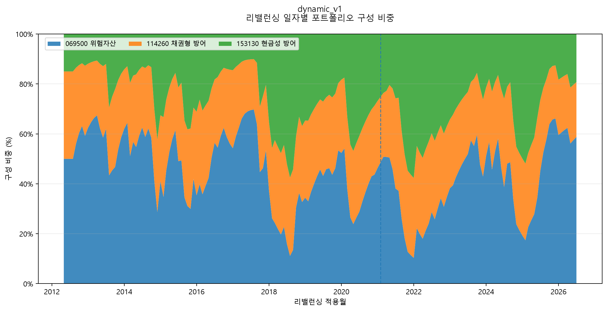

[그림 1. dynamic_v1 전략의 리밸런싱 일자별 포트폴리오 구성 비중]

그림 1은 dynamic_v1 전략이 각 리밸런싱 적용월에 069500, 114260, 153130에 어떤 비중을 배분했는지 보여준다. 069500은 위험자산, 114260은 채권형 방어자산, 153130은 현금성 방어자산으로 해석한다.

그림 1을 보면 dynamic_v1 전략의 위험자산 비중은 고정되어 있지 않고, 시간에 따라 달라진다. 이는 HSI 상태별 목표비중을 바로 따라가는 것이 아니라, 연환산 변동성, rolling drawdown, risk_relief 지속 조건에 따라 목표비중 반영 속도인 λ가 조정되기 때문이다. HSI 상태가 변하더라도 실제 포트폴리오 비중은 한 번에 크게 이동하지 않고, λ에 의해 완만하게 이동한다.

이 결과는 전략이 단순 고정비중 포트폴리오가 아니라는 점을 보여준다. 시장상태가 위험 완화 구간에 가까워질 때는 069500 비중이 확대되고, 위험 경고 또는 사고 구간에 가까워질 때는 채권형 방어자산과 현금성 방어자산 비중이 확대된다. 다만 이 그림은 성과 개선의 직접 증거라기보다, 전략 규칙이 실제 비중 변화로 구현되었음을 보여주는 실행 증거로 해석하는 것이 적절하다.

## 8.2 dynamic_v1_macro 포트폴리오 구성 비중

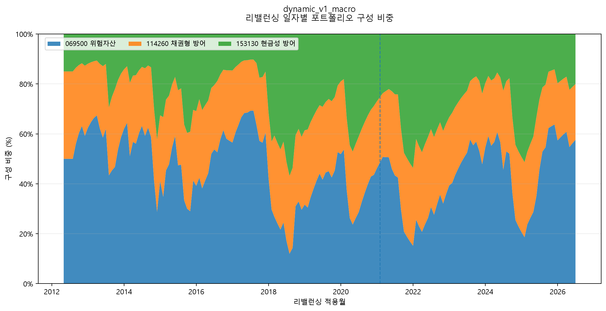

[그림 2. dynamic_v1_macro 전략의 리밸런싱 일자별 포트폴리오 구성 비중]

그림 2는 기존 dynamic_v1 조건에 MacroRisk 조건을 추가한 dynamic_v1_macro 전략의 월별 포트폴리오 구성 비중을 보여준다. MacroRisk는 `rate_up_flag + fx_up_flag`로 정의하였고, MacroRisk >= 2는 금리 상승 압력과 환율 상승 압력이 동시에 관찰되는 달을 의미한다.

E30-M 실행 결과, MacroRisk 조건은 실제로 작동하였다. 기존 dynamic_v1보다 고위험으로 분류되는 달이 증가했고, macro 단독 또는 macro와 변동성·drawdown 조건이 함께 작동한 사례가 확인되었다. 따라서 dynamic_v1_macro는 단순히 이름만 macro를 붙인 전략이 아니라, 실제 λ 결정 과정에 거시위험 조건을 반영한 확장안이다.

그림 2를 그림 1과 함께 보면, dynamic_v1_macro는 거시위험 조건을 추가로 반영하면서도 전체적인 자산군 구성은 dynamic_v1과 유사한 틀 안에서 움직인다. 다만 성과 해석은 신중해야 한다. dynamic_v1_macro는 기존 dynamic_v1 대비 평균 Turnover와 연환산 변동성을 소폭 낮추었지만, CAGR, MDD, Calmar는 dynamic_v1보다 약간 낮았다. 따라서 dynamic_v1_macro를 기본 후보로 대체하지 않고, MacroRisk를 반영한 저회전·보수 확장안으로 제시한다.


그림 1과 그림 2의 포트폴리오 구성 흐름은 시각적으로 큰 차이를 보이지 않는다. 이는 dynamic_v1_macro가 HSI 상태별 목표비중을 새로 바꾼 전략이 아니라, 기존 dynamic_v1의 λ 결정 조건에 MacroRisk를 추가한 전략이기 때문이다. 따라서 macro 확장안의 차이는 구성비중 면적 차트보다 λ 경로, 조건 분포, Turnover, 비용차감 성과에서 확인하는 것이 더 적절하다.

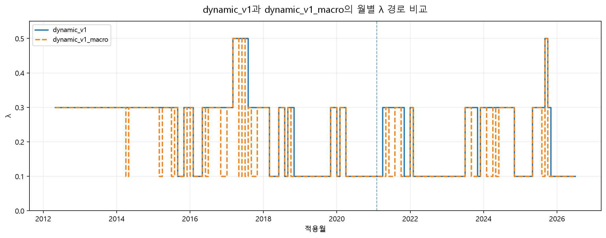

[그림 2-1. dynamic_v1과 dynamic_v1_macro의 월별 λ 경로 비교]

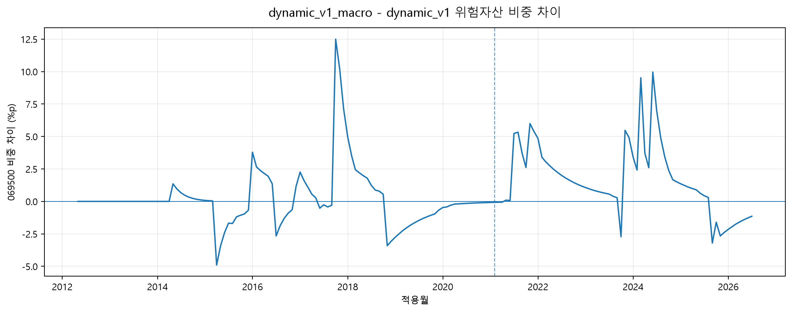

[그림 2-2. dynamic_v1_macro와 dynamic_v1의 위험자산 비중 차이]

그림 2-1은 dynamic_v1과 dynamic_v1_macro에서 실제 적용된 월별 λ 경로를 비교한 것이다. 두 전략은 같은 HSI 목표비중 체계를 공유하지만, MacroRisk 조건이 작동한 달에는 dynamic_v1_macro의 λ가 dynamic_v1과 달라질 수 있다. 즉, macro 확장안의 차이는 “무엇을 보유할 것인가”보다 “목표비중으로 얼마나 빠르게 이동할 것인가”에서 발생한다.

그림 2-2는 dynamic_v1_macro의 069500 비중에서 dynamic_v1의 069500 비중을 뺀 값이다. 값이 0에 가까운 구간은 두 전략의 실제 위험자산 비중이 거의 비슷했다는 뜻이고, 값이 양수 또는 음수로 벌어지는 구간은 MacroRisk 조건이 λ 경로를 바꾸면서 실제 위험자산 비중에도 차이를 만든 구간으로 해석할 수 있다.


---

# 9. IS/OOS/FULL 성과 분석

## 9.1 누적수익률 비교

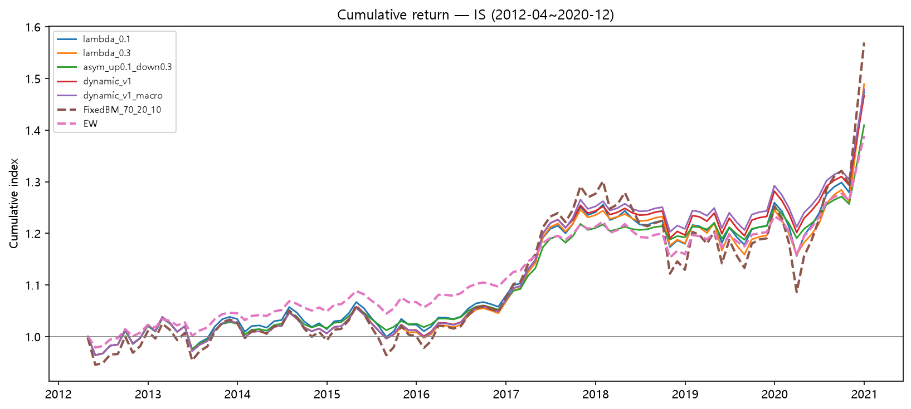

[그림 3. IS 구간 전략별 누적수익률 비교]

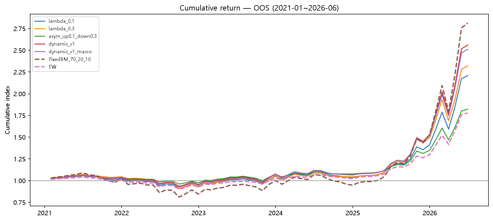

[그림 4. OOS 구간 전략별 누적수익률 비교]

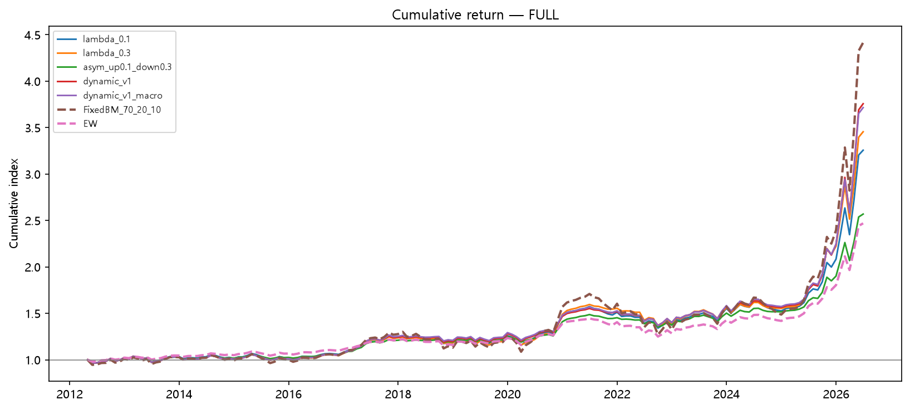

[그림 5. FULL 구간 전략별 누적수익률 비교]

그림 3, 그림 4, 그림 5는 각각 IS, OOS, FULL 구간에서 전략별 누적수익률을 비교한 결과이다. IS는 전략 설계와 확인에 사용된 구간이고, OOS는 새로운 구간에서 전략의 성과 특성이 유지되는지 보기 위한 평가 구간이다. FULL은 전체 기간을 한 번에 본 결과이다.

누적수익률 그림을 보면 FixedBM_70_20_10은 전체 구간에서 높은 수익률 경로를 보인다. 이는 위험자산인 069500 비중이 70%로 높게 유지되기 때문이다. 그러나 이 결과만으로 FixedBM이 방어형 RoboAdvisor 관점에서 더 적합하다고 보기는 어렵다. 위험자산 비중이 높으면 상승장에서는 유리하지만, 하락 구간에서는 낙폭도 커질 수 있기 때문이다.

dynamic_v1과 dynamic_v1_macro는 FixedBM보다 누적수익률은 낮지만, 이후 드로다운과 Calmar 지표에서 확인하듯이 낙폭 통제 측면에서 더 안정적인 특성을 보였다. 따라서 이 누적수익률 그림은 수익률 순위만 보는 용도보다는, 각 전략이 어떤 성격의 수익 경로를 가졌는지 확인하는 자료로 해석하는 것이 적절하다.

## 9.2 Drawdown 비교

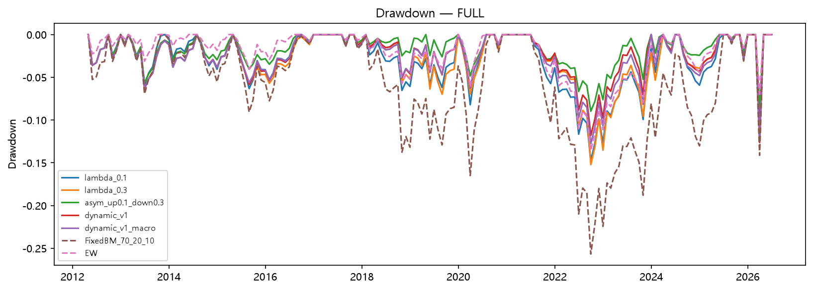

[그림 6. FULL 구간 전략별 Drawdown 비교]

그림 6은 FULL 구간에서 전략별 Drawdown을 비교한 결과이다. Drawdown은 투자 기간 중 고점 대비 얼마나 하락했는지를 보여준다. 방어형 전략에서는 누적수익률만큼이나 중요한 지표이다.

그림 6을 보면 FixedBM_70_20_10은 높은 누적수익률을 기록했지만, 하락 구간에서는 Drawdown도 크게 나타난다. 반면 dynamic_v1과 dynamic_v1_macro는 FixedBM보다 낙폭이 작게 나타난다. 이 결과는 전략의 핵심이 수익률 극대화보다 낙폭 통제에 있음을 보여준다.

## 9.3 성과-위험 요약

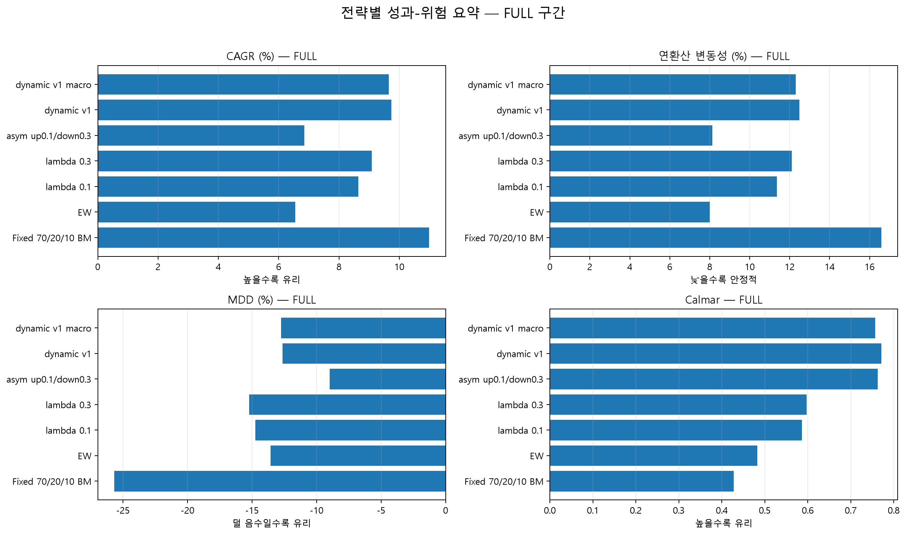

[그림 7. FULL 구간 전략별 성과-위험 요약]

그림 7은 FULL 구간에서 각 전략의 CAGR, 연환산 변동성, MDD, Calmar를 비교한 요약 그림이다. 표로 정리하면 다음과 같다.

| 전략 | FULL CAGR | FULL MDD | Calmar | 해석 |
|---|---:|---:|---:|---|
| FixedBM_70_20_10 | 10.99% | -25.67% | 0.43 | 수익률은 높지만 낙폭도 큼 |
| EW | 6.55% | -13.57% | 0.48 | 단순 동일비중 기준 |
| lambda_0.1 | 8.64% | -14.74% | 0.59 | 낮은 회전율, 보수적 이동 |
| lambda_0.3 | 9.09% | -15.22% | 0.60 | 빠른 반응, 회전율 증가 |
| asym_up0.1_down0.3 | 6.84% | -8.98% | 0.76 | 낮은 MDD, 방어 성향 강함 |
| dynamic_v1 | 9.73% | -12.63% | 0.77 | 성과-위험 균형 양호 |
| dynamic_v1_macro | 9.65% | -12.76% | 0.76 | dynamic_v1과 유사, 회전율은 더 낮음 |

[표 5. FULL 구간 주요 성과-위험 요약]

그림 7과 표 5를 함께 보면 FixedBM_70_20_10은 CAGR 측면에서 가장 높지만, MDD도 가장 크게 나타난다. 반면 dynamic_v1과 dynamic_v1_macro는 FixedBM보다 CAGR은 낮지만 MDD가 작고 Calmar가 높게 나타난다. 이 결과는 핵심이 수익률 극대화보다 낙폭 통제와 위험조정 성과에 있음을 보여준다.

## 9.4 월간 성과 흐름과 3년 rolling 성과 점검

앞선 성과표는 IS, OOS, FULL 구간의 요약 성과를 보여준다. 그러나 실무 관점에서는 특정 기간의 최종 수치만으로 전략을 판단하기 어렵다. 전체기간 CAGR이나 MDD가 양호하더라도, 특정 연도나 특정 월에 손실이 집중되었는지, 3년 단위로 굴려 보았을 때 성과가 반복적으로 음수가 되는 구간이 있는지 함께 확인할 필요가 있다.

이를 위해 월별 수익률 히트맵과 3년 rolling 성과지표를 추가로 산출하였다. 월별 수익률 히트맵은 연도와 월을 기준으로 수익률이 좋았던 달과 손실이 발생한 달을 확인하기 위한 자료이다. 3년 rolling 성과지표는 매월 36개월 구간을 하나씩 이동시키며 누적수익률, CAGR, 연환산 변동성, MDD, Sharpe를 계산한 결과이다.

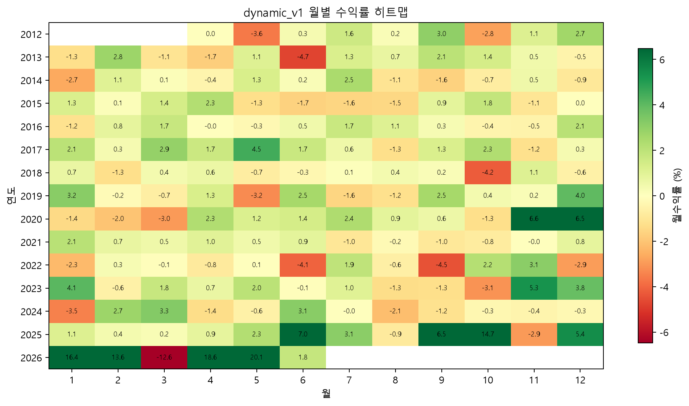

[그림 5-1. dynamic_v1 월별 수익률 히트맵]

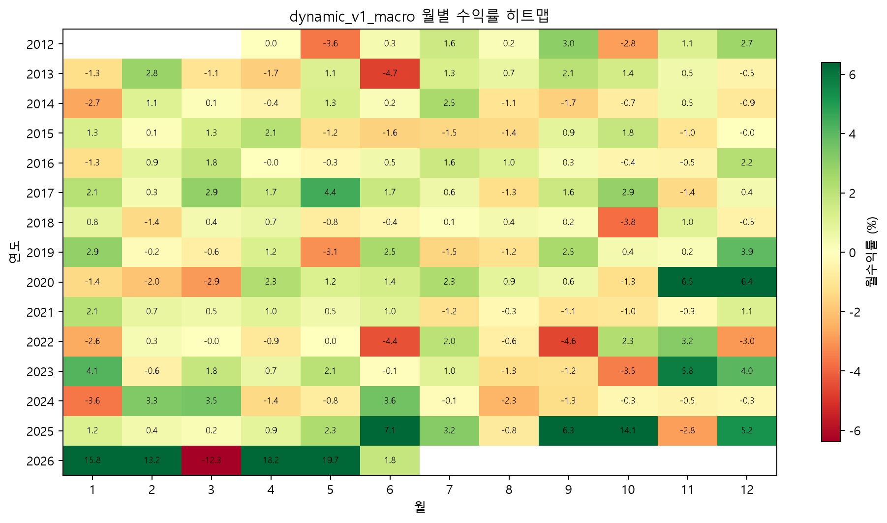

[그림 5-2. dynamic_v1_macro 월별 수익률 히트맵]

그림 5-1과 그림 5-2는 각 연도와 월별로 전략 수익률이 어떻게 나타났는지를 보여준다. 녹색에 가까운 구간은 월수익률이 양호했던 달, 붉은색에 가까운 구간은 손실이 발생한 달로 해석할 수 있다. 이 그림은 최종 누적수익률만으로는 확인하기 어려운 월간 손익의 분포를 보여준다.

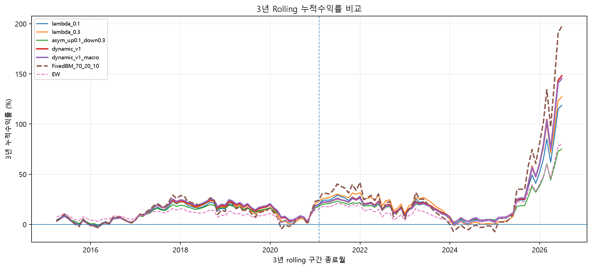

[그림 5-3. 3년 rolling 누적수익률 비교]

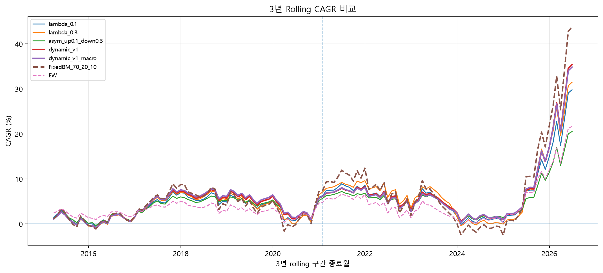

[그림 5-4. 3년 rolling CAGR 비교]

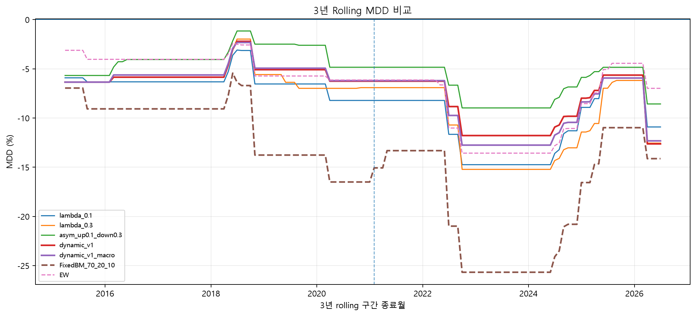

[그림 5-5. 3년 rolling MDD 비교]

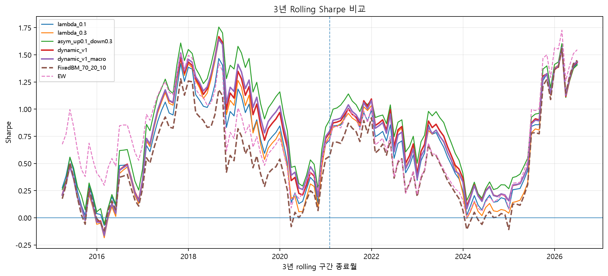

[그림 5-6. 3년 rolling Sharpe 비교]

그림 5-3부터 그림 5-6은 36개월 rolling window를 기준으로 전략별 성과지표를 비교한 것이다. 3년 rolling 누적수익률과 CAGR은 각 3년 구간에서 전략이 양의 성과를 유지했는지 확인하기 위한 자료이다. MDD는 해당 3년 구간에서 발생한 최대낙폭을 보여주며, Sharpe는 변동성 대비 수익이 얼마나 안정적이었는지를 보여준다.

이 점검의 목적은 특정 한 구간의 성과만으로 후보를 판단하지 않는 데 있다. rolling 구간에서 음수 누적수익률이 반복되는 전략은 전체기간 성과가 양호하더라도 실무 적용 시 부담이 클 수 있다. 반대로 rolling 구간에서 음수 누적수익률이 적고, MDD가 낮으며 Sharpe가 안정적인 전략은 방어형 RoboAdvisor 후보로서 더 안정적으로 해석할 수 있다.

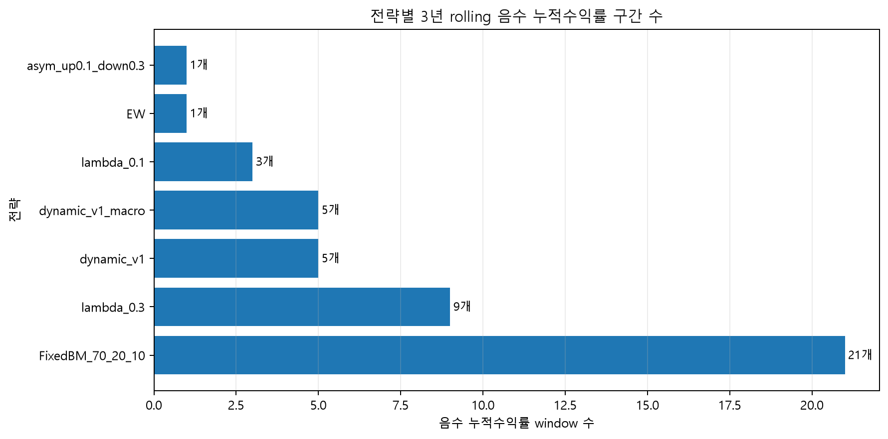

[그림 5-7. 전략별 3년 rolling 음수 누적수익률 구간 수]

그림 5-7은 각 전략별로 3년 rolling 누적수익률이 음수였던 구간의 수를 비교한 것이다. 이 그림은 “3년 단위로 굴려 보았을 때 손실 구간이 얼마나 자주 발생했는가”를 요약한다. 방어형 전략을 선택할 때는 단순히 가장 높은 최종 수익률을 기록한 전략보다, rolling 구간에서 음수 성과가 적고 낙폭이 완만한 전략을 더 안정적인 후보로 볼 수 있다.

---

# 10. 회전율·거래비용·슬리피지 민감도 점검

전략 성과를 해석할 때는 수익률만으로 후보를 판단하기 어렵다. 백테스트에서 비슷한 성과를 보이는 전략이라도, 어떤 전략은 적은 매매로 그 결과를 만들고, 다른 전략은 잦은 매매로 비슷한 성과를 만들 수 있다. 후자의 경우 실제 운용에서는 거래비용, 슬리피지, 체결 불확실성에 더 많이 노출된다. 따라서 성과지표와 함께 Turnover를 별도로 점검하였다.

Turnover는 리밸런싱 과정에서 포트폴리오 비중이 얼마나 많이 바뀌었는지를 나타내는 지표이다. 예를 들어 위험자산을 줄이고 방어자산을 늘리는 과정에서 매매가 많이 발생하면 Turnover가 커진다. 월별 Turnover를 계산하고, 이를 연도별로 합산하여 특정 연도에 매매가 과도하게 집중되었는지 확인하였다.

슬리피지는 실제 거래가격이 이론상 가격이나 기대 가격과 달라지면서 발생하는 비용을 의미한다. 예를 들어 ETF를 매수하려고 할 때 호가 차이 때문에 예상보다 조금 비싸게 사거나, 매도할 때 예상보다 조금 싸게 팔게 되는 경우가 있다. 실제 호가 스프레드, 시장충격비용, 세금, 체결 실패 가능성을 직접 모델링하지는 않았다. 대신 `Turnover × 비용률` 방식으로 0bp, 5bp, 10bp, 20bp 비용 민감도를 적용하였다. 따라서 비용 분석은 실제 거래비용을 정확히 추정한 결과가 아니라, 회전율이 높은 전략이 비용에 얼마나 취약할 수 있는지 확인하기 위한 점검으로 해석한다.

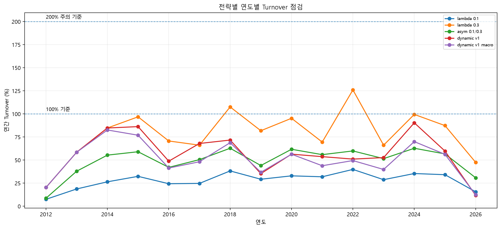

[그림 8. 전략별 연도별 Turnover 점검]

그림 8은 주요 전략의 연도별 Turnover를 보여준다. 연간 Turnover 100%와 200%를 기준선으로 함께 확인하였다. 연간 Turnover가 100% 미만이면 매매가 지나치게 잦다고 보기 어렵고, 100%를 넘는 해가 반복되면 거래비용과 운용 안정성을 더 조심스럽게 봐야 한다. 200% 이상은 교육용 백테스트에서 성과가 좋아 보이더라도 실전 운용 가능성 측면에서 상당히 보수적으로 해석해야 하는 구간으로 보았다.

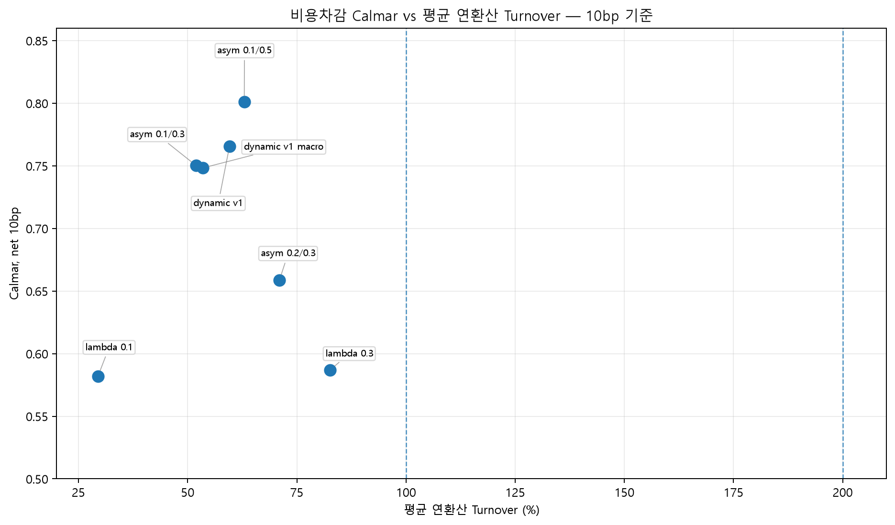

[그림 9. 10bp 비용차감 Calmar와 평균 연환산 Turnover 비교]

그림 9는 10bp 비용차감 기준 Calmar와 평균 연환산 Turnover를 함께 보여준다. 후보 간 차이를 보기 쉽도록 Calmar 0.50 이상 구간을 확대해 표시하였다. 오른쪽으로 갈수록 평균 매매 회전이 많고, 위로 갈수록 비용차감 후 위험조정 성과가 좋다. 따라서 왼쪽 위에 가까운 전략일수록 적은 회전율로 비교적 양호한 성과-위험 균형을 보인다고 해석할 수 있다.

10bp 비용차감 기준 결과는 다음과 같다.

[표 6-1. 10bp 비용차감 성과 요약]

| 전략 | CAGR | MDD | Calmar |
|---|---:|---:|---:|
| lambda_0.1 | 8.607% | -14.788% | 0.582 |
| lambda_0.3 | 9.002% | -15.335% | 0.587 |
| asym_up0.1_down0.3 | 6.790% | -9.049% | 0.750 |
| asym_up0.1_down0.5 | 5.731% | -7.154% | 0.801 |
| asym_up0.2_down0.3 | 8.376% | -12.719% | 0.659 |
| dynamic_v1 | 9.669% | -12.630% | 0.766 |
| dynamic_v1_macro | 9.590% | -12.816% | 0.748 |

[표 6-2. 10bp 비용차감 회전율 점검 요약]

| 전략 | 평균 월 Turnover | 평균 연환산 Turnover | 최대 연간 Turnover | 100% 초과 연도 | 200% 초과 연도 | 해석 |
|---|---:|---:|---:|---:|---:|---|
| lambda_0.1 | 2.455% | 29.465% | 39.851% | 0 | 0 | 회전율 낮음 |
| lambda_0.3 | 6.886% | 82.627% | 125.984% | 2 | 0 | 일부 연도 회전율 주의 |
| asym_up0.1_down0.3 | 4.324% | 51.884% | 62.782% | 0 | 0 | 회전율 안정 |
| asym_up0.1_down0.5 | 5.246% | 62.957% | 76.663% | 0 | 0 | 회전율 안정 |
| asym_up0.2_down0.3 | 5.916% | 70.991% | 98.285% | 0 | 0 | 100% 미만 |
| dynamic_v1 | 4.964% | 59.572% | 90.340% | 0 | 0 | 성과-회전율 균형 양호 |
| dynamic_v1_macro | 4.452% | 53.423% | 82.568% | 0 | 0 | 저회전 확장안 |


표 6-1 과 표 6-2를 보면 lambda_0.3은 평균 연환산 Turnover가 82.627%로 100% 미만이지만, 특정 연도에서는 최대 125.984%까지 상승했고 100%를 넘는 해가 2회 있었다. 따라서 성과만 보면 후보로 볼 수 있지만, 회전율이 특정 연도에 높아지는 특성이 있어 실전 적용 관점에서는 추가 주의가 필요하다.

반면 dynamic_v1은 10bp 비용차감 기준에서 CAGR 9.669%, MDD -12.630%, Calmar 0.766을 기록하였다. 평균 연환산 Turnover는 59.572%, 최대 연간 Turnover는 90.340%로 확인되었다. 이 범위 안에서는 dynamic_v1의 성과가 과도한 매매 빈도에서만 만들어졌다고 보기는 어렵다.

dynamic_v1_macro는 CAGR 9.590%, MDD -12.816%, Calmar 0.748을 기록하였다. 평균 연환산 Turnover는 53.423%, 최대 연간 Turnover는 82.568%였다. dynamic_v1_macro는 dynamic_v1보다 Calmar와 MDD는 소폭 낮았지만, Turnover는 더 낮았다. 따라서 이 전략은 기본 후보를 대체하기보다는 MacroRisk 조건을 반영한 저회전·보수 확장안으로 해석하는 것이 적절하다.

다만 이 분석은 실제 슬리피지를 직접 반영한 것은 아니다. 실제 운용에서는 ETF 호가 스프레드, 체결 비용, 세금, 시장충격비용이 추가로 발생할 수 있다. 따라서 이 결과는 실거래 비용까지 완전히 반영한 결론이 아니라, 비용 민감도와 회전율 안정성을 함께 확인한 결과로 제한해서 해석한다.

---

# 11. Factor loading과 rolling factor exposure

E24 factor loading은 전략 수익률이 어떤 요인에 노출되어 있었는지를 설명하기 위한 진단 절차이다. Market, Bond, Momentum, Volatility, MacroRisk를 주요 팩터로 사용하였다. Market은 069500 월수익률, Bond는 114260 월수익률, Momentum은 069500의 3개월 누적수익률, Volatility는 069500 월수익률의 12개월 rolling 연환산 변동성, MacroRisk는 rate_up_flag와 fx_up_flag의 단순 합으로 정의하였다.

Factor loading은 전략을 고르는 기준이라기보다, 이미 만들어진 전략이 어떤 요인에 노출되어 있었는지 설명하기 위한 도구이다. 예를 들어 어떤 전략의 Market beta가 낮다면, 그 전략은 주식시장 움직임에 덜 민감했을 가능성이 있다. Bond beta가 높다면, 채권형 방어자산의 영향을 더 많이 받았을 수 있다.

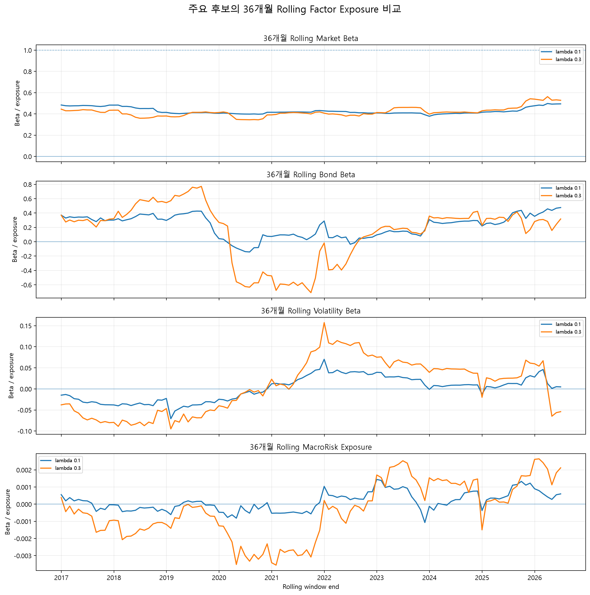

[그림 10. lambda_0.1과 lambda_0.3의 36개월 rolling factor exposure 비교]

그림 10은 lambda_0.1과 lambda_0.3의 36개월 rolling factor exposure를 비교한 것이다. 두 전략은 같은 HSI 목표비중 체계를 사용하지만, λ 값이 다르기 때문에 시장·채권·변동성·거시위험 팩터에 대한 노출 경로가 다르게 나타난다. 특히 lambda_0.3은 목표비중 변화에 더 빠르게 반응하므로 일부 구간에서 Bond beta와 Volatility beta의 변동폭이 더 크게 나타난다. 반면 lambda_0.1은 상대적으로 완만하게 이동하기 때문에 factor exposure도 더 부드럽게 변하는 경향을 보인다.

이 결과는 λ가 단순히 회전율만 바꾸는 변수가 아니라, 실제 포트폴리오의 시장·채권·변동성 노출 경로에도 영향을 줄 수 있음을 보여준다. 다만 rolling factor exposure는 후보를 새로 고르기 위한 기준이 아니라, 이미 실행한 전략이 어떤 위험요인에 노출되어 있었는지 설명하기 위한 진단 자료로 해석한다.

그림 10은 주요 후보의 36개월 rolling factor exposure를 보여준다. 36개월 rolling 방식은 일정한 기간을 한 칸씩 밀어가며 반복 계산하는 방식이다. 이를 통해 전략의 Market, Bond, Volatility, MacroRisk 노출이 시간에 따라 어떻게 달라졌는지 확인할 수 있다.

그리고 전략별 factor exposure가 고정되어 있지 않고, 시기별로 달라지는 것을 확인할 수 있다. 이는 HSI 상태와 λ 실행속도에 따라 실제 포트폴리오 비중이 달라지기 때문이다. 다만 rolling factor exposure는 성과를 사후적으로 정당화하기 위한 도구가 아니다. 이 결과는 “전략이 어떤 노출 구조를 가졌는지 설명하는 진단 자료”로 사용한다.

E24 factor loading 결과에서 FixedBM과 EW의 raw 수익률은 ETF 수익률의 고정 조합이므로 R²가 1에 가깝게 나타나는 것이 자연스럽다. FixedBM은 069500 70%, 114260 20%, 153130 10%의 고정 조합이기 때문에 Market beta와 Bond beta가 해당 구조를 거의 그대로 반영한다.

HSI_baseline은 FixedBM보다 낮은 Market beta와 높은 Bond beta를 보였고, 변동성 상승 구간에서 음의 노출이 관찰되었다. 이는 HSI 상태 변화가 위험자산 비중을 줄이고 방어자산 비중을 확대하는 방식으로 작동했기 때문으로 해석할 수 있다. 다만 이 해석은 회귀 결과에 기반한 설명이며, 이를 근거로 새로운 λ 후보를 사후 선택하지는 않았다.

---

# 12. Dynamic λ와 MacroRisk 확장안

dynamic_v1은 시장상태 변수에 따라 월별 λ를 다르게 적용한 시변 λ 전략이다. 기본 λ는 0.3이며, 고위험 조건에서는 0.1을 사용하고, 안정적인 risk_relief 조건에서는 0.5를 사용한다. 이 규칙은 목표비중으로 이동하는 속도를 시장상태에 따라 조절하기 위한 것이다.

dynamic_v1_macro는 dynamic_v1에 MacroRisk 조건을 추가한 확장안이다. MacroRisk는 금리 상승 flag와 환율 상승 flag의 단순 합으로 구성하였다. MacroRisk >= 2는 금리 상승 압력과 환율 상승 압력이 동시에 관찰되는 달을 의미한다.

E30-M에서는 기존 dynamic_v1 조건에 MacroRisk >= 2 조건을 명시적으로 결합하여 macro-aware dynamic λ v1을 재실행하였다. 실행 결과 MacroRisk 조건은 실제로 작동하였다. 고위험 조건으로 분류된 월은 기존 dynamic_v1보다 증가했고, 고위험 사유 중 macro 단독 또는 macro와 다른 위험 조건이 함께 작동한 사례가 확인되었다.

다만 dynamic_v1_macro는 기존 dynamic_v1 대비 CAGR, MDD, Calmar를 명확히 개선하지는 못했다. 대신 연환산 변동성과 평균 Turnover는 소폭 낮아졌다. 따라서 MacroRisk 조건은 성과 개선을 보장하는 최적화 규칙이라기보다, 거시위험을 반영한 보수적 위험조절 장치로 해석하는 것이 적절하다.

또한 고위험 구간에서 λ를 낮추는 방식에는 한계가 있다. 목표비중이 방어 방향으로 이동해야 하는 경우에도 λ가 낮아지면 실제 포트폴리오가 방어 목표비중으로 이동하는 속도가 느려질 수 있다. 따라서 후속 실험에서는 방향별 λ와 상황별 λ를 결합하는 구조를 검토할 필요가 있다.

---

# 13. Adoption decision

최종 후보 판단은 OOS 구간에서 10bp 거래비용을 차감한 net 성과를 기준으로 수행하였다. 판정은 superiority, 즉 우월성 입증이 아니라 non-inferiority, 즉 비열등 기준으로 설정하였다. 방어형 RoboAdvisor 전략에서는 항상 BM보다 높은 수익률을 내는 것보다, 방어형 참여자에게 적합한 위험조정 성과와 낙폭 통제 특성을 안정적으로 제공하는 것이 중요하기 때문이다.

사전등록 비열등 기준은 다음 네 가지이다.

| 기준 | 의미 |
|---|---|
| Calmar_net ≥ 대칭 최우수 × 0.90 | 대칭 λ 후보 대비 위험조정 성과가 크게 밀리지 않는지 확인 |
| MDD 악화 ≤ 대칭 λ=0.1 대비 2.0%p | 낙폭이 과도하게 악화되지 않는지 확인 |
| tail-month 평균수익 악화 ≤ 0.3%p | 위험월 방어력이 크게 약해지지 않는지 확인 |
| 평균 Turnover ≤ 대칭 λ=0.3 × 1.5 | 회전율이 과도하지 않은지 확인 |

[표 7. Adoption decision 판정 기준]

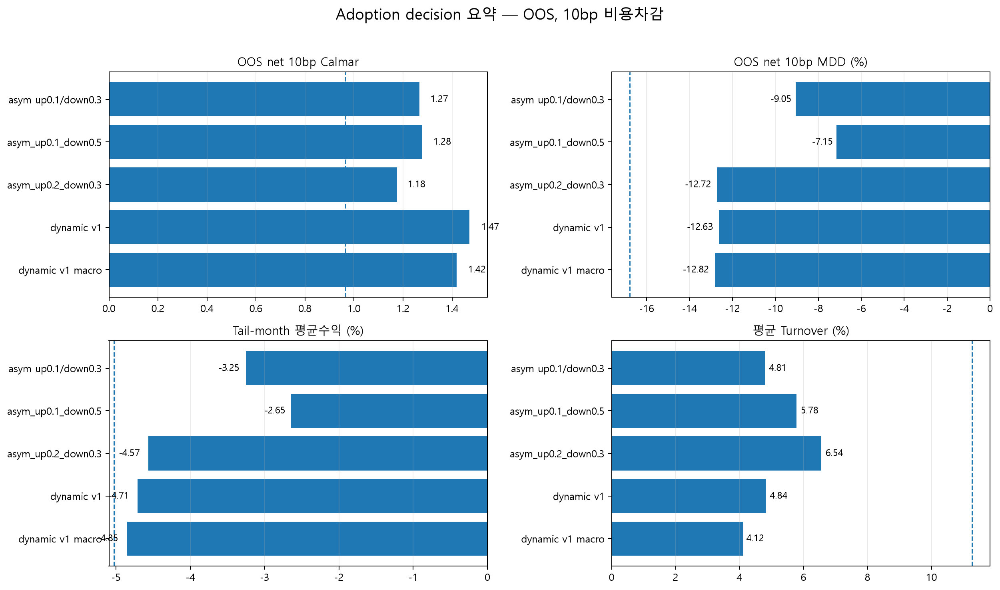

[그림 11. OOS 10bp 비용차감 adoption decision 요약]

그림 11은 OOS 10bp 비용차감 기준에서 각 시변 후보의 Calmar, MDD, tail-month 평균수익, 평균 Turnover를 비교한 것이다. 이 그림은 최종 후보를 단일 수익률 기준으로 고르지 않고, 위험조정 성과와 회전율을 함께 판단하기 위한 자료이다.

34번 adoption decision 결과, 모든 주요 시변 후보가 비열등 기준을 통과하였다. 주요 결과는 다음과 같다.

| 전략 | Calmar_net | MDD | tail-month 평균수익 | 평균 Turnover | non-inferior |
|---|---:|---:|---:|---:|---|
| asym_up0.1_down0.3 | 1.267 | -9.049% | -3.253% | 4.809% | True |
| asym_up0.1_down0.5 | 1.279 | -7.154% | -2.646% | 5.782% | True |
| asym_up0.2_down0.3 | 1.176 | -12.719% | -4.568% | 6.541% | True |
| dynamic_v1 | 1.471 | -12.630% | -4.710% | 4.835% | True |
| dynamic_v1_macro | 1.418 | -12.816% | -4.853% | 4.116% | True |

[표 8. OOS 10bp 비용차감 adoption decision 결과]

표 8을 보면 dynamic_v1과 dynamic_v1_macro는 모두 비열등 기준을 통과하였다. dynamic_v1은 Calmar_net 1.471, MDD -12.630%, tail-month 평균수익 -4.710%, 평균 Turnover 4.835%를 기록하였다. dynamic_v1_macro는 Calmar_net 1.418, MDD -12.816%, tail-month 평균수익 -4.853%, 평균 Turnover 4.116%를 기록하였다.

두 전략 모두 기준을 통과했지만, 해석은 다르게 해야 한다. dynamic_v1은 Calmar, MDD, tail-month 방어력에서 dynamic_v1_macro보다 소폭 우수하였다. 반면 dynamic_v1_macro는 평균 Turnover가 더 낮았다. 따라서 dynamic_v1을 기본 시변 λ 후보로 유지하고, dynamic_v1_macro는 MacroRisk를 반영한 저회전·보수 확장안으로 제시한다.

이 결론은 결과가 가장 좋아 보이는 후보를 사후적으로 고른 것이 아니라, IS/OOS, walk-forward, 비용 민감도, 회전율 점검, 사전등록 비열등 판정을 거쳐 도출한 것이다.

Adoption decision은 OOS 10bp 비용차감 기준에서 Calmar, MDD, tail-month 방어력, Turnover 조건을 통과했는지 확인하는 절차이다. 그러나 실무 적용 관점에서는 이 판정만으로 충분하지 않을 수 있다. 특정 OOS 구간에서 조건을 통과했더라도, 3년 단위로 굴려 보았을 때 손실 구간이 반복된다면 안정적인 후보로 보기 어렵기 때문이다.

따라서 최종 후보 판단에서는 adoption decision과 3년 rolling 성과 점검을 함께 해석하였다. Adoption decision은 “OOS 비용차감 기준을 통과했는가”를 확인하고, 3년 rolling 음수 누적수익률 window 수는 “3년 단위로 보아도 손실 구간이 적은가”를 확인한다. 두 기준을 함께 보면, 단일 기간의 최종 성과에 의존하지 않고 전략의 실행 안정성을 더 입체적으로 판단할 수 있다.

정리하면 최종 의사결정 구조는 다음과 같다.

1. OOS 10bp 비용차감 기준에서 Calmar, MDD, tail-month, Turnover 조건을 통과하는가?
2. 3년 rolling 누적수익률 기준에서 음수 성과 구간이 반복적으로 발생하지 않는가?
3. 최종 CAGR이 높더라도 MDD와 rolling 손실구간이 과도하지 않은가?
4. Turnover가 과도하지 않아 실제 운용 가능성이 유지되는가?

이 기준에 따라 최종 후보는 단순히 수익률이 가장 높은 전략이 아니라, 비용차감 성과, 낙폭 통제, 회전율, rolling 안정성을 함께 고려하여 해석하였다.

## 13.1 최종 추천 RA 가상 포트폴리오와 BM 성과 비교

앞선 절에서는 OOS 10bp 비용차감 기준의 adoption decision을 통해 후보 전략이 방어형 RoboAdvisor 후보로서 크게 밀리지 않는지를 확인하였다. 이 절에서는 선정과정을 거친 이후의 최종 추천 RA 가상 포트폴리오가 메인 BM 및 보조 BM 대비 어떤 성과 흐름을 보였는지 별도로 비교한다.

최종 추천 RA 가상 포트폴리오는 dynamic_v1을 기준으로 구성하였다. dynamic_v1은 시장상태 변수에 따라 월별 λ를 조절하는 시변 λ 전략이며, 본 프로젝트에서는 기본 RA 후보로 해석하였다. 비교 대상은 메인 BM인 FixedBM_70_20_10과 보조 BM인 EW이다. FixedBM_70_20_10은 069500 70%, 114260 20%, 153130 10%의 고정비중 포트폴리오이고, EW는 세 ETF를 동일비중으로 보유하는 단순 비교 기준이다.

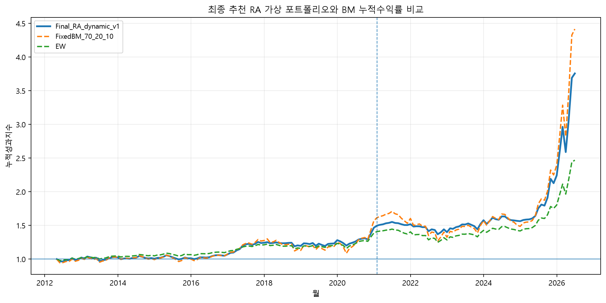

[그림 13-1. 최종 추천 RA 가상 포트폴리오와 BM 누적수익률 비교]

그림 13-1은 최종 추천 RA 가상 포트폴리오와 BM의 누적수익률 시계열을 비교한 것이다. 세로 점선은 OOS 검증구간 시작 시점이다. 따라서 점선 이후의 성과 흐름은 전략 설계 이후의 검증구간 성과로 해석한다. 이 그림은 최종 시점의 수익률만 보는 것이 아니라, 시간에 따라 RA 포트폴리오와 BM의 성과 격차가 어떻게 형성되었는지 확인하기 위한 자료이다. FixedBM_70_20_10은 위험자산 비중이 높기 때문에 상승 구간에서 높은 누적성과를 보일 수 있다. 반면 RA 가상 포트폴리오는 HSI 상태와 λ 실행속도 규칙에 따라 위험자산 비중을 조절하므로, 단순히 BM의 수익률을 추종하기보다 낙폭과 변동성을 함께 통제하는 방향으로 움직인다.

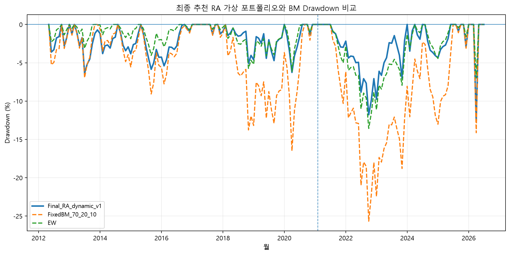

[그림 13-2. 최종 추천 RA 가상 포트폴리오와 BM Drawdown 비교]

그림 13-2는 동일한 비교대상에 대해 Drawdown 추이를 나타낸 것이다. 누적수익률 차트만 보면 위험자산 비중이 높은 BM이 유리해 보일 수 있지만, Drawdown 차트를 함께 보면 해당 성과가 어느 정도의 낙폭을 동반했는지 확인할 수 있다. 방어형 RoboAdvisor 관점에서는 최종 누적수익률뿐 아니라, 하락 구간에서 손실 폭이 얼마나 커졌는지, 그리고 이후 회복 경로가 얼마나 안정적이었는지를 함께 보는 것이 중요하다.

시계열 차트만으로는 수익과 위험의 차이를 정량적으로 비교하기 어렵기 때문에, 동일한 비교대상에 대해 성과지표를 추가로 정리하였다. 표 13-1은 수익·위험 성과지표를 비교하고, 표 13-2는 실행 과정에서 발생한 Turnover를 정리한다. 이를 통해 최종 RA 가상 포트폴리오가 BM 대비 어떤 수익률을 기록했는지뿐 아니라, 그 성과가 어느 정도의 변동성, 낙폭, 회전율을 동반했는지 함께 확인한다.

[표 13-1. 최종 추천 RA 가상 포트폴리오와 BM의 수익·위험 성과지표]

| 구간 | 전략 | 누적수익률(%) | CAGR(%) | 연환산 변동성(%) | MDD(%) | Sharpe | Calmar |
|---|---|---:|---:|---:|---:|---:|---:|
| OOS | Final_RA_dynamic_v1 | 156.11 | 18.65 | 18.12 | -12.63 | 1.03 | 1.48 |
| OOS | FixedBM_70_20_10 | 181.37 | 20.69 | 23.11 | -25.67 | 0.93 | 0.81 |
| OOS | EW | 77.79 | 11.03 | 11.23 | -13.57 | 0.99 | 0.81 |
| FULL | Final_RA_dynamic_v1 | 275.72 | 9.73 | 12.49 | -12.63 | 0.81 | 0.77 |
| FULL | FixedBM_70_20_10 | 341.62 | 10.99 | 16.58 | -25.67 | 0.71 | 0.43 |
| FULL | EW | 146.94 | 6.55 | 7.99 | -13.57 | 0.83 | 0.48 |

[표 13-2. 최종 추천 RA 가상 포트폴리오와 BM의 실행·회전율 지표]

| 구간 | 전략 | 시작일 | 종료일 | 월 수 | 평균 월 Turnover(%) | 평균 연환산 Turnover(%) |
|---|---|---|---|---:|---:|---:|
| OOS | Final_RA_dynamic_v1 | 2021-01-31 | 2026-06-30 | 66 | 4.84 | 58.02 |
| OOS | FixedBM_70_20_10 | 2021-01-31 | 2026-06-30 | 66 | 0.00 | 0.00 |
| OOS | EW | 2021-01-31 | 2026-06-30 | 66 | 0.00 | 0.00 |
| FULL | Final_RA_dynamic_v1 | 2012-04-30 | 2026-06-30 | 171 | 4.96 | 59.57 |
| FULL | FixedBM_70_20_10 | 2012-04-30 | 2026-06-30 | 171 | 0.00 | 0.00 |
| FULL | EW | 2012-04-30 | 2026-06-30 | 171 | 0.00 | 0.00 |

표 13-1과 표 13-2에는 최종 추천 RA 가상 포트폴리오와 BM의 OOS 및 FULL 구간 성과지표를 정리하였다. IS 구간을 포함한 전체 결과는 별도 CSV 산출물에 저장하였다. 표 13-1은 누적수익률, CAGR, 연환산 변동성, MDD, Sharpe, Calmar를 통해 수익·위험 성과를 비교한다. 표 13-2는 분석 기간과 평균 Turnover를 정리하여, 해당 성과가 어느 정도의 리밸런싱 부담을 동반했는지 확인한다.

이 비교의 목적은 최종 추천 RA 가상 포트폴리오가 BM보다 모든 구간에서 더 높은 수익률을 기록했는지를 확인하는 데 있지 않다. 본 프로젝트의 핵심 프레이밍은 수익률 알파가 아니라 낙폭 통제 엣지이다. 따라서 최종 판단은 누적수익률 하나가 아니라, CAGR, 변동성, MDD, Sharpe, Calmar, Turnover를 함께 고려하여 수행한다.

표 13-1을 보면 OOS 구간에서 Final_RA_dynamic_v1의 누적수익률과 CAGR은 FixedBM_70_20_10보다 낮았다. OOS 기준 Final_RA_dynamic_v1의 CAGR은 18.65%, FixedBM_70_20_10의 CAGR은 20.69%였다. 그러나 연환산 변동성과 MDD는 Final_RA_dynamic_v1이 더 낮게 나타났다. 특히 OOS 기준 MDD는 Final_RA_dynamic_v1이 -12.63%, FixedBM_70_20_10이 -25.67%로 나타나, 최종 RA 가상 포트폴리오가 하락 구간에서 낙폭을 더 완만하게 통제한 것으로 해석할 수 있다.

FULL 구간에서도 같은 방향의 차이가 확인된다. FixedBM_70_20_10은 누적수익률과 CAGR이 더 높았지만, MDD는 -25.67%로 Final_RA_dynamic_v1의 -12.63%보다 크게 나타났다. 반면 Final_RA_dynamic_v1은 FULL 기준 Calmar가 0.77로 FixedBM_70_20_10의 0.43보다 높았다. 이는 최종 RA 가상 포트폴리오가 절대수익률을 극대화한 전략이라기보다, 낙폭 대비 수익의 균형을 개선한 방어형 전략에 가깝다는 점을 보여준다.

표 13-2를 보면 Final_RA_dynamic_v1의 평균 월 Turnover는 OOS 기준 4.84%, FULL 기준 4.96%이며, 이를 연환산하면 각각 58.02%, 59.57% 수준이다. 이는 HSI 상태와 λ 실행속도 규칙에 따라 포트폴리오가 월별로 조정되었기 때문에 발생한 실행 부담이다. BM의 Turnover는 본 비교표에서 고정비중 기준 성과 경로로 처리하여 0으로 표시하였다. 따라서 Turnover 항목은 RA 전략의 실행 부담을 확인하기 위한 보조 지표로 해석하는 것이 적절하다.

종합하면, 최종 추천 RA 가상 포트폴리오는 FixedBM_70_20_10보다 높은 최종 누적수익률을 기록한 전략은 아니었다. 그러나 변동성, MDD, Calmar 측면에서는 방어형 RoboAdvisor 전략으로 해석 가능한 특징을 보였다. 따라서 본 프로젝트의 핵심 결과는 “BM 대비 절대수익률 우위”가 아니라, “위험자산 참여를 유지하면서도 낙폭과 위험조정 성과를 개선하려는 상태기반 실행 규칙”으로 정리하는 것이 적절하다.

---

# 14. 최종 결론

HSI 기반 ETF 방어형 Overlay 전략을 RoboAdvisor형 자산배분 규칙으로 구현하고, 백테스트와 후속 검증을 통해 전략의 성과와 한계를 확인하였다.

첫째, 전략은 특정 월의 수익률을 직접 예측하는 모델이 아니다. HSI 상태를 해석하고, 그 상태에 따라 위험자산·채권형 방어자산·현금성 방어자산의 목표비중을 정한 뒤, λ를 통해 실제 포트폴리오가 목표비중으로 이동하는 속도를 조절하는 구조이다.

둘째, 핵심 성과는 수익률 알파가 아니라 낙폭 통제 엣지이다. FixedBM_70_20_10은 전체 구간에서 가장 높은 CAGR을 기록했지만, MDD도 가장 컸다. 반면 dynamic_v1과 dynamic_v1_macro는 FixedBM보다 CAGR은 낮지만, MDD를 크게 낮추고 Calmar를 개선하였다.

셋째, dynamic_v1은 OOS와 walk-forward 검증에서 성과-위험 균형을 유지하였다. 또한 10bp 비용차감 adoption decision에서도 비열등 기준을 통과하였다. 회전율 점검에서도 평균 연환산 Turnover 59.572%, 최대 연간 Turnover 90.340%로 100% 기준을 넘지 않았다. 따라서 dynamic_v1은 기본 시변 λ 후보로 제시할 수 있다.

넷째, dynamic_v1_macro는 MacroRisk 조건을 실제로 반영한 확장안이다. MacroRisk 조건은 고위험 월 분류에 실제로 기여했고, dynamic_v1보다 평균 Turnover를 낮추었다. 그러나 CAGR, MDD, Calmar, tail-month 방어력은 dynamic_v1보다 소폭 낮았다. 따라서 dynamic_v1_macro는 기본 후보를 대체하기보다, macro-aware 저회전·보수 확장안으로 해석하는 것이 적절하다.

다섯째, 백테스트 성과를 그대로 신뢰하지 않고 여러 단계의 검증을 수행하였다. 가격-수익률 재현성 검증, factor input 원칙 점검, t월 신호→t+1월 수익률 적용, IS/OOS 분리, walk-forward 평가, 누수 점검, 비용 민감도, 연도별 Turnover 점검, 연단위 매수/매도 Turnover 분리 산출, 3년 rolling 성과추이 점검, adoption decision을 통해 결과의 절차적 안정성을 확인하였다.

여섯째, 선정과정을 거친 이후 최종 추천 RA 가상 포트폴리오와 BM의 성과 흐름을 별도로 비교하였다. Final_RA_dynamic_v1은 FixedBM_70_20_10보다 누적수익률과 CAGR은 낮았지만, OOS와 FULL 구간 모두에서 MDD가 더 낮고 Calmar가 더 높게 나타났다. 이는 최종 RA 가상 포트폴리오가 BM 대비 절대수익률을 항상 초과하는 전략이라기보다, 위험자산 참여를 유지하면서 낙폭 대비 수익의 균형을 개선하려는 방어형 실행 규칙에 가깝다는 점을 보여준다.

따라서 최종 결론은 다음과 같다. HSI 기반 λ Overlay 전략은 BM 대비 수익률을 항상 초과하는 전략이라고 주장할 수는 없다. 그러나 방어형 참여자 관점에서는 시장상태 해석을 바탕으로 위험자산 비중 이동 속도를 조절하고, 낙폭과 회전율을 관리하는 RoboAdvisor형 자산배분 규칙으로서 의미가 있다. 또한 최종 성과표 하나에만 의존하지 않고 월별 성과 흐름과 3년 rolling 성과추이를 함께 확인함으로써, 특정 구간의 결과에 과도하게 의존하지 않도록 검증 범위를 확장하였다.

---

# 15. 한계와 후속 과제

몇 가지 한계가 있다.

첫째, 실제 슬리피지를 직접 반영하지 않았다. Turnover × 비용률 방식으로 0bp, 5bp, 10bp, 20bp 비용 민감도를 적용했지만, 실제 ETF 거래에서는 호가 스프레드, 세금, 시장충격비용, 체결 실패 가능성이 존재한다. 따라서 비용 분석은 실거래 비용의 정확한 추정치가 아니라, 회전율이 높은 전략의 취약성을 점검하기 위한 민감도 분석으로 제한된다.

둘째, dynamic_v1_macro는 MacroRisk 조건을 추가했지만 기존 dynamic_v1을 명확히 개선하지는 못했다. 이는 거시위험 조건을 넣는 것 자체가 항상 성과 개선으로 이어지는 것은 아니라는 점을 보여준다. MacroRisk는 유용한 진단 변수일 수 있지만, 단순히 조건을 추가한다고 최종 성과가 개선되는 것은 아니다.

셋째, 고위험 구간에서 λ를 낮추는 방식은 방어 전환을 느리게 만들 수 있다. 예를 들어 위험자산 목표비중이 빠르게 낮아져야 하는 구간에서도 λ가 낮으면 실제 포트폴리오가 방어 목표비중으로 이동하는 속도가 느려질 수 있다. 따라서 후속 v2에서는 방향별 λ와 상황별 λ를 결합하는 구조가 필요하다.

넷째, 검증은 교육용 프로젝트 수준의 백테스트 검증이다. 상용 RoboAdvisor로 사용하기 위해서는 더 긴 데이터, 다양한 시장구간, 세금 및 체결비용, ETF 유동성, 투자자 위험성향별 suitability, 리스크 고지, 실시간 데이터 업데이트 체계가 추가로 필요하다.

다섯째, 최종 RA 가상 포트폴리오와 BM 비교는 동일 유니버스 내 성과 차이를 확인하기 위한 가상 백테스트 결과이다. 실제 RoboAdvisor 서비스로 확장하려면 투자자별 위험성향, 투자한도, 리밸런싱 주기, 세금, 체결 가능성, 상품 교체 가능성 등을 추가로 고려해야 한다. 따라서 본 결과는 실거래 운용 성과의 확정적 예측이 아니라, 방어형 자산배분 규칙의 가능성을 점검한 교육용 검증 결과로 해석해야 한다.

| 개선 과제 | 내용 |
|---|---|
| 방향별 + 상황별 λ 결합 | 위험자산 축소 방향에서는 빠르게, 재진입 방향에서는 천천히 조정하는 구조와 macro 조건을 결합 |
| 슬리피지 모델 보강 | ETF별 호가 스프레드, 세금, 체결비용 반영 |
| MacroRisk v2 | 금리·환율 외에 신용스프레드, 변동성지수 등 추가 검토 |
| 투자자 성향별 포트폴리오 | 방어형, 중립형, 적극형 RA profile로 확장 |
| 실시간 운영 점검 | 월말 데이터 업데이트, 신호 생성, 리밸런싱 안내 자동화 |
| RA 운용 제약 반영 | 투자자 위험성향, 리밸런싱 주기, 세금, 체결 가능성, 상품 교체 가능성을 반영한 실운용형 검증 |
| rolling 검증 확장 | 3년 rolling 외에 1년, 5년 window와 시장국면별 rolling 성과 비교 |

[표 9. 한계와 후속 개선 과제]

---

# 최종 요약

HSI 상태해석을 기반으로 ETF 3종의 목표비중을 조정하고, λ 실행속도를 통해 실제 포트폴리오 이동을 제어하는 방어형 Overlay 전략을 구현하였다. 결과는 단순 수익률 순위가 아니라, 낙폭 통제, 비용차감 성과, 회전율, OOS 검증, factor exposure, adoption decision을 함께 고려하여 해석하였다.

최종 결과에서 FixedBM_70_20_10은 가장 높은 CAGR을 기록했지만 MDD도 가장 컸다. 선정 이후 최종 추천 RA 가상 포트폴리오로 정리한 Final_RA_dynamic_v1 역시 FixedBM보다 누적수익률과 CAGR은 낮았지만, OOS와 FULL 구간 모두에서 MDD와 Calmar 측면의 방어적 특징을 보였다. OOS 10bp 비용차감 기준에서도 사전등록 비열등 조건을 통과했고, 연도별 Turnover 및 매수/매도 Turnover 점검에서도 과도한 회전율은 확인되지 않았다. 따라서 dynamic_v1을 기본 시변 λ 후보로 제시한다.

dynamic_v1_macro는 MacroRisk 조건을 반영한 확장안으로, Turnover를 낮추는 장점이 있었지만 dynamic_v1 대비 성과-위험 지표를 명확히 개선하지는 못했다. 따라서 macro-aware 저회전·보수 확장안으로 제시한다. 이 전략은 BM을 항상 초과하는 수익 전략이라기보다, 방어형 참여자에게 적합한 낙폭 통제형 RoboAdvisor 자산배분 규칙으로 해석하는 것이 적절하다.
