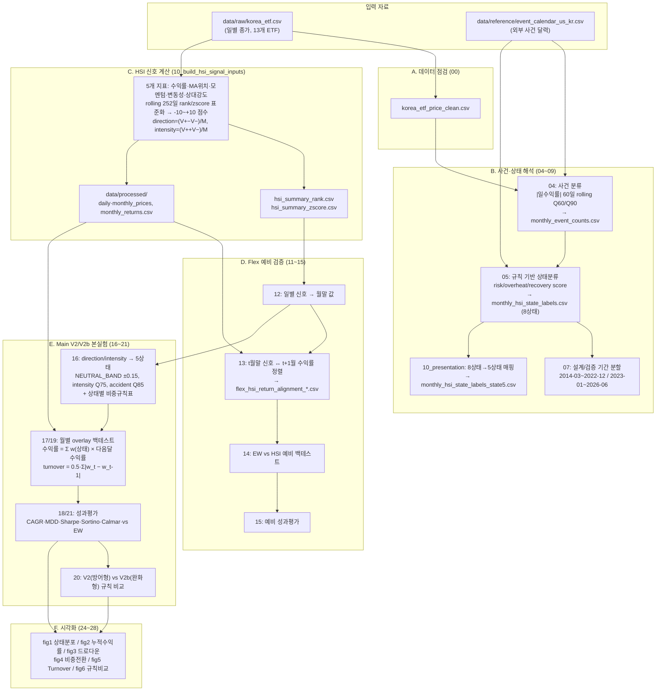

# HSI 파이프라인 설명서 (src 코드 기준)

> 조원 공유용 문서. `src/` 폴더의 실제 코드에서 확인한 입력 → 계산 → 출력 흐름을 정리했다.
> 작성 기준일: 2026-07-02

## 1. 한 줄 요약

한국 상장 ETF의 일별 종가에서 **HSI(Hourglass Signal Index)** 시장상태 신호를 계산하고,
그 상태분류(5상태)에 따라 주식/채권/단기채권 비중을 조절하는 **overlay 전략을 백테스트**하는 파이프라인이다.

## 2. 파이프라인 단계 구성

| 단계 | 스크립트 | 역할 |
|------|----------|------|
| A. 데이터 점검 | `00` | 원본 ETF 종가 품질 점검·정제 |
| B. 사건·상태 해석 | `04`~`09`, `10_build_presentation_state5_tables`, `10_visualize_hsi_hourglass_cone` | 사건 카운트 → 규칙 기반 8상태 → 발표용 5상태, 사건 달력 대조 |
| C. HSI 신호 계산 | `10_build_hsi_signal_inputs` | 5개 가격 지표 → direction/intensity/signal 산출 |
| D. Flex 예비 검증 | `11`~`15` | 월말 변환·정렬(look-ahead 회피)·예비 백테스트 |
| E. Main V2/V2b 본실험 | `16`~`21` | 5상태 비중규칙 → 백테스트 → 성과평가 → 규칙 비교 |
| F. 산출물 인덱스·시각화 | `22`~`29` | fig1~fig6 생성, 출력물 목록화 |
| G. 후속 설계 | `30` | Main V3 실험 설계표(계획 문서 성격) |

보조 모듈: `common/`(공통 함수), `dashboard/`(Streamlit 페이지), `portfolio_optimizer.py`, `tests/`

## 3. 전체 흐름 차트 (입력 → 계산 → 출력)

## 4. 단계별 상세: 입력 → 계산 → 출력

### A. 00_check_korea_etf_data.py — 데이터 점검

- **입력**: `data/raw/korea_etf.csv`
- **계산**: 결측·기간·티커별 데이터 품질 점검, 정제본 생성
- **출력**: `data/processed/korea_etf_price_clean.csv`, `output/tables/korea_etf_data_quality.csv`, `korea_etf_data_summary.csv`

### B. 사건·상태 해석 (04~09)

**04_event_count_index.py — 일별 사건 분류**

- **입력**: `korea_etf_price_clean.csv`, `event_calendar_us_kr.csv`
- **계산**: 일수익률 절대값의 60거래일(`LOOKBACK_DAYS=60`) rolling 분위수 Q60(`SMALL_Q`)·Q90(`LARGE_Q`)을 `shift(1)`로 과거 기준화 → 각 거래일을 크기(small/medium/large) × 방향(up/down/flat) 9분류. 월별 집계로 `risk_event_count`, `overheat_event_count`, `event_balance` 산출
- **출력**: `daily_event_labels.csv`, `monthly_event_counts.csv`, `event_count_summary.csv`, `event_calendar_overlap_summary.csv`

**05_hsi_state_classifier.py — 규칙 기반 8상태 분류**

- **입력**: `monthly_event_counts.csv`, `korea_etf_price_clean.csv`, `event_calendar_us_kr.csv`
- **계산**: 월별로 3개 점수 산출 후 규칙으로 상태 결정
  - `risk_score`(0~8): large_down≥2(+2), medium_down≥3(+1), risk_event_count≥4(+1), 모멘텀·추세 음수(+1씩), 변동성 상승(+1), 상대강도 열위(+1)
  - `overheat_score`, `recovery_score`: 유사한 가점 규칙
  - 8상태: 강한 위험악화 / 고변동성 혼합구간 / 위험악화 / 불안정 과열 / 과열 후보 / 안정적 회복 후보 / 회복 후보 / 중립·혼조
- **출력**: `monthly_hsi_state_labels.csv`, `monthly_hsi_state_summary.csv`, `event_period_state_check.csv`, `event_period_state_distribution.csv`

**06 / 09 — 파동·사건 주석 시각화**: `fig09`~`fig15` PNG와 `monthly_wave_features.csv`, `monthly_wave_market_summary.csv`

**07_split_design_validation_periods.py — 기간 분할**

- **계산**: 설계용 `2014-03~2022-12`, 검증용 `2023-01~2026-06`으로 분리해 상태 분포 안정성 점검
- **출력**: `*_design.csv` / `*_validation.csv` 4쌍 + `design_validation_state_summary.csv`, `design_validation_wave_summary.csv`

**08 — 사건-상태 해석 요약**: `event_hsi_interpretation_summary.csv`

**10_build_presentation_state5_tables.py — 발표용 5상태 파생**

- **계산**: 8상태 → 5상태(`risk_relief`, `neutral_watch`, `conflict`, `risk_warning`, `accident_zone`) 매핑. 원본 8상태는 보존
- **출력**: `monthly_hsi_state_labels_state5.csv`, `state5_mapping_audit.csv`, `fig00`, `fig12`(5상태 분포)

### C. 10_build_hsi_signal_inputs.py — HSI 신호 계산 (핵심)

- **입력**: 원본 ETF 종가 (유니버스 확정: `069500` KODEX 200 / `114260` KODEX 국고채3년 / `153130` KODEX 단기채권, 벤치마크 = 069500)
- **계산** (부호 규약: 음수 = 양호, 양수 = 위험):

| 지표 | 계산식 | 기간 |
|------|--------|------|
| 수익률 | `(P_t / P_{t-w}) − 1` 후 부호 반전 | 20일 |
| MA 위치 | `(P_t / MA_w) − 1` 평균 후 부호 반전 | 20/60/120일 |
| 모멘텀 | n일 수익률 평균 후 부호 반전 | 21/63/126일 |
| 변동성 | 일수익률 rolling std × √252 (반전 없음) | 20일 |
| 상대강도 | 종목 수익률 − 벤치마크 수익률 후 부호 반전 | 21일 |

  - **표준화**: rolling 252일(min 60일) 기준 `rank`(기본, 분위수→-1~+1) 또는 `zscore`(clip ±2.5) → -10~+10 점수 변환
  - **HSI 합성**: `V+ = Σ max(sᵢ,0)`, `V− = Σ max(−sᵢ,0)`, `M = 지표수×10`
    - `direction = (V+ − V−) / M` (-1~+1, **양수 = 위험 악화 방향**)
    - `intensity = (V+ + V−) / M` (0~1, 신호 강도)
    - `signal`: direction < −0.3 → `buy`, > +0.3 → `caution`, 그 외 `watch` (`direction_threshold=0.3`)
  - **그리드 서치**: direction_threshold [0.2, 0.3, 0.4] 등 파라미터 조합 탐색
- **출력**: `data/processed/daily_prices.csv`, `monthly_prices.csv`, `monthly_returns.csv`(decimal 단위), `selected_etf_universe.csv`, `output/tables/hsi_summary_rank.csv`, `hsi_summary_zscore.csv`, `hsi_latest_snapshot_*.csv`, `grid_search_summary_preliminary.csv`
  ※ `data/processed`의 가격·수익률 파일은 실행 시 생성되며 저장소에는 커밋되어 있지 않다.

### D. Flex 예비 검증 (11~15)

| 스크립트 | 입력 | 계산 | 출력 |
|----------|------|------|------|
| 11 | daily/monthly_prices, monthly_returns | 결측·기간·자산군 수 점검 | `flex_data_quality_summary.csv` 외 4종 |
| 12 | hsi_summary_rank/zscore | 일별 신호 → **월말 값** 추출, rank/zscore 비교 | `flex_hsi_monthly_state_{rank,zscore}.csv`, `_compare.csv` |
| 13 | 12 출력 + monthly_returns | **t월말 신호 ↔ t+1월 수익률 정렬** (`signal_date` 컬럼으로 look-ahead bias 회피) | `flex_hsi_return_alignment_{rank,zscore}.csv`, `_check.csv` |
| 14 | 13 출력 | EW vs HSI 규칙 예비 백테스트 | `flex_backtest_timeseries_*.csv`, `flex_strategy_weights_*.csv`, `flex_backtest_rule_summary.csv` |
| 15 | 14 출력 | 예비 성과지표 산출 | `flex_performance_summary.csv`, `flex_cumulative_return_timeseries.csv`, `flex_drawdown_timeseries.csv` |

### E. Main V2/V2b 본실험 (16~21)

**16_main_v2_build_hsi_state5_table.py — 신호 → 5상태 + 비중규칙**

- **입력**: `flex_hsi_monthly_state_{rank,zscore}.csv`
- **계산**: 대표 위험자산(069500)의 direction/intensity 기준으로 상태 결정
  - `NEUTRAL_BAND = ±0.15`: direction > +0.15 위험 악화 / < −0.15 위험 완화 / 사이 중립
  - `HIGH_INTENSITY_QUANTILE = 0.75`: intensity 상위 25%부터 강한 신호
  - `ACCIDENT_DIRECTION_QUANTILE = 0.85`: 위험 방향 상위 15% + 고강도 → accident_zone
  - ETF 간 신호 불일치 → `cross_asset_conflict` → conflict 상태
- **상태별 비중규칙** (069500 / 114260 / 153130):

| 상태 | V2 (방어형) | V2b (완화형) | action |
|------|-------------|---------------|--------|
| risk_relief | ⅓/⅓/⅓ | ⅓/⅓/⅓ | 기본 동일비중 유지 |
| neutral_watch | ⅓/⅓/⅓ | ⅓/⅓/⅓ | 기본 동일비중 유지 |
| conflict | **0.25/0.375/0.375** | **⅓/⅓/⅓** | V2 소폭 방어 / V2b 관찰 처리 |
| risk_warning | 0.20/0.40/0.40 | 0.20/0.40/0.40 | 방어 강화 |
| accident_zone | 0.10/0.45/0.45 | 0.10/0.45/0.45 | 강한 방어전환 |
| insufficient_data | ⅓/⅓/⅓ | ⅓/⅓/⅓ | 자료 부족 시 기본 비중 |

- **출력**: `main_v2_hsi_state5_table_{rank,zscore}.csv`, `main_v2_hsi_state5_definition.csv`, `main_v2_allocation_rule_table.csv`, `main_v2_hsi_state5_distribution.csv`

**17 / 19 — overlay 백테스트 (V2 / V2b)**

- **입력**: 16 출력 + `monthly_returns.csv`
- **계산**: 전략별(EW, HSI overlay) 월간 수익률 = Σ 비중 × 해당 자산의 **다음달** 수익률. 누적수익률, running max, drawdown 계산. `turnover = 0.5 × Σ|w_t − w_{t-1}|` (첫 달 0)
- **출력**: `main_v2{,b}_backtest_timeseries_{rank,zscore}.csv`, `_strategy_weights_*.csv`, `_turnover_summary.csv`, `_signal_return_alignment_check.csv`

**18 / 21 — 성과평가**

- **계산** (`common/metrics.py`):
  - `CAGR = (1+총수익률)^(12/개월수) − 1`
  - `연변동성 = 월수익률 std × √12`
  - `Sharpe = 월평균×12 / 연변동성`, `Sortino = 월평균×12 / (하방 std×√12)`
  - `MDD = min(누적수익률/최고점 − 1)`, `Calmar = CAGR / |MDD|`, Win Rate, EW 대비 차이 컬럼
- **출력**: `main_v2{,b}_performance_summary.csv`, `_cumulative_return_timeseries.csv`, `_drawdown_timeseries.csv`, `_performance_comparison_comment.csv`

**20 — 규칙 비교**: V2 vs V2b 성과 비교 → `main_v2_rule_comparison_summary.csv`, `_comment.csv`

### F. 시각화·인덱스 (22~29)

- 22/29: 실험·시각화 산출물 목록 CSV (`main_v2_experiment_output_index.csv`, `main_v2_visualization_output_index.csv`)
- 23: 시각화 계획표
- 24~28: `output/figures/`에 fig1(상태분포), fig2(누적수익률), fig3(드로다운), fig4(비중전환), fig5(Turnover), fig6(규칙비교) PNG + 각 fig용 plot_data CSV

### G. 30_main_v3_experiment_design_table.py — 후속 실험 설계

신호조합 실험, 가중치 grid, robustness(기간·위기·파라미터), 거래비용 민감도 **설계표**만 생성 (실행 실험 아님):
`main_v3_signal_experiment_design.csv`, `main_v3_weight_grid_design.csv`, `main_v3_robustness_plan.csv` 등 9종

### 공통 모듈 (`common/`)

| 모듈 | 제공 기능 |
|------|-----------|
| `config.py` | ETF 3종 티커·비중 컬럼명·초기자본 상수 |
| `metrics.py` | CAGR, 연변동성, Sharpe, Sortino, MDD, Calmar, EW 대비 diff |
| `backtest.py` | look-ahead 회피 신호-수익률 정렬, turnover 계산 |
| `io_utils.py` | Date 자동 파싱 CSV 로더 |
| `paths.py` | 프로젝트 경로 상수 |
| `viz.py` | 한글 폰트 설정, 전략 라벨 매핑 |

### 대시보드 (`dashboard/`, `streamlit_app.py`)

`home.py`(메인), `hsi_candidates.py`(최종 후보 시각화 — `data/processed/hsi_candidates/` 사용), `midterm.py`(중간발표 보존, `?page=midterm`)

## 5. 입력 자료 세부 명세서

### 5-1. data/raw/korea_etf.csv (원본)

| 항목 | 내용 |
|------|------|
| 내용 | 한국 상장 ETF 일별 종가 (원 단위) |
| 기간 | 2014-03-27 ~ 현재 |
| 행 | 거래일 1행 |
| 컬럼 | 1열: 날짜(헤더 없음, YYYY-MM-DD) + ETF 티커 13개: `069500, 229200, 360750, 133690, 195930, 192090, 114260, 148070, 136340, 132030, 130680, 352560, 153130` |
| 결측 | 상장 이전 구간은 빈 값 |
| 비고 | 최종 유니버스는 이 중 3개(069500/114260/153130)만 사용 |

### 5-2. data/reference/event_calendar_us_kr.csv (외부 사건 달력)

| 컬럼 | 의미 |
|------|------|
| `Market` | US / KR |
| `EventName` | 사건명 (예: Dot-com bubble build-up) |
| `StartDate`, `EndDate` | 사건 구간 (YYYY-MM-DD) |
| `EventType` | Overheating / Crisis 등 유형 |
| `ExpectedHSIDirection` | 기대되는 HSI 방향 (사후 해석용) |
| `MainMeaning`, `UseInProject`, `ReferenceHint` | 설명·사용 목적·출처 힌트 |

※ 전략 입력값이 아니라 HSI 상태의 **사후 해석 기준**으로만 사용.

### 5-3. data/processed/korea_etf_price_clean.csv (00번 산출, B단계 입력)

원본과 동일 구조(날짜 × 13개 티커 종가)의 정제본.

### 5-4. data/processed/ 파생 입력 (10번 실행 시 생성, 저장소 미포함)

| 파일 | 내용 |
|------|------|
| `daily_prices.csv` | 유니버스 3종 일별 종가 |
| `monthly_prices.csv` | 월말 종가 |
| `monthly_returns.csv` | 월간 수익률, **decimal 단위** (0.01 = 1%) — 34번 구실험의 pct 단위 혼동 재발 방지 주의 |
| `selected_etf_universe.csv` | 확정 유니버스와 선정 기준 |

### 5-5. data/processed/hsi_candidates/ (대시보드 입력, main_final 산출물)

| 파일 | 내용 |
|------|------|
| `23_main_final_report_candidate_shortlist.csv` | 최종 후보 성과 비교표 (EW, baseline, λ 0.1/0.3/0.5, event filter) |
| `23_main_final_report_candidate_timeseries_subset_dedup.csv` | 그래프용 전략별 월별 시계열 (중복 제거본 — 이것을 사용) |
| `23_main_final_report_candidate_cost_pivot.csv` | 거래비용(bps)별 CAGR 민감도 |

## 6. 출력 자료 세부 명세서 (핵심 산출물)

모든 표는 `output/tables/`, 그림은 `output/figures/`에 저장. 인코딩 utf-8-sig.

### 6-1. monthly_event_counts.csv (04번)

| 컬럼 | 의미 |
|------|------|
| `Month`, `Ticker` | 월(YYYY-MM), ETF 티커 |
| `large_down` ~ `large_flat` (9개) | 크기×방향 사건 일수 |
| `risk_event_count` / `overheat_event_count` | 하락성 / 상승성 사건 수 |
| `event_balance` | 과열 − 위험 사건 수 균형 |

### 6-2. monthly_hsi_state_labels.csv (05번, 8상태)

| 컬럼 그룹 | 내용 |
|-----------|------|
| 식별 | `Month`, `Ticker`, `MonthEndDate`, `price` |
| 가격 지표 | `ret21`, `ret63`, `ma20_gap`, `ma60_gap`, `vol20`, `vol60`, `rel_strength_63` |
| 사건 카운트 | 04번의 9분류 + risk/overheat/balance |
| 점수 | `risk_score`, `overheat_score`, `recovery_score` + 불리언 플래그 |
| 결과 | 상태명(8상태, 한글), 판정 사유 |

파생: `monthly_hsi_state_labels_state5.csv` (5상태 매핑본), `_design/_validation` (기간 분할본)

### 6-3. hsi_summary_rank.csv / hsi_summary_zscore.csv (10번)

| 컬럼 | 의미 | 범위 |
|------|------|------|
| `Date` | 거래일 | |
| `{ticker}_direction` | 위험 방향성 (양수=위험 악화) | -1 ~ +1 |
| `{ticker}_intensity` | 신호 강도 | 0 ~ 1 |
| `{ticker}_signal` | buy / watch / caution (임계 ±0.3) | |

티커 3종 × 3컬럼 = 9개 신호 컬럼. rank본이 기본, zscore본은 비교용.

### 6-4. flex_hsi_return_alignment_{rank,zscore}.csv (13번)

| 컬럼 | 의미 |
|------|------|
| `Date` | **수익률 실현 월말** (t+1월) |
| `signal_date` | **신호 기준 월말** (t월) — 이 두 컬럼이 look-ahead 회피 구조의 증거 |
| `method` | rank / zscore |
| 신호 9컬럼 | 6-3과 동일 |
| `{ticker}_return` | 해당 월 실현 수익률 (decimal) |

### 6-5. main_v2_hsi_state5_table_{rank,zscore}.csv (16번)

| 컬럼 | 의미 |
|------|------|
| `Date` + 신호 9컬럼 | 월말 신호 |
| `primary_ticker/direction/intensity` | 대표 위험자산(069500) 기준값 |
| `hsi_state5`, `state_name_kr`, `state_reason` | 5상태 코드·한글명·판정 사유 |
| `cross_asset_conflict` | ETF 간 신호 충돌 여부 |
| `high_intensity_cutoff`, `accident_direction_cutoff` | 해당 시점 분위수 임계값 |
| `069500_weight`, `114260_weight`, `153130_weight` | 상태별 목표비중 (합=1.0) |
| `action`, `weight_sum` | 비중 조치 설명, 합계 검증 |

### 6-6. main_v2_allocation_rule_table.csv (16번) — 상태별 비중규칙 확정표

4절 E단계 표와 동일 (6개 상태 × 3개 비중 + action).

### 6-7. main_v2{,b}_backtest_timeseries_{rank,zscore}.csv (17/19번)

| 컬럼 | 의미 |
|------|------|
| `method`, `strategy` | rank/zscore × EW/HSI overlay |
| `signal_date`, `Date` | 신호 월말(t) / 수익 월말(t+1) |
| `hsi_state5`, `state_name_kr`, `state_reason`, `action` | 적용된 상태와 조치 |
| `monthly_return` | 월간 전략 수익률 (decimal) |
| `cumulative_return`, `running_max`, `drawdown` | 누적수익률(1.0 시작), 최고점, 낙폭 |

### 6-8. main_v2{,b}_performance_summary.csv (18/21번)

| 컬럼 그룹 | 내용 |
|-----------|------|
| 식별 | `method`, `strategy`, `months` |
| 수익성 | `total_return`, `cagr`, `mean/std/min/max_monthly_return` |
| 위험 | `annual_volatility`, `mdd` |
| 위험조정 | `sharpe`, `sortino`, `calmar`, `win_rate` |
| 회전율 | `avg/max/total_turnover` (turnover = 0.5·Σ|Δw|) |
| 비교 | `*_diff_vs_ew` — EW 대비 각 지표 차이 |

※ 이 파일의 수익률 지표는 decimal (예: cagr 0.065 = 6.5%). 발표용 `hsi_candidates` CSV는 `_pct` 접미사의 % 단위 — 혼용 주의.

### 6-9. 그림 (output/figures/, 24~28번)

| 파일 | 내용 |
|------|------|
| `main_v2_fig1_hsi_state5_distribution.png` | 5상태 분포 |
| `main_v2_fig2_cumulative_return_comparison_*.png` | EW vs overlay 누적수익률 |
| `main_v2_fig3_drawdown_comparison_*.png` | 드로다운 비교 |
| `main_v2_fig4_weight_transition_*.png` | 상태별 비중 전환 |
| `main_v2_fig5_turnover_comparison.png` | Turnover 비교 |
| `main_v2_fig6_rule_comparison_summary_*.png` | V2 vs V2b 규칙 비교 |

각 그림의 원자료는 같은 이름의 `_plot_data.csv`로 `output/tables/`에 병행 저장.

## 7. 실행 순서와 주의사항

1. 실행 순서는 파일 번호 순서를 따른다: `00 → 04~09 → 10(신호) → 11~15 → 16~21 → 24~28`. 번호 사이 결번(01~03)은 실험 정리 과정에서 제거된 이력이다.
2. `10_build_hsi_signal_inputs.py`를 먼저 실행해야 `data/processed/`의 가격·수익률 파일이 생성되어 11번 이후가 동작한다.
3. **look-ahead bias 방지**: 모든 백테스트는 t월말 신호 → t+1월 수익률 구조를 유지한다. `signal_date`와 `Date` 컬럼으로 항상 검증 가능하다.
4. **단위 규약**: 코드 내부 수익률은 decimal, 발표용 후보표(`hsi_candidates`)는 `_pct` 컬럼(%)이다. 34번 구실험(main_v3)에서 pct→decimal 미변환 문제가 있었으므로 old main_v3 산출물은 발표에 사용하지 않는다 (2026-06-30 팀 결정).
5. 이 문서는 이 저장소의 `src/` 코드 기준이다. 최종 발표 후보(λ 0.1/0.3)를 산출한 **main_final 파이프라인**(00~16번)은 별도 작업분이며, 그 산출물만 `data/processed/hsi_candidates/`로 반입되어 대시보드에서 사용된다.
