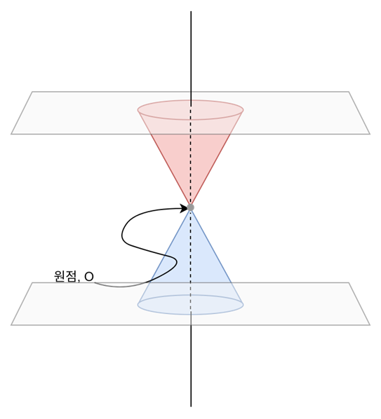
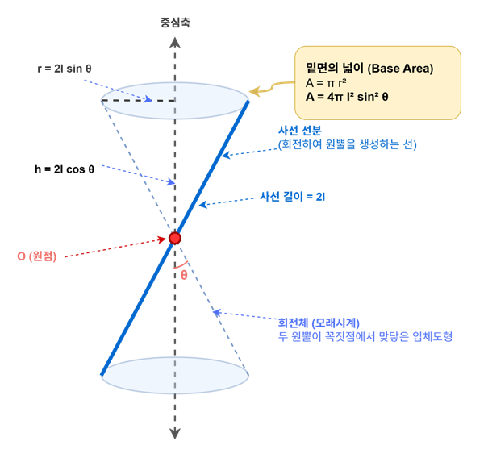
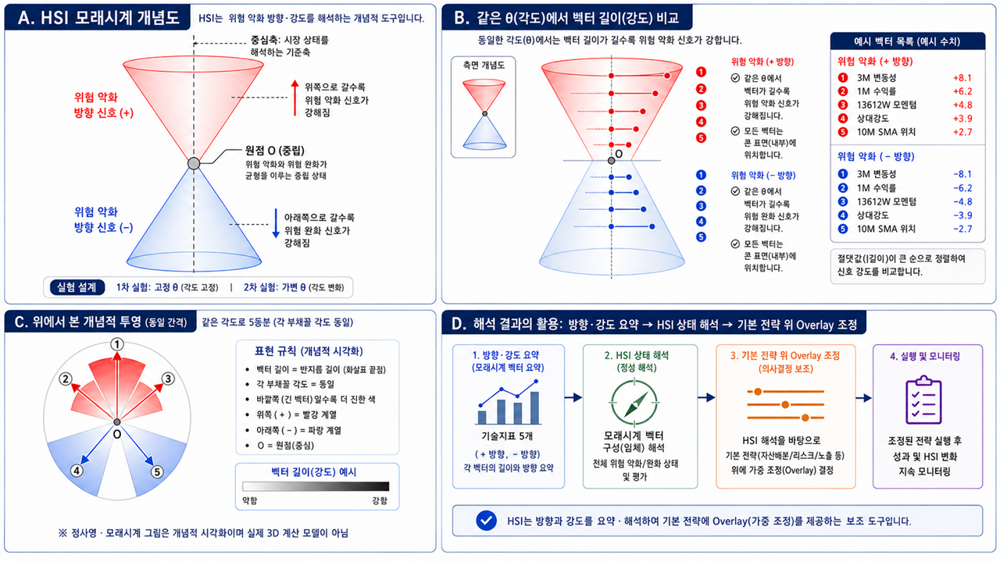
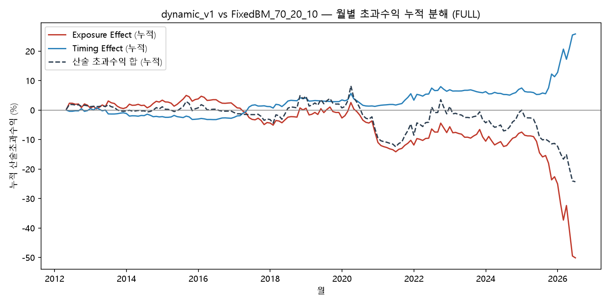
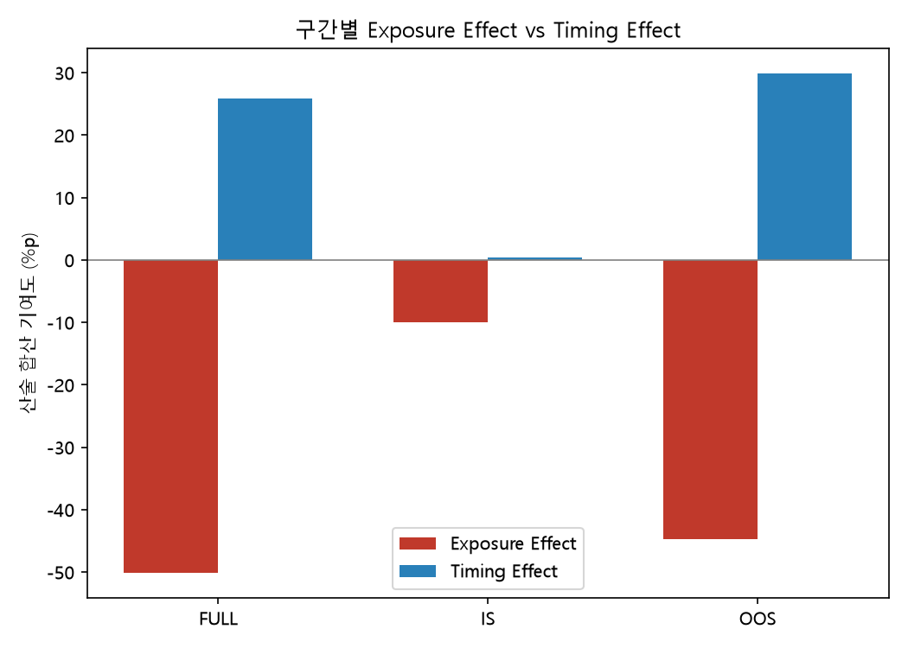
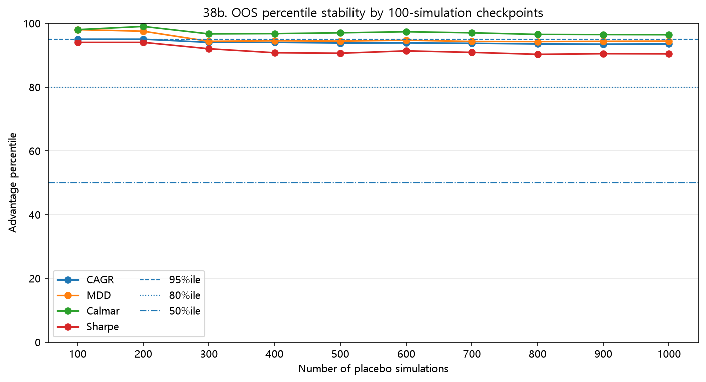
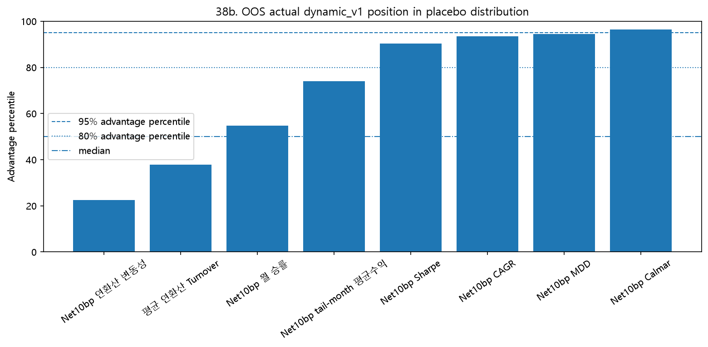
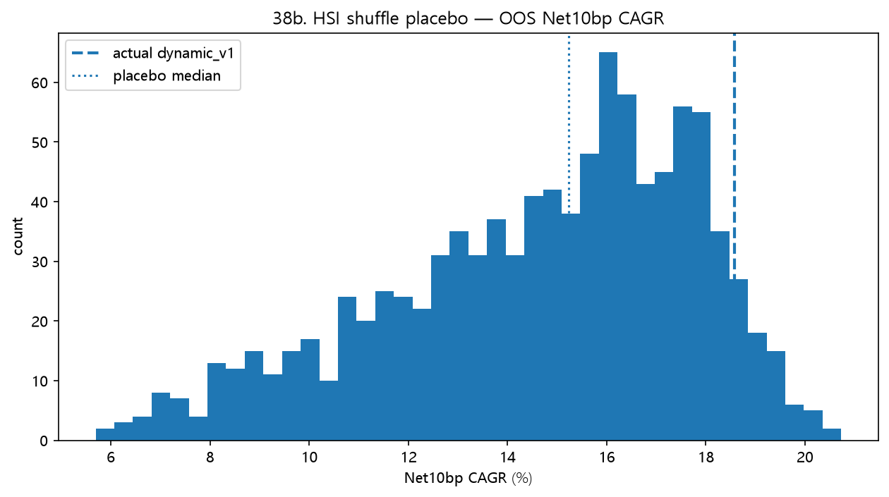
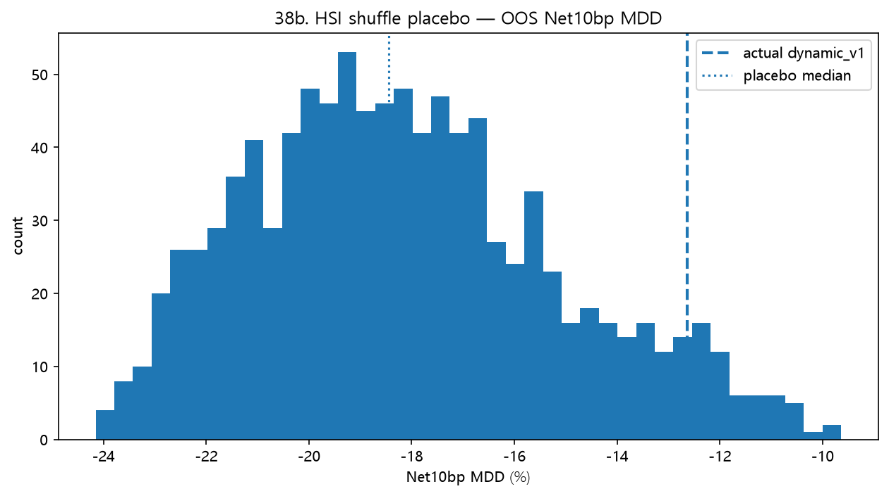
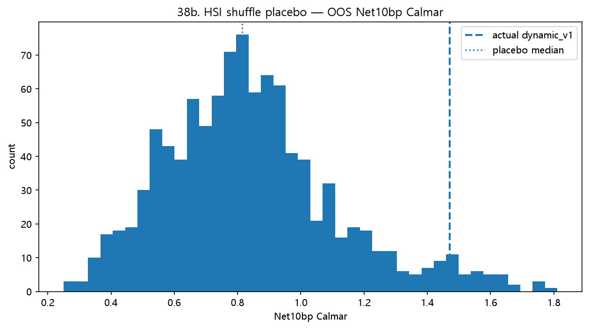

# HSI 기반 ETF 방어형 Overlay RoboAdvisor 프로젝트 결과보고서  
## 시장상태 해석 기반 동적 자산배분과 λ 실행속도 조절 전략

**작성자:** 김근형  
**팀명:** 3조 — 권보성, 김근형, 추주원, 김민호  
**제출일:** 2026-07-13  
**강의명 / 프로젝트명:** 나만의 로보어드바이저 만들기  
**분석 대상:** 국내 ETF 3종 기반 방어형 자산배분 전략  
**최종 산출물 기준:** 2026-07-12 통합 검토본 — `main_final_*`, 25·26 현실성/무결성 검증, 37·38b 원인분해·placebo, 44 θ 민감도 검증 반영  
**제출 문서 구성:** 01 최종보고서 / 02 초기 아이디어·방법론 초안 / 03 방법론·계산식·검증 보충부록

---

# 목차

1. 프로젝트 개요  
2. HSI 알고리즘과 방법론적 무결성 및 λ 적용 방식  
3. 전략 설계: HSI 상태해석과 ETF Overlay  
4. 유니버스와 BM 구성  
5. SAA / TAA / λ 실행 구조  
6. 데이터와 입력자료 검증  
7. 백테스트 설계와 검증 절차  
8. 리밸런싱 구성 비중 분석  
9. IS/OOS/FULL 성과 분석과 3년 rolling 성과추이  
10. 회전율·거래비용·슬리피지 민감도 및 매수/매도 Turnover 점검   
11. Factor loading과 rolling factor exposure  
12. Dynamic λ와 MacroRisk 확장안  
13. Adoption decision과 최종 RA 포트폴리오 검증
14. 최종 결론  
15. 한계와 후속 과제  
부록 A. 용어 설명: 프로젝트 내부 용어와 변수명  

---

# 1. 프로젝트 개요

HSI 기반 ETF 방어형 Overlay 전략을 RoboAdvisor형 자산배분 규칙으로 구현하고, 백테스트와 후속 검증을 통해 전략의 성과와 한계를 확인하였다. 핵심 목적은 특정 월의 수익률을 직접 예측하는 것이 아니라, 시장상태를 해석하고 그 상태에 따라 위험자산, 채권형 방어자산, 현금성 방어자산의 비중을 조정하는 규칙을 만드는 것이다.

핵심 질문은 다음과 같다.

> HSI 상태를 이용해 위험자산 비중을 조절하고, λ 실행속도를 통해 목표비중으로 이동하는 속도를 조절하면, 고정비중 BM 대비 낙폭과 위험조정 성과를 개선할 수 있는가?

단순히 “성과가 좋았다”는 결과만 제시하지 않았다. 전략 후보들이 실제로 어떤 방식으로 비중을 바꾸었는지, 성과가 특정 구간에만 의존하지 않는지, 회전율이 과도하지 않은지, 비용을 차감해도 해석 가능한 결과가 남는지, 최종 후보를 어떤 기준으로 판단했는지 함께 정리하였다.

핵심 프레이밍은 “수익률 알파”가 아니라 “낙폭 통제 엣지”이다. FixedBM_70_20_10은 전체 구간에서 가장 높은 CAGR을 기록했지만, 동시에 가장 큰 MDD를 보였다. 반면 HSI 기반 λ 전략은 CAGR을 극대화하기보다 위험자산 비중의 이동 속도를 조절하여 낙폭과 변동성을 완화하는 데 초점을 둔다. 따라서 성과 해석은 단순 수익률 우위가 아니라, 방어형 참여자에게 필요한 위험조정 성과와 낙폭 관리 능력을 중심으로 진행한다. 또한 최종 성과표 하나에만 의존하지 않기 위해 월별 수익률 흐름과 3년 rolling 성과추이를 추가로 확인하였다. 이를 통해 특정 구간의 성과가 전체 판단을 왜곡하지 않는지, 3년 단위로 보았을 때 음수 누적수익률 구간이 반복되는지 함께 점검하였다.

본 프로젝트에서 사용하는 알파의 의미를 명확히 하기 위해, 먼저 알파를 `RA 수익률 − BM 수익률`로 정의한다. 이 기준에서 Final_RA_dynamic_v1은 FixedBM_70_20_10 대비 OOS와 FULL 구간 모두에서 양의 수익률 알파를 달성했다고 보기 어렵다. 따라서 본 전략의 성과는 초과수익률 알파가 아니라, MDD·연환산 변동성·Sharpe·Calmar 개선으로 확인되는 방어형 위험조정 성과로 해석한다.

## 1.1 제출 문서 구성과 본문 반영 원칙

본 제출물은 성격이 다른 세 문서로 나누어 정리하였다. `01_최종보고서_HSI_방어형Overlay.md`는 프로젝트의 문제의식, 전략 구조, 핵심 성과, 주요 검증 결과와 결론을 한 흐름으로 설명하는 본문 문서이다. `02_HSI초기아이디어_구상과_방법론초안.zip`은 HSI가 어떤 관찰과 초기 구상에서 출발했는지를 보여주는 배경 자료이다. `03_HSI_방법론_계산식_검증_보충부록.md`는 본문에 모두 싣기 어려운 수식 전개, 변수 정의, 실험 단위 검증 로그, 상태판정 기준 변화, 보조 실험 결과를 모아 둔 보충부록이다.

본 프로젝트의 특징은 외부에서 이미 정립된 지표를 단순 적용한 것이 아니라, HSI라는 내부 상태 해석 지표를 직접 구성하고 이를 실제 ETF 자산배분 전략에 적용하면서 계산식, 상태판정 기준, 리밸런싱 방식, 검증 절차를 함께 다듬어 갔다는 점이다. 따라서 본 보고서는 완성된 지표를 단순 적용한 백테스트 결과만 제시하는 문서라기보다, 지표 설계와 전략 검증이 병행된 실험형 자산배분 프로젝트의 결과를 정리하는 문서에 가깝다.

다만 본문에서는 HSI 수식과 모든 실험 로그를 전부 반복하지 않는다. 독자가 오해하기 쉬운 핵심 연결고리, 즉 `HSI 상태판정 → ETF 목표비중 → λ 부분조정 → 포트폴리오 성과`의 흐름을 본문에 남기고, 세부 계산식과 기준 변경 내역은 03번 보충부록으로 분리하였다. 이 구성은 보고서 본문이 과도하게 수식 부록처럼 변하는 것을 피하면서도, 기준값의 출처와 검증 절차를 추적 가능하게 만들기 위한 것이다.

본 보고서의 결론은 전략의 미래 성과를 보장하거나, HSI가 모든 시장에서 BM을 초과한다고 주장하는 것이 아니다. 최종 해석은 “월간 시장상태 해석을 ETF 비중 행동으로 번역하고, λ를 통해 실행속도를 조절한 방어형 Overlay prototype이 BM 대비 낙폭과 위험조정 성과 개선 가능성을 보였는가”에 초점을 둔다.

---

# 2. HSI 알고리즘과 방법론적 무결성 및 λ 적용 방식

이 절에서는 HSI가 어떤 문제의식에서 출발했고, 실제 과제에서는 어떤 계산 절차로 축소 구현되었는지 정리한다. HSI는 처음부터 완성된 금융공학 모형으로 출발한 지표가 아니라, 시장에서 먼저 나타난 위험 신호가 시간차를 두고 한국 시장에 전달되는 장면을 보며 떠올린 상태해석형 아이디어에 가깝다. 따라서 본문에서는 HSI의 탄생 배경, 개념적 시각화, 실제 계산 방식, 그리고 λ 실행속도 조절 구조를 순서대로 정리한다.

## 2.1 HSI 발상의 기원: 6월 8일의 관찰

HSI(Hourglass Signal Index)는 단순히 데이터를 수학적으로 가공한 결과물이 아니라, 한 사건을 보며 생긴 질문에서 출발하였다. 6월 8일 전후 미국 반도체 시장의 급락이 한국 시장의 삼성전자와 SK하이닉스 하락으로 이어지는 흐름을 보면서, 단순히 “한국 반도체 주식이 많이 빠졌다”는 결과보다 그 위험이 어디에서 시작되어 어떤 시간차를 두고 한국 시장에 도달했는지가 더 궁금해졌다.

당시 나는 모멘텀과 ETF 방어형 전략을 주제로 과제를 준비하고 있었다. 그래서 자연스럽게 “미국에서 먼저 발생한 충격이 한국 시장에 도착하기 전에, 그 위험을 미리 감지하고 방어할 수 있다면 어떨까?”라는 질문을 하게 되었다. 이 질문은 이후 HSI의 출발점이 되었다. 시장을 하나의 정적인 숫자로 보기보다, 시간에 따라 여러 신호가 흔들리고 전이되는 동적인 상태로 보고 싶었다.

아래 그림은 이러한 초기 직관을 지진계식 흔들림과 벡터 경로의 형태로 표현한 개념도이다. 이 그림은 실제 구현에 사용한 수식 모델이 아니라, 위험 신호가 시간축 위에서 강해졌다가 약해지고, 여러 방향 신호가 한 점을 기준으로 확산될 수 있다는 사고방식을 설명하기 위한 시각화이다.



[그림 2-1. 시간에 따른 벡터 스파이럴 경로와 위험 신호 전이의 개념도]

이 관찰은 이후 P파와 S파를 구분해 읽는 사고방식과도 연결되었다. 여기서 중요한 것은 지진파를 금융시장에 물리적으로 적용하려는 것이 아니다. 핵심은 먼저 감지되는 외부 경고 사건과, 한국 시장 내부에서 실제 가격과 수급을 흔드는 본진 사건이 시간차와 강도 차이를 가질 수 있다는 점이다. 미국 반도체주 급락, 나스닥 약세, 환율 상승, 해외 반도체 지수 하락은 외부 경고 신호처럼 볼 수 있고, 이후 삼성전자·SK하이닉스 하락, KOSPI 약세, 외국인 수급 변화는 국내 본진 신호처럼 볼 수 있다.

다만 이번 과제에서 이 P파/S파 구조 전체를 구현한 것은 아니다. 실제 구현은 가격 기반 신호를 이용한 HSI 상태분류와 ETF 목표비중 조절로 축소되었다. 따라서 6월 8일의 관찰은 완성된 모형의 증거가 아니라, HSI가 왜 “시장상태 해석”을 목표로 출발했는지 설명하는 배경으로 보는 것이 적절하다.

## 2.2 모래시계 구조와 벡터 기반 상태 해석 원리

HSI는 여러 시장 신호를 하나의 점수로 무작정 더하지 않는다. 수익률, 이동평균 대비 위치, 모멘텀, 변동성, 상대강도는 서로 단위도 다르고 해석 방향도 다르다. 어떤 신호는 값이 높을수록 좋은 상태를 의미하고, 어떤 신호는 값이 높을수록 위험 악화를 의미한다. 따라서 원신호를 그대로 더하면 특정 지표가 과도하게 커 보이거나, 위험 방향과 완화 방향이 섞여 해석이 어려워질 수 있다.

초기 구상에서는 이 문제를 해결하기 위해 각 지표를 한국 시장 안에서 해석 가능한 기준으로 정렬한 뒤, 같은 원점에서 출발하는 벡터처럼 놓아 보고자 했다. 모래시계의 중심점 O는 단순한 숫자 0이 아니라, 위험 악화 신호와 위험 완화 신호가 균형을 이루는 중립 상태를 의미한다. 중심점 위쪽은 위험 악화 방향이고, 아래쪽은 위험 완화 방향이다.



[그림 2-2. HSI 모래시계 개념도: 위험 악화 신호와 위험 완화 신호의 분리]

위쪽으로 갈수록 위험 악화 신호가 강해지고, 아래쪽으로 갈수록 위험 완화 신호가 강해진다. 이때 각 신호는 방향과 크기를 함께 갖는다. 방향은 해당 신호가 위험 악화 쪽인지, 위험 완화 쪽인지를 나타내고, 크기는 그 신호가 얼마나 강한지를 나타낸다. 본 프로젝트에서 확인하고자 한 것은 단순히 시장이 좋다 또는 나쁘다는 판정이 아니라, 위험 신호와 완화 신호가 동시에 존재할 때 어느 쪽의 힘이 더 강한지, 그리고 양쪽 신호가 동시에 강한 충돌 구간인지였다.

## 2.3 정사면체 구조, 원뿔 구조, 그리고 실제 구현 범위

HSI를 처음 떠올렸을 때는 정사면체 두 개의 꼭짓점이 서로 맞닿은 구조도 생각하였다. 위쪽 정사면체는 위험 악화 신호가 쌓이는 공간, 아래쪽 정사면체는 위험 완화 신호가 쌓이는 공간으로 볼 수 있었다. 두 꼭짓점이 만나는 지점은 모든 신호가 같은 출발점에서 시작하는 원점이고, 각 꼭짓점이나 모서리는 개별 시장 신호의 방향과 강도를 표현하는 자리로 생각하였다.

하지만 정사면체 구조는 지표 수가 고정되어 있을 때는 직관적일 수 있으나, 사용할 지표가 늘어나거나 줄어들면 배치가 어려워진다. 어떤 지표를 어느 꼭짓점에 둘 것인지에 따라 시각적 해석이 달라질 수 있다는 문제도 있었다. 그래서 이후에는 정사면체보다 더 유연한 원뿔형 모래시계 구조로 생각을 옮겼다. 원뿔은 지표 수가 달라져도 중심축을 기준으로 여러 벡터가 위쪽 또는 아래쪽으로 퍼지는 모습을 표현하기 쉽다고 보았기 때문이다.



[그림 2-3. HSI 벡터 각도와 강도 비교 개념도]

다만 이 모래시계와 원뿔 구조는 실제 3D 계산 모델이 아니다. 이번 과제에서 원뿔의 부피, 회전체 면적, 사선 길이를 직접 계산해 전략에 투입한 것은 아니다. 해당 도형들은 시장 신호의 방향과 강도를 설명하기 위한 개념적 시각화이며, 실제 구현은 계산 가능한 요약 지표로 단순화하였다.

이 지점은 방법론적 무결성을 위해 분명히 밝힐 필요가 있다. HSI의 초기 구상은 정사면체, 원뿔, 지진계식 경로, 사건 누적, 외부 경고와 국내 본진 사건의 시간차까지 포함한 넓은 구조였다. 그러나 실제 과제 구현은 가격 기반 신호를 위험 악화 방향과 위험 완화 방향으로 정렬하고, 이를 HSI 상태와 ETF 목표비중으로 연결하는 1차 구현에 가깝다. 따라서 본 보고서는 HSI를 완성된 예측모형이라고 주장하지 않고, 시장상태를 해석하여 방어형 Overlay 규칙으로 연결한 실험적 도구로 해석한다.

## 2.4 실제 계산 방식: 입력 신호, V_plus, V_minus, direction, intensity, conflict

실제 구현에서는 각 신호의 방향을 먼저 통일하였다. 위험 악화 방향의 신호는 양의 방향으로, 위험 완화 방향의 신호는 음의 방향으로 정리하였다. 이후 위험 악화 방향 점수의 합을 `V_plus`, 위험 완화 방향 점수의 절댓값 합을 `V_minus`로 계산하였다.

이때 입력 신호의 경제적 의도와 실제 변수명을 구분하는 것이 중요하다. HSI의 입력 신호는 개념적으로 수익률, 이동평균 대비 위치, 모멘텀, 변동성, 상대강도라는 다섯 축으로 설명할 수 있다. 다만 실제 구현에서는 실험 단계에 따라 20일·60일·120일, 21일·63일·126일, 또는 월별 집계 신호로 변환되어 사용되었다. 따라서 본 보고서에서는 “입력 신호의 개념적 의도”와 “각 실험에서 실제 사용된 변수명”을 구분하여 해석한다.

| 입력 축 | 대표 변수 예시 | 경제적 의도 | 해석상 주의 |
|---|---|---|---|
| 수익률 | `return`, `ret_1m`, `ret63` | 최근 가격 변화로 시장의 단기 방향을 포착한다. 하락 전환의 초기 신호를 감지하는 기본 축이다. | 실험 단계에 따라 20거래일, 21거래일, 63거래일 등 기간이 다를 수 있다. |
| 이동평균 대비 위치 | `ma_pos`, `ma20_gap`, `ma60_gap` | 현재 가격이 이동평균 위인지 아래인지로 추세의 방향과 이탈 정도를 본다. | 초기·중간·최종 실험에서 사용한 이동평균 기간이 다를 수 있으므로 변수명 기준으로 확인한다. |
| 모멘텀 | `momentum`, `ret_3m`, `ret_6m` | 여러 기간 누적수익률로 추세의 힘과 지속성을 측정한다. | 1·3·6개월 후보가 모두 최종 상태분류에 동일하게 들어간 것은 아니므로 최종 구현 기준을 별도로 구분한다. |
| 변동성 | `vol`, `vol20`, `vol60` | 가격 방향과 별도로 시장 불안정성 자체를 측정한다. 변동성 확대는 위험 국면 진입의 조기 신호가 될 수 있다. | HSI 입력용 변동성과 rolling 성과검증용 변동성, factor loading용 Volatility는 역할이 다르다. |
| 상대강도 | `rs`, `rel_strength_63` | 위험자산 대비 방어자산 또는 기준자산의 상대성과를 비교하여 risk-off 로테이션을 포착한다. | 절대 가격 하락이 크지 않아도 방어자산이 상대적으로 강하면 위험 신호로 해석될 수 있다. |

후속 50번 실험(HSI 입력신호별 내부계산 기여도)에서
전체 기간 기준 모멘텀·이평위치·수익률·변동성 4종의 평균 절대기여 비중이
22~28% 범위로 분포하여, 특정 신호 하나가 direction을 지배하는 구조가
아님을 사후 점검으로 확인하였다. 세부 결과는 03 보충부록 Part C.4를 참고한다.

개념적으로는 다음 세 가지를 보려고 했다.

- `direction HSI`: 위험 악화 방향과 위험 완화 방향 중 어느 쪽이 우세한가
- `intensity HSI`: 전체 신호가 얼마나 강하게 나타나는가
- `balanced conflict HSI`: 위험 악화와 위험 완화 신호가 동시에 강하게 나타나는가

보고서 구현에서 사용한 기본 형태는 다음과 같다.

```text
direction HSI = (V_plus - V_minus) / m_v
intensity HSI = (V_plus + V_minus) / m_v
balanced conflict HSI = 2 × min(V_plus, V_minus) / (V_plus + V_minus)
```

여기서 `m_v`는 단순한 신호 개수만을 뜻하지 않는다. `m_v`는 해당 월에 유효하게 계산된 신호들이 만들 수 있는 최대 절대 신호합을 의미한다. 신호 점수가 `-10~+10` 범위라면 신호 1개의 한 방향 최대 절대점수는 10이므로, `SCORE_SCALE=10`일 때 다음과 같이 정리한다.

```text
m_v = 유효 신호 개수 × SCORE_SCALE
SCORE_SCALE = 10이면, m_v = 유효 신호 개수 × 10
```

`-10`에서 `+10`까지의 전체 폭은 20이지만, `V_plus` 또는 `V_minus`가 한 방향으로 가질 수 있는 최대 절대점수는 지표 1개당 10이다. 따라서 한 방향 성분을 정규화하는 분모로 `유효 신호 개수 × 20`을 쓰는 것은 적절하지 않다. 만약 어떤 실험에서 신호 점수가 이미 `-1~+1`로 정규화되어 있다면, 같은 논리로 `SCORE_SCALE=1`이 되어 `m_v`는 유효 신호 개수와 같아진다.

이 정규화 기준을 사용하면 위험 악화 성분과 위험 완화 성분은 다음처럼 해석할 수 있다.

```text
risk_component = V_plus / m_v
relief_component = V_minus / m_v
direction = risk_component - relief_component
intensity = risk_component + relief_component
```

따라서 `θ=0.15`, `direction_margin=0.05`와 같은 기준값은 원점수에 직접 적용되는 값이 아니라, `m_v`로 정규화된 `risk_component`, `relief_component`, `direction`에 적용되는 상태판정 기준값이다. 이 점을 명확히 해야 θ를 모래시계 도형의 각도나 원점수 기준으로 오해하지 않는다.

상태판정은 위 계산값을 단순히 해석하는 데서 끝나지 않고, 정규화된 성분값을 기준으로 HSI 5상태에 연결된다. 최종보고서 본문에서는 핵심 로직만 기록하고, 세부 수식 전개와 예시는 별도 HSI 방법론 정리 문서와 계산식 익힘장 부록에 둔다. 본문에서 필요한 상태판정 기준은 다음과 같다. 아래 표는 단순 설명표가 아니라 판정 우선순위를 함께 보여준다. 따라서 `conflict`는 conflict 값이 높다는 이유만으로 자동 판정되는 상태가 아니라, 양쪽 성분이 모두 켜져 있고 direction이 한쪽으로 충분히 벗어나지 않은 경우에 적용되는 중간 상태로 해석한다.

| 판정 단계 | 조건 | 상태 해석 |
|---|---|---|
| 신호 부족 | 유효 신호 수가 최소 기준에 미달 | `insufficient_data` |
| 강한 위험 악화 | `risk_component >= THETA_COMMON + ACCIDENT_EXTRA`이고 위험 악화 방향 우세 | `accident_zone` |
| 양방향 충돌 | `risk_component >= THETA_COMMON`, `relief_component >= THETA_COMMON`, `abs(direction) <= CONFLICT_DIRECTION_BAND` | `conflict` |
| 위험 악화 우세 | `risk_component >= THETA_COMMON`, `direction > DIRECTION_MARGIN` | `risk_warning` |
| 위험 완화 우세 | `relief_component >= THETA_COMMON`, `direction < -DIRECTION_MARGIN` | `risk_relief` |
| 그 외 | 위 조건에 해당하지 않음 | `neutral_watch` |

여기서 `THETA_COMMON=0.15`는 위험 악화 또는 완화 성분이 의미 있게 켜졌는지를 보는 공통 기준이다. `DIRECTION_MARGIN=0.05`는 두 성분의 차이가 어느 한 방향으로 충분히 기울었는지 확인하는 최소 우세 폭이다. `ACCIDENT_EXTRA=0.20`은 `accident_zone`을 일반적인 `risk_warning`보다 더 강한 위험 구간으로 분리하기 위한 추가 기준이다. 따라서 baseline 기준의 accident threshold는 별도의 독립값이 아니라 `THETA_COMMON + ACCIDENT_EXTRA = 0.15 + 0.20 = 0.35`로 계산된다. 이 값을 단순히 `risk_component >= 0.35`라고만 쓰면 0.35가 처음부터 독립적으로 정해진 공통 기준처럼 보일 수 있으므로, 본 보고서에서는 가능하면 `THETA_COMMON + ACCIDENT_EXTRA` 구조로 설명한다.

`intensity`는 전체 신호 강도와 내부 긴장도를 설명하는 보조 지표로 해석한다. `risk_component` 또는 `relief_component`가 이미 기준을 넘는 경우 `intensity` 기준은 중복될 수 있으므로, 본 보고서에서는 `intensity`를 모든 상태판정의 독립 주조건으로 과장하지 않는다. 다만 `conflict` 구간에서는 위험 악화 신호와 완화 신호가 서로 상쇄되어 `direction`은 작게 보이지만 양쪽 신호의 총량은 작지 않은 경우를 설명하는 데 도움이 된다.

`direction HSI`가 양의 방향이면 위험 악화 신호가 우세하고, 음의 방향이면 위험 완화 신호가 우세하다고 해석한다. `intensity HSI`는 방향과 관계없이 시장 신호가 얼마나 강하게 움직이는지 보여준다. `balanced conflict HSI`는 보충부록에서 `conflict_score`라고도 부르는 보조 진단값으로, 위험 악화와 위험 완화가 동시에 강하게 나타나는지를 보기 위한 지표이다. 다만 최종 `conflict` 상태는 이 값 하나만으로 정해지지 않고, 위 표의 성분 활성화 기준과 direction 중립대 조건을 함께 통과해야 한다.

초기 구상에서는 충돌도를 위험 신호와 완화 신호가 동시에 강한 정도, 즉 두 힘의 공존이나 곱의 직관으로 떠올렸다. 그러나 실제 구현에서는 값의 스케일과 해석 안정성을 위해 균형형 conflict 비율을 사용하였다. 이처럼 초기 아이디어와 실제 구현은 구분해서 해석해야 한다.

## 2.5 HSI 상태가 목표비중으로 연결되는 방식

HSI가 시장 상태를 해석하면, 이 정보를 ETF 비중 조절 규칙으로 번역한다. 이때 중요한 것은 HSI가 그 자체로 매매 명령을 내리는 예측 모델이 아니라, 이미 정해진 유니버스 안에서 위험자산 비중을 결정하는 보조 장치(Overlay)로 작동한다는 점이다.

HSI 알고리즘의 핵심 산출물은 시장상태이다. 본 프로젝트에서는 HSI 상태를 `risk_relief`, `neutral_watch`, `conflict`, `risk_warning`, `accident_zone`으로 구분하였다. 각 상태는 위험자산인 069500, 채권형 방어자산인 114260, 현금성 방어자산인 153130의 목표비중으로 연결된다.

이 구조에서 HSI가 직접 매매 주문을 내는 것은 아니다. HSI는 먼저 목표비중 `w*`를 만든다. 예를 들어 위험 완화 상태에서는 069500 목표비중을 높이고, 위험 경고 또는 사고 구간에서는 069500 목표비중을 낮추며 114260과 153130의 목표비중을 높인다. 즉, HSI는 포트폴리오가 향해야 할 방향을 정하는 신호이다.

이 방식이 MDD 개선으로 이어질 수 있는 이유는 위험자산 하락 구간에서 위험자산 목표비중이 낮아지기 때문이다. FixedBM_70_20_10은 069500을 70%로 고정 보유하므로 위험자산 하락을 그대로 많이 반영한다. 반면 HSI 기반 전략은 위험 경고 상태에서 069500 목표비중을 20% 또는 0%까지 낮출 수 있으므로, 같은 하락 구간에서도 포트폴리오 전체 손실을 완화할 수 있다.

## 2.6 λ 적용 방식: 목표비중으로 이동하는 상대속도

HSI가 목표비중을 정하더라도 실제 포트폴리오가 그 목표비중으로 한 번에 이동하는 것은 아니다. 실제 비중은 이전 비중과 HSI 목표비중 사이의 차이를 λ만큼만 반영하여 계산한다.

```text
새 비중 = 이전 비중 + λ × (목표비중 - 이전 비중)
```

여기서 λ는 방향 신호가 아니라 목표비중으로 이동하는 상대속도이다. 방향은 HSI 목표비중이 정하고, λ는 그 방향으로 얼마나 빠르게 이동할지를 정한다. λ가 1이면 목표비중까지 즉시 이동하고, λ가 0.3이면 이전 비중과 목표비중 차이의 30%만 이동한다. λ가 0.1이면 목표비중을 향해 더 천천히 이동한다.

예를 들어 직전 069500 비중이 70%이고, HSI가 위험 경고 상태로 바뀌어 069500 목표비중이 20%가 되었다고 가정한다. λ가 1이면 069500 비중은 즉시 20%로 낮아진다. λ가 0.3이면 한 달에 전체 차이 50%p의 30%인 15%p만 이동하여 55%가 된다. 이처럼 λ는 신호 변화에 대한 포트폴리오의 반응 속도와 회전율을 동시에 조절한다.

## 2.7 MDD와 위험조정 성과가 개선될 수 있는 작동 원리

HSI와 λ가 결합되면 성과가 개선될 수 있는 경로는 크게 세 가지이다.

첫째, HSI 상태가 위험자산 목표비중을 낮추면 하락장에서 포트폴리오의 위험자산 노출이 줄어든다. 이 효과는 MDD를 줄이는 방향으로 작동할 수 있다. 실제로 최종 비교에서 Final_RA_dynamic_v1은 FixedBM_70_20_10보다 CAGR은 낮았지만, MDD와 Calmar는 더 양호하게 나타났다.

둘째, λ는 목표비중 변화가 실제 포트폴리오에 반영되는 속도를 조절한다. 목표비중을 즉시 반영하면 신호가 흔들릴 때 매매가 급격히 늘어날 수 있다. 반면 λ를 적용하면 포트폴리오가 목표비중으로 점진적으로 이동하므로 회전율과 과잉 반응을 줄일 수 있다. 이 점은 비용차감 성과와 운용 안정성 측면에서 중요하다.

셋째, dynamic_v1은 고정 λ 하나만 사용하지 않고, 연환산 변동성, rolling drawdown, risk_relief 지속 조건에 따라 λ를 다르게 적용한다. 이 구조는 시장상태가 불안정할 때 포트폴리오 이동을 더 신중하게 만들고, 위험 완화 상태가 일정 기간 이어질 때는 목표비중으로 더 빠르게 접근하도록 설계하였다. 다만 고위험 구간에서 λ를 낮추는 방식은 방어 목표비중으로 이동하는 속도까지 늦출 수 있으므로, 항상 성과 개선을 보장하지는 않는다. 따라서 본 보고서에서는 dynamic_v1을 완성된 최적 전략이 아니라, HSI 목표비중과 λ 실행속도 조절이 결합된 방어형 후보 전략으로 해석한다.

## 2.8 성과 해석상 주의: 초과수익률 알파와 방어형 성과의 구분

HSI와 λ 구조가 MDD와 Calmar를 개선할 수 있다고 해서, 곧바로 BM 대비 초과수익률 알파가 달성되었다고 해석해서는 안 된다. 본 보고서에서 알파를 `RA 수익률 − BM 수익률`로 정의할 경우, Final_RA_dynamic_v1은 FixedBM_70_20_10 대비 누적수익률과 CAGR에서 양의 알파를 달성했다고 보기 어렵다.

따라서 본 프로젝트의 핵심 성과는 초과수익률 알파가 아니라 방어형 위험조정 성과이다. 즉, 위험자산 참여를 완전히 포기하지 않으면서도 하락 구간의 손실 폭을 줄이고, 낙폭 대비 수익의 균형을 개선하려는 전략으로 해석하는 것이 적절하다. 이후 13장에서는 이 해석을 정량적으로 확인하기 위해 BM 대비 성과 차이, exposure/timing 분해, HSI 목표비중 shuffle placebo test를 함께 제시한다.

---

# 3. 전략 설계: HSI 상태해석과 ETF Overlay

앞 절에서는 HSI 알고리즘과 λ 적용 방식의 작동 원리를 설명하였다. 이 절에서는 해당 구조가 실제 ETF 목표비중과 포트폴리오 Overlay 규칙으로 어떻게 구현되었는지 정리한다.

전략의 출발점은 HSI를 미래 수익률 예측모형으로 사용하는 것이 아니라, 시장상태를 해석하는 상태분류 도구로 사용하는 것이다. HSI 상태는 시장이 위험 완화, 중립 관찰, 충돌, 위험 경고, 사고 구간 중 어디에 가까운지를 판단하고, 각 상태에 따라 위험자산·채권형 방어자산·현금성 방어자산의 목표비중을 다르게 설정한다.

HSI 상태별 목표비중은 다음과 같다.

| HSI 상태 | 069500 | 114260 | 153130 | 해석 |
|---|---:|---:|---:|---|
| risk_relief | 70% | 20% | 10% | 위험 완화, 위험자산 참여 확대 |
| neutral_watch | 50% | 35% | 15% | 중립 관찰 |
| conflict | 35% | 40% | 25% | 신호 충돌, 방어 비중 확대 |
| risk_warning | 20% | 45% | 35% | 위험 경고, 위험자산 축소 |
| accident_zone | 0% | 30% | 70% | 사고 구간, 현금성 방어 강화 |
| insufficient_data | 이전 비중 유지 | 이전 비중 유지 | 이전 비중 유지 | 정보 부족 구간 |

[표 1. HSI 상태별 ETF 목표비중]

이 구조에서 HSI는 “목표비중 w*”를 결정한다. 그러나 실제 포트폴리오가 목표비중으로 바로 이동하는 것은 아니다. λ가 현재비중과 목표비중 사이의 이동 속도를 조절한다.

```text
새 비중 = 이전 비중 + λ × (목표비중 - 이전 비중)
```

λ가 1이면 목표비중까지 즉시 이동하고, λ가 0.3이면 현재비중과 목표비중 차이의 30%만 이동한다. 따라서 λ는 전략의 공격성·방어성·회전율을 조절하는 실행속도 변수이다.

단일 λ를 사용하는 대칭 전략, 위험자산을 늘릴 때와 줄일 때 다른 λ를 사용하는 비대칭 전략, 그리고 시장상태 변수에 따라 λ를 월별로 바꾸는 dynamic 전략을 비교하였다. 이 구조는 단순히 “어떤 ETF를 살 것인가”가 아니라, “시장상태가 바뀔 때 목표비중으로 얼마나 빠르게 이동할 것인가”를 함께 다룬다는 점에서 RoboAdvisor형 Overlay 전략에 가깝다.

---

# 4. 유니버스와 BM 구성

ETF 유니버스는 다음 3개 자산으로 구성된다.

| 티커 | 자산 역할 | 해석 |
|---|---|---|
| 069500 | 위험자산 | KODEX 200, 주식시장 참여 자산 |
| 114260 | 채권형 방어자산 | KODEX 국고채3년, 중기 국채 방어자산 |
| 153130 | 현금성 방어자산 | KODEX 단기채권PLUS, 현금성 방어자산 |

[표 2. ETF 유니버스]

모든 전략과 BM은 동일한 3개 ETF 유니버스 안에서 비교하였다. 이는 성과 차이가 유니버스 선택에서 발생한 것인지, 비중 조절 규칙에서 발생한 것인지 혼재되지 않도록 하기 위한 통제이다. 유니버스가 달라지면 전략 성과도 크게 달라질 수 있으므로, 자산 범위를 고정한 뒤 λ 실행 규칙의 차이를 비교하였다.

성과 비교를 위해 두 가지 BM을 사용하였다.

| BM | 구성 | 역할 |
|---|---|---|
| FixedBM_70_20_10 | 069500 70%, 114260 20%, 153130 10% | 주된 비교 기준 |
| EW | 세 ETF 동일비중 | 보조 비교 기준 |

[표 3. BM 구성]

## 4.1 BM 선정 근거와 17번 Benchmark alignment 실험의 연결

FixedBM_70_20_10을 메인 BM으로 둔 이유는 단순한 주가지수 비교보다, 동일 ETF 유니버스 안에서 고정비중을 유지했을 때와 HSI 기반 동적 비중조절을 비교하는 것이 전략 효과를 더 명확히 보여주기 때문이다. 즉, 069500, 114260, 153130이라는 같은 자산군을 사용하되, 한쪽은 70/20/10 고정비중으로 보유하고, 다른 한쪽은 HSI 상태와 λ 실행속도에 따라 비중을 조정한다. 이렇게 비교하면 성과 차이가 ETF 선택 자체에서 발생한 것인지, 비중 조절 규칙에서 발생한 것인지 더 분리해서 해석할 수 있다.

17번 Benchmark alignment 실험에서는 Fixed 70/20/10 BM, EW Benchmark, HSI baseline, Lambda 0.1, Lambda 0.3을 같은 방식으로 계산해 비교하였다. 전체 기간 기준으로 Fixed 70/20/10 BM은 CAGR이 가장 높았지만, MDD도 가장 크게 나타났다. 반면 Lambda 후보는 FixedBM보다 CAGR은 낮았지만, MDD와 Calmar에서 개선된 모습을 보였다. 이 결과는 이후 최종 보고서의 비교 기준을 “수익률 1등 찾기”가 아니라 “동일 유니버스 안에서 수익률과 낙폭의 교환관계를 확인하는 구조”로 정렬하는 근거가 되었다.

또한 069500 하위 10% 손실월 진단에서는 FixedBM의 평균 손실월 수익률이 더 크게 악화된 반면, Lambda 후보는 위험자산 비중이 낮아지면서 손실폭을 완화하였다. 이 점은 HSI 기반 전략이 FixedBM을 모든 구간에서 이긴다는 뜻이 아니라, 동일 위험자산을 더 적게 또는 더 천천히 보유함으로써 하락 구간의 낙폭을 줄이는 방어형 성격을 가진다는 점을 보여준다.

FixedBM_70_20_10은 위험자산 참여도가 높은 기준 포트폴리오이다. 따라서 상승장에서는 성과가 높을 수 있지만, 위험자산 하락 구간에서는 MDD가 커질 수 있다. EW는 세 ETF를 동일하게 보유하는 단순 비교 기준이다. FixedBM을 주된 BM으로 두고, EW는 보조 기준으로 활용하였다.

---

# 5. SAA / TAA / λ 실행 구조

전략은 SAA, TAA, λ 실행속도의 3층 구조로 해석할 수 있다.

첫째, SAA는 장기 기준 배분 또는 정책 앵커이다. HSI 중립상태의 목표비중인 50/35/15를 정책적 중립 상태로 해석할 수 있으며, FixedBM_70_20_10은 성과 비교를 위한 기준 포트폴리오로 사용하였다.

둘째, TAA는 HSI 상태 변화에 따른 목표비중 조정이다. 예를 들어 risk_relief 상태에서는 069500 비중을 70%까지 허용하고, risk_warning 상태에서는 069500 비중을 20%로 낮추며, accident_zone 상태에서는 위험자산 비중을 0%까지 낮춘다. 즉, HSI 상태별 목표비중 w*가 전술적 자산배분 역할을 한다.

셋째, λ는 TAA 목표비중이 실제 포트폴리오에 반영되는 속도이다. 고정 λ 전략에서는 모든 월에 같은 λ를 사용한다. 예를 들어 lambda_0.1은 모든 월에 λ=0.1을 사용하고, lambda_0.3은 모든 월에 λ=0.3을 사용한다. 반면 dynamic_v1은 연환산 변동성, rolling drawdown, risk_relief 지속 조건에 따라 월별 λ를 다르게 설정한다. dynamic_v1_macro는 여기에 MacroRisk 조건을 추가한 확장안이다.

이 구조는 단순한 고정비중 전략도 아니고, 특정 ETF를 매수·매도하는 단기매매 전략도 아니다. 시장상태에 따라 목표비중을 바꾸고, 그 목표비중으로 이동하는 속도를 λ로 조절하는 방어형 자산배분 규칙이다.

---

# 6. 데이터와 입력자료 검증

백테스트 결과를 해석하기 전에 먼저 입력자료가 전략 검증에 사용할 수 있는 상태인지 확인하였다. 데이터 수집 및 전처리 단계에서 수익률 단위, 날짜 정렬, 결측값, 비중 계산 오류가 발생하면 이후 성과는 신뢰하기 어렵다. 따라서 가격 자료, 수익률 자료, factor input 자료에 대해 별도의 점검 절차를 수행하였다.

첫째, 월말 가격 자료에서 수익률을 재계산하고, 백테스트 입력 파일인 `main_final_monthly_return_decimal.csv`와 비교하였다. 공통 검증 구간은 2012-04-30부터 2026-06-30까지 총 171개월이며, 최대 절대오차는 0.000000499609로 1e-6 허용오차 이내였다. 따라서 가격 자료와 백테스트 입력 수익률은 실질적으로 일치한다고 판단하였다.

둘째, 수익률 단위를 검증하였다. 백테스트는 decimal 수익률을 기준으로 작동하므로, pct 단위와 decimal 단위가 혼용되면 성과가 크게 왜곡될 수 있다. 이에 따라 decimal 파일과 pct 파일의 변환 관계를 확인하였다.

셋째, 시점 정합성을 검증하였다. 적용 규칙은 `t월 신호 → t+1월 수익률`이다. 특정 월 말에 관측 가능한 HSI 상태와 위험조건은 다음 달 수익률에만 적용된다. 이는 미래 정보를 사용하지 않기 위한 핵심 규칙이다.

넷째, factor input 원칙 점검을 수행하였다. Market, Bond, Momentum, Volatility, MacroRisk의 계산 기준을 고정하였고, GDP처럼 공시 지연 가능성이 있는 변수는 1차 E24 factor loading에서 제외하였다. MacroRisk는 금리 상승 flag와 환율 상승 flag의 단순 합으로 제한하였다. 이는 복잡한 사후 최적화 score를 만들지 않기 위한 조치이다.

입력자료 검증은 단순히 파일이 존재하는지 확인하는 수준이 아니라, 가격-수익률 재현성, 수익률 단위, 시점 정합성, factor input 정의, 미래정보 사용 가능성을 함께 점검한 절차이다.

---

# 7. 백테스트 설계와 검증 절차

최종 성과를 해석하기 전에, 본 프로젝트의 실험 계보를 구분할 필요가 있다. 00_Start와 01_First는 HSI 아이디어와 상태분류 규칙을 탐색한 예비·중간 실험이고, 04_main_v3는 main_final 이전의 설계 고정 자료에 가깝다. 02_Second의 main_final 파이프라인과 03_Third 이후의 dynamic λ·검증 실험이 최종 전략 판단의 직접 근거에 더 가깝다. 따라서 예비 실험의 변수명이나 상태명을 최종 state5 정의와 그대로 동일시하지 않고, 각 실험의 역할을 구분해 해석한다.

| 실험 묶음 | 역할 | 최종보고서에서의 사용 범위 |
|---|---|---|
| 00_Start | 미국 ETF 예제 데이터를 이용한 1차 HSI 예비 실험 | HSI 아이디어의 출발점과 `m_v = 유효 신호 개수 × SCORE_SCALE` 구조 설명에 사용 |
| 01_First | 초기 state5, conflict 처리, event balance, 제한 grid 탐색 | 어떤 규칙이 문제였고 후속 실험이 왜 필요했는지 설명하는 계보 자료 |
| 04_main_v3 | main_final 이전 설계 고정 및 재정리 | 최종 구조로 넘어가기 전 상태분류·비중규칙 정리 자료 |
| 02_Second main_final | 공식 파이프라인, λ 후보, macro companion, 최종 후보 비교 | 최종 성과와 후보 선별의 주된 근거 |
| 03_Third 이후 | dynamic_v1, attribution, shuffle placebo 등 보조 검증 | 최종 RA 후보의 검증 및 한계 설명에 사용 |

초기 검토 단계에서는 Calmar, Sharpe, Turnover, 비용 민감도를 하나의 Score로 합산하는 방식도 고려하였다. 그러나 이 방식은 각 항목의 가중치 a, b, c를 어떻게 정하느냐에 따라 결과가 달라질 수 있고, 결과를 본 뒤 가중치를 조정하면 과적합 위험이 커질 수 있다. 따라서 최종 백테스트에서는 해당 Score식을 사용하지 않았다.

최종 검증에서는 λ 후보를 사전에 정한 뒤, OOS 구간 10bp 비용차감 성과를 기준으로 Calmar, MDD, tail-month 방어력, 평균 Turnover의 네 조건을 각각 확인하였다. 즉, 하나의 종합점수로 후보를 고른 것이 아니라, 방어형 RoboAdvisor 후보로서 크게 밀리지 않는지를 비열등 조건으로 판정하였다.

백테스트 성과가 좋게 나온 후보를 사후적으로 고르는 방식을 피하기 위해, 실험 순서와 판정 기준을 분리하였다. λ 후보와 비대칭 λ grid는 결과를 본 뒤 새로 만든 것이 아니라, 사전에 정한 범위 안에서 비교하였다. 비대칭 λ 수행 문서에서도 λ grid와 dynamic λ 규칙을 사전등록하고, CAGR 단독 기준이 아니라 MDD, Calmar, Turnover, 비용 민감도, tail-month 방어력, OOS/walk-forward 검증을 함께 확인해야 한다고 정리되어 있다.

주요 검증 절차는 다음과 같다.

| 검증 항목 | 목적 | 처리 내용 |
|---|---|---|
| Smoke test | 기본 계산 규칙 확인 | Turnover 규약, t→t+1 적용, 비중 합계 1 유지 확인 |
| 가격-수익률 재계산 | 입력 수익률 재현성 확인 | 가격에서 월수익률 재계산 후 기존 수익률 파일과 비교 |
| Factor input 점검 | 팩터 입력 원칙 확인 | Market, Bond, Momentum, Volatility, MacroRisk 정의 고정 |
| IS/OOS 분리 | 전체기간 의존 방지 | IS와 OOS 성과를 분리해 비교 |
| Walk-forward | 구간별 안정성 확인 | 후보별 rolling 평가 수행 |
| 비용 민감도 | 회전율 높은 후보의 취약성 확인 | 0bp, 5bp, 10bp, 20bp 비용 차감 |
| Adoption decision | 후보 채택 기준 명확화 | OOS 10bp net 기준 비열등 판정 |
| 연도별 Turnover 점검 | 과도한 매매 여부 확인 | 월별 one-way Turnover를 연도별로 합산하고, 100%, 200% 기준으로 점검 |
| 연단위 매수/매도 Turnover 분리 | 회전율 계산 방식 명확화 | 연간 매수 Turnover, 매도 Turnover, one-way Turnover, double-sided Turnover를 분리 산출 |
| Exp 44 θ 임계값 민감도 | 상태분류 기준값 의존도 확인 | alignment 수정 후 임계값 변경이 상태·비중·수익률 변화로 전달되는지 점검 |
| 3년 rolling 성과 점검 | 시간별 성과 안정성 확인 | 36개월 rolling window로 누적수익률, CAGR, 변동성, MDD, Sharpe, 음수 누적수익률 구간 수 확인 |

[표 4. 백테스트 검증 절차]

이러한 절차는 과적합 가능성을 완전히 제거했다는 의미는 아니다. 그러나 임의 score 합산, 사후 파라미터 조정, 미래정보 사용, 단일기간 성과 의존을 줄이기 위한 절차적 안정성을 확보했다는 점에서 의미가 있다. 특히 3년 rolling 성과 점검은 특정 최종 시점의 성과만으로 후보를 판단하지 않기 위한 보조 검증이며, 연단위 매수/매도 Turnover 분리는 회전율 계산 방식의 해석 가능성을 높이기 위한 보완 절차이다.

## 7.1 Exp 44: θ 임계값 민감도와 alignment 수정 검증

Exp 44는 HSI 5상태 분류에 사용한 임계값이 특정 기준값 하나에 과도하게 의존하는지 확인하기 위한 보조 민감도 실험이다. 이 실험은 θ를 새로 최적화하기 위한 절차가 아니라, 사전에 사용한 상태분류 기준값 주변에서 성과가 급격히 무너지는지 확인하기 위한 robustness 점검이다.

원본 실행에서는 상태표와 다음 달 월간수익률을 연결하는 과정에서 `next_return_069500`, `next_return_114260`, `next_return_153130` 값이 모두 NaN으로 생성되어 FULL, IS, OOS 성과지표가 계산되지 않았다. 따라서 원본의 `Not Evaluable` 결과는 θ 기준값의 불안정성을 의미하는 것이 아니라, `year_month=t`의 HSI 상태를 `t+1`월 수익률에 연결하는 alignment 문제로 해석하였다. 이후 로컬 alignment 함수를 추가하여 상태표와 다음 달 월간수익률을 명시적으로 연결하였다.

Exp 44에서 사용한 주요 입력과 출력은 다음과 같이 정리할 수 있다. 이 표는 세부 로그를 모두 본문에 넣기 위한 것이 아니라, 검증이 어떤 데이터 흐름을 확인했는지 오해를 줄이기 위한 요약이다.

| 구분 | 변수·산출물 | 의미 |
|---|---|---|
| 입력 | `monthly_long` | 월말 HSI 신호 long 데이터이다. HSI 상태표를 다시 만들기 위한 입력이다. |
| 입력 | `monthly_returns` | 069500, 114260, 153130의 월간수익률 decimal 데이터이다. |
| 중간 산출 | `state_table` | 각 월의 HSI 상태를 담은 표이다. `year_month`, `hsi_state`가 핵심 열이다. |
| 중간 산출 | `alignment` | `year_month=t`의 상태와 `return_year_month=t+1`의 수익률을 연결한 표이다. |
| 중간 산출 | `next_return_*` | 다음 달 ETF 수익률이다. 이 값이 NaN이면 포트폴리오 성과를 계산할 수 없다. |
| 출력 | `detail_df` | 파라미터 값별 성과, 상태 변화 수, 목표비중 변화 수, 포트폴리오 수익률 변화 수를 담은 상세 진단표이다. |
| 출력 | `summary_df` | 파라미터별 안정 구간과 전 구간 안정 여부를 요약한 표이다. |
| 출력 | `extreme_df` | 극단값 override가 실제 상태·비중·수익률 변화로 전달되는지 확인한 표이다. |


수정 후에는 171개월의 다음 달 수익률이 정상 매칭되었고, baseline 성과는 FULL 기준 CAGR 8.109%, MDD -23.459%, Calmar 0.346으로 계산되었다. 또한 극단값 override 점검에서 임계값 변경은 실제 `hsi_state` 변화로 반영되었고, 이 변화는 목표비중과 포트폴리오 수익률 변화로 전달되었다. 따라서 수정 후 Exp 44는 평가 가능한 민감도 점검으로 볼 수 있다.

| 파라미터 | baseline | 안정범위 | 안정비율 | 해석 |
|---|---:|---:|---:|---|
| `THETA_COMMON` | 0.15 | 0.10~0.15 | 3/5 | 일부 높은 값에서 민감도 발생 |
| `ACCIDENT_EXTRA` | 0.20 | 0.10~0.30 | 5/5 | baseline 주변에서 안정 |
| `DIRECTION_MARGIN` | 0.05 | 0.00~0.075 | 4/5 | 너무 크게 설정하면 민감도 발생 |
| `CONFLICT_DIRECTION_BAND` | 0.20 | 0.10~0.30 | 5/5 | 이번 표본의 일반 grid에서는 영향 작음 |

이 결과는 θ 관련 임계값이 완전히 의미 없는 장식값이 아님을 보여준다. 특히 `THETA_COMMON`과 `DIRECTION_MARGIN`은 상태분류와 성과에 영향을 줄 수 있다. 다만 baseline 주변 일부 범위에서는 성과가 급격히 붕괴하지 않았으므로, 본 실험은 θ 최적화가 아니라 상태분류 기준값의 민감도와 평가 가능성을 확인한 보조 검증으로 해석한다.

정보누수 관점에서 가장 중요한 확인은 `t월 상태 → t+1월 수익률` 연결이다. 수정된 alignment는 같은 달의 미래 수익률을 상태판정에 사용하지 않고, 월말에 관측된 상태가 다음 달 포트폴리오 수익률에만 적용되도록 만든다. 과적합 관점에서도 Exp 44는 가장 성과가 좋은 θ를 새로 고르는 절차가 아니라, baseline 주변의 사전 기준값을 흔들어도 성과가 즉시 붕괴하는지 확인한 민감도 점검이다. 따라서 이 검증은 과적합 가능성을 완전히 제거했다는 뜻이 아니라, 임계값 하나에 대한 과도한 의존과 정렬 오류 가능성을 줄이기 위한 보조 검증으로 해석한다.

---

## 7.2 실행가정 검증: 25번·26번 현실성 및 무결성 점검

본 프로젝트는 월말 HSI 상태를 이용해 다음 월의 ETF 목표비중을 정하는 월간 자산배분 전략이다. 따라서 일별 가격 자료를 사용하더라도, 매 거래일 목표비중을 다시 맞추는 방식은 실제 전략 구조보다 공격적인 리밸런싱 가정이 될 수 있다. 이 문제를 분리하기 위해 25번과 26번 스크립트를 비교하였다.

25번은 월말 HSI 목표비중을 다음 달 모든 거래일에 적용하되, 매 거래일 목표비중으로 재조정하는 일별 리밸런싱 민감도 실험이다. 반면 26번은 적용월의 첫 거래일에만 목표비중으로 리밸런싱하고, 이후에는 ETF 가격 변화에 따라 보유수량과 평가금액이 자연스럽게 변하도록 두는 월별 보유 + 일별 평가 실험이다. 따라서 25번은 “일별 리밸런싱을 허용하면 결과가 어떻게 달라지는가”를 보는 대조군이고, 26번은 본 프로젝트의 월간 HSI 자산배분 구조에 더 가까운 현실성 검증 기준으로 해석한다.

두 산출물에 대해서는 계산 무결성과 미래정보 누수 가능성을 함께 점검하였다. 총 106개 무결성 점검 항목이 모두 PASS로 확인되었고, `signal_date`와 실제 평가일 `Date` 사이의 최소 lag는 1일, look-ahead fail count는 0건으로 집계되었다. 이는 월말 신호가 같은 달 수익률에 섞이지 않고 다음 기간 평가일에 적용되었음을 의미한다.

대표 케이스인 `zscore / HSI_state5_overlay` 기준으로, 25번 일별 리밸런싱 방식은 26번 월별 보유 방식보다 CAGR이 약 -0.1555%p, MDD가 약 -0.1582%p 불리했다. 반면 총 Turnover는 약 +453.5935%p 높았고, 배율로는 약 1.6004배였다. 즉, 일별 리밸런싱은 성과 개선보다 거래 빈도와 운용 부담 증가가 더 뚜렷했다. 따라서 최종 성과 해석에서는 25번을 민감도 실험 또는 대조군으로, 26번을 월간 전략의 현실성 평가 기준으로 사용한다. 자세한 무결성 표와 시각화는 03번 보충부록과 `main_v2_25_26_visual_report_note.md`에 정리하였다.

[표 4-1. 25번·26번 현실성 및 무결성 검증 요약]

| 항목 | 확인 결과 | 해석 |
|---|---:|---|
| 무결성 점검 | PASS 106 / FAIL 0 | 비중 합계, 수익률 연결, drawdown 재계산, 평가금액 합산 등 계산 구조가 일관적으로 확인됨 |
| 미래정보 누수 | 최소 lag 1일, fail 0건 | 월말 신호가 다음 기간 수익률에 적용됨 |
| CAGR 차이 | -0.1555%p | 25번 일별 리밸런싱이 26번보다 성과를 개선하지 못함 |
| MDD 차이 | -0.1582%p | 25번이 낙폭 측면에서도 소폭 불리 |
| Turnover 차이 | +453.5935%p | 일별 재조정 가정이 거래 부담을 크게 증가시킴 |
| Turnover 배율 | 1.6004배 | 26번 월별 보유 방식이 현실성 기준으로 더 적합 |

# 8. 리밸런싱 구성 비중 분석

## 8.1 dynamic_v1 포트폴리오 구성 비중


[그림 1. dynamic_v1 전략의 리밸런싱 일자별 포트폴리오 구성 비중]

그림 1은 dynamic_v1 전략이 각 리밸런싱 적용월에 069500, 114260, 153130에 어떤 비중을 배분했는지 보여준다. 069500은 위험자산, 114260은 채권형 방어자산, 153130은 현금성 방어자산으로 해석한다.

그림 1을 보면 dynamic_v1 전략의 위험자산 비중은 고정되어 있지 않고, 시간에 따라 달라진다. 이는 HSI 상태별 목표비중을 바로 따라가는 것이 아니라, 연환산 변동성, rolling drawdown, risk_relief 지속 조건에 따라 목표비중 반영 속도인 λ가 조정되기 때문이다. HSI 상태가 변하더라도 실제 포트폴리오 비중은 한 번에 크게 이동하지 않고, λ에 의해 완만하게 이동한다.

이 결과는 전략이 단순 고정비중 포트폴리오가 아니라는 점을 보여준다. 시장상태가 위험 완화 구간에 가까워질 때는 069500 비중이 확대되고, 위험 경고 또는 사고 구간에 가까워질 때는 채권형 방어자산과 현금성 방어자산 비중이 확대된다. 다만 이 그림은 성과 개선의 직접 증거라기보다, 전략 규칙이 실제 비중 변화로 구현되었음을 보여주는 실행 증거로 해석하는 것이 적절하다.

## 8.2 dynamic_v1_macro 포트폴리오 구성 비중


[그림 2. dynamic_v1_macro 전략의 리밸런싱 일자별 포트폴리오 구성 비중]

그림 2는 기존 dynamic_v1 조건에 MacroRisk 조건을 추가한 dynamic_v1_macro 전략의 월별 포트폴리오 구성 비중을 보여준다. MacroRisk는 `rate_up_flag + fx_up_flag`로 정의하였고, MacroRisk >= 2는 금리 상승 압력과 환율 상승 압력이 동시에 관찰되는 달을 의미한다.

E30-M 실행 결과, MacroRisk 조건은 실제로 작동하였다. 기존 dynamic_v1보다 고위험으로 분류되는 달이 증가했고, macro 단독 또는 macro와 변동성·drawdown 조건이 함께 작동한 사례가 확인되었다. 따라서 dynamic_v1_macro는 단순히 이름만 macro를 붙인 전략이 아니라, 실제 λ 결정 과정에 거시위험 조건을 반영한 확장안이다.

그림 2를 그림 1과 함께 보면, dynamic_v1_macro는 거시위험 조건을 추가로 반영하면서도 전체적인 자산군 구성은 dynamic_v1과 유사한 틀 안에서 움직인다. 다만 성과 해석은 신중해야 한다. dynamic_v1_macro는 기존 dynamic_v1 대비 평균 Turnover와 연환산 변동성을 소폭 낮추었지만, CAGR, MDD, Calmar는 dynamic_v1보다 약간 낮았다. 따라서 dynamic_v1_macro를 기본 후보로 대체하지 않고, MacroRisk를 반영한 저회전·보수 확장안으로 제시한다.

그림 1과 그림 2의 포트폴리오 구성 흐름은 시각적으로 큰 차이를 보이지 않는다. 이는 dynamic_v1_macro가 HSI 상태별 목표비중을 새로 바꾼 전략이 아니라, 기존 dynamic_v1의 λ 결정 조건에 MacroRisk를 추가한 전략이기 때문이다. 따라서 macro 확장안의 차이는 구성비중 면적 차트보다 λ 경로, 조건 분포, Turnover, 비용차감 성과에서 확인하는 것이 더 적절하다.


[그림 2-1. dynamic_v1과 dynamic_v1_macro의 월별 λ 경로 비교]


[그림 2-2. dynamic_v1_macro와 dynamic_v1의 위험자산 비중 차이]

그림 2-1은 dynamic_v1과 dynamic_v1_macro에서 실제 적용된 월별 λ 경로를 비교한 것이다. 두 전략은 같은 HSI 목표비중 체계를 공유하지만, MacroRisk 조건이 작동한 달에는 dynamic_v1_macro의 λ가 dynamic_v1과 달라질 수 있다. 즉, macro 확장안의 차이는 “무엇을 보유할 것인가”보다 “목표비중으로 얼마나 빠르게 이동할 것인가”에서 발생한다.

그림 2-2는 dynamic_v1_macro의 069500 비중에서 dynamic_v1의 069500 비중을 뺀 값이다. 값이 0에 가까운 구간은 두 전략의 실제 위험자산 비중이 거의 비슷했다는 뜻이고, 값이 양수 또는 음수로 벌어지는 구간은 MacroRisk 조건이 λ 경로를 바꾸면서 실제 위험자산 비중에도 차이를 만든 구간으로 해석할 수 있다.

---

# 9. IS/OOS/FULL 성과 분석

## 9.1 누적수익률 비교


[그림 3. IS 구간 전략별 누적수익률 비교]


[그림 4. OOS 구간 전략별 누적수익률 비교]


[그림 5. FULL 구간 전략별 누적수익률 비교]

그림 3, 그림 4, 그림 5는 각각 IS, OOS, FULL 구간에서 전략별 누적수익률을 비교한 결과이다. IS는 전략 설계와 확인에 사용된 구간이고, OOS는 새로운 구간에서 전략의 성과 특성이 유지되는지 보기 위한 평가 구간이다. FULL은 전체 기간을 한 번에 본 결과이다.

누적수익률 그림을 보면 FixedBM_70_20_10은 전체 구간에서 높은 수익률 경로를 보인다. 이는 위험자산인 069500 비중이 70%로 높게 유지되기 때문이다. 그러나 이 결과만으로 FixedBM이 방어형 RoboAdvisor 관점에서 더 적합하다고 보기는 어렵다. 위험자산 비중이 높으면 상승장에서는 유리하지만, 하락 구간에서는 낙폭도 커질 수 있기 때문이다.

dynamic_v1과 dynamic_v1_macro는 FixedBM보다 누적수익률은 낮지만, 이후 드로다운과 Calmar 지표에서 확인하듯이 낙폭 통제 측면에서 더 안정적인 특성을 보였다. 따라서 이 누적수익률 그림은 수익률 순위만 보는 용도보다는, 각 전략이 어떤 성격의 수익 경로를 가졌는지 확인하는 자료로 해석하는 것이 적절하다.

## 9.2 Drawdown 비교


[그림 6. FULL 구간 전략별 Drawdown 비교]

그림 6은 FULL 구간에서 전략별 Drawdown을 비교한 결과이다. Drawdown은 투자 기간 중 고점 대비 얼마나 하락했는지를 보여준다. 방어형 전략에서는 누적수익률만큼이나 중요한 지표이다.

그림 6을 보면 FixedBM_70_20_10은 높은 누적수익률을 기록했지만, 하락 구간에서는 Drawdown도 크게 나타난다. 반면 dynamic_v1과 dynamic_v1_macro는 FixedBM보다 낙폭이 작게 나타난다. 이 결과는 전략의 핵심이 수익률 극대화보다 낙폭 통제에 있음을 보여준다.

## 9.3 성과-위험 요약


[그림 7. FULL 구간 전략별 성과-위험 요약]

그림 7은 FULL 구간에서 각 전략의 CAGR, 연환산 변동성, MDD, Calmar를 비교한 요약 그림이다. 표로 정리하면 다음과 같다.

| 전략 | FULL CAGR | FULL MDD | Calmar | 해석 |
|---|---:|---:|---:|---|
| FixedBM_70_20_10 | 10.99% | -25.67% | 0.43 | 수익률은 높지만 낙폭도 큼 |
| EW | 6.55% | -13.57% | 0.48 | 단순 동일비중 기준 |
| lambda_0.1 | 8.64% | -14.74% | 0.59 | 낮은 회전율, 보수적 이동 |
| lambda_0.3 | 9.09% | -15.22% | 0.60 | 빠른 반응, 회전율 증가 |
| asym_up0.1_down0.3 | 6.84% | -8.98% | 0.76 | 낮은 MDD, 방어 성향 강함 |
| dynamic_v1 | 9.73% | -12.63% | 0.77 | 성과-위험 균형 양호 |
| dynamic_v1_macro | 9.65% | -12.76% | 0.76 | dynamic_v1과 유사, 회전율은 더 낮음 |

[표 5. FULL 구간 주요 성과-위험 요약]

그림 7과 표 5를 함께 보면 FixedBM_70_20_10은 CAGR 측면에서 가장 높지만, MDD도 가장 크게 나타난다. 반면 dynamic_v1과 dynamic_v1_macro는 FixedBM보다 CAGR은 낮지만 MDD가 작고 Calmar가 높게 나타난다. 이 결과는 핵심이 수익률 극대화보다 낙폭 통제와 위험조정 성과에 있음을 보여준다.

## 9.4 월간 성과 흐름과 3년 rolling 성과 점검

앞선 성과표는 IS, OOS, FULL 구간의 요약 성과를 보여준다. 그러나 실무 관점에서는 특정 기간의 최종 수치만으로 전략을 판단하기 어렵다. 전체기간 CAGR이나 MDD가 양호하더라도, 특정 연도나 특정 월에 손실이 집중되었는지, 3년 단위로 굴려 보았을 때 성과가 반복적으로 음수가 되는 구간이 있는지 함께 확인할 필요가 있다.

이를 위해 월별 수익률 히트맵과 3년 rolling 성과지표를 추가로 산출하였다. 월별 수익률 히트맵은 연도와 월을 기준으로 수익률이 좋았던 달과 손실이 발생한 달을 확인하기 위한 자료이다. 3년 rolling 성과지표는 매월 36개월 구간을 하나씩 이동시키며 누적수익률, CAGR, 연환산 변동성, MDD, Sharpe를 계산한 결과이다.


[그림 5-1. dynamic_v1 월별 수익률 히트맵]


[그림 5-2. dynamic_v1_macro 월별 수익률 히트맵]

그림 5-1과 그림 5-2는 각 연도와 월별로 전략 수익률이 어떻게 나타났는지를 보여준다. 녹색에 가까운 구간은 월수익률이 양호했던 달, 붉은색에 가까운 구간은 손실이 발생한 달로 해석할 수 있다. 이 그림은 최종 누적수익률만으로는 확인하기 어려운 월간 손익의 분포를 보여준다.


[그림 5-3. 3년 rolling 누적수익률 비교]


[그림 5-4. 3년 rolling CAGR 비교]


[그림 5-5. 3년 rolling MDD 비교]


[그림 5-6. 3년 rolling Sharpe 비교]

그림 5-3부터 그림 5-6은 36개월 rolling window를 기준으로 전략별 성과지표를 비교한 것이다. 3년 rolling 누적수익률과 CAGR은 각 3년 구간에서 전략이 양의 성과를 유지했는지 확인하기 위한 자료이다. MDD는 해당 3년 구간에서 발생한 최대낙폭을 보여주며, Sharpe는 변동성 대비 수익이 얼마나 안정적이었는지를 보여준다.

이 점검의 목적은 특정 한 구간의 성과만으로 후보를 판단하지 않는 데 있다. rolling 구간에서 음수 누적수익률이 반복되는 전략은 전체기간 성과가 양호하더라도 실무 적용 시 부담이 클 수 있다. 반대로 rolling 구간에서 음수 누적수익률이 적고, MDD가 낮으며 Sharpe가 안정적인 전략은 방어형 RoboAdvisor 후보로서 더 안정적으로 해석할 수 있다.


[그림 5-7. 전략별 3년 rolling 음수 누적수익률 구간 수]

그림 5-7은 각 전략별로 3년 rolling 누적수익률이 음수였던 구간의 수를 비교한 것이다. 이 그림은 “3년 단위로 굴려 보았을 때 손실 구간이 얼마나 자주 발생했는가”를 요약한다. 방어형 전략을 선택할 때는 단순히 가장 높은 최종 수익률을 기록한 전략보다, rolling 구간에서 음수 성과가 적고 낙폭이 완만한 전략을 더 안정적인 후보로 볼 수 있다.

---

# 10. 회전율·거래비용·슬리피지 민감도 점검

전략 성과를 해석할 때는 수익률만으로 후보를 판단하기 어렵다. 백테스트에서 비슷한 성과를 보이는 전략이라도, 어떤 전략은 적은 매매로 그 결과를 만들고, 다른 전략은 잦은 매매로 비슷한 성과를 만들 수 있다. 후자의 경우 실제 운용에서는 거래비용, 슬리피지, 체결 불확실성에 더 많이 노출된다. 따라서 성과지표와 함께 Turnover를 별도로 점검하였다.

강사님 피드백을 반영하여, 거래비용이 수익률을 갉아먹는 효과를 비용 부담 또는 cost drag 관점에서 함께 확인하였다. 본 프로젝트에서는 0bp, 5bp, 10bp, 20bp 비용 민감도를 적용하고, 매수·매도 합계의 절반을 사용하는 one-way Turnover 기준으로 회전율을 계산하였다. 이 절의 목적은 백테스트 수익률만 제시하는 것이 아니라, 회전율이 높은 전략이 실제 거래 환경에서 얼마나 비용에 취약해질 수 있는지 점검하는 데 있다.

Turnover는 리밸런싱 과정에서 발생한 매수와 매도 규모를 포트폴리오금액 대비 비율로 나타낸 지표이다. 본 프로젝트에서는 월별 Turnover를 `(매수 + 매도) / 2 / 포트폴리오금액`으로 정의하였다. 비중 기준으로는 자산별 비중 변화의 절대값 합을 2로 나눈 값과 같다. 이후 월별 Turnover를 연도별로 합산하여 연간 Turnover를 계산하였다.

슬리피지는 실제 거래가격이 이론상 가격이나 기대 가격과 달라지면서 발생하는 비용을 의미한다. 예를 들어 ETF를 매수하려고 할 때 호가 차이 때문에 예상보다 조금 비싸게 사거나, 매도할 때 예상보다 조금 싸게 팔게 되는 경우가 있다. 실제 호가 스프레드, 시장충격비용, 세금, 체결 실패 가능성을 직접 모델링하지는 않았다. 대신 `Turnover × 비용률` 방식으로 0bp, 5bp, 10bp, 20bp 비용 민감도를 적용하였다. 따라서 비용 분석은 실제 거래비용을 정확히 추정한 결과가 아니라, 회전율이 높은 전략이 비용에 얼마나 취약할 수 있는지 확인하기 위한 점검으로 해석한다.


[그림 8. 전략별 연도별 Turnover 점검]

그림 8은 주요 전략의 연도별 Turnover를 보여준다. 연간 Turnover 100%와 200%를 기준선으로 함께 확인하였다. 연간 Turnover가 100% 미만이면 매매가 지나치게 잦다고 보기 어렵고, 100%를 넘는 해가 반복되면 거래비용과 운용 안정성을 더 조심스럽게 봐야 한다. 200% 이상은 교육용 백테스트에서 성과가 좋아 보이더라도 실전 운용 가능성 측면에서 상당히 보수적으로 해석해야 하는 구간으로 보았다.


[그림 9. 10bp 비용차감 Calmar와 평균 연환산 Turnover 비교]

그림 9는 10bp 비용차감 기준 Calmar와 평균 연환산 Turnover를 함께 보여준다. 후보 간 차이를 보기 쉽도록 Calmar 0.50 이상 구간을 확대해 표시하였다. 오른쪽으로 갈수록 평균 매매 회전이 많고, 위로 갈수록 비용차감 후 위험조정 성과가 좋다. 따라서 왼쪽 위에 가까운 전략일수록 적은 회전율로 비교적 양호한 성과-위험 균형을 보인다고 해석할 수 있다.

10bp 비용차감 기준 결과는 다음과 같다.

[표 6-1. 10bp 비용차감 성과 요약]

| 전략 | CAGR | MDD | Calmar |
|---|---:|---:|---:|
| lambda_0.1 | 8.607% | -14.788% | 0.582 |
| lambda_0.3 | 9.002% | -15.335% | 0.587 |
| asym_up0.1_down0.3 | 6.790% | -9.049% | 0.750 |
| asym_up0.1_down0.5 | 5.731% | -7.154% | 0.801 |
| asym_up0.2_down0.3 | 8.376% | -12.719% | 0.659 |
| dynamic_v1 | 9.669% | -12.630% | 0.766 |
| dynamic_v1_macro | 9.590% | -12.816% | 0.748 |

[표 6-2. 10bp 비용차감 회전율 점검 요약]

| 전략 | 평균 월 Turnover | 평균 연환산 Turnover | 최대 연간 Turnover | 100% 초과 연도 | 200% 초과 연도 | 해석 |
|---|---:|---:|---:|---:|---:|---|
| lambda_0.1 | 2.455% | 29.465% | 39.851% | 0 | 0 | 회전율 낮음 |
| lambda_0.3 | 6.886% | 82.627% | 125.984% | 2 | 0 | 일부 연도 회전율 주의 |
| asym_up0.1_down0.3 | 4.324% | 51.884% | 62.782% | 0 | 0 | 회전율 안정 |
| asym_up0.1_down0.5 | 5.246% | 62.957% | 76.663% | 0 | 0 | 회전율 안정 |
| asym_up0.2_down0.3 | 5.916% | 70.991% | 98.285% | 0 | 0 | 100% 미만 |
| dynamic_v1 | 4.964% | 59.572% | 90.340% | 0 | 0 | 성과-회전율 균형 양호 |
| dynamic_v1_macro | 4.452% | 53.423% | 82.568% | 0 | 0 | 저회전 확장안 |

표 6-1 과 표 6-2를 보면 lambda_0.3은 평균 연환산 Turnover가 82.627%로 100% 미만이지만, 특정 연도에서는 최대 125.984%까지 상승했고 100%를 넘는 해가 2회 있었다. 따라서 성과만 보면 후보로 볼 수 있지만, 회전율이 특정 연도에 높아지는 특성이 있어 실전 적용 관점에서는 추가 주의가 필요하다.

반면 dynamic_v1은 10bp 비용차감 기준에서 CAGR 9.669%, MDD -12.630%, Calmar 0.766을 기록하였다. 평균 연환산 Turnover는 59.572%, 최대 연간 Turnover는 90.340%로 확인되었다. 이 범위 안에서는 dynamic_v1의 성과가 과도한 매매 빈도에서만 만들어졌다고 보기는 어렵다.

dynamic_v1_macro는 CAGR 9.590%, MDD -12.816%, Calmar 0.748을 기록하였다. 평균 연환산 Turnover는 53.423%, 최대 연간 Turnover는 82.568%였다. dynamic_v1_macro는 dynamic_v1보다 Calmar와 MDD는 소폭 낮았지만, Turnover는 더 낮았다. 따라서 이 전략은 기본 후보를 대체하기보다는 MacroRisk 조건을 반영한 저회전·보수 확장안으로 해석하는 것이 적절하다.

다만 이 분석은 실제 슬리피지를 직접 반영한 것은 아니다. 실제 운용에서는 ETF 호가 스프레드, 체결 비용, 세금, 시장충격비용이 추가로 발생할 수 있다. 따라서 이 결과는 실거래 비용까지 완전히 반영한 결론이 아니라, 비용 민감도와 회전율 안정성을 함께 확인한 결과로 제한해서 해석한다.

---

# 11. Factor loading과 rolling factor exposure

E24 factor loading은 전략 수익률이 어떤 요인에 노출되어 있었는지를 설명하기 위한 진단 절차이다. Market, Bond, Momentum, Volatility, MacroRisk를 주요 팩터로 사용하였다. Market은 069500 월수익률, Bond는 114260 월수익률, Momentum은 069500의 3개월 누적수익률, Volatility는 069500 월수익률의 12개월 rolling 연환산 변동성, MacroRisk는 rate_up_flag와 fx_up_flag의 단순 합으로 정의하였다.

여기서 변동성이라는 이름이 여러 위치에서 사용되므로 혼동을 피해야 한다. HSI 상태분류용 변동성은 상태를 만들기 전 입력 신호이고, 36개월 rolling 성과의 변동성은 전략 완성 후 구간별 성과 안정성을 보는 사후 성과지표이다. 반면 E24 factor loading의 Volatility는 전략 수익률이 변동성 요인에 얼마나 노출되어 있었는지 확인하기 위한 사후 진단 변수이다. 따라서 세 변동성은 이름은 비슷하지만 입력 단계, 성과검증 단계, 요인노출 진단 단계에서 각각 다른 역할을 한다.

Factor loading은 전략을 고르는 기준이라기보다, 이미 만들어진 전략이 어떤 요인에 노출되어 있었는지 설명하기 위한 도구이다. 예를 들어 어떤 전략의 Market beta가 낮다면, 그 전략은 주식시장 움직임에 덜 민감했을 가능성이 있다. Bond beta가 높다면, 채권형 방어자산의 영향을 더 많이 받았을 수 있다.


[그림 10. lambda_0.1과 lambda_0.3의 36개월 rolling factor exposure 비교]

그림 10은 lambda_0.1과 lambda_0.3의 36개월 rolling factor exposure를 비교한 것이다. 두 전략은 같은 HSI 목표비중 체계를 사용하지만, λ 값이 다르기 때문에 시장·채권·변동성·거시위험 팩터에 대한 노출 경로가 다르게 나타난다. 특히 lambda_0.3은 목표비중 변화에 더 빠르게 반응하므로 일부 구간에서 Bond beta와 Volatility beta의 변동폭이 더 크게 나타난다. 반면 lambda_0.1은 상대적으로 완만하게 이동하기 때문에 factor exposure도 더 부드럽게 변하는 경향을 보인다.

이 결과는 λ가 단순히 회전율만 바꾸는 변수가 아니라, 실제 포트폴리오의 시장·채권·변동성 노출 경로에도 영향을 줄 수 있음을 보여준다. 다만 rolling factor exposure는 후보를 새로 고르기 위한 기준이 아니라, 이미 실행한 전략이 어떤 위험요인에 노출되어 있었는지 설명하기 위한 진단 자료로 해석한다.

그림 10은 주요 후보의 36개월 rolling factor exposure를 보여준다. 36개월 rolling 방식은 일정한 기간을 한 칸씩 밀어가며 반복 계산하는 방식이다. 이를 통해 전략의 Market, Bond, Volatility, MacroRisk 노출이 시간에 따라 어떻게 달라졌는지 확인할 수 있다.

그리고 전략별 factor exposure가 고정되어 있지 않고, 시기별로 달라지는 것을 확인할 수 있다. 이는 HSI 상태와 λ 실행속도에 따라 실제 포트폴리오 비중이 달라지기 때문이다. 다만 rolling factor exposure는 성과를 사후적으로 정당화하기 위한 도구가 아니다. 이 결과는 “전략이 어떤 노출 구조를 가졌는지 설명하는 진단 자료”로 사용한다.

E24 factor loading 결과에서 FixedBM과 EW의 raw 수익률은 ETF 수익률의 고정 조합이므로 R²가 1에 가깝게 나타나는 것이 자연스럽다. FixedBM은 069500 70%, 114260 20%, 153130 10%의 고정 조합이기 때문에 Market beta와 Bond beta가 해당 구조를 거의 그대로 반영한다.

HSI_baseline은 FixedBM보다 낮은 Market beta와 높은 Bond beta를 보였고, 변동성 상승 구간에서 음의 노출이 관찰되었다. 이는 HSI 상태 변화가 위험자산 비중을 줄이고 방어자산 비중을 확대하는 방식으로 작동했기 때문으로 해석할 수 있다. 다만 이 해석은 회귀 결과에 기반한 설명이며, 이를 근거로 새로운 λ 후보를 사후 선택하지는 않았다.

---

# 12. Dynamic λ와 MacroRisk 확장안

dynamic_v1은 시장상태 변수에 따라 월별 λ를 다르게 적용한 시변 λ 전략이다. 기본 λ는 0.3이며, 고위험 조건에서는 0.1을 사용하고, 안정적인 risk_relief 조건에서는 0.5를 사용한다. 이 규칙은 목표비중으로 이동하는 속도를 시장상태에 따라 조절하기 위한 것이다.

dynamic_v1_macro는 dynamic_v1에 MacroRisk 조건을 추가한 확장안이다. MacroRisk는 금리 상승 flag와 환율 상승 flag의 단순 합으로 구성하였다. MacroRisk >= 2는 금리 상승 압력과 환율 상승 압력이 동시에 관찰되는 달을 의미한다.

이때 macro companion 실험과 최종 MacroRisk 조건을 구분해야 한다. macro companion은 금리·환율·GDP 후보를 함께 살펴본 보조 진단 실험이었다. 반면 최종 dynamic_v1_macro에서 실제로 사용한 MacroRisk는 GDP를 제외하고 금리 상승 flag와 환율 상승 flag만 단순 합산한 축소형 조건이다. GDP는 분기자료, 발표 지연, 계절성, 기저효과 문제가 있어 최종 λ 결정 조건에는 직접 넣지 않았다. 따라서 최종 전략에 GDP 기반 macro overlay가 직접 들어간 것으로 해석해서는 안 된다.

E30-M에서는 기존 dynamic_v1 조건에 MacroRisk >= 2 조건을 명시적으로 결합하여 macro-aware dynamic λ v1을 재실행하였다. 실행 결과 MacroRisk 조건은 실제로 작동하였다. 고위험 조건으로 분류된 월은 기존 dynamic_v1보다 증가했고, 고위험 사유 중 macro 단독 또는 macro와 다른 위험 조건이 함께 작동한 사례가 확인되었다.

다만 dynamic_v1_macro는 기존 dynamic_v1 대비 CAGR, MDD, Calmar를 명확히 개선하지는 못했다. 대신 연환산 변동성과 평균 Turnover는 소폭 낮아졌다. 따라서 MacroRisk 조건은 성과 개선을 보장하는 최적화 규칙이라기보다, 거시위험을 반영한 보수적 위험조절 장치로 해석하는 것이 적절하다.

또한 고위험 구간에서 λ를 낮추는 방식에는 한계가 있다. 목표비중이 방어 방향으로 이동해야 하는 경우에도 λ가 낮아지면 실제 포트폴리오가 방어 목표비중으로 이동하는 속도가 느려질 수 있다. 따라서 후속 실험에서는 방향별 λ와 상황별 λ를 결합하는 구조를 검토할 필요가 있다.

---

# 13. Adoption decision과 최종 RA 포트폴리오 검증

최종 후보 판단은 OOS 구간에서 10bp 거래비용을 차감한 net 성과를 기준으로 수행하였다. 판정은 superiority, 즉 우월성 입증이 아니라 non-inferiority, 즉 비열등 기준으로 설정하였다. 방어형 RoboAdvisor 전략에서는 항상 BM보다 높은 수익률을 내는 것보다, 방어형 참여자에게 적합한 위험조정 성과와 낙폭 통제 특성을 안정적으로 제공하는 것이 중요하기 때문이다.

사전등록 비열등 기준은 다음 네 가지이다.

| 기준 | 의미 |
|---|---|
| Calmar_net ≥ 대칭 최우수 × 0.90 | 대칭 λ 후보 대비 위험조정 성과가 크게 밀리지 않는지 확인 |
| MDD 악화 ≤ 대칭 λ=0.1 대비 2.0%p | 낙폭이 과도하게 악화되지 않는지 확인 |
| tail-month 평균수익 악화 ≤ 0.3%p | 위험월 방어력이 크게 약해지지 않는지 확인 |
| 평균 Turnover ≤ 대칭 λ=0.3 × 1.5 | 회전율이 과도하지 않은지 확인 |

[표 7. Adoption decision 판정 기준]


[그림 11. OOS 10bp 비용차감 adoption decision 요약]

그림 11은 OOS 10bp 비용차감 기준에서 각 시변 후보의 Calmar, MDD, tail-month 평균수익, 평균 Turnover를 비교한 것이다. 이 그림은 최종 후보를 단일 수익률 기준으로 고르지 않고, 위험조정 성과와 회전율을 함께 판단하기 위한 자료이다.

34번 adoption decision 결과, 모든 주요 시변 후보가 비열등 기준을 통과하였다. 주요 결과는 다음과 같다.

| 전략 | Calmar_net | MDD | tail-month 평균수익 | 평균 Turnover | non-inferior |
|---|---:|---:|---:|---:|---|
| asym_up0.1_down0.3 | 1.267 | -9.049% | -3.253% | 4.809% | True |
| asym_up0.1_down0.5 | 1.279 | -7.154% | -2.646% | 5.782% | True |
| asym_up0.2_down0.3 | 1.176 | -12.719% | -4.568% | 6.541% | True |
| dynamic_v1 | 1.471 | -12.630% | -4.710% | 4.835% | True |
| dynamic_v1_macro | 1.418 | -12.816% | -4.853% | 4.116% | True |

[표 8. OOS 10bp 비용차감 adoption decision 결과]

표 8을 보면 dynamic_v1과 dynamic_v1_macro는 모두 비열등 기준을 통과하였다. dynamic_v1은 Calmar_net 1.471, MDD -12.630%, tail-month 평균수익 -4.710%, 평균 Turnover 4.835%를 기록하였다. dynamic_v1_macro는 Calmar_net 1.418, MDD -12.816%, tail-month 평균수익 -4.853%, 평균 Turnover 4.116%를 기록하였다.

두 전략 모두 기준을 통과했지만, 해석은 다르게 해야 한다. dynamic_v1은 Calmar, MDD, tail-month 방어력에서 dynamic_v1_macro보다 소폭 우수하였다. 반면 dynamic_v1_macro는 평균 Turnover가 더 낮았다. 따라서 dynamic_v1을 기본 시변 λ 후보로 유지하고, dynamic_v1_macro는 MacroRisk를 반영한 저회전·보수 확장안으로 제시한다.

이 결론은 결과가 가장 좋아 보이는 후보를 사후적으로 고른 것이 아니라, IS/OOS, walk-forward, 비용 민감도, 회전율 점검, 사전등록 비열등 판정을 거쳐 도출한 것이다.

Adoption decision은 OOS 10bp 비용차감 기준에서 Calmar, MDD, tail-month 방어력, Turnover 조건을 통과했는지 확인하는 절차이다. 그러나 실무 적용 관점에서는 이 판정만으로 충분하지 않을 수 있다. 특정 OOS 구간에서 조건을 통과했더라도, 3년 단위로 굴려 보았을 때 손실 구간이 반복된다면 안정적인 후보로 보기 어렵기 때문이다.

따라서 최종 후보 판단에서는 adoption decision과 3년 rolling 성과 점검을 함께 해석하였다. Adoption decision은 “OOS 비용차감 기준을 통과했는가”를 확인하고, 3년 rolling 음수 누적수익률 window 수는 “3년 단위로 보아도 손실 구간이 적은가”를 확인한다. 두 기준을 함께 보면, 단일 기간의 최종 성과에 의존하지 않고 전략의 실행 안정성을 더 입체적으로 판단할 수 있다.

정리하면 최종 의사결정 구조는 다음과 같다.

1. OOS 10bp 비용차감 기준에서 Calmar, MDD, tail-month, Turnover 조건을 통과하는가?
2. 3년 rolling 누적수익률 기준에서 음수 성과 구간이 반복적으로 발생하지 않는가?
3. 최종 CAGR이 높더라도 MDD와 rolling 손실구간이 과도하지 않은가?
4. Turnover가 과도하지 않아 실제 운용 가능성이 유지되는가?

이 기준에 따라 최종 후보는 단순히 수익률이 가장 높은 전략이 아니라, 비용차감 성과, 낙폭 통제, 회전율, rolling 안정성을 함께 고려하여 해석하였다.

## 13.1 최종 추천 RA 가상 포트폴리오와 BM 성과 비교

앞선 절에서는 OOS 10bp 비용차감 기준의 adoption decision을 통해 후보 전략이 방어형 RoboAdvisor 후보로서 크게 밀리지 않는지를 확인하였다. 이 절에서는 선정과정을 거친 이후의 최종 추천 RA 가상 포트폴리오가 메인 BM 및 보조 BM 대비 어떤 성과 흐름을 보였는지 별도로 비교한다.

최종 추천 RA 가상 포트폴리오는 dynamic_v1을 기준으로 구성하였다. dynamic_v1은 시장상태 변수에 따라 월별 λ를 조절하는 시변 λ 전략이며, 본 프로젝트에서는 기본 RA 후보로 해석하였다. 비교 대상은 메인 BM인 FixedBM_70_20_10과 보조 BM인 EW이다. FixedBM_70_20_10은 069500 70%, 114260 20%, 153130 10%의 고정비중 포트폴리오이고, EW는 세 ETF를 동일비중으로 보유하는 단순 비교 기준이다.


[그림 13-1. 최종 추천 RA 가상 포트폴리오와 BM 누적수익률 비교]

그림 13-1은 최종 추천 RA 가상 포트폴리오와 BM의 누적수익률 시계열을 비교한 것이다. 세로 점선은 OOS 검증구간 시작 시점이다. 따라서 점선 이후의 성과 흐름은 전략 설계 이후의 검증구간 성과로 해석한다. 이 그림은 최종 시점의 수익률만 보는 것이 아니라, 시간에 따라 RA 포트폴리오와 BM의 성과 격차가 어떻게 형성되었는지 확인하기 위한 자료이다. FixedBM_70_20_10은 위험자산 비중이 높기 때문에 상승 구간에서 높은 누적성과를 보일 수 있다. 반면 RA 가상 포트폴리오는 HSI 상태와 λ 실행속도 규칙에 따라 위험자산 비중을 조절하므로, 단순히 BM의 수익률을 추종하기보다 낙폭과 변동성을 함께 통제하는 방향으로 움직인다.


[그림 13-2. 최종 추천 RA 가상 포트폴리오와 BM Drawdown 비교]

그림 13-2는 동일한 비교대상에 대해 Drawdown 추이를 나타낸 것이다. 누적수익률 차트만 보면 위험자산 비중이 높은 BM이 유리해 보일 수 있지만, Drawdown 차트를 함께 보면 해당 성과가 어느 정도의 낙폭을 동반했는지 확인할 수 있다. 방어형 RoboAdvisor 관점에서는 최종 누적수익률뿐 아니라, 하락 구간에서 손실 폭이 얼마나 커졌는지, 그리고 이후 회복 경로가 얼마나 안정적이었는지를 함께 보는 것이 중요하다.

프로젝트의 성격을 명확히 하기 위해 알파의 정의를 먼저 정리한다. 본 보고서에서 알파를 `RA 수익률 − BM 수익률`로 정의한다. 이 기준에서 Final_RA_dynamic_v1은 FixedBM_70_20_10 대비 OOS와 FULL 구간 모두에서 양의 수익률 알파를 달성했다고 보기 어렵다. OOS 기준 CAGR은 Final_RA_dynamic_v1이 18.65%, FixedBM_70_20_10이 20.69%였고, FULL 기준 CAGR도 Final_RA_dynamic_v1이 9.73%, FixedBM_70_20_10이 10.99%였다.

다만 Final_RA_dynamic_v1은 OOS와 FULL 구간 모두에서 연환산 변동성, MDD, Sharpe, Calmar가 FixedBM_70_20_10보다 양호하게 나타났다. 따라서 본 전략의 성과는 초과수익률 알파가 아니라, 위험자산 참여를 유지하면서도 낙폭과 변동성을 줄이고 위험조정 성과를 개선한 방어형 Overlay 효과로 해석하는 것이 적절하다.

시계열 차트만으로는 수익과 위험의 차이를 정량적으로 비교하기 어렵기 때문에, 동일한 비교대상에 대해 성과지표를 추가로 정리하였다. 표 13-1은 수익·위험 성과지표를 비교하고, 표 13-2는 실행 과정에서 발생한 Turnover를 정리한다. 이를 통해 최종 RA 가상 포트폴리오가 BM 대비 어떤 수익률을 기록했는지뿐 아니라, 그 성과가 어느 정도의 변동성, 낙폭, 회전율을 동반했는지 함께 확인한다.

[표 13-1. 최종 추천 RA 가상 포트폴리오와 BM의 수익·위험 성과지표]

| 구간 | 전략 | 누적수익률(%) | CAGR(%) | 연환산 변동성(%) | MDD(%) | Sharpe | Calmar |
|---|---|---:|---:|---:|---:|---:|---:|
| OOS | Final_RA_dynamic_v1 | 156.11 | 18.65 | 18.12 | -12.63 | 1.03 | 1.48 |
| OOS | FixedBM_70_20_10 | 181.37 | 20.69 | 23.11 | -25.67 | 0.93 | 0.81 |
| OOS | EW | 77.79 | 11.03 | 11.23 | -13.57 | 0.99 | 0.81 |
| FULL | Final_RA_dynamic_v1 | 275.72 | 9.73 | 12.49 | -12.63 | 0.81 | 0.77 |
| FULL | FixedBM_70_20_10 | 341.62 | 10.99 | 16.58 | -25.67 | 0.71 | 0.43 |
| FULL | EW | 146.94 | 6.55 | 7.99 | -13.57 | 0.83 | 0.48 |

[표 13-1-1. Final_RA_dynamic_v1과 FixedBM_70_20_10의 RA−BM 차이]

| 구간 | 항목 | Final_RA_dynamic_v1 | FixedBM_70_20_10 | RA−BM / 개선폭 | 해석 |
|---|---:|---:|---:|---:|---|
| OOS | 누적수익률 | 156.11% | 181.37% | -25.26%p | 수익률 미달 |
| OOS | CAGR | 18.65% | 20.69% | -2.04%p | 수익률 미달 |
| OOS | 연환산 변동성 | 18.12% | 23.11% | 변동성 4.99%p 감소 | 방어 지표 |
| OOS | MDD | -12.63% | -25.67% | 낙폭 13.04%p 개선 | 방어 지표 |
| OOS | Sharpe | 1.03 | 0.93 | +0.10 | 위험조정 성과 |
| OOS | Calmar | 1.48 | 0.81 | +0.67 | 위험조정 성과 |
| FULL | 누적수익률 | 275.72% | 341.62% | -65.90%p | 수익률 미달 |
| FULL | CAGR | 9.73% | 10.99% | -1.26%p | 수익률 미달 |
| FULL | 연환산 변동성 | 12.49% | 16.58% | 변동성 4.09%p 감소 | 방어 지표 |
| FULL | MDD | -12.63% | -25.67% | 낙폭 13.04%p 개선 | 방어 지표 |
| FULL | Sharpe | 0.81 | 0.71 | +0.10 | 위험조정 성과 |
| FULL | Calmar | 0.77 | 0.43 | +0.34 | 위험조정 성과 |

표 13-1-1을 보면 Final_RA_dynamic_v1은 FixedBM_70_20_10 대비 OOS와 FULL 구간 모두에서 누적수익률과 CAGR 기준으로는 음의 차이를 보였다. 따라서 양의 수익률 알파를 달성했다고 보기 어렵다.

하지만 연환산 변동성, MDD, Sharpe, Calmar에서는 Final_RA_dynamic_v1이 FixedBM_70_20_10보다 양호하게 나타났다. 특히 OOS 기준 MDD는 13.04%p 개선되었고, Calmar는 0.67 높았다. 이는 본 전략이 BM을 수익률로 초과한 전략이라기보다, 위험자산 참여를 유지하면서 낙폭과 변동성을 완화한 방어형 Overlay 전략에 가깝다는 점을 보여주고 있다.

[표 13-2. 최종 추천 RA 가상 포트폴리오와 BM의 실행·회전율 지표]

| 구간 | 전략 | 시작일 | 종료일 | 월 수 | 평균 월 Turnover(%) | 평균 연환산 Turnover(%) |
|---|---|---|---|---:|---:|---:|
| OOS | Final_RA_dynamic_v1 | 2021-01-31 | 2026-06-30 | 66 | 4.84 | 58.02 |
| OOS | FixedBM_70_20_10 | 2021-01-31 | 2026-06-30 | 66 | 0.00 | 0.00 |
| OOS | EW | 2021-01-31 | 2026-06-30 | 66 | 0.00 | 0.00 |
| FULL | Final_RA_dynamic_v1 | 2012-04-30 | 2026-06-30 | 171 | 4.96 | 59.57 |
| FULL | FixedBM_70_20_10 | 2012-04-30 | 2026-06-30 | 171 | 0.00 | 0.00 |
| FULL | EW | 2012-04-30 | 2026-06-30 | 171 | 0.00 | 0.00 |

표 13-1과 표 13-2에는 최종 추천 RA 가상 포트폴리오와 BM의 OOS 및 FULL 구간 성과지표를 정리하였다. IS 구간을 포함한 전체 결과는 별도 CSV 산출물에 저장하였다. 표 13-1은 누적수익률, CAGR, 연환산 변동성, MDD, Sharpe, Calmar를 통해 수익·위험 성과를 비교한다. 표 13-2는 분석 기간과 평균 Turnover를 정리하여, 해당 성과가 어느 정도의 리밸런싱 부담을 동반했는지 확인한다.

이 비교의 목적은 최종 추천 RA 가상 포트폴리오가 BM보다 모든 구간에서 더 높은 수익률을 기록했는지를 확인하는 데 있지 않다. 본 프로젝트의 핵심 프레이밍은 수익률 알파가 아니라 낙폭 통제 엣지이다. 따라서 최종 판단은 누적수익률 하나가 아니라, CAGR, 변동성, MDD, Sharpe, Calmar, Turnover를 함께 고려하여 수행한다.

표 13-1을 보면 OOS 구간에서 Final_RA_dynamic_v1의 누적수익률과 CAGR은 FixedBM_70_20_10보다 낮았다. OOS 기준 Final_RA_dynamic_v1의 CAGR은 18.65%, FixedBM_70_20_10의 CAGR은 20.69%였다. 그러나 연환산 변동성과 MDD는 Final_RA_dynamic_v1이 더 낮게 나타났다. 특히 OOS 기준 MDD는 Final_RA_dynamic_v1이 -12.63%, FixedBM_70_20_10이 -25.67%로 나타나, 최종 RA 가상 포트폴리오가 하락 구간에서 낙폭을 더 완만하게 통제한 것으로 해석할 수 있다.

FULL 구간에서도 같은 방향의 차이가 확인된다. FixedBM_70_20_10은 누적수익률과 CAGR이 더 높았지만, MDD는 -25.67%로 Final_RA_dynamic_v1의 -12.63%보다 크게 나타났다. 반면 Final_RA_dynamic_v1은 FULL 기준 Calmar가 0.77로 FixedBM_70_20_10의 0.43보다 높았다. 이는 최종 RA 가상 포트폴리오가 절대수익률을 극대화한 전략이라기보다, 낙폭 대비 수익의 균형을 개선한 방어형 전략에 가깝다는 점을 보여준다.

표 13-2를 보면 Final_RA_dynamic_v1의 평균 월 Turnover는 OOS 기준 4.84%, FULL 기준 4.96%이며, 이를 연환산하면 각각 58.02%, 59.57% 수준이다. 이는 HSI 상태와 λ 실행속도 규칙에 따라 포트폴리오가 월별로 조정되었기 때문에 발생한 실행 부담이다. BM의 Turnover는 본 비교표에서 고정비중 기준 성과 경로로 처리하여 0으로 표시하였다. 따라서 Turnover 항목은 RA 전략의 실행 부담을 확인하기 위한 보조 지표로 해석하는 것이 적절하다.

종합하면, 최종 추천 RA 가상 포트폴리오는 FixedBM_70_20_10보다 높은 최종 누적수익률을 기록한 전략은 아니었다. 그러나 변동성, MDD, Calmar 측면에서는 방어형 RoboAdvisor 전략으로 해석 가능한 특징을 보였다. 따라서 본 프로젝트의 핵심 결과는 “BM 대비 절대수익률 우위”가 아니라, “위험자산 참여를 유지하면서도 낙폭과 위험조정 성과를 개선하려는 상태기반 실행 규칙”으로 정리하는 것이 적절하다.

## 13.2 CAGR 격차 원인분해: exposure effect와 timing effect

13.1에서는 Final_RA_dynamic_v1이 FixedBM_70_20_10보다 누적수익률과 CAGR은 낮지만, MDD·변동성·Sharpe·Calmar 측면에서는 더 방어적인 특성을 보였음을 확인하였다. 다음으로는 “왜 FixedBM을 CAGR에서 못 이겼는가”를 감으로 설명하지 않고, 월별 초과수익을 구성요소로 나누어 정량적으로 확인하였다.

분해 방식은 월별 산술 초과수익을 `exposure effect`와 `timing effect`로 나누는 것이다. `exposure effect`는 전략이 평균적으로 FixedBM보다 위험자산을 적게 또는 많이 보유한 데서 발생한 효과이다. 반면 `timing effect`는 전략의 월별 비중이 자기 평균비중에서 벗어난 부분이 해당 월 수익률과 만나 발생한 효과이다. 이 분해는 월별 산술수익 기준 항등식이므로 residual은 사실상 0에 가까웠고, 최대 잔차는 2.08×10⁻¹⁷ 수준으로 확인되었다.



[그림 13-2-1. dynamic_v1과 FixedBM_70_20_10 간 월별 초과수익의 누적 exposure/timing 분해]

그림 13-2-1은 FULL 구간에서 exposure effect와 timing effect가 시간에 따라 어떻게 누적되었는지 보여준다. exposure effect는 시간이 지날수록 음(-)의 방향으로 누적되어, 위험자산을 구조적으로 적게 보유한 데 따른 손실이 계속 쌓였음을 보여준다. 반면 timing effect는 양(+)의 방향으로 누적되어, 월별 비중 조절이 평균노출 손실을 일정 부분 상쇄하는 방향으로 작동했음을 보여준다.



[그림 13-2-2. FULL/IS/OOS 구간별 exposure effect와 timing effect 비교]

그림 13-2-2는 FULL, IS, OOS 세 구간에서 exposure effect와 timing effect를 나란히 비교한 것이다. 세 구간 모두 exposure effect는 음(-), timing effect는 양(+)으로 나타났다. 특히 OOS 구간에서 timing effect가 크게 나타났다는 점은 검증구간에서도 비중 조절의 상쇄 효과가 약화되지 않았음을 시사한다. 다만 이 결과만으로 HSI 목표비중의 독립 기여를 확정할 수는 없으므로, 13.3의 shuffle placebo test와 연결해서 해석한다.

[표 13-3. BM 대비 수익률 격차 원인 분해 요약]

| 구간 | CAGR 격차(%p) | 누적수익률 격차(%p) | 산술 초과수익 합(%p) | Exposure Effect(%p) | Timing Effect(%p) | Compounding Interaction(%p) | 해석 |
|---|---:|---:|---:|---:|---:|---:|---|
| FULL | -1.25 | -65.90 | -24.34 | -50.14 | +25.80 | -41.56 | 평균 위험자산 노출 축소가 CAGR 열위의 주된 부담 |
| IS | -0.81 | -10.25 | -9.55 | -9.97 | +0.41 | -0.70 | timing 기여는 제한적이고, exposure 부담이 대부분 |
| OOS | -2.05 | -25.26 | -14.78 | -44.68 | +29.90 | -10.48 | timing effect가 평균노출 손실을 상당 부분 상쇄 |

표 13-3은 Final_RA_dynamic_v1과 FixedBM_70_20_10의 수익률 격차를 exposure effect와 timing effect로 나누어 정리한 것이다. FULL 구간에서 exposure effect는 -50.14%p, timing effect는 +25.80%p로 나타났다. 이는 FixedBM 대비 CAGR 열위의 주된 원인이 상태판단 타이밍의 실패라기보다, 방어형 설계에 따라 위험자산을 평균적으로 적게 보유한 데 있었음을 보여준다. 반면 timing effect는 양(+)의 값을 보여, dynamic_v1의 월별 비중 조절은 평균노출 축소에 따른 손실을 일부 상쇄하는 방향으로 작동하였다.

OOS 구간에서도 같은 방향의 결과가 확인되었다. OOS에서 exposure effect는 -44.68%p, timing effect는 +29.90%p였다. 즉 검증구간에서도 평균적으로 위험자산을 덜 들고 있었던 구조는 수익률 격차를 키웠지만, 월별 비중 조절 타이밍은 그 손실을 줄이는 방향으로 기여하였다. 따라서 “BM보다 CAGR이 낮았으므로 HSI 타이밍이 실패했다”는 해석은 적절하지 않다. 더 정확한 해석은 “방어형 평균노출 축소의 비용이 컸고, HSI 목표비중과 λ 실행규칙이 결합된 타이밍은 그 비용을 일부 완화하였다”이다.

다만 여기서 timing effect는 HSI 단독의 방향성 기여로 해석하지 않는다. dynamic_v1의 실제 월별 비중은 HSI 목표비중과 λ 실행규칙이 결합되어 산출된 결과이기 때문이다. 따라서 timing effect가 양(+)이라는 것은 HSI와 λ가 결합된 실제 비중 조절이 평균비중 대비 유리한 방향으로 작동했다는 뜻이지, HSI 목표비중 자체의 독립 기여를 완전히 입증했다는 뜻은 아니다.

또한 산술 초과수익의 합과 실제 복리 누적수익률 격차 사이에는 compounding interaction이 존재한다. FULL 구간에서 산술 초과수익 합은 -24.34%p였지만, 실제 복리 누적수익률 격차는 -65.90%p였고, 그 차이인 compounding interaction은 -41.56%p로 나타났다. 이는 계산 오류가 아니라 장기 복리 효과의 비선형성 때문이며, 특히 분석 후반부의 급격한 상승 구간에서 상대적으로 낮은 위험자산 노출이 유지되면서 수익률 격차가 산술 합산보다 크게 확대된 결과로 해석된다.

종합하면, Final_RA_dynamic_v1이 FixedBM_70_20_10 대비 CAGR에서 열위였던 것은 타이밍 실패 때문이라기보다, 방어형 전략 설계에 따른 평균 위험자산 노출 축소의 비용으로 해석하는 것이 적절하다. 다만 positive timing effect는 HSI와 λ가 결합된 결과이므로, HSI 목표비중의 시간 배치가 실제로 무작위 배치보다 유리했는지는 별도의 placebo 검정으로 확인할 필요가 있다.

## 13.3 HSI 목표비중 Shuffle Placebo Test

37번 원인 분해에서는 positive timing effect가 확인되었다. 그러나 이 결과만으로 HSI 목표비중의 시간 배치가 독립적으로 유효했다고 단정할 수는 없다. timing effect가 양(+)인 것이 HSI 목표비중의 실제 시점 정보 때문인지, 아니면 HSI 목표비중을 무작위로 배치해도 비슷하게 재현되는 결과인지는 추가 검정이 필요하다. 이를 확인하기 위해 HSI 목표비중 Shuffle Placebo Test를 수행하였다.

### 13.3.1 실험 목적과 방법

본 실험의 목적은 HSI 목표비중의 시간 배치가 무작위 배치보다 성과에 유리했는지 확인하는 것이다. 실제 dynamic_v1에서 사용된 `lambda_used` 경로는 그대로 고정하고, HSI 목표비중의 배치 시점만 4개월 블록 단위로 무작위 재배열하였다. 이렇게 하면 변동성·rolling drawdown 기반 실행속도 경로는 유지하면서, HSI 목표비중이 어느 시점에 배치되었는지만 무작위화할 수 있다.

실험 절차는 다음과 같다.

1. dynamic_v1의 실현 λ_t 시퀀스는 그대로 고정한다.
2. HSI 목표비중 시퀀스를 4개월 블록 단위로 무작위 셔플한다.
3. 셔플된 HSI 목표비중과 실제 λ_t를 이용해 placebo 포트폴리오 비중을 재귀적으로 재계산한다.

```text
w_t = w_(t-1) + λ_t × (w*_shuffled,t - w_(t-1))
```

4. 위 과정을 1,000회 반복하여 placebo 귀무분포를 만든다.
5. 실제 dynamic_v1의 성과가 placebo 분포에서 몇 백분위에 위치하는지 확인한다.

이 검정은 HSI 전체의 독립 기여를 완전히 분리하는 최종 증명이 아니다. 실제 λ_t 경로 자체에도 risk_relief 지속 조건처럼 HSI 상태와 연결된 정보가 일부 포함될 수 있기 때문이다. 따라서 본 검정은 HSI 단독 효과를 확정하기보다, HSI 목표비중의 시간 배치가 무작위 배치보다 유리했는지 확인하는 보조 검증으로 해석한다.

[표 13-4. 38b 실험 설계 요약]

| 구분 | 처리 방식 | 해석 |
|---|---|---|
| 고정한 정보 | 실제 dynamic_v1의 λ_t 경로 | 변동성·drawdown 기반 실행속도 경로는 유지 |
| 무작위화한 정보 | HSI 목표비중의 시간 배치 | HSI 방향 정보의 시점성을 제거 |
| 셔플 방식 | 4개월 블록 셔플 | 상태 지속성을 일부 보존 |
| 반복 횟수 | 1,000회 | 단일 셔플 우연성 방지 |
| 재구성 점검 | 최대 비중 오차 1.67×10⁻¹⁶ | 실제 비중 경로와 replay 가정의 정합성 확인 |
| 판정 기준 | 유리 백분위, 단측 p-value | 실제 dynamic_v1이 placebo 분포에서 어디에 있는지 확인 |

표 13-4는 38b 실험에서 무엇을 고정하고 무엇을 무작위화했는지 정리한 것이다. 이 실험은 λ 실행속도 조절 자체를 제거하지 않고, HSI 목표비중의 시간 배치만 깨는 방식으로 설계하였다. 따라서 “HSI 방향은 무작위, λ 실행속도 경로는 실제값”인 대조군과 실제 dynamic_v1을 비교하는 구조이다.

### 13.3.2 Monte Carlo 반복과 백분위 안정성 확인




[그림 13-4. OOS 핵심 백분위의 누적 안정화 경로]

그림 13-4는 100회, 200회, ..., 1,000회로 placebo 표본을 늘려가며 OOS 핵심 지표의 유리 백분위가 어떻게 변하는지 보여준다. 표본 수가 증가해도 Net10bp CAGR, MDD, Calmar, Sharpe의 유리 백분위가 대체로 상위 구간에 유지되면, 최종 1,000회 결과가 특정 소수 셔플의 우연에만 의존하지 않았다고 해석할 수 있다.

### 13.3.3 OOS 핵심 지표별 placebo 분포와 실제 위치



[그림 13-5. OOS 핵심 지표별 유리 백분위 요약]

그림 13-5는 OOS 구간의 핵심 지표별 유리 백분위를 요약한 것이다. 수익률 지표와 방어 지표는 값이 클수록 유리하게, 변동성과 Turnover는 값이 낮을수록 유리하게 계산하였다. OOS 기준 actual dynamic_v1은 Net10bp CAGR, MDD, Sharpe, Calmar에서 높은 유리 백분위에 위치했지만, 연환산 변동성·월 승률·평균 연환산 Turnover에서는 우위가 뚜렷하지 않았다. 따라서 HSI 목표비중의 시간 배치는 모든 지표에서 일관되게 우월했다기보다, 특히 수익률·낙폭·위험조정 성과 측면에서 유리했던 것으로 해석하는 것이 적절하다.



[그림 13-6. OOS Net10bp CAGR placebo 분포와 실제 dynamic_v1 위치]

그림 13-6은 OOS Net10bp CAGR의 placebo 분포와 실제 dynamic_v1의 위치를 비교한 것이다. 실제값은 18.58%, placebo 중앙값은 15.23%였고, 유리 백분위는 93.5%ile로 계산되었다. 이는 실제 HSI 목표비중의 시간 배치가 무작위 배치보다 OOS 수익률 측면에서 유리한 상위 구간에 위치했음을 시사한다.



[그림 13-7. OOS Net10bp MDD placebo 분포와 실제 dynamic_v1 위치]

그림 13-7은 OOS Net10bp MDD의 placebo 분포와 실제 dynamic_v1의 위치를 비교한 것이다. 실제값은 -12.63%, placebo 중앙값은 -18.44%였고, 유리 백분위는 94.4%ile로 나타났다. MDD는 덜 음수일수록 낙폭이 작다는 뜻이므로, 이 결과는 실제 HSI 목표비중의 시간 배치가 무작위 배치보다 낙폭 통제 측면에서 유리했음을 보여준다.



[그림 13-8. OOS Net10bp Calmar placebo 분포와 실제 dynamic_v1 위치]

그림 13-8은 OOS Net10bp Calmar의 placebo 분포와 실제 dynamic_v1의 위치를 비교한 것이다. 실제값은 1.471, placebo 중앙값은 0.815였고, 유리 백분위는 96.4%ile, 단측 p-value는 0.037로 계산되었다. Calmar는 수익률을 낙폭과 함께 보는 지표이므로, 이 결과는 실제 HSI 목표비중의 시간 배치가 무작위 배치보다 방어형 위험조정 성과 측면에서 매우 유리했음을 시사한다.

[표 13-5. OOS 핵심 지표별 actual dynamic_v1과 placebo 분포 비교]

| 지표 | 실제값 | Placebo 중앙값 | 차이 | 유리 백분위 | p-value | 해석 |
|---|---:|---:|---:|---:|---:|---|
| Net10bp CAGR | 18.58% | 15.23% | +3.34%p | 93.5%ile | 0.066 | 실제값이 유리한 상위권 |
| Net10bp Calmar | 1.471 | 0.815 | +0.656 | 96.4%ile | 0.037 | 무작위 배치 대비 매우 유리 |
| Net10bp MDD | -12.63% | -18.44% | +5.81%p | 94.4%ile | 0.057 | 실제값이 유리한 상위권 |
| Net10bp Sharpe | 1.031 | 0.937 | +0.094 | 90.4%ile | 0.097 | 실제값이 유리한 상위권 |
| Net10bp tail-month 평균수익 | -4.71% | -5.20% | +0.49%p | 74.0%ile | 0.261 | 보조적으로 유리하나 강한 우위는 아님 |
| Net10bp 연환산 변동성 | 18.12% | 16.27% | +1.86%p | 22.4%ile | 0.776 | 실제값이 유리하지 않은 구간 |
| Net10bp 월 승률 | 56.06% | 56.06% | +0.00%p | 54.7%ile | 1.000 | placebo 중앙부 |
| 평균 연환산 Turnover | 58.02% | 56.31% | +1.71%p | 37.8%ile | 0.622 | OOS에서는 회전율 우위가 뚜렷하지 않음 |

표 13-5는 OOS 구간에서 실제 dynamic_v1의 핵심 지표와 placebo 분포의 중앙값을 비교한 것이다. 차이는 실제값에서 placebo 중앙값을 뺀 값이다. % 단위 지표는 %p 차이로, Sharpe와 Calmar는 ratio 차이로 해석한다. percentile(%ile)은 실제 dynamic_v1 성과가 shuffle placebo 대조군 분포에서 어느 위치에 있는지를 나타낸다. 예를 들어 OOS Calmar가 96.4%ile이라는 것은, 무작위 HSI 목표비중 배치로 생성한 대조군 중 약 96.4%보다 실제 dynamic_v1의 Calmar가 높았다는 의미이다.

[표 13-6. FULL/IS/OOS 구간별 shuffle placebo 백분위 보조 요약]

| 구간 | 지표 | 실제값 | 귀무분포 평균 | 귀무분포 표준편차 | 실제값 백분위 |
|---|---|---:|---:|---:|---:|
| FULL | CAGR(%) | 9.734 | 8.175 | 1.205 | 92.3%ile |
| FULL | MDD(%) | -12.630 | -18.089 | 2.933 | 96.7%ile |
| FULL | Sharpe | 0.805 | 0.746 | 0.051 | 88.5%ile |
| FULL | Calmar | 0.771 | 0.468 | 0.123 | 98.0%ile |
| IS | CAGR(%) | 4.477 | 4.373 | 0.620 | 54.1%ile |
| IS | MDD(%) | -6.355 | -10.482 | 1.870 | 98.7%ile |
| IS | Sharpe | 0.700 | 0.641 | 0.087 | 76.7%ile |
| IS | Calmar | 0.705 | 0.432 | 0.106 | 98.2%ile |
| OOS | CAGR(%) | 18.648 | 14.540 | 3.182 | 93.7%ile |
| OOS | MDD(%) | -12.630 | -18.048 | 3.012 | 95.2%ile |
| OOS | Sharpe | 1.034 | 0.931 | 0.087 | 90.4%ile |
| OOS | Calmar | 1.476 | 0.840 | 0.278 | 97.1%ile |

표 13-6은 OOS뿐 아니라 FULL과 IS 구간까지 포함해 actual dynamic_v1이 shuffle placebo 귀무분포에서 어느 위치에 있는지 확인한 보조 요약이다. FULL과 OOS에서는 CAGR, MDD, Sharpe, Calmar가 대체로 상위 백분위에 위치하였다. IS에서는 CAGR 백분위가 54.1%ile로 중앙부에 가까웠지만, MDD와 Calmar는 높은 백분위에 위치하였다. 따라서 HSI 목표비중의 시간 배치는 모든 구간에서 수익률을 일관되게 높였다기보다, 특히 낙폭과 Calmar 측면에서 유리하게 작동한 것으로 해석하는 편이 안전하다.

### 13.3.4 추가 안정성 진단: 수렴성, 배치 동질성, 다중검정 보정

38_report에서는 1,000회 shuffle placebo 결과에 대해 별도의 안정성 진단도 함께 수행하였다. Null distribution 비교에서 CAGR, MDD, Calmar, Sharpe의 실제값은 귀무분포 상위 10% 구간에 위치했지만, turnover와 win rate 같은 보조지표에서는 유의한 우위가 확인되지 않았다. 명목 p-value 기준으로는 Calmar만 0.037로 95% 유의수준을 통과했고, MDD는 0.057, CAGR은 0.066으로 경계선에 위치하였다. Sharpe는 0.097로 95% 기준에서는 유의하지 않았다.


[그림 13-9. Shuffle-placebo null distribution과 actual dynamic_v1의 OOS 위치]


[그림 13-10. Headline percentile과 p-value 요약]

다만 Bonferroni 보정 임계값을 적용하면 유의한 지표는 남지 않는다. 따라서 본 보고서에서는 38b 결과를 “강한 통계적 확정”으로 해석하지 않는다. 더 적절한 표현은 actual dynamic_v1이 Calmar와 MDD 중심의 방어형 지표에서 무작위 대조군 대비 상위권에 위치했지만, 다중검정 보정까지 통과한 강한 결론은 아니라는 것이다.

또한 convergence diagnostics에서는 전 지표가 안정적으로 수렴했고, late-window drift는 ±2%p 이내로 확인되었다. Batch homogeneity 점검에서도 8개 지표가 모두 Chi-square p-value 0.05 초과를 통과했으며, Calmar는 p=0.051로 경계값에 가까웠다. Overfitting verdict grid에서는 Batch Homogeneity, Split-Half Stability, Convergence Stability 항목이 OK/PASS로 정리되었다. 따라서 38b 결과는 단일 셔플이나 특정 배치의 우연에만 의존한 결과로 보기는 어렵지만, Calmar 개선의 원천이 HSI 3-way 구조인지 단순 risk-off 규칙인지까지 완전히 분리한 것은 아니다.


[그림 13-11. Shuffle placebo convergence diagnostics]


[그림 13-12. Batch homogeneity diagnostics]


[그림 13-13. Overfitting verdict grid]

### 13.3.5 종합 해석

38b 실험은 37번에서 확인된 positive timing effect가 단순한 우연 배치였는지 확인하기 위한 placebo 검정이다. OOS 기준 실제 dynamic_v1은 Net10bp CAGR 93.5%ile, Net10bp MDD 94.4%ile, Net10bp Sharpe 90.4%ile, Net10bp Calmar 96.4%ile에 위치하였다. 이는 실제 HSI 목표비중의 시간 배치가 무작위 배치보다 수익률, 낙폭 통제, 위험조정 성과 측면에서 유리했음을 시사한다.

다만 모든 지표가 일관되게 우월한 것은 아니다. OOS 구간에서 Net10bp 연환산 변동성의 유리 백분위는 22.4%ile, 평균 연환산 Turnover는 37.8%ile, 월 승률은 54.7%ile이었다. 따라서 HSI 목표비중의 시간 배치는 매월 더 자주 이기거나 변동성을 일관되게 낮추는 방식으로 작동했다기보다, 중요한 구간에서 낙폭과 Calmar를 개선하는 방향으로 기여한 것으로 해석하는 것이 적절하다.

종합하면, 본 placebo test는 dynamic_v1의 결합 타이밍 성과가 단순한 우연이나 무작위 목표비중 배치만으로 설명되기 어렵다는 보조 근거를 제공한다. 그러나 실제 λ_t 경로를 고정했기 때문에 이 결과를 HSI 단독 효과의 최종 증명으로 해석하지 않는다. HSI는 독립적이고 절대적인 예측 엔진이라기보다, λ 실행속도 조절과 결합되었을 때 방어형 Overlay에서 낙폭 통제와 위험조정 성과 개선에 기여하는 방향 정보 보조 신호로 이해하는 것이 가장 적절하다.

---

## 13.4 간이 Walk-forward robustness와 기존 전략 proxy 비교의 해석 범위

최종 후보가 전체기간 또는 단일 OOS 구간에만 의존하지 않는지 확인하기 위해 간이 walk-forward robustness check를 수행하였다. 이 검증은 λ 후보를 새로 최적화하기 위한 절차가 아니라, train 구간에서 후보를 고르고 다음 test 구간에 고정 적용했을 때 성과가 급격히 붕괴하는지 확인하기 위한 보조 검증이다. 공식 19번 walk-forward와 Colab 보조 variant 실험을 함께 보면, λ 후보는 window 설정 변화에도 완전히 무너지지 않았고, 선택 λ는 주로 0.1과 0.3에 집중되었다. 이는 기존에 해석한 저회전형 λ=0.1과 균형형 λ=0.3의 후보 의미와 대체로 일관된다.

다만 이 결과를 “λ 최적화 완료” 또는 “HSI 우월성 입증”으로 해석하지 않는다. FixedBM은 상승장에서 더 높은 수익률을 보였고, EW는 일부 안정성 지표에서 강점을 보였다. 또한 walk-forward selected λ의 회전율과 실거래 제약은 상용 RA 수준에서 추가 검토가 필요하다. 따라서 본 보고서에서는 walk-forward를 교육용 방어형 RoboAdvisor prototype에서 λ 후보의 시간 안정성을 점검한 보조 근거로만 사용한다.

기존 카나리아형 동적자산배분 전략과의 비교도 보조적으로 검토하였다. HSI는 처음부터 DAA, VAA, BAA를 개선하려는 목적으로 출발한 전략은 아니지만, 시장상태를 감지하여 risk-on/risk-off 성격의 비중 조절을 수행한다는 점에서 해당 계열과 비교할 필요가 있다. 이에 따라 동일 국내 ETF 3종 유니버스 안에서 VAA-like, DAA-like, BAA-like proxy 전략을 구성하고, 동일 비용·동일 리밸런싱·동일 IS/OOS 조건에서 비교하는 틀을 만들었다.

다만 이 실험은 원 논문의 글로벌 offensive/defensive/canary universe를 완전히 복제한 것이 아니며, 일부 실행에서는 HSI_dynamic_v1 weight 파일 연동을 추가로 확인해야 하는 한계가 있었다. 따라서 본 보고서의 최종 채택 결론은 기존 카나리아형 전략 대비 HSI의 우월성을 주장하는 데 사용하지 않는다. 해당 비교는 HSI 구조가 단순 이진 risk-on/risk-off proxy와 어떤 차이를 보이는지 확인하기 위한 후속 검증 과제로 남긴다.

# 14. 최종 결론

HSI 기반 ETF 방어형 Overlay 전략을 RoboAdvisor형 자산배분 규칙으로 구현하고, 백테스트와 후속 검증을 통해 전략의 성과와 한계를 확인하였다.

첫째, 전략은 특정 월의 수익률을 직접 예측하는 모델이 아니다. HSI 상태를 해석하고, 그 상태에 따라 위험자산·채권형 방어자산·현금성 방어자산의 목표비중을 정한 뒤, λ를 통해 실제 포트폴리오가 목표비중으로 이동하는 속도를 조절하는 구조이다.

둘째, 핵심 성과는 수익률 알파가 아니라 낙폭 통제 엣지이다. FixedBM_70_20_10은 전체 구간에서 가장 높은 CAGR을 기록했지만, MDD도 가장 컸다. 반면 dynamic_v1과 dynamic_v1_macro는 FixedBM보다 CAGR은 낮지만, MDD를 크게 낮추고 Calmar를 개선하였다.

셋째, dynamic_v1은 OOS와 walk-forward 검증에서 성과-위험 균형을 유지하였다. 또한 10bp 비용차감 adoption decision에서도 비열등 기준을 통과하였다. 회전율 점검에서도 평균 연환산 Turnover 59.572%, 최대 연간 Turnover 90.340%로 100% 기준을 넘지 않았다. 따라서 dynamic_v1은 기본 시변 λ 후보로 제시할 수 있다.

넷째, dynamic_v1_macro는 MacroRisk 조건을 실제로 반영한 확장안이다. MacroRisk 조건은 고위험 월 분류에 실제로 기여했고, dynamic_v1보다 평균 Turnover를 낮추었다. 그러나 CAGR, MDD, Calmar, tail-month 방어력은 dynamic_v1보다 소폭 낮았다. 따라서 dynamic_v1_macro는 기본 후보를 대체하기보다, macro-aware 저회전·보수 확장안으로 해석하는 것이 적절하다.

다섯째, 백테스트 성과를 그대로 신뢰하지 않고 여러 단계의 검증을 수행하였다. 가격-수익률 재현성 검증, factor input 원칙 점검, t월 신호→t+1월 수익률 적용, IS/OOS 분리, walk-forward 평가, 누수 점검, 비용 민감도, 연도별 Turnover 점검, 연단위 매수/매도 Turnover 분리 산출, 3년 rolling 성과추이 점검, Exp 44 θ 임계값 민감도 점검, adoption decision을 통해 결과의 절차적 안정성을 확인하였다. 또한 25번·26번 비교를 통해 일별 리밸런싱 가정과 월별 보유+일별 평가 가정을 분리하고, 총 106개 무결성 점검과 look-ahead fail 0건을 확인하였다. Exp 44는 θ를 최적화한 실험이 아니라, alignment 수정 후 상태분류 기준값 변화가 상태·비중·수익률로 정상 전달되는지 확인한 보조 검증으로 해석하였다.

여섯째, 선정과정을 거친 이후 최종 추천 RA 가상 포트폴리오와 BM의 성과 흐름을 별도로 비교하였다. Final_RA_dynamic_v1은 FixedBM_70_20_10보다 누적수익률과 CAGR은 낮았지만, OOS와 FULL 구간 모두에서 MDD가 더 낮고 Calmar가 더 높게 나타났다. 이는 최종 RA 가상 포트폴리오가 BM 대비 절대수익률을 항상 초과하는 전략이라기보다, 위험자산 참여를 유지하면서 낙폭 대비 수익의 균형을 개선하려는 방어형 실행 규칙에 가깝다는 점을 보여준다.

일곱째, BM 대비 수익률 격차의 원인을 추가로 분해한 결과, Final_RA_dynamic_v1의 CAGR 열위는 상태판단 타이밍의 실패라기보다 평균 위험자산 노출 축소에 따른 구조적 비용에 가까웠다. FULL 구간에서 exposure effect는 -50.14%p였고, timing effect는 +25.80%p였다. OOS 구간에서도 exposure effect는 -44.68%p, timing effect는 +29.90%p로 나타났다. 이는 방어형 전략이 위험자산을 평균적으로 덜 보유하면서 수익률 일부를 포기했지만, HSI 목표비중과 λ 실행규칙이 결합된 월별 비중 조절은 그 손실을 일부 상쇄했음을 의미한다.

여덟째, HSI 목표비중의 시간 배치가 단순 우연인지 확인하기 위해 shuffle placebo test를 수행하였다. 실제 dynamic_v1의 λ 경로는 고정하고 HSI 목표비중 배치만 4개월 블록 단위로 1,000회 무작위 재배열한 결과, OOS 기준 실제 dynamic_v1은 Net10bp CAGR 93.5%ile, MDD 94.4%ile, Sharpe 90.4%ile, Calmar 96.4%ile에 위치하였다. 이는 실제 HSI 목표비중의 시간 배치가 무작위 배치보다 수익률, 낙폭 통제, 위험조정 성과 측면에서 유리했음을 시사한다. 다만 변동성·월 승률·OOS Turnover까지 일관되게 우월한 것은 아니므로, 이 결과는 HSI 단독 효과의 최종 증명이라기보다 HSI 목표비중 타이밍의 보조 검증으로 해석한다.

따라서 결과를 다음과 같이 해석한다. HSI 기반 λ Overlay 전략은 BM 대비 수익률을 항상 초과하는 전략이라고 주장할 수는 없다. 특히 알파를 `RA 수익률 − BM 수익률`로 정의하면, Final_RA_dynamic_v1은 FixedBM_70_20_10 대비 양의 수익률 알파를 안정적으로 달성했다고 보기 어렵다. 따라서 결론은 초과수익률 알파가 아니라, 낙폭 통제와 위험조정 성과 개선이라는 방어형 Overlay 효과를 확인한 것으로 정리한다. 그러나 방어형 참여자 관점에서는 시장상태 해석을 바탕으로 위험자산 비중 이동 속도를 조절하고, 낙폭과 회전율을 관리하는 RoboAdvisor형 자산배분 규칙으로서 의미가 있다. 또한 최종 성과표 하나에만 의존하지 않고 월별 성과 흐름과 3년 rolling 성과추이를 함께 확인함으로써, 특정 구간의 결과에 과도하게 의존하지 않도록 검증 범위를 확장하였다.

---

# 15. 한계와 후속 과제

몇 가지 한계가 있다.

첫째, 실제 슬리피지를 직접 반영하지 않았다. Turnover × 비용률 방식으로 0bp, 5bp, 10bp, 20bp 비용 민감도를 적용했지만, 실제 ETF 거래에서는 호가 스프레드, 세금, 시장충격비용, 체결 실패 가능성이 존재한다. 따라서 비용 분석은 실거래 비용의 정확한 추정치가 아니라, 회전율이 높은 전략의 취약성을 점검하기 위한 민감도 분석으로 제한된다.

둘째, dynamic_v1_macro는 MacroRisk 조건을 추가했지만 기존 dynamic_v1을 명확히 개선하지는 못했다. 이는 거시위험 조건을 넣는 것 자체가 항상 성과 개선으로 이어지는 것은 아니라는 점을 보여준다. MacroRisk는 유용한 진단 변수일 수 있지만, 단순히 조건을 추가한다고 최종 성과가 개선되는 것은 아니다.

셋째, 고위험 구간에서 λ를 낮추는 방식은 방어 전환을 느리게 만들 수 있다. 예를 들어 위험자산 목표비중이 빠르게 낮아져야 하는 구간에서도 λ가 낮으면 실제 포트폴리오가 방어 목표비중으로 이동하는 속도가 느려질 수 있다. 따라서 후속 v2에서는 방향별 λ와 상황별 λ를 결합하는 구조가 필요하다.

넷째, 검증은 교육용 프로젝트 수준의 백테스트 검증이다. 상용 RoboAdvisor로 사용하기 위해서는 더 긴 데이터, 다양한 시장구간, 세금 및 체결비용, ETF 유동성, 투자자 위험성향별 suitability, 리스크 고지, 실시간 데이터 업데이트 체계가 추가로 필요하다.

다섯째, 최종 RA 가상 포트폴리오와 BM 비교는 동일 유니버스 내 성과 차이를 확인하기 위한 가상 백테스트 결과이다. 실제 RoboAdvisor 서비스로 확장하려면 투자자별 위험성향, 투자한도, 리밸런싱 주기, 세금, 체결 가능성, 상품 교체 가능성 등을 추가로 고려해야 한다. 따라서 본 결과는 실거래 운용 성과의 확정적 예측이 아니라, 방어형 자산배분 규칙의 가능성을 점검한 교육용 검증 결과로 해석해야 한다.

여섯째, dynamic_v1의 성과는 HSI 목표비중과 λ 실행속도 조절이 결합된 결과이다. 본 보고서에서는 HSI 목표비중의 시간 배치를 무작위로 섞는 shuffle placebo test를 통해 실제 HSI 배치가 무작위 배치보다 유리했는지 확인하였다. 다만 이 검정은 실제 λ 경로를 고정한 조건에서 수행되었기 때문에, HSI와 λ의 독립 기여분을 완전히 분리한 것은 아니다. 향후에는 volatility-only target 전략, fixed target + dynamic λ 전략, shuffled HSI target 전략을 함께 비교하는 ablation test를 추가하여 HSI 방향 정보의 독립 기여도를 더 엄밀히 검증할 필요가 있다.

일곱째, 38b shuffle placebo test는 과최적화 가능성을 줄여 보는 보조 검증이지만, 그 자체로 과적합이 완전히 없다는 증명은 아니다. 명목 p-value 기준으로는 Calmar만 95% 유의수준을 통과했고, MDD와 CAGR은 경계선에 위치하였다. Bonferroni 보정 후에는 유의한 지표가 남지 않았으므로, 본 결과는 “HSI 목표비중의 시간 배치가 방어형 지표에서 유리했을 가능성”을 보여주는 예비 근거로 제한해 해석해야 한다.

여덟째, Calmar 개선의 원천이 HSI 3-way 구조 전체에서 나온 것인지, 단순한 변동성 축소 규칙이나 drawdown trigger만으로도 재현 가능한지는 아직 분리되지 않았다. 따라서 후속 연구에서는 Naive Volatility Targeting, MA Crossover, Fixed Drawdown Trigger, 단순 risk-off 규칙과 비교하여 HSI 구조의 고유한 기여를 분해해야 한다.

아홉째, HSI 탄생 배경에서 구상한 외부 경고 사건과 국내 본진 사건의 분리, 즉 P파/S파형 사건 정렬은 이번 최종 백테스트에서 충분히 구현되지 못하였다. 현재 HSI는 가격 기반 신호와 제한적인 MacroRisk 조건을 중심으로 작동하므로, 미국 반도체지수·NASDAQ·환율·외국인 수급·거래량 같은 외부 및 내부 사건축을 별도 계층으로 구축하는 작업은 후속 과제로 남는다.

열째, 기존 카나리아형 DAA/VAA/BAA 계열과의 비교는 국내 ETF 3종으로 구현 가능한 proxy 수준에서 검토하였다. 이는 HSI가 기존 전략보다 우월하다는 결론을 내리기 위한 실험이 아니라, HSI의 5상태 분류와 λ 부분조정 구조가 단순 이진 risk-on/risk-off 구조와 어떤 차이를 보이는지 확인하기 위한 후속 검증 설계에 가깝다. 원 전략의 글로벌 유니버스와 동일한 조건을 복제한 것이 아니므로, 최종 보고서의 핵심 결론은 FixedBM·EW·HSI 내부 후보 비교와 계산 무결성 검증을 중심으로 해석한다.

| 개선 과제 | 내용 |
|---|---|
| 방향별 + 상황별 λ 결합 | 위험자산 축소 방향에서는 빠르게, 재진입 방향에서는 천천히 조정하는 구조와 macro 조건을 결합 |
| 슬리피지 모델 보강 | ETF별 호가 스프레드, 세금, 체결비용 반영 |
| MacroRisk v2 | 금리·환율 외에 신용스프레드, 변동성지수 등 추가 검토 |
| 투자자 성향별 포트폴리오 | 방어형, 중립형, 적극형 RA profile로 확장 |
| 실시간 운영 점검 | 월말 데이터 업데이트, 신호 생성, 리밸런싱 안내 자동화 |
| RA 운용 제약 반영 | 투자자 위험성향, 리밸런싱 주기, 세금, 체결 가능성, 상품 교체 가능성을 반영한 실운용형 검증 |
| rolling 검증 확장 | 3년 rolling 외에 1년, 5년 window와 시장국면별 rolling 성과 비교 |
| HSI 독립 기여도 검증 | volatility-only target, fixed target + dynamic λ, shuffled HSI target을 함께 비교하는 ablation test 수행 |
| placebo 검정 확장 | 블록 길이 3개월·6개월·12개월 변화, 비용률 변화, OOS 하위 구간별 placebo 검정 추가 |
| 단순 risk-off 대조군 비교 | Naive Volatility Targeting, MA Crossover, Fixed Drawdown Trigger, 단순 risk-off 규칙과 비교 |
| HSI 3-way 구조 기여도 분해 | direction·intensity·conflict 중 어떤 성분이 Calmar와 MDD 개선에 기여했는지 ablation |
| P파/S파형 사건 계층 확장 | 미국 반도체·NASDAQ·환율 등 외부 경고 사건과 KOSPI·삼성전자·SK하이닉스·수급 등 국내 본진 사건을 분리 정렬 |
| block shuffle 민감도 확장 | 4개월 블록 외에 3개월·6개월·12개월 블록으로 셔플 구조를 바꾸어 placebo 결과의 민감도 확인 |
| 기존 카나리아형 전략 비교 확장 | DAA/VAA/BAA 원 전략 유니버스에 가까운 글로벌 ETF군을 구성하여 HSI와 엄밀 비교 |

[표 9. 한계와 후속 개선 과제]

---

# 최종 요약

HSI 상태해석을 기반으로 ETF 3종의 목표비중을 조정하고, λ 실행속도를 통해 실제 포트폴리오 이동을 제어하는 방어형 Overlay 전략을 구현하였다. 결과는 단순 수익률 순위가 아니라, 낙폭 통제, 비용차감 성과, 회전율, OOS 검증, factor exposure, adoption decision을 함께 고려하여 해석하였다.

추가로 BM 대비 수익률 격차를 exposure effect와 timing effect로 분해하고, HSI 목표비중 shuffle placebo test를 수행하였다. 원인 분해 결과, BM 대비 CAGR 열위는 타이밍 실패보다 평균 위험자산 노출 축소의 비용에 가까웠고, timing effect는 FULL과 OOS 모두에서 양(+)으로 나타났다. 이어서 1,000회 placebo 검정에서도 실제 dynamic_v1은 OOS 기준 Net10bp CAGR, MDD, Sharpe, Calmar에서 무작위 HSI 목표비중 배치보다 유리한 상위 구간에 위치하였다. 다만 이 결과는 HSI 단독 효과의 완전한 증명이 아니라, HSI 목표비중과 λ 실행규칙이 결합된 방어형 타이밍 효과에 대한 보조 검증으로 해석한다.

최종 결과에서 FixedBM_70_20_10은 가장 높은 CAGR을 기록했지만 MDD도 가장 컸다. 선정 이후 최종 추천 RA 가상 포트폴리오로 정리한 Final_RA_dynamic_v1 역시 FixedBM보다 누적수익률과 CAGR은 낮았지만, OOS와 FULL 구간 모두에서 MDD와 Calmar 측면의 방어적 특징을 보였다. OOS 10bp 비용차감 기준에서도 사전등록 비열등 조건을 통과했고, 연도별 Turnover 및 매수/매도 Turnover 점검에서도 과도한 회전율은 확인되지 않았다. 따라서 dynamic_v1을 기본 시변 λ 후보로 제시한다.

dynamic_v1_macro는 MacroRisk 조건을 반영한 확장안으로, Turnover를 낮추는 장점이 있었지만 dynamic_v1 대비 성과-위험 지표를 명확히 개선하지는 못했다. 따라서 macro-aware 저회전·보수 확장안으로 제시한다. 이 전략은 BM을 항상 초과하는 수익 전략이라기보다, 방어형 참여자에게 적합한 낙폭 통제형 RoboAdvisor 자산배분 규칙으로 해석하는 것이 적절하다.


---

# 부록 A. 용어 설명: 프로젝트 내부 용어와 변수명

아래 용어들은 이 전략을 구현하고 검증하는 과정에서 사용한 내부 변수명과 전략명이다. 일반적인 금융용어도 일부 포함되어 있지만, 여기서는 프로젝트 안에서 어떤 의미로 사용했는지를 기준으로 설명한다.

| 용어 | 쉬운 설명 |
|---|---|
| HSI | 시장상태를 구분하기 위해 사용한 상태지표이다. 수익률을 직접 예측하는 모델로 쓰지 않고, 위험 완화·중립·위험 경고·사고 구간처럼 시장상태를 나누는 기준으로 사용하였다. |
| `V_plus` | 방향 통일 후 위험 악화 방향으로 나타난 신호 점수의 합이다. 값이 클수록 위험 악화 성분이 강하다고 해석한다. |
| `V_minus` | 방향 통일 후 위험 완화 방향으로 나타난 신호 점수의 절댓값 합이다. 값이 클수록 위험 완화 성분이 강하다고 해석한다. |
| `m_v` | HSI 신호를 정규화하기 위한 기준값이다. 신호 점수가 `-10~+10`이면 `m_v = 유효 신호 개수 × 10`으로 둔다. `×20`은 전체 점수 폭이지 한 방향 최대합의 분모가 아니다. |
| `SCORE_SCALE` | 신호 1개가 한 방향으로 가질 수 있는 최대 절대점수이다. 본 보고서의 `-10~+10` 점수 체계에서는 10으로 해석한다. |
| `risk_component` | `V_plus / m_v`로 계산한 정규화된 위험 악화 성분이다. θ 기준은 원점수가 아니라 이 정규화 성분에 적용된다. |
| `relief_component` | `V_minus / m_v`로 계산한 정규화된 위험 완화 성분이다. |
| `direction` | `risk_component - relief_component`로 해석할 수 있다. 양수이면 위험 악화 우세, 음수이면 위험 완화 우세를 뜻한다. |
| `intensity` | `risk_component + relief_component`로 해석할 수 있다. 방향과 무관하게 전체 신호가 얼마나 강하게 켜졌는지를 보여준다. |
| `conflict_ratio` | 위험 악화와 위험 완화 성분이 동시에 나타나는 정도를 설명하는 보조 지표이다. 중립과 같지 않고, 양쪽 신호가 함께 존재하는 내부 충돌 상태를 설명한다. |
| θ | 모래시계 도형의 각도가 아니라, 정규화된 risk_component 또는 relief_component가 의미 있게 켜졌는지를 판단하는 상태분류 임계값이다. |
| `THETA_COMMON` | baseline 기준 0.15로 둔 공통 상태판정 기준이다. `risk_component` 또는 `relief_component`가 의미 있게 활성화되었는지를 판단한다. |
| `ACCIDENT_EXTRA` | `accident_zone`을 일반적인 `risk_warning`보다 더 강한 위험 구간으로 분리하기 위해 θ에 더하는 추가 기준이다. baseline에서는 0.20을 사용하였다. |
| `accident_threshold` | `THETA_COMMON + ACCIDENT_EXTRA`로 계산되는 accident 전용 기준이다. baseline에서는 0.15 + 0.20 = 0.35이다. |
| `CONFLICT_DIRECTION_BAND` | 위험 악화 성분과 완화 성분이 모두 기준 이상일 때, 두 성분의 차이가 이 범위 안이면 충돌 상태로 볼 수 있는 기준이다. |
| `direction_margin` | direction이 위험 악화 또는 위험 완화 쪽으로 충분히 기울었는지를 판단하는 최소 우세 폭이다. |
| Overlay | 기존 자산배분 위에 얹는 조정 규칙을 의미한다. 여기서는 주식·채권·현금성 ETF의 기본 배분 위에 HSI 상태와 λ 실행속도 규칙을 얹어 비중을 조정한다. |
| 유니버스 | 전략이 투자할 수 있는 자산의 범위이다. 유니버스는 069500, 114260, 153130 세 ETF로 제한하였다. |
| 069500 | KODEX 200 ETF이다. 위험자산 역할을 맡는다. |
| 114260 | KODEX 국고채3년 ETF이다. 채권형 방어자산 역할을 맡는다. |
| 153130 | KODEX 단기채권PLUS ETF이다. 현금성 방어자산 역할을 맡는다. |
| FixedBM_70_20_10 | 069500 70%, 114260 20%, 153130 10%로 고정한 기준 포트폴리오이다. 전략 성과를 비교하기 위한 주된 BM으로 사용하였다. |
| EW | Equal Weight의 약자이다. 세 ETF에 동일한 비중을 두는 보조 BM이다. |
| SAA | Strategic Asset Allocation의 약자이다. 장기 기준 배분 또는 정책적 기준 비중을 의미한다. |
| TAA | Tactical Asset Allocation의 약자이다. 시장상태에 따라 단기적으로 목표비중을 바꾸는 전술적 배분을 의미한다. |
| λ | 목표비중으로 이동하는 속도이다. λ가 크면 목표비중에 빠르게 가까워지고, λ가 작으면 천천히 이동한다. |
| target_w | HSI 상태가 제시한 목표비중이다. 예를 들어 위험 경고 상태에서는 위험자산 목표비중이 낮아진다. |
| 실제 비중 | 전월 비중에서 target_w로 한 번에 이동하지 않고, λ만큼 이동한 뒤의 포트폴리오 비중이다. |
| lambda_0.1 | 매월 λ=0.1을 적용한 전략이다. 목표비중으로 천천히 이동하는 보수적인 실행 규칙이다. |
| lambda_0.3 | 매월 λ=0.3을 적용한 전략이다. lambda_0.1보다 목표비중에 더 빠르게 반응한다. |
| asym_up0.1_down0.3 | 위험자산 비중을 늘릴 때와 줄일 때 다른 λ를 쓰는 비대칭 전략이다. up은 위험자산 비중을 다시 늘리는 방향, down은 위험자산 비중을 줄이는 방향을 의미한다. |
| dynamic_v1 | 시장상태 변수에 따라 월별 λ를 다르게 적용한 시변 λ 전략이다. 고정 λ 하나를 계속 쓰는 것이 아니라, 조건에 따라 λ=0.1, 0.3, 0.5 중 하나를 사용한다. |
| dynamic_v1_macro | dynamic_v1에 MacroRisk 조건을 추가한 확장안이다. 금리와 환율 위험이 동시에 관찰되는 달에는 고위험 조건을 더 보수적으로 반영한다. |
| MacroRisk | 금리 상승 flag와 환율 상승 flag를 더한 단순 거시위험 점수이다. 값이 2이면 금리와 환율 위험이 동시에 관찰된 달로 해석한다. |
| macro companion | 금리·환율·GDP 후보를 함께 살펴본 보조 진단 실험이다. 최종 dynamic_v1_macro의 MacroRisk와 동일하지 않으며, 최종 MacroRisk에는 GDP를 직접 넣지 않았다. |
| rate_up_flag | 금리 상승 압력이 관찰된 달을 1로 표시한 변수이다. |
| fx_up_flag | 환율 상승 압력이 관찰된 달을 1로 표시한 변수이다. |
| Turnover | 리밸런싱 때 포트폴리오 비중이 얼마나 많이 바뀌었는지를 나타내는 지표이다. 본 보고서에서는 매수비중과 매도비중을 더한 뒤 2로 나누고, 이를 포트폴리오금액 대비 비율로 해석하는 one-way Turnover 기준을 사용하였다. 비중 기준으로는 자산별 비중 변화의 절대값 합을 2로 나눈 값이다. |
| 슬리피지 | 실제 거래가격이 기대한 가격과 달라지면서 발생하는 비용이다. 이 프로젝트에서는 슬리피지를 직접 측정하지 않고, Turnover × 비용률 방식으로 비용 민감도를 점검하였다. |
| MDD | Maximum Drawdown의 약자이다. 투자 기간 중 고점 대비 가장 크게 하락한 정도를 의미한다. 방어형 전략에서는 중요한 지표이다. |
| Calmar | CAGR을 MDD와 함께 보는 위험조정 성과지표이다. 같은 수익률이라도 낙폭이 작으면 Calmar가 높아진다. |
| tail-month | 위험자산 수익률이 특히 나빴던 달을 의미한다. 나쁜 시장 구간에서 전략이 얼마나 방어했는지 보기 위해 사용하였다. |
| IS | In-Sample의 약자이다. 전략을 설계하고 확인한 구간이다. |
| OOS | Out-of-Sample의 약자이다. 전략을 새 구간에서 평가하기 위한 검증 구간이다. |
| FULL | IS와 OOS를 합친 전체 기간이다. |
| factor loading | 전략 수익률이 Market, Bond, Volatility, MacroRisk 같은 요인에 얼마나 노출되어 있었는지 보는 회귀 분석 결과이다. |
| rolling factor exposure | 일정 기간을 굴려가며 factor loading을 반복 계산한 것이다. 시간에 따라 전략의 시장·채권·변동성 노출이 어떻게 변했는지 확인하기 위해 사용하였다. |
| exposure effect | 전략이 평균적으로 BM보다 위험자산을 적게 또는 많이 보유한 데서 발생한 수익률 차이이다. |
| timing effect | 전략의 월별 비중이 자기 평균비중에서 벗어난 부분이 해당 월 수익률과 만나 발생한 효과이다. |
| shuffle placebo test | HSI 목표비중의 시간 배치를 무작위로 섞어 실제 전략과 비교한 보조 검증이다. HSI 단독 효과의 완전한 증명이 아니라, 목표비중 배치가 우연보다 유리했는지 확인하는 절차이다. |
| audit | 여기서는 “감사”라는 엄격한 회계감사 뜻보다, 입력자료와 계산 규칙이 의도대로 맞는지 확인하는 점검 절차를 의미한다. |
| `next_return_*` | HSI 상태가 관측된 다음 달의 ETF 수익률을 뜻한다. Exp 44에서는 이 값이 모두 NaN으로 붙으면서 초기 `Not Evaluable` 문제가 발생하였다. |
| alignment | 상태월 `t`와 적용 수익률월 `t+1`을 연결하는 정렬 절차이다. 정보누수를 줄이기 위해 월말 HSI 상태는 다음 달 수익률에만 적용한다. |
| `Not Evaluable` | 계산 실패나 평가 불능 상태를 뜻한다. Exp 44 초기 결과에서는 θ 기준값의 성능 문제가 아니라 `next_return` alignment 문제로 인해 성과지표가 계산되지 않은 상태를 의미하였다. |
| adoption decision | 최종 후보를 고르기 위한 판정 절차이다. OOS 10bp 비용차감 기준으로 Calmar, MDD, tail-month 방어력, Turnover를 함께 확인하였다. |
| non-inferiority | “반드시 더 우월하다”를 입증하는 방식이 아니라, 정해진 기준보다 크게 밀리지 않는지 확인하는 방식이다. 방어형 RoboAdvisor 후보가 기존 대칭 λ 후보보다 위험조정 성과와 회전율 측면에서 크게 뒤처지지 않는지 확인하기 위해 사용하였다. |
| 누적수익률 | 특정 기간 동안 전략의 자산가치가 시작점 대비 얼마나 증가하거나 감소했는지를 나타내는 지표이다. 월별 수익률을 차례로 복리 누적하여 계산한다. |
| Sharpe | 수익률을 변동성과 함께 보는 위험조정 성과지표이다. 이 프로젝트에서는 무위험수익률을 0으로 두고, 연환산 수익률을 연환산 변동성으로 나누어 해석하였다. |
| 3년 rolling 성과 | 매월 36개월 구간을 하나씩 이동시키며 누적수익률, CAGR, 변동성, MDD, Sharpe를 반복 계산한 결과이다. 특정 한 기간의 최종 성과에만 의존하지 않고 전략의 시간별 안정성을 확인하기 위해 사용하였다. |
---
