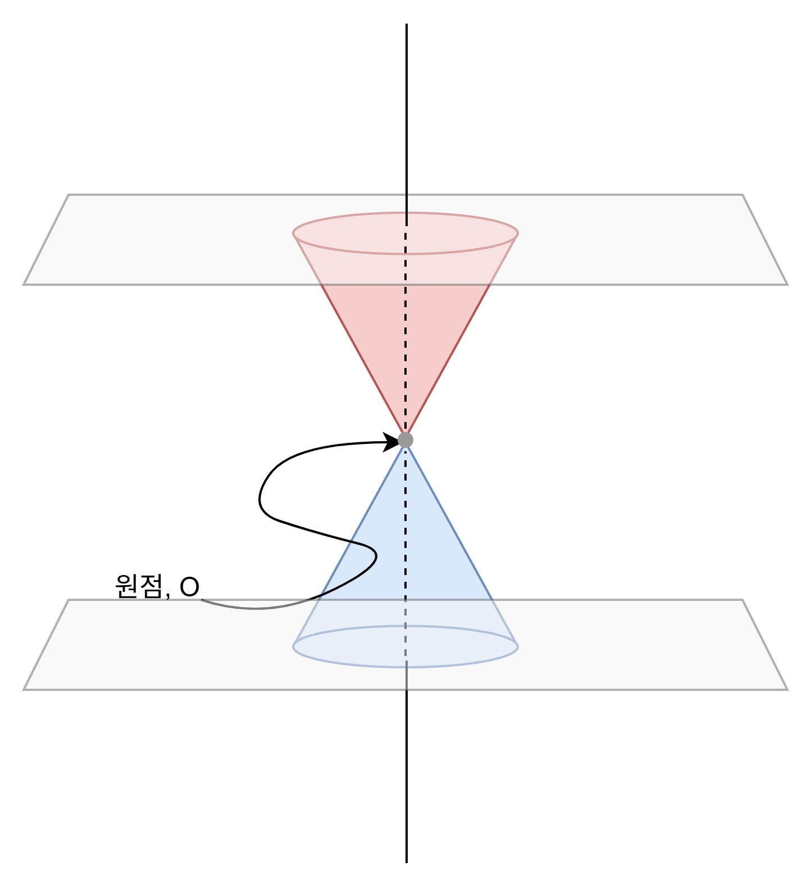
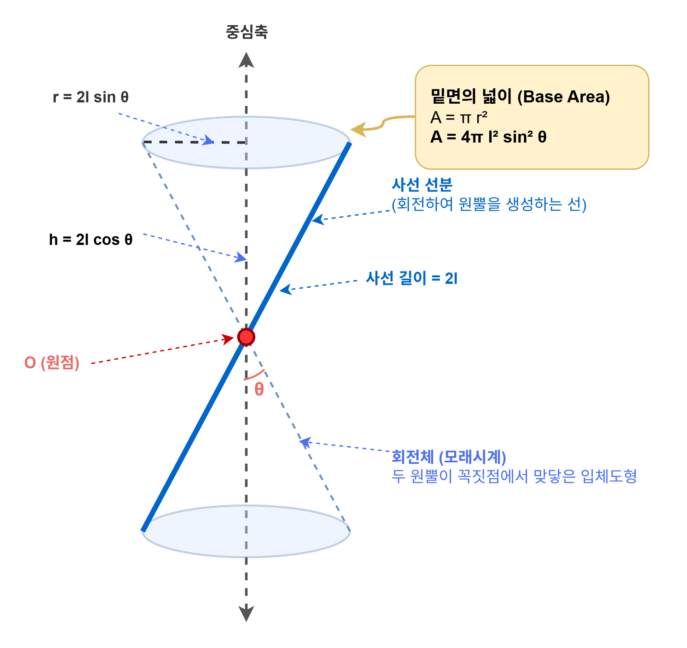
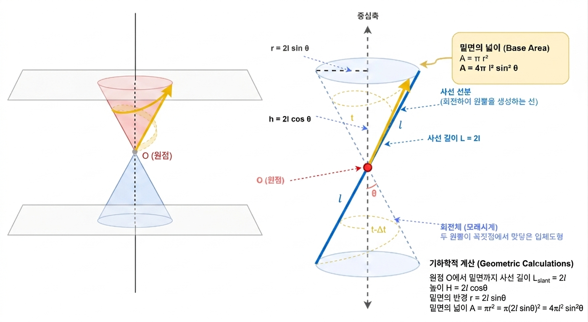
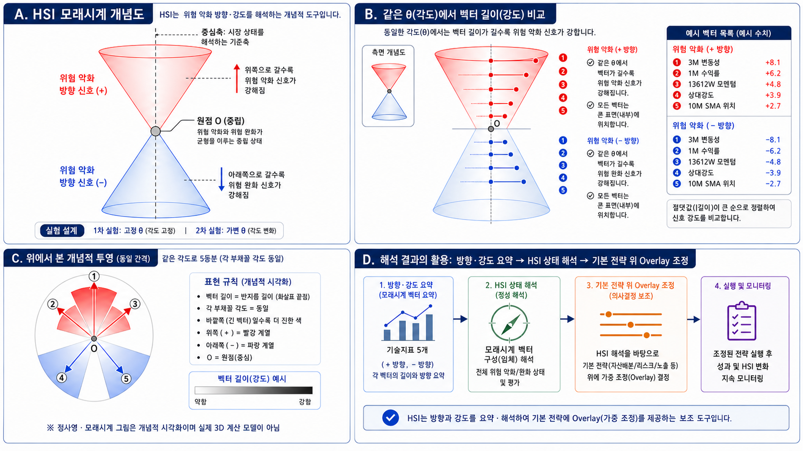
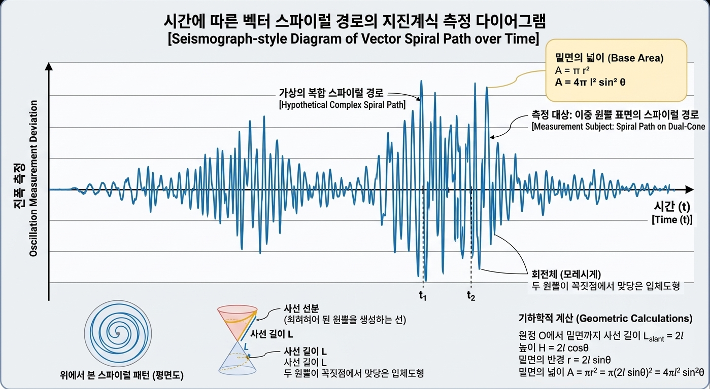

# HSI 초기 아이디어와 구상, 그리고 방법론 정리 수정보완본

> 기준 원본: `HSI초기 아이디어와 구상의 출발점(4).hwpx`
> 수정 범위: 원본의 `HSI 방법론 정리: 발상에서 계산 구조로 줄어든 과정` 이하를 중심으로 첨삭·보완하였다.
> 편집 방향: 초기 구상의 서사는 최대한 유지하고, 방법론 절에는 계산값 → 상태판정 rule → 목표비중 → λ 적용 → 검증 해석의 연결고리를 보강하였다.

- 일시 ; 2026년 07월 10일
- 소속 : 나만의 로보어드바이저 만들기 프로젝트, 3조 조원 김근형

## 0. 문서 안내: HSI 방법론 설명의 범위

HSI는 외부에서 이미 정립된 표준 금융지표가 아니라, 본 프로젝트 안에서 직접 정의하고 실험을 통해 다듬어 간 내부 상태 해석 지표이다. 따라서 이 문서에는 단순한 결과 설명뿐 아니라, HSI가 어떤 관찰에서 출발했고 어떤 개념적 구상을 거쳐 실제 계산 가능한 구조로 축소되었는지에 대한 과정이 함께 기록되어 있다.

본 프로젝트는 HSI라는 아이디어를 실험 과정에서 보완하면서, 동시에 이를 활용한 방어형 ETF Overlay 전략을 구성한 작업이다. 이 때문에 HSI 방법론과 수식 설명은 일반적인 백테스트 결과 설명보다 길게 정리되었다. 이는 지표를 과도하게 포장하기 위한 것이 아니라, 아직 정립 과정에 있는 HSI의 계산 근거와 적용 범위를 투명하게 남기기 위한 것이다.

이 문서는 HSI가 완성된 표준지표라는 주장을 하기 위한 문서가 아니라, HSI가 형성되고 검증되는 과정을 보여주는 방법론 초안이다. 최종 성과와 결론은 01 최종보고서에, 계산식과 검증 로그는 03 보충부록에 두고, 본 문서는 HSI가 왜 이러한 구조를 가지게 되었는지 설명하는 역할을 담당한다.

## 1. HSI 생성 출발점 기록

HSI 발상은 6월 8일, 미국 반도체주 급락 후 그 다음날 한국의 삼성전자와 SK하이닉스가 급락한 보도를 듣고 모멘텀을 주제로 미국 ETF방어형 전략을 주제로 과제를 하면서 미국에서 사건이 있은 후 한국에 충격이 오기 전에 방어할 수 있다면 좋겠다는 생각이 계기가 되었다. 이 사건이 있은 후 ‘한국 반도체 주식이 많이 빠졌다’라는 현상을 시간의 흐름에 따라 정렬 하였을 때 그 위험이 어디에서 시작되어 어디로 전이되었는지 그리고 국내외에 발생하는 이슈들과 주변 환경 변화에 대한 한국 시장의 반응과 미치는 영향의 크기 같은 신호를 확인 할 수 있는 방법이 있는지 종종 고민하다가, 마지막 나만의 알파전략 만들기 과제를 제출을 앞두고 한국의 시장을 파악할 수 있는 무언가를 만들어 보자고 마음먹게 되었고 HSI(Hourglass Signal Index)가 그 날 여러 관심 분야의 배경지식과 기대하에 구상되어 어떤 모양으로 시장의 현황과 분위기를 읽을 수 있을지에 대한 기틀이 만들어 졌다.

담백하게도 금융과 주식시장에 대한 이해도가 낮고 레벨로 보자면 입문자 단계에 걸쳐져 있는 터라, 다른 지표나 전략에 비해 여러모로 준비와 체계의 정밀도가 떨어진다는 점과 구현 단계에서 그친 내용들이 많다는 한계가 있다. 하지만 HSI는 기존의 검증된 금융모형을 그대로 적용한 것이 아니라, 수업 범위 안에서 직접 설계한 실험적 상태 해석 지표이다. 보편적이고 상용화된 지표 수준의 정밀성을 갖추었다고 보기는 어렵지만, 여러 가격 기반 신호를 하나의 시장상태 판단 구조로 연결해 보았다는 점에서 학습 프로젝트로서의 의미가 있다. 그리고 개인의 배경지식에 영향을 많이 받았다는 점이 HSI의 단점과 장점으로 동시에 작용했다는 점을 미리 밝히며 지표의 구성에 대한 이야기로 이어가고자 한다.

본 프로젝트에서 HSI는 시장상태를 읽는 보조지표로 사용되며, 각 상태를 ETF 목표비중으로 연결하는 역할을 한다. 이후 λ는 현재 비중이 HSI 목표비중으로 이동하는 속도를 조절한다. 하지만, 지금 완성된 HSI는 초기 커다란 구상 중 일부를 과제 범위에서 구현한 시장상태 해석형 market timing overlay의 3차 실험 결론에 가깝고 이 또한 한계점이 있다. 이에 대한 내용은 프로젝트 본문의 발표내용에서 실험의 흐름과 결과 분석내용에서 확인 할 수 있다.

HSI는 처음부터 금융모형이나 확고한 설계를 바탕으로 한 기술지표로 출발한 것이 아니라, 시간이라는 물리적인 표현의 한계를 가상의 공통된 개념으로 좌표축으로 두었을 때 여러 시장 신호를 같은 원점에서 비교해 보고 싶다는 생각에서 출발하였다.

아래의 첨부된 그림은 아이디어를 얻은 배경지식의 초기 구현 상태를 표현한 것들을 가져온 것이다.

| [그림a. 공간 좌표와 출발점 원점] | [그림b. 시장상태 해석 신호 분리] |
|:---:|:---:|
|  |  |


## 2. 아이디어와 구조설계

“한국 반도체 주식이 많이 빠졌다”는 현상은 시간의 흐름에 따라 정렬해 보면, 위험은 어느 한 지점에서 갑자기 나타난 것이 아니라, 바깥에서 먼저 흔들리고 한국 시장으로 전이된 것처럼 보였다. 미국 반도체 시장의 흔들림, 나스닥의 변화, 환율의 움직임, 그리고 다음 날 한국 반도체 대표주의 하락은 각각 따로 떨어진 사건이라기보다, 하나의 시장 환경 안에서 시간차를 두고 나타난 신호처럼 느껴졌다.

같은 날의 시장에도 수익률, 추세, 변동성, 상대강도, 외부 충격, 수급 변화처럼 서로 다른 신호가 동시에 존재한다고 느꼈다. 어떤 신호는 위험을 키우는 방향으로 움직이고, 어떤 신호는 위험이 완화되는 방향으로 움직인다. 또 어떤 날은 두 방향의 신호가 동시에 나타나 시장이 어느 쪽으로 가는지 판단하기 어렵다. 그래서 단순히 오른다, 내린다를 보는 것이 아니라, 지금 시장이 어느 방향으로 얼마나 기울었는지, 그리고 그 안에서 위험과 완화가 얼마나 충돌하고 있는지를 보고 싶었다.

이 생각에는 자연과학을 배우면서 현상을 관찰하고 문제인식과 동시에 가설을 세워 기존 배경 지식과 배경원리를 정리해 실험을 설계하고 결과를 보고 가설 재설정과 실험의 반복을 통해 최종적인 결과 분석으로 결론을 얻고, 그에 대한 일반화와 이론으로 순환되는 절대적인 규칙이나 진리는 없다는 것을 보여주는 탐구적인 시선과 감각이 많이 섞여 있다.

물리학에서 배운 차원과 벡터는 서로 다른 방향과 크기를 가진 값을 같은 좌표계에서 해석하는 방법을 떠올리게 했다. 공통된 시간 위에서 흐르며 같은 시점에서 가지는 의미 있는 지표들은 상대속도의 개념으로, 가속도는 위치 자체보다 변화의 변화량을 보는 감각을 주었다.

지구과학에서 배운 P파와 S파는 같은 지진이라는 현상에 속하더라도 도착 시간과 흔들림의 방식이 다를 수 있다는 점을 생각하게 했다.

무기화학에서 인상적인 첫 수업에서, CH4 분자 구조는 공유결합의 길이와 중성자와 양성자 그리고 전자의 구성으로 분해하여 화학의 미시적인 관점에서 여러 힘이 동시에 작용할 때 물리적인 안정적이 하나의 형태를 이루려는 화학 평형상태로 가려한다는 기억을 통해 시장 또한 여러 힘이 작용하고 그후 안정적인 형태를 찾아가려 한다는 가정을 해 볼 수 있었다. 이러한 자연과학의 개념을 금융시장에 그대로 적용할 수 있다고 생각한 것은 아니다.

시장은 분자나 파동처럼 자연법칙 하나로 안정되게 설명되는 대상이 아니다. 시장에는 금리, 환율, 정책, 수급, 뉴스, 투자심리, 글로벌 환경 같은 여러 변인이 섞여 있다. 그렇지만 여러 힘이 동시에 작용할 때 하나의 상태가 만들어진다는 감각은 시장 신호를 해석하는 데 도움이 될 수 있다고 생각했다. 시장도 하나의 선 위에서만 움직이는 것이 아니라, 여러 방향으로 동시에 눌리고 밀리고 흔들리는 구조일 수 있다고 보았다.

처음에는 이 구조를 평면 그림이 아니라 입체도형으로 표현하고 싶었다. 정사면체의 꼭짓점 두 개를 맞닿게 한 구조나, 여러 벡터가 같은 간격으로 배치된 정다면체 같은 형태도 떠올렸다. 하지만 실제 시장지표는 네 개 혹은 정다면체의 면의 꼭지점 수에 맞추어 고정되지 않는 변수임을 반영하며, 어떤 지표를 위쪽에 둘지 아래쪽에 둘지, 벡터 사이의 각도를 어떻게 둘지 구분하는 과정이 필요했다. 그래서 조금 더 유연한 형태인 원뿔, 그리고 위아래 원뿔이 맞닿은 모래시계 구조로 생각이 옮겨갔다.

특히 화학에서 배운 분자 구조의 감각은 HSI의 공간적 상상에 영향을 주었다. 분자의 형태는 원자가 임의로 놓인 결과가 아니라, 전자쌍 사이의 반발, 비편재화, 안정화, 평형상태가 함께 작용하면서 특정한 결합각과 구조를 갖게 된다. 시장의 기술지표들이 분자 구조와 같다고 본 것은 아니지만, 여러 신호가 동시에 작용할 때 특정 시점의 시장상태도 하나의 구조처럼 나타날 수 있지 않을까 생각했다. 각 신호가 따로 존재하는 숫자가 아니라, 방향과 길이를 가진 요소라면, 그 요소들을 같은 원점 위에 놓았을 때 시장의 현재 모습이 조금 더 입체적으로 보이지 않을까 싶었다.

그래서 나는 각 기술지표를 그냥 더하는 대신, 같은 원점에서 출발하는 벡터로 바꾸고 싶었다. 원점은 위험과 완화를 가르는 기준점이고, 벡터의 방향은 위험 악화 또는 위험 완화 방향이며, 벡터의 길이는 신호의 강도라고 보았다. 여러 벡터가 한 시점에 동시에 놓이면, 그날의 시장은 단순히 좋거나 나쁜 것이 아니라 어느 방향으로 눌리고, 어느 쪽으로 벌어지고, 어떤 신호들이 충돌하는 상태로 해석될 수 있다고 생각했다.

> [그림a]는 시간은 물리적인 좌표축으로 그어 낼 수 없지만, 모든 사물과 생명 그리고 현상들을 공통으로 관통하는 개념이며 존재한다. 그렇기에 앞으로 시간의 개념이 공통적으로 적용된다는 의미로 시간축이라는 단어로 명칭하겠다.

주식의 가격과 그것으로부터 파생된 지표와 각 기업의 성적표들 그리고 정성적인 분석들의 가치는 시간이라는 공통된 축에서 동일한 시점 마다 그 수치를 달리하여 보여진다. 그것을 시장이라는 환경에서 나타나는 현상들을 요소로 나누어 파악하는 방식이라고 생각한다면 이들을 다음에 빗대어 표현 할 수 있지 않을까? 각 변수들이 하나의 축과 스케일을 담당하듯, 시장은 수익률, 추세, 변동성, 상대강도, 외부 충격 등의 여러 차원에서 오는 신호를 수용하여 어떠한 방향으로 기울거나 나아가게 된다. 그 신호들은 서로 단위가 다르기 때문에 단순 산술 합산이 어렵다. 수익률은 퍼센트로 표현되고, 변동성은 표준편차로 계산되며, 이동평균 대비 위치는 가격과 평균의 차이로 나타난다. 상대강도나 거래량 지표는 또 다른 단위를 가진다. 그냥 더하거나 곱하면 과하게 커지거나 방향이 엉뚱하게 섞여 아무런 의미 없는 값이 될 것이다. 그래서 이 표들을 먼저 분위수나 z-score로 바꾸어, 같은 출발점, 원점에서 출발하는 벡터로 표현하고 각 지표의 원점이 되는 기준점을 한국시장에 맞추어 해석 되는 값으로 나누어 한국만의 기준을 만들어 보고 싶었다, 예를 들어, 어떤 기술지표 A가 미국시장에서는 -3~-5 구간에서 위험 신호로 해석된다고 가정하더라도, 한국시장에서는 0~-1 구간이 위험 신호로 작동할 수 있다. 이 경우 동일한 절대값 기준을 그대로 적용하기보다, 한국시장 자료에서 관찰되는 위험 신호 구간을 기준으로 중심점을 다시 설정하고, 해당 지표를 분위수 또는 표준화 점수로 변환하여 다른 지표들과 비교 가능한 형태로 만들고자 하였다.

그래서 원점은 한국 시장환경에서 안전 구간과 위험 구간을 나누는 기준점이어야 했다. 어떤 기술지표가 미국 시장에서는 특정 범위에 들어갔을 때 위험 신호로 해석될 수 있지만, 한국 시장에서는 그보다 훨씬 작은 변화도 위험 신호로 작용할 수 있다. 반대로 미국 시장에서는 크게 보이는 변화가 한국 시장에서는 흔한 움직임일 수도 있다. 그래서 나는 각 지표의 원점을 한국 시장의 과거 분포와 시장환경에 맞추어 다시 잡아 보고 싶었다. 그 기준을 중심으로 위쪽은 위험 악화 방향, 아래쪽은 위험 완화 방향으로 나누고 싶었다.

이 구상이 [그림b] 모래시계 구조(Hourglass Signal)로 이어졌다. 모래시계의 중심은 원점이고, 위쪽은 위험 신호가 쌓이는 방향이며, 아래쪽은 위험 완화 또는 안전 신호가 쌓이는 방향이다. 각 기술지표는 중심에서 출발하는 하나의 벡터가 된다. 어떤 벡터는 위쪽으로 뻗고, 어떤 벡터는 아래쪽으로 뻗는다. 벡터의 길이는 신호의 강도를 나타낸다. 위쪽 벡터가 길면 위험 악화 신호가 강하다는 뜻이고, 아래쪽 벡터가 길면 위험 완화 신호가 강하다는 뜻이다.




> [그림1. HSI 초기 모래시계 구상: 원점, 벡터, 시간 경로]

> [그림1]을 보면 좀 더 쉽게 구조적인 이해를 돕는다. 이 그림은 시장 신호를 같은 원점에서 출발하는 벡터로 보고, 위험 악화 방향과 위험 완화 방향을 위아래 원뿔로 나누어 해석하려 한 초기 구상이다. 사선 벡터는 특정 시점의 신호 방향과 강도를 의미하고, t와 t-Δt는 시간이 지나며 신호의 위치와 강도가 달라질 수 있다는 생각을 나타낸다. 그러나 실제 구현에서는 이중 원뿔 표면의 경로나 θ 기반 면적 계산을 그대로 사용하지는 못했다. 최종적으로는 이 아이디어를 위험 악화 신호와 위험 완화 신호의 합, 그리고 direction, intensity, conflict라는 계산 가능한 구조로 다음과 같이 단순화하였다. 실제 최종 백테스트에서는 θ와 원뿔 면적을 직접 계산하지 않았고, 이 구상은 HSI의 방향성, 강도, 충돌도 계산으로 단순화되었다. ([그림2])




> [그림 2. HSI 개념도: 방향·강도·투영·Overlay 흐름]

이 그림은 처음의 모래시계 구상[그림1]을 실제 설명 가능한 형태로 줄인 것이다. 위쪽은 위험 악화 방향, 아래쪽은 위험 완화 방향으로 두고, 각 기술지표의 신호 강도는 벡터 길이로 표현하였다. 위에서 본 단면은 같은 각도에 배치된 지표들의 상대적인 신호 강도를 비교하기 위한 개념적 그림이며, 실제 3차원 계산 모델은 아니다. 최종적으로 HSI는 이 방향과 강도를 요약하여 기본 전략 위에 Overlay 조정을 제공하는 보조 도구로 사용된다.



> [그림3.] 시장 신호를 지진계 기록처럼 해석하려 한 초기 구상

이 그림은 외부 충격과 내부 반응이 시간축 위에서 어떻게 흔들리고 사라지는지 보고 싶었던 초기 아이디어를 시각화한 것이다. 실제 최종 백테스트에서는 스파이럴 경로나 이중 원뿔 표면의 경로를 직접 계산하지 않았고, 이 구상은 HSI의 방향·강도·충돌 개념으로 단순화되었다.

지구과학에서 배운 P파와 S파의 감각도 이 구상에 영향을 주었다. 지진 현상으로 인한 흔들림은 사람이 만든 지진계의 펜끝에서 진폭으로 기록된다. 펜은 고정되어 있고, 그 아래의 종이와 장치의 몸체가 흔들리면서 선이 그려진다. 이때 P파와 S파는 같은 지진이라는 현상에서 관찰되는 흔들림이지만, 도착 시간과 흔들림의 방식이 다르기 때문에 같은 기록 안에서도 구분해서 읽어야 한다.

두 파는 지진원에서 바깥으로 퍼져 나간다는 큰 방향은 같지만, 매질이 에너지를 전달하며 흔들리는 방식과 통과하는 속도, 그리고 관측되는 강도가 다르다. 특히 P파는 진행 방향과 나란한 압축·팽창 성분이 강하고, S파는 진행 방향과 수직인 흔들림 성분이 강하다고 배운 기억이 있다. 그래서 처음 지진 기록 그림을 보면 하나의 흔들림이 이어져 그려진 것처럼 보일 수 있지만, 실제로는 서로 다른 성격의 파가 시간차를 두고 도착한 흔적을 함께 읽는 것에 가깝다고 생각했다.

나는 이 방식이 시장 신호를 읽는 감각과 닮아 있을 수 있다고 느꼈다. 기술지표마다 서로 다른 방식으로 흔들리고, 서로 다른 속도로 시장에 신호를 보내지만, 결국에는 하나의 큰 시장 흐름 안에서 모여 국면을 만들 수 있다. 시장은 강의와 학습자료에서 배운 것처럼 확장, 둔화, 침체, 회복과 같은 큰 국면 사이클을 반복하기도 하고, 때로는 그 흐름이 끊어지거나 예상보다 빠르게 전환되기도 한다. 그래서 나는 같은 시간을 공유하며 한 방향으로 흘러가되, 각자 다른 방식으로 기록되고 읽히는 신호들이 시장 안에도 존재한다고 생각했다.

시장에서도 하나의 큰 사건이 있을 때, 모든 신호가 한 장의 차트 위에서 같은 방식으로 나타나는 것은 아니다. 해외 반도체, 나스닥, 환율, 일본시장 같은 신호는 먼저 흔들리는 외부 경고 신호처럼 보일 수 있고, KOSPI, 삼성전자, SK하이닉스, 외국인 수급, 거래량 같은 신호는 한국 시장 내부에서 실제로 나타나는 본진 신호처럼 보일 수 있다. 그래서 나는 이 신호들을 한 번에 섞어서 하나의 값으로만 보고 싶지 않았다.

각각의 신호는 서로 다른 기록지에 그려진 선처럼 생각해 보았다. 지진이라는 현상을 분석할 때 서로 다른 성격의 흔들림을 같은 시간축 위에 맞추어 읽듯이, 시장에서도 사건 기준일을 정하고 외부 신호와 내부 신호를 나누어 정렬해 보고 싶었다. 어떤 신호가 먼저 흔들렸는지, 그 흔들림이 며칠 뒤 한국 시장의 가격과 수급에 나타났는지, 그리고 그 사이의 시간차가 반복되는지 확인하고 싶었다.

이때 신호가 전파되는 속도에 상대적인 차이가 있을 수 있다는 생각에서, 외부사건과 내부사건을 나누어 보고 싶어졌다. 외부사건은 미국 반도체 급락, 나스닥 하락, 환율 급등, 일본시장 약세처럼 한국 시장 밖에서 먼저 발생하는 신호에 가깝다. 내부사건은 KOSPI 하락, 삼성전자와 SK하이닉스의 급락, 외국인 순매도, 거래량 급증처럼 한국 시장 안에서 실제로 관측되는 반응에 가깝다. 나는 이 둘을 단순히 원인과 결과로 단정하려 한 것은 아니지만, 적어도 시간의 흐름 속에서 어느 쪽이 먼저 움직이고 어느 쪽이 뒤따라 흔들렸는지는 살펴볼 수 있다고 생각했다.

동시에 큰 여파를 사전에 줄이고 방어할 수 있는 방법도 생각해 보고 싶었다. 이때 떠올린 것이 하인리히 법칙이었다. 하인리히 법칙은 산업재해 분야에서 작은 사고, 중간 사고, 큰 사고의 발생 관계를 설명할 때 사용되는 경험적 사고방식이다. 물론 이 법칙을 주식시장에 그대로 적용할 수는 없다. 산업재해는 특정 현장과 사고 범위를 정해 두고 사건의 개수를 세는 방식이고, 주식시장은 가격, 수급, 정책, 뉴스, 환율, 해외시장 등 여러 요인이 동시에 섞이는 환경이기 때문이다. 하지만, “작은 흔들림이 반복되고, 그 흔들림이 중간 수준의 경고로 커지고, 결국 큰 충격으로 이어질 수 있다”는 사고방식은 시장을 해석하는 데 참고할 수 있다고 생각했다. 그래서 주식의 등락 폭이나 지표의 변화 길이를 어떤 기준으로 작은 사건, 중간 사건, 큰 사건으로 나눌 수 있을지 고민하였다. 처음에는 절대적인 기준을 정하기보다, 한국시장 안에서 관찰되는 과거 변동의 분포를 기준으로 사건의 크기를 나누어 보고 싶었다.

더 나아가 그 크기들이 정의정의될 수 있다면 큰 사건이 발생하기 전의 작은 흔들림, 사건이 발생한 뒤의 여파, 그리고 다시 유의미한 회복세가 시작되는 시점까지 함께 보고 싶었다. 이를 위해 과거 데이터의 분위수를 이용해 사건의 강도를 나누고 싶었다. 어떤 움직임이 평소에도 자주 나타나는 작은 변화인지, 과거 분포에서 극단에 가까운 큰 충격인지, 혹은 큰 사건 이후에도 위험 신호가 계속 남아 있는 여진 같은 상태인지 세어보고 싶었다.

그에 내가 기대했던 것은 사건과 여파가 시장에 들어왔다가 사라지는 과정에서 어떤 패턴이나 순환 고리가 보이지 않을까 하는 점이었다. 외부에서 먼저 온 충격이 내부 시장으로 전이되고, 그 충격이 가격과 수급에 남고, 이후 반등이나 회복 신호가 나타나는 흐름을 시간축 위에 올려 보면, 시장이 위험을 받아들이고 소화하는 방식이 조금은 보일 수 있지 않을까 생각했다. 이 생각은 나중에 HSI에서 방향, 강도, 충돌, 사건누적을 나누어 보고 싶었던 이유와 연결된다.

마지막으로, 현실적인 한계를 말하자면, 이 모든 구상은 당시의 금융시장 이해도와 구현 능력에 비해 컸다. 경제지표와 시장 국면을 읽는 법에 익숙하지 않았고, 각 지표가 실제로 어떤 의미를 갖는지 확인하려면 시장 관련 사실을 오랜 시간 관찰하고, 측정하고, 편견이나 해석이 과하게 섞이지 않은 질 좋은 정보를 모아야 했다. 또한 한국시장이라는 범위 안에서 실험 대상을 분류하는 일 자체에도 많은 변인이 섞여 있었다. 그래서 처음의 HSI 구상은 매우 넓었지만, 실제 과제에서는 그중 계산 가능한 부분만 남길 수밖에 없었다.

## 3. 미니 프로젝트에서 구현된 것

초기의 HSI 구상은 머릿속에서는 비교적 넓은 형태를 가지고 있었다. 시장에 떨어질 수 있는 위험 신호를 모아 볼 수 있는 부피량이 있는 구조로 살펴 볼 수 있고, 각 지표의 벡터를 위아래에 배치하며, 그 벡터들이 만들어내는 넓이와 부피감, 정사영의 일그러짐까지 함께 읽어 보고자 하였다. 그러나 개인 과제로 구현할 수 있는 범위는 제한적이었다. 특히 “유의미한 알파 전략”을 구성해야 하는 과제 조건 안에서는, 상상한 구조 전체를 구현하기보다 우선 계산 가능하고 설명 가능한 형태로 줄이는 과정이 필요했다. 따라서 미니 프로젝트에서는 HSI의 전체 구상 중 가격 데이터만으로 계산할 수 있는 신호를 중심으로 첫 번째 작동형 구조를 만들었다. 이때 사용한 신호는 최근 수익률, 1/3/6/12개월 모멘텀, 10개월 이동평균 대비 위치, 최근 변동성, 현금성 자산 대비 상대강도였다. 이 신호들은 서로 단위와 해석 방향이 다르기 때문에 그대로 합산하지 않고, HSI의 해석 방향에 맞추어 위험 악화 방향과 위험 완화 방향으로 부호를 정리하였다. 실제 1차 보고서에서도 HSI 계산을 위해 값이 클수록 양호한 수익률, 모멘텀, 이동평균 대비 위치, 상대강도는 부호를 반전하고, 값이 클수록 위험이 커지는 변동성은 그대로 사용하여 HSI 점수의 양수를 위험 악화 방향, 음수를 위험 완화 방향으로 해석하였다.

이때 중요하게 본 것은 좋은 신호와 나쁜 신호를 한 줄로 단순 합산하는 것이 아니었다. 같은 시점에 위험 신호와 완화 신호가 동시에 존재할 수 있기 때문이다. 그래서 각 신호를 위험 악화 방향과 위험 완화 방향으로 나누고, 위험 악화 방향의 신호 합을 V_plus, 위험 완화 방향의 신호 합을 V_minus로 정의하였다. 이후 가능한 최대 신호 크기와 유효한 신호 개수를 곱한 총 크기(m_v)를 기준으로 방향성, 절대강도, 충돌도를 계산하였다. 이 구조는 단순히 신호의 총합을 보는 방식보다, 위험과 완화가 동시에 나타나는 상태를 따로 해석할 수 있다는 장점이 있었다.

이 과정에서 HSI의 기본 성격이 정리되었다. HSI는 하나의 매수·매도 명령이 아니라, 현재 시장 신호를 방향성, 강도, 충돌도로 요약하는 상태 해석 지표이다. 방향성은 위험 악화와 위험 완화 중 어느 쪽이 더 우세한지를 나타내고, 강도는 전체 신호가 얼마나 크게 활성화되었는지를 나타내며, 충돌도는 위험 신호와 완화 신호가 동시에 존재하는 정도를 보여준다. 방법론 정리본에서도 direction, intensity, conflict를 분리해 계산하는 이유는 시장이 단순히 위험하거나 안전한 상태로만 존재하지 않기 때문이라고 설명하고 있다.

m_v는 단순한 지표 개수라기보다, 해당 시점의 유효 신호들이 만들 수 있는 최대 절대 신호합을 의미한다. 신호 점수가 이미 -1~+1 범위로 정규화되어 있다면 m_v는 유효지표 개수와 같고, 신호 점수가 -10~+10 범위라면 m_v는 유효지표 개수 × 10이 된다. 본문의 θ=0.15, direction_margin=0.05와 같은 상태분류 기준은 이러한 정규화 이후의 component 값에 적용된다.

미니 프로젝트에서는 이렇게 계산한 HSI 값을 이용해 시장 상태를 몇 개의 구간으로 나누고, 각 상태에 따라 위험자산과 현금성 자산의 비중을 다르게 적용하였다. 위험 완화 신호가 우세하면 위험자산 비중을 높이고, 위험 악화 신호가 우세하면 현금성 자산 비중을 높이는 방식이었다. 따라서 이 단계의 HSI는 미래 수익률을 직접 맞히는 예측모델이라기보다, 관측 가능한 시장환경신호를 이용하여 다음 리밸런싱 시점의 비중을 정하는 보조 판단 기준으로 사용되었다. 1차 보고서에서도 본 전략은 현재 관측 가능한 시장환경신호를 이용해 시장 상태를 분류하고, 그 결과를 다음 리밸런싱 기간의 위험자산 비중과 현금성 자산 비중으로 변환하는 규칙 기반 동적자산배분 실험으로 정리되어 있다.

물론 이 단계에서 구현된 HSI는 초기 구상 전체를 옮긴 결과는 아니었다. P파와 S파를 실제로 분리하여 해외 선행 신호와 한국 본진 신호의 시간차를 계산하지는 못했고, 모래시계의 입체 부피나 정사영의 왜곡을 계산하지도 못했다. 분위수와 z-score를 이용해 한국시장만의 기준선을 충분히 정교하게 검증하지도 못했다. 실제로 남은 것은 여러 가격 기반 신호를 위험 악화와 위험 완화 방향으로 나누고, 그 방향과 강도, 충돌을 요약하여 비중 결정에 연결하는 기본 뼈대였다.

그럼에도 이 미니 프로젝트는 HSI가 단순한 그림이나 비유에서 계산 가능한 실험 지표로 넘어간 첫 단계였다는 점에서 의미가 있다. 머릿속에 있던 모래시계와 벡터의 이미지를 전부 구현하지는 못했지만, 시장 신호를 같은 원점에서 바라보고 위험과 완화의 방향으로 나누어 계산하는 구조를 처음으로 코드 안에 넣어 보았기 때문이다. 이때부터 HSI는 불완전하더라도 실제 백테스트에 연결할 수 있는 상태 해석형 지표가 되었다.

## 4. 팀 프로젝트로 넘어가며 바뀐 것

처음의 HSI는 개인적인 미니 프로젝트 안에서 시장 신호를 해석해 보고 싶은 실험에 가까웠다. 그러나 이후 팀 프로젝트의 주제로 이어지면서 HSI의 성격은 조금 달라졌다. 실제 프로젝트로 팀 단위로 회의하고 설계를 하는 과정에 들어 가기 위해선 HSI를 구현해야 하는 단계에 들어서자 먼저 줄여야 하는 것들이 많았다. 처음에 HSI 중심의 실험결과만을 가지고 출발했지만, 현실적인 목적에 맞도록 구현하는 단계에서 전략이 중심으로 초점이 맞춰지고 보조적인 장치로 HSI가 사용되었다. 즉, 한국 ETF를 이용한 방어형 RoboAdvisor 전략 안에서 HSI를 어떻게 사용할 수 있는지가 더 중요해졌다.

이 과정에서 HSI는 독립적인 시장 설명 모형이라기보다, ETF 비중을 조절하는 market timing overlay 지표로 정리되었다. 즉, HSI가 시장 전체를 완벽하게 설명하는 것이 아니라, 위험자산 비중을 늘릴지 줄일지 판단하는 보조 신호로 사용되는 구조가 되었다. 처음의 상상에서는 HSI가 시장의 시간차, 사건, 국면, 충돌을 모두 읽는 큰 해석 틀에 가까웠다면, 팀 프로젝트에서는 HSI 상태를 ETF 목표비중으로 번역하고, 그 목표비중을 실제 포트폴리오에 반영하는 방식으로 전략이 세워졌다.

특히 팀 프로젝트에서는 HSI baseline이라는 내부 기준선이 만들어졌다. HSI baseline은 HSI가 분류한 시장 상태를 ETF 목표비중에 즉시 반영하는 구조이다. 예를 들어 위험 완화 상태에서는 위험자산 비중을 높이고, 위험 경고 상태에서는 위험자산 비중을 줄이는 방식이다. 이 구조는 HSI가 자산배분 행동으로 어떻게 연결되는지를 보여주는 데는 유용했지만, 목표비중을 바로 반영하다 보니 비중 변화가 다소 과격해지고 Turnover 부담이 커질 수 있었다.

그래서 이후에는 λ 부분조정 방식이 들어왔다. λ는 HSI가 제시한 목표비중으로 한 번에 이동하지 않고, 현재 비중에서 목표비중으로 천천히 이동하게 하는 속도 조절 계수이다. 이 부분에서 HSI의 성격은 다시 한 번 바뀌었다. HSI는 더 이상 “그날의 시장상태를 읽는 지표”에만 머무르지 않고, 실제 ETF 비중을 얼마나 빠르게 조정할 것인지에 영향을 주는 방어형 overlay 구조의 중심 입력이 되었다.

이 변화는 초기 구상의 일부를 포기하는 과정이기도 했다. 해외 선행 신호와 한국 본진 신호를 분리해 읽는 P/S파 구조는 팀 프로젝트의 중심 구현으로 들어오지 못했고, macro companion이나 event balance 같은 보조 진단층으로 일부 흔적만 남았다. 대신 프로젝트는 다양한 실험을 하여 여러 장치를 만들어 볼 수 있는 기회가 되었다, ETF 3개를 정하고, Fixed BM과 EW Benchmark를 두고, HSI baseline과 Lambda 후보를 비교하는 구조가 만들어졌다. 팀 프로젝트 버전의 HSI는 초기 구상 중에서 ETF 방어형 자산배분에 적용 가능한 부분만 남긴 축약형이라고 보는 것이 더 적절하다. 처음의 HSI는 시장을 해석하고 싶었던 상상에서 출발했고, 팀 프로젝트의 HSI는 그 상상을 한국 ETF 방어형 RoboAdvisor 전략 안에서 작동 가능한 형태로 줄인 결과에 가깝게 되었다.

## 5. HSI 방법론 정리: 발상에서 계산 구조로 줄어든 과정

앞선 절이 HSI의 출발점과 구상 과정을 설명하는 글이라면, 이 절은 그 구상이 실제 계산 구조와 ETF 비중 조절 규칙으로 어떻게 줄어들었는지를 정리하는 방법론 절이다. HSI는 처음부터 완성된 외부 표준지표로 출발한 것이 아니라, 본 프로젝트 안에서 정의되고 검증되며 다듬어진 내부 합성지표이다. 따라서 본 절에서는 HSI를 과장하여 설명하기보다, 실제 구현에 남은 계산 구조와 후속 검증으로 분리된 요소를 구분해 설명한다.

HSI의 목적은 다음 달 수익률을 직접 예측하는 것이 아니다. HSI는 현재 관측 가능한 가격 기반 시장 신호를 같은 해석 기준 위에 올려, 시장상태가 위험 악화 방향에 가까운지, 위험 완화 방향에 가까운지, 또는 양쪽 신호가 동시에 나타나는 충돌 상태인지 확인하기 위한 상태 해석형 market timing 보조지표이다. 실제 전략 안에서는 HSI 상태가 ETF 목표비중을 만들고, λ는 그 목표비중으로 이동하는 속도를 조절한다.

따라서 HSI의 전체 흐름은 다음처럼 정리할 수 있다.

```text
가격 기반 입력 신호
→ 방향 통일
→ 표준화와 clipping
→ V_plus / V_minus 분리
→ risk_component / relief_component 계산
→ direction / intensity / conflict 해석
→ HSI 5상태 판정
→ ETF 목표비중 w* 산출
→ λ 부분조정을 통한 실제 적용 비중 계산
→ 다음 월 수익률에 적용
```

이 흐름에서 중요한 점은 `direction`, `intensity`, `conflict`가 계산된 뒤 바로 목표비중으로 넘어가지 않는다는 것이다. 이 값들은 먼저 상태판정 rule을 통과해 `risk_relief`, `neutral_watch`, `conflict`, `risk_warning`, `accident_zone` 중 하나의 상태로 번역되고, 그 상태가 다시 ETF 목표비중으로 연결된다. 기존 설명에서 약했던 부분은 바로 이 연결고리였으므로, 본 절에서는 계산값과 실제 전략 로직 사이의 단계를 명확히 보완한다.

---

### 5.1 HSI 입력 신호를 제한한 이유

HSI에 들어가는 지표는 가능한 많이 넣는 방향으로 정하지 않았다. 지표를 많이 넣으면 시장을 더 풍부하게 설명하는 것처럼 보일 수 있지만, 실제로는 특정 기간의 성과에 우연히 맞는 조합을 만들 위험이 커진다. 따라서 본 프로젝트에서는 가격 기반 market timing에서 해석 가능한 최소 신호군을 구성하는 쪽을 우선하였다.

입력 신호는 개념적으로 수익률, 이동평균 대비 위치, 모멘텀, 변동성, 상대강도라는 다섯 축으로 정리하였다. 이 다섯 지표는 모두 같은 역할을 하지 않는다. 수익률은 단기 가격 변화의 방향을 보고, 이동평균 대비 위치는 현재 가격이 추세 위에 있는지 아래에 있는지를 확인한다. 모멘텀은 일정 기간 동안 추세가 얼마나 지속되었는지, 변동성은 가격 방향과 별개로 시장이 얼마나 불안정한지, 상대강도는 위험자산과 방어자산 사이의 상대적 흐름을 보기 위한 신호이다.

다만 실제 구현에서는 실험 단계에 따라 변수명과 산출 기간이 조금씩 달라졌다. 어떤 실험에서는 20일·60일·120일 기준 신호가 사용되었고, 어떤 실험에서는 21일·63일·126일 또는 월말 집계 신호로 변환되어 사용되었다. 따라서 보고서에서는 “입력 신호의 경제적 의도”와 “각 실험에서 실제 사용된 변수명”을 구분하여 해석하는 것이 안전하다.

| 입력 축 | 대표 변수 예시 | 경제적 의도 | 해석상 주의 |
|---|---|---|---|
| 수익률 | `return`, `ret_1m`, `ret63` | 최근 가격 변화로 시장의 단기 방향을 포착한다. | 실험 단계에 따라 20거래일, 21거래일, 63거래일 등 기간이 다를 수 있다. |
| 이동평균 대비 위치 | `ma_pos`, `ma20_gap`, `ma60_gap` | 현재 가격이 이동평균 위인지 아래인지로 추세 위치를 본다. | 최종 구현 기준과 초기 실험 기준을 구분해야 한다. |
| 모멘텀 | `momentum`, `ret_3m`, `ret_6m` | 여러 기간 누적수익률로 추세의 힘과 지속성을 측정한다. | 모든 후보 기간이 동일하게 최종 상태분류에 들어간 것은 아니다. |
| 변동성 | `vol`, `vol20`, `vol60` | 가격 방향과 별개로 시장 불안정성을 측정한다. | HSI 입력용 변동성, rolling 성과검증용 변동성, factor loading용 변동성은 역할이 다르다. |
| 상대강도 | `rs`, `rel_strength_63` | 위험자산 대비 방어자산 또는 기준자산의 상대성과를 비교한다. | 절대 가격 하락이 크지 않아도 방어자산이 상대적으로 강하면 risk-off 신호로 해석될 수 있다. |

이 입력 구조의 핵심은 다섯 지표를 한 줄로 더해 “좋다/나쁘다”를 판단하지 않는다는 점이다. 각 지표는 서로 다른 정보를 대표하고, HSI 안에서는 방향 통일과 점수화를 거쳐 위험 악화 성분과 위험 완화 성분으로 나뉜다.

---

### 5.2 신호 방향을 통일한 이유

HSI 계산에서 가장 먼저 필요한 작업은 신호의 방향을 통일하는 것이다. 입력지표들은 원래 해석 방향이 서로 다르다. 수익률, 이동평균 대비 위치, 모멘텀, 상대강도는 일반적으로 값이 높을수록 양호한 신호로 해석된다. 반대로 변동성은 값이 높을수록 시장 불안정성이 커졌다는 위험 신호로 해석된다.

이 상태에서 지표를 그대로 더하면 어떤 값은 높을수록 좋은데, 다른 값은 높을수록 위험한 값이 되어 해석 방향이 섞인다. 그래서 HSI에서는 모든 입력값을 하나의 기준으로 맞추었다. HSI 점수에서 양수는 위험 악화 방향, 음수는 위험 완화 방향을 의미하도록 부호를 정리하였다.

원신호를 `x_{j,t}`라고 두고, 각 지표의 방향 계수를 `d_j`라고 하면 방향 통일된 신호는 다음과 같이 표현할 수 있다.

```text
x_tilde_{j,t} = d_j × x_{j,t}
```

여기서 `d_j`는 다음처럼 해석한다.

```text
값이 높을수록 양호한 지표: d_j = -1
값이 높을수록 위험한 지표: d_j = +1
```

따라서 수익률, 이동평균 대비 위치, 모멘텀, 상대강도는 위험 완화 방향으로 반전되고, 변동성은 위험 악화 방향으로 유지된다. 이 처리는 지표의 경제적 의미를 바꾸기 위한 것이 아니라, 이후 모든 신호를 “양수 = 위험 악화, 음수 = 위험 완화”라는 하나의 해석 기준에서 비교하기 위한 전처리이다.

---

### 5.3 표준화와 점수화: 단위가 다른 신호를 같은 기준으로 올리는 과정

방향을 통일한 뒤에도 각 지표의 단위와 변동폭은 서로 다르다. 수익률은 퍼센트로 계산되고, 이동평균 대비 위치는 가격과 평균의 차이로 표현되며, 변동성은 수익률의 표준편차로 계산된다. 상대강도 역시 기준자산과의 비교값이므로 범위가 다르다. 따라서 HSI에서는 방향 통일된 신호를 그대로 합산하지 않고, 비교 가능한 점수로 바꾸는 과정이 필요하다.

초기 구상에서는 분위수와 z-score를 모두 고려하였다. 분위수는 현재 값이 과거 분포에서 어느 위치에 있는지를 보여주므로 사건 분류에 적합하고, z-score는 평균과 표준편차를 기준으로 현재 값이 평소보다 얼마나 벗어났는지를 보여주므로 연속적인 점수화에 적합하다. 실제 기본 구현은 rolling z-score 기반 점수화를 중심으로 정리할 수 있다.

방향 통일된 신호 `x_tilde_{j,t}`에 대해 과거 `w`기간의 평균과 표준편차를 계산하고, 현재 값이 그 분포에서 얼마나 벗어났는지를 표준화한다.

```text
z_{j,t} = (x_tilde_{j,t} - μ_{j,t}^{(w)}) / σ_{j,t}^{(w)}
```

여기서 `μ_{j,t}^{(w)}`는 과거 `w`기간의 rolling 평균이고, `σ_{j,t}^{(w)}`는 과거 `w`기간의 rolling 표준편차이다. 이 값은 현재 신호가 평소보다 위험 악화 방향으로 강한지, 위험 완화 방향으로 강한지를 비교할 수 있게 해준다.

다만 z-score를 그대로 사용하면 극단값이 지나치게 크게 반영될 수 있다. 그래서 일정 범위에서 clipping을 적용한다. 예를 들어 clipping 기준을 `c = 2.5`로 두면 z-score가 +2.5보다 크거나 -2.5보다 작은 경우 각각 +2.5와 -2.5로 제한한다. 이후 이를 -10부터 +10 사이의 점수로 변환한다.

```text
s_{j,t} = clip(z_{j,t}, -c, c) / c × 10
```

이렇게 하면 각 지표는 공통 점수 `s_{j,t}`로 변환된다. `s_{j,t}`가 양수이면 위험 악화 방향 신호이고, 음수이면 위험 완화 방향 신호이다. 절댓값이 클수록 해당 방향의 신호 강도가 크다고 해석한다.

예를 들어 방향 통일 후 어떤 지표의 z-score가 1.25이고 `c = 2.5`라면 점수는 다음과 같다.

```text
s_{j,t} = 1.25 / 2.5 × 10 = 5.0
```

이 값은 양수이므로 위험 악화 방향 신호이다. 반대로 z-score가 -1.25라면 다음과 같다.

```text
s_{j,t} = -1.25 / 2.5 × 10 = -5.0
```

이 값은 음수이므로 위험 완화 방향 신호이다.

---

### 5.4 clipping의 역할과 정보 손실 가능성

clipping은 값이 너무 커지거나 작아지지 않도록 위아래 한계를 정해 잘라내는 처리이다. 본 프로젝트에서 clipping은 특정 지표 하나의 극단값이 HSI 전체를 과도하게 지배하지 않도록 하는 안정화 장치로 사용하였다.

그러나 clipping에는 정보 손실 가능성이 있다. 예를 들어 z-score가 3인 경우와 5인 경우가 모두 같은 최대점수로 처리될 수 있다. 이 경우 큰 위기와 매우 큰 위기의 세부 강도 차이가 줄어든다. 따라서 clipping은 위기 강도를 완전히 보존하는 장치라기보다, 극단값의 영향을 제한해 상태판정의 안정성을 높이는 장치로 이해해야 한다.

보고서에서는 이 부분을 방어적으로 숨기기보다 다음처럼 정리하는 것이 좋다.

> clipping은 예측 정확도를 높이기 위한 임의 조정값이 아니라, 입력 신호의 안정성을 확보하기 위한 고정 전처리 규칙이다. 다만 극단적 위기 구간에서 세부 강도 차이를 줄일 수 있으므로, 후속 검증에서는 clipping 기준을 바꾸었을 때 HSI 상태분류, MDD, Calmar, Turnover가 얼마나 달라지는지 민감도 분석이 필요하다.

즉, clipping은 필요한 안정화 장치이지만 완전한 해결책은 아니다. 사건 달력, 큰 손실월, tail-event 분석과 함께 보아야 HSI가 실제 위기 구간을 충분히 위험 상태로 인식했는지 확인할 수 있다.

---

### 5.5 V_plus와 V_minus: 위험 악화와 위험 완화 성분의 분리

점수화된 신호를 모두 더하면 위험 신호와 완화 신호가 서로 상쇄될 수 있다. 예를 들어 어떤 달에는 변동성은 크게 상승했지만, 동시에 수익률이나 상대강도는 아직 양호할 수 있다. 단순 합산만 사용하면 실제로는 신호가 강한데도 중립처럼 보일 수 있다.

그래서 HSI에서는 점수화된 신호 `s_{j,t}`를 위험 악화 성분과 위험 완화 성분으로 나누어 계산한다.

```text
V_plus_t = Σ max(s_{j,t}, 0)
V_minus_t = Σ max(-s_{j,t}, 0)
```

`V_plus_t`는 위험 악화 방향으로 켜진 신호들의 합이고, `V_minus_t`는 위험 완화 방향으로 켜진 신호들의 절댓값 합이다. 이 구조의 목적은 위험 신호와 완화 신호를 서로 지워 버리지 않고, 두 방향의 신호가 동시에 존재하는 상태를 따로 해석하는 데 있다.

---

### 5.6 m_v: 정규화 분모를 어떻게 볼 것인가

`V_plus`와 `V_minus`를 계산한 뒤에는 이 값이 어느 정도로 큰 신호인지 비교할 기준이 필요하다. 이를 위해 정규화 분모로 `m_v`를 사용한다.

`m_v`는 단순한 지표 개수라기보다, 해당 시점의 유효 신호들이 한 방향으로 만들 수 있는 최대 절대 신호합을 의미한다. 신호 점수가 이미 -1부터 +1 범위라면 `m_v`는 유효지표 개수와 같다. 반대로 신호 점수가 -10부터 +10 범위라면, 지표 1개가 한 방향으로 가질 수 있는 최대 절대점수는 10이므로 `m_v`는 유효지표 개수에 10을 곱한 값이 된다.

```text
m_v = 유효 신호 개수 × SCORE_SCALE
```

예를 들어 `SCORE_SCALE = 10`이고 유효 신호가 5개라면 다음과 같다.

```text
m_v = 5 × 10 = 50
```

여기서 -10에서 +10까지의 전체 폭은 20이지만, `V_plus` 또는 `V_minus`는 한 방향으로 쌓이는 신호합이다. 따라서 한 방향 성분을 정규화하는 분모로 지표 1개당 20을 쓰는 것은 적절하지 않다. 이 점을 명확히 해야 `m_v = 5`와 `m_v = 50`이 서로 충돌하는 것처럼 보이는 오해를 줄일 수 있다.

정리하면 다음과 같다.

```text
신호가 -1~+1 범위로 이미 정규화된 예시: m_v = 유효 신호 개수
신호가 -10~+10 범위로 점수화된 예시: m_v = 유효 신호 개수 × 10
```

---

### 5.7 risk_component, relief_component, direction, intensity, conflict

`V_plus`, `V_minus`, `m_v`가 정해지면 정규화된 위험 악화 성분과 위험 완화 성분을 계산할 수 있다.

```text
risk_component   = V_plus / m_v
relief_component = V_minus / m_v
```

이후 HSI의 핵심 해석값인 `direction`, `intensity`, `conflict`를 계산한다.

```text
direction = risk_component - relief_component
intensity = risk_component + relief_component
```

`direction`은 위험 악화와 위험 완화 중 어느 쪽이 더 우세한지를 나타낸다. 양수이면 위험 악화 쪽이 우세하고, 음수이면 위험 완화 쪽이 우세하다. 그러나 `direction`만으로는 충분하지 않다. 위험 악화와 위험 완화가 모두 약해서 0에 가까운 경우와, 둘 다 강하지만 서로 상쇄되어 0에 가까운 경우는 서로 다른 상태이기 때문이다.

`intensity`는 방향과 관계없이 전체 신호가 얼마나 강하게 켜져 있는지를 보여준다. 따라서 `intensity`는 전체 신호 활성도와 내부 긴장도를 설명하는 보조값으로 해석하는 것이 안전하다.

`conflict`는 위험 악화 신호와 위험 완화 신호가 동시에 존재하는 정도를 보기 위한 값이다. 실험에서 사용한 균형형 conflict 비율은 다음처럼 표현할 수 있다.

```text
balanced_conflict = 2 × min(V_plus, V_minus) / (V_plus + V_minus)
```

다만 `conflict` 값이 높다고 해서 최종 상태가 항상 `conflict`가 되는 것은 아니다. 최종 상태판정에서는 `risk_component`, `relief_component`, `direction`, 그리고 상태판정 순서를 함께 본다. 이 부분을 구분하지 않으면 “conflict가 높은데 왜 accident_zone인가?” 같은 질문이 생길 수 있다.

---

### 5.8 계산값이 실제 상태판정 로직에 반영되는 방식

기존 계산 예시는 `direction`, `intensity`, `conflict`가 무엇을 뜻하는지 설명하는 데에는 도움이 된다. 그러나 보고서에서는 그 값들이 실제 전략에서 어떻게 상태판정으로 이어지고, 다시 ETF 목표비중으로 연결되는지를 반드시 보여주어야 한다.

계산값은 다음 순서로 전략에 반영된다.

```text
V_plus, V_minus 계산
→ risk_component, relief_component 계산
→ direction, intensity, conflict 계산
→ HSI 상태판정 rule 적용
→ 상태별 ETF 목표비중 w* 결정
→ λ 부분조정으로 실제 적용 비중 w_t 계산
→ 다음 월 수익률에 적용
```

본 프로젝트의 핵심 상태판정 기준은 다음과 같다.

```text
THETA_COMMON = 0.15
DIRECTION_MARGIN = 0.05
ACCIDENT_EXTRA = 0.20
CONFLICT_DIRECTION_BAND = 0.20
```

여기서 `THETA_COMMON = 0.15`는 위험 악화 또는 위험 완화 성분이 의미 있게 활성화되었는지를 보는 공통 기준이다. `DIRECTION_MARGIN = 0.05`는 위험 악화와 위험 완화 중 어느 쪽이 최소 기준 이상 우세한지 확인하기 위한 방향 기준이다. `ACCIDENT_EXTRA = 0.20`은 `accident_zone`을 일반적인 `risk_warning`보다 더 강한 위험 구간으로 구분하기 위해 추가한 기준이다.

따라서 `accident_zone` 기준에서 자주 보이는 0.35는 독립적으로 갑자기 정한 절대 기준이 아니다.

```text
accident_threshold = THETA_COMMON + ACCIDENT_EXTRA
                   = 0.15 + 0.20
                   = 0.35
```

보고서에서는 가능하면 `risk_component >= 0.35`라고만 쓰기보다, `risk_component >= THETA_COMMON + ACCIDENT_EXTRA`라고 풀어 쓰는 것이 안전하다. 그래야 0.35가 처음부터 모든 실험에 붙어 있던 공통 기준이 아니라, `accident_zone`을 분리하기 위한 파생 기준이라는 점이 드러난다.

상태판정은 개념적으로 다음 순서로 정리할 수 있다.

| 판정 단계 | 조건 | 상태 |
|---|---|---|
| 정보 부족 | 유효 신호 수가 최소 기준에 미달 | `insufficient_data` |
| 강한 위험 악화 | `risk_component >= THETA_COMMON + ACCIDENT_EXTRA`이고 위험 악화 방향 우세 | `accident_zone` |
| 양방향 충돌 | `risk_component >= THETA_COMMON`, `relief_component >= THETA_COMMON`, `abs(direction) <= CONFLICT_DIRECTION_BAND` | `conflict` |
| 위험 악화 우세 | `risk_component >= THETA_COMMON`, `direction > DIRECTION_MARGIN` | `risk_warning` |
| 위험 완화 우세 | `relief_component >= THETA_COMMON`, `direction < -DIRECTION_MARGIN` | `risk_relief` |
| 그 외 | 위 조건에 해당하지 않음 | `neutral_watch` |

이 표에서 중요한 점은 `direction > 0.05`가 단독으로 쓰이지 않는다는 것이다. `direction > 0.05`는 “위험 악화 쪽이 조금이라도 더 크다”가 아니라, 위험 악화 방향의 우세 폭이 최소 기준 이상이라는 뜻이다. 그리고 이 방향 기준은 `risk_component >= THETA_COMMON`과 함께 쓰일 때 `risk_warning`으로 해석된다.

반대로 `risk_relief`도 단순히 `direction < 0`이라는 이유만으로 판정하지 않는다. 완화 성분이 충분히 켜져 있고, 방향도 위험 완화 쪽으로 최소 기준 이상 기울어져야 한다.

```text
risk_component >= THETA_COMMON
and direction > DIRECTION_MARGIN
→ risk_warning
```

```text
relief_component >= THETA_COMMON
and direction < -DIRECTION_MARGIN
→ risk_relief
```

`intensity >= 0.15`를 독립적인 핵심 조건처럼 쓰는 것도 조심해야 한다. `intensity = risk_component + relief_component`이므로, `risk_component >= 0.15` 또는 `relief_component >= 0.15`만 만족해도 `intensity >= 0.15`는 자동으로 성립한다. 따라서 `intensity`는 상태판정의 주조건이라기보다, 전체 신호가 약한지 강한지, 그리고 내부 긴장도가 있는지를 설명하는 보조 해석값으로 두는 것이 적절하다.

또한 `conflict` 값이 높다고 해서 최종 상태가 반드시 `conflict`가 되는 것은 아니다. 만약 위험 악화 성분이 `THETA_COMMON + ACCIDENT_EXTRA`를 넘고 방향도 위험 악화 쪽으로 기울어져 있다면, 완화 신호가 일부 존재하더라도 최종 상태는 `conflict`가 아니라 `accident_zone`으로 분류될 수 있다. 즉, `conflict`는 충돌성을 설명하는 보조 진단값이고, 최종 상태는 상태판정 rule의 순서와 조건에 따라 결정된다.

---

### 5.9 계산 예시와 상태판정 연결

예를 들어 정규화 전 점수가 아니라 이미 `m_v = 5`로 정규화할 수 있는 단순 예시에서 다음 값이 나왔다고 하자.

```text
V_plus  = 3.0
V_minus = 1.5
m_v     = 5.0
```

그러면 정규화 성분은 다음과 같다.

```text
risk_component   = 3.0 / 5.0 = 0.60
relief_component = 1.5 / 5.0 = 0.30
direction        = 0.60 - 0.30 = 0.30
intensity        = 0.60 + 0.30 = 0.90
```

이 값은 다음처럼 해석할 수 있다.

```text
direction = 0.30  → 위험 악화 방향이 우세하다.
intensity = 0.90  → 전체 신호 강도는 약하지 않다.
conflict  = 높음   → 위험 악화 신호와 완화 신호가 동시에 존재한다.
```

그러나 여기서 설명이 끝나면 실제 전략 반영 로직이 빠진다. 상태판정 기준을 적용하면 다음 단계가 필요하다.

```text
risk_component = 0.60
THETA_COMMON + ACCIDENT_EXTRA = 0.35
```

따라서 `risk_component`는 `accident_zone` 기준을 넘는다. 또한 `direction`도 양수 방향으로 뚜렷하게 기울어져 있다. 이 경우 완화 신호가 일부 존재하고 conflict가 높더라도, 최종 상태는 단순 `conflict`가 아니라 `accident_zone`으로 분류될 수 있다.

이후 포트폴리오에는 다음처럼 반영된다.

```text
accident_zone
→ 위험자산 목표비중 축소
→ 채권형 또는 현금성 방어자산 목표비중 확대
```

이 예시가 보여주는 핵심은 다음과 같다.

> HSI 계산값은 단순 해석으로 끝나지 않는다. `risk_component`, `relief_component`, `direction`, 상태판정 rule을 거쳐 HSI 상태로 번역되고, 그 상태가 ETF 목표비중과 λ 부분조정을 통해 실제 포트폴리오 비중에 반영된다.

---

### 5.10 HSI 상태를 ETF 목표비중으로 연결하는 방식

HSI 상태가 정해지면, 이 상태는 ETF 목표비중 `w*`로 연결된다. 이때 HSI가 직접 매매 주문을 내리는 것은 아니다. HSI는 시장상태를 해석하고, 포트폴리오가 향해야 할 목표비중을 제시하는 보조 장치이다.

본 프로젝트의 ETF 유니버스는 다음 세 자산으로 구성된다.

| 티커 | 자산 역할 | 해석 |
|---|---|---|
| 069500 | 위험자산 | KODEX 200, 주식시장 참여 자산 |
| 114260 | 채권형 방어자산 | KODEX 국고채3년, 변동성 완화와 방어 역할 |
| 153130 | 현금성 방어자산 | KODEX 단기채권PLUS, 현금성 대기 역할 |

HSI 상태별 목표비중은 다음처럼 정리할 수 있다.

| HSI 상태 | 069500 | 114260 | 153130 | 해석 |
|---|---:|---:|---:|---|
| `risk_relief` | 70% | 20% | 10% | 위험 완화, 위험자산 참여 확대 |
| `neutral_watch` | 50% | 35% | 15% | 중립 관찰 |
| `conflict` | 35% | 40% | 25% | 신호 충돌, 방어 비중 확대 |
| `risk_warning` | 20% | 45% | 35% | 위험 경고, 위험자산 축소 |
| `accident_zone` | 0% | 30% | 70% | 사고 구간, 현금성 방어 강화 |
| `insufficient_data` | 이전 비중 유지 | 이전 비중 유지 | 이전 비중 유지 | 정보 부족 구간 |

위 표는 HSI 상태를 포트폴리오 행동으로 번역하는 규칙이다. 위험 완화 상태에서는 위험자산 비중을 높이고, 위험 경고 또는 사고 구간에서는 위험자산 비중을 줄이며 채권형 또는 현금성 방어자산 비중을 높인다.

이 구조가 MDD 개선으로 이어질 수 있는 이유는 하락 구간에서 위험자산 노출을 줄이기 때문이다. FixedBM_70_20_10은 069500을 70%로 고정 보유하므로 위험자산 하락을 크게 반영한다. 반면 HSI 기반 전략은 위험 경고 또는 사고 구간에서 069500 목표비중을 20% 또는 0%까지 낮출 수 있으므로, 같은 하락 구간에서도 포트폴리오 전체 손실을 완화할 수 있다.

---

### 5.11 HSI baseline과 λ 부분조정

HSI 상태를 목표비중에 즉시 반영한 전략은 `HSI baseline`으로 볼 수 있다. baseline은 HSI 상태분류가 어떤 비중 행동을 만들어내는지 확인하기 위한 내부 기준선이다. 그러나 baseline은 상태가 바뀔 때마다 목표비중으로 즉시 이동하기 때문에 비중 변화가 과격해질 수 있고, Turnover 부담이 커질 수 있다.

이를 완화하기 위해 λ 부분조정 구조를 사용하였다. λ는 HSI가 정한 목표비중으로 한 번에 이동하지 않고, 이전 비중과 목표비중의 차이 중 일부만 반영하도록 하는 실행속도 계수이다.

```text
w_t = (1 - λ) × w_{t-1} + λ × w_t^*
```

또는 같은 식을 다음처럼 쓸 수 있다.

```text
새 비중 = 이전 비중 + λ × (목표비중 - 이전 비중)
```

여기서 각 항의 의미는 다음과 같다.

```text
w_t     : t시점에 실제 적용되는 포트폴리오 비중
w_{t-1} : 직전 시점의 포트폴리오 비중
w_t^*   : HSI 상태에 따라 산출된 목표비중
λ       : 목표비중으로 이동하는 속도
```

예를 들어 직전 069500 비중이 70%이고, HSI가 위험 경고 상태로 바뀌어 069500 목표비중이 20%가 되었다고 하자. λ가 1이면 069500 비중은 즉시 20%로 낮아진다. 반면 λ가 0.3이면 전체 차이 50%p의 30%인 15%p만 이동하여 55%가 된다.

```text
w_t = 70% + 0.3 × (20% - 70%)
    = 70% - 15%p
    = 55%
```

따라서 λ는 방향 신호가 아니라 목표비중으로 이동하는 상대속도이다. 방향은 HSI 상태가 정하고, λ는 그 방향으로 얼마나 빠르게 이동할지를 정한다.

본 프로젝트에서는 λ를 수익률 극대화를 위한 사후 최적화값으로 보기보다, HSI baseline의 급격한 비중 전환을 완화하기 위한 실행 구조로 해석한다. `Lambda 0.1`은 저회전·보수형 후보, `Lambda 0.3`은 수익성과 방어력 사이의 균형형 후보로 볼 수 있다.

---

### 5.12 월말 신호와 다음 월 수익률 적용

본 프로젝트의 HSI 전략은 월말 기준으로 시장상태를 계산하고, 그 결과를 다음 월의 ETF 비중에 적용하는 구조이다. 즉, 월말까지 관측된 가격 기반 신호로 HSI 상태를 만들고, 해당 상태가 산출한 목표비중과 λ 부분조정을 거쳐 다음 월 포트폴리오 수익률을 계산한다.

이 구조는 look-ahead bias를 줄이기 위해 중요하다. 같은 달의 수익률을 이미 알고 그 달의 비중을 바꾸는 방식이 아니라, 월말에 관측 가능한 신호를 이용해 다음 월 비중을 결정한다는 점을 명확히 해야 한다.

보고서에서는 다음 문장으로 정리할 수 있다.

> HSI 상태는 월말까지 관측 가능한 가격 기반 신호로 계산하고, 해당 상태가 산출한 목표비중은 다음 월 포트폴리오 수익률에 적용하였다. 따라서 HSI는 같은 달의 사후 수익률을 이용해 비중을 조정하는 예측 회귀모형이 아니라, 월말 상태 해석을 다음 월 비중 행동으로 연결하는 규칙 기반 자산배분 구조이다.

---

### 5.13 BM과 비교군을 구분한 이유

HSI 전략의 성과를 해석할 때는 비교군의 역할을 구분해야 한다. 같은 ETF 유니버스 안에서도 고정비중을 유지한 결과와 HSI 상태에 따라 비중을 조절한 결과는 서로 다른 의미를 갖는다.

본 프로젝트의 핵심 비교군은 다음과 같다.

| 비교군 | 역할 | 해석 |
|---|---|---|
| `FixedBM_70_20_10` | 메인 BM | 069500 70%, 114260 20%, 153130 10% 고정비중 기준 |
| `EW Benchmark` | 보조 BM | 동일 ETF 유니버스를 단순 동일비중으로 보유한 기준 |
| `HSI baseline` | 내부 기준선 | HSI 상태를 목표비중에 즉시 반영한 전략 |
| `Lambda 후보` | 실행 후보 | HSI 목표비중으로 이동하는 속도를 λ로 조절한 전략 |
| `Final_RA_dynamic_v1` | 최종 RA 후보 | 시장상태 변수에 따라 λ를 조절한 방어형 실행 후보 |

FixedBM_70_20_10은 동일 ETF 유니버스 안에서 위험자산 069500을 70%로 고정 보유하는 기준 포트폴리오이다. 이 BM은 상승장 참여도가 높아 전체 CAGR이 높을 수 있지만, 하락 구간에서는 MDD도 커질 수 있다. 반대로 HSI 기반 λ 전략은 위험자산 참여를 완전히 포기하지 않으면서도 위험 구간에서 위험자산 비중을 줄여 낙폭과 변동성을 완화하는 데 초점을 둔다.

따라서 성과 해석은 “HSI가 모든 BM을 이겼다”가 아니라, “FixedBM보다 CAGR은 낮지만, MDD·변동성·Calmar 측면에서는 방어형 overlay 효과가 관찰되었다”로 정리하는 것이 안전하다.

---

### 5.14 성과 해석: 수익률 알파와 방어형 overlay 효과의 구분

본 프로젝트에서 알파를 `RA 수익률 − BM 수익률`로 정의하면, 최종 RA 후보가 FixedBM_70_20_10 대비 OOS와 FULL 구간 모두에서 양의 수익률 알파를 달성했다고 보기는 어렵다. OOS 기준 CAGR은 Final_RA_dynamic_v1이 18.65%, FixedBM_70_20_10이 20.69%였고, FULL 기준 CAGR도 Final_RA_dynamic_v1이 9.73%, FixedBM_70_20_10이 10.99%였다.

다만 Final_RA_dynamic_v1은 OOS와 FULL 구간 모두에서 연환산 변동성, MDD, Sharpe, Calmar가 FixedBM_70_20_10보다 양호하게 나타났다. OOS 기준 MDD는 Final_RA_dynamic_v1이 -12.63%, FixedBM_70_20_10이 -25.67%였고, FULL 기준에서도 같은 MDD 개선폭이 관찰되었다. FULL 기준 Calmar는 Final_RA_dynamic_v1이 0.77, FixedBM_70_20_10이 0.43으로 나타났다.

따라서 본 프로젝트의 성과는 초과수익률 알파라기보다, 위험자산 참여를 유지하면서도 낙폭과 변동성을 줄이고 낙폭 대비 성과를 개선한 방어형 overlay 효과로 해석하는 것이 적절하다.

보고서 표현은 다음처럼 정리할 수 있다.

> Final_RA_dynamic_v1은 FixedBM_70_20_10보다 누적수익률과 CAGR은 낮았지만, MDD와 Calmar 측면에서는 더 방어적인 특성을 보였다. 따라서 본 전략의 핵심 결과는 BM 대비 절대수익률 우위가 아니라, 위험자산 참여를 유지하면서도 낙폭과 위험조정 성과를 개선하려는 상태기반 실행 규칙으로 해석하는 것이 적절하다.

---

### 5.15 CAGR 격차 원인: exposure effect와 timing effect

FixedBM보다 CAGR이 낮았다는 사실만으로 HSI 타이밍이 실패했다고 해석하면 안 된다. 최종보고서에서는 Final_RA_dynamic_v1과 FixedBM_70_20_10의 월별 초과수익을 `exposure effect`와 `timing effect`로 나누어 확인하였다.

`exposure effect`는 전략이 평균적으로 FixedBM보다 위험자산을 적게 또는 많이 보유한 데서 발생한 효과이다. 반면 `timing effect`는 전략의 월별 비중이 자기 평균비중에서 벗어난 부분이 해당 월 수익률과 만나 발생한 효과이다.

FULL 구간에서 exposure effect는 -50.14%p, timing effect는 +25.80%p로 나타났다. 이는 FixedBM 대비 CAGR 열위의 주된 원인이 상태판단 타이밍의 실패라기보다, 방어형 설계에 따라 위험자산을 평균적으로 적게 보유한 데 있었음을 보여준다. 반면 timing effect는 양(+)의 값을 보여, HSI 목표비중과 λ 실행규칙의 시간 배치는 평균노출 축소에 따른 손실을 일부 상쇄하는 방향으로 작동하였다.

따라서 더 정확한 해석은 다음과 같다.

> BM보다 CAGR이 낮았으므로 HSI 타이밍이 실패했다는 해석은 적절하지 않다. 더 정확한 해석은 방어형 평균노출 축소의 비용이 컸고, HSI 목표비중과 λ 실행규칙이 결합된 타이밍은 그 비용을 일부 완화했다는 것이다.

다만 이 해석은 HSI 타이밍이 무조건 우월하다는 뜻은 아니다. HSI 목표비중의 시간 배치가 무작위 배치보다 유리했는지는 별도의 placebo 검정이나 shuffle test로 확인하는 것이 더 안전하다.

---

### 5.16 θ와 상태분류 기준의 민감도 검증

HSI 상태판정 기준은 최종 전략에서 하나의 main specification으로 고정하여 사용하였다. 기준값을 월별 성과나 특정 기간 결과에 맞추어 계속 바꾸면, HSI가 시장상태 해석 지표가 아니라 사후적으로 성과에 맞춘 규칙처럼 보일 수 있다.

따라서 최종 전략 기준은 다음처럼 정리한다.

```text
THETA_COMMON = 0.15
DIRECTION_MARGIN = 0.05
ACCIDENT_EXTRA = 0.20
CONFLICT_DIRECTION_BAND = 0.20
```

다만 기준값을 전혀 점검하지 않는 것도 안전하지 않다. 그래서 44번 θ 임계값 민감도 실험은 수익률이 가장 높은 기준을 새로 찾기 위한 grid search가 아니라, 이미 사용 중인 상태판정 기준 주변에서 결과가 급격히 무너지는지 확인하기 위한 robustness 점검으로 해석한다.

검증 결과 `ACCIDENT_EXTRA`와 `CONFLICT_DIRECTION_BAND`는 실험한 전체 구간에서 비교적 안정적으로 나타났고, `THETA_COMMON`과 `DIRECTION_MARGIN`도 baseline 주변 일부 구간에서 안정성을 보였다. 다만 모든 기준이 전 구간에서 안정적이었던 것은 아니므로, 이 결과를 과적합 가능성을 완전히 제거했다는 의미로 해석해서는 안 된다. 더 적절한 해석은 상태판정 기준값의 취약성을 점검한 보조 근거이다.

보고서에는 다음처럼 쓰는 것이 안전하다.

> 상태판정 기준은 최종 백테스트에서 하나의 기준으로 고정하여 전체 기간에 일관 적용하였다. 기준값 변경은 최종 후보를 고르기 위한 최적화가 아니라, baseline 주변에서 상태분류와 성과가 급격히 무너지는지 확인하기 위한 민감도 검증으로 분리하였다.

---

### 5.17 실행가정 검증: 일별 리밸런싱과 월별 보유 방식

본 프로젝트는 월말 HSI 상태를 이용해 다음 월 ETF 목표비중을 결정하는 월간 자산배분 전략이다. 따라서 일별 가격 자료를 사용하더라도 매 거래일 목표비중을 다시 맞추는 방식은 실제 전략 구조보다 공격적인 리밸런싱 가정이 될 수 있다.

이를 확인하기 위해 25번 일별 리밸런싱 실험과 26번 월별 보유 + 일별 평가 방식을 비교하였다. 검증 결과, 25번 일별 리밸런싱 방식은 26번 월별 보유 방식보다 CAGR과 MDD를 개선하지 못했고, turnover만 크게 증가시켰다. 대표 케이스인 zscore / HSI_state5_overlay 기준으로 25번은 26번 대비 CAGR이 약 -0.1555%p, MDD가 약 -0.1582%p 불리했고, turnover는 약 +453.5935%p 높았으며 배율로는 약 1.6004배였다.

따라서 본 프로젝트에서는 25번을 일별 리밸런싱 민감도 실험 또는 대조군으로, 26번을 월간 HSI 전략의 현실성 평가 기준으로 해석하였다. 이 검증은 HSI 전략이 일별 재조정이라는 과도한 실행가정에 의존하지 않는다는 점을 보여주는 보조 근거가 된다.

---

### 5.18 비용, turnover, rolling 검증을 함께 본 이유

방어형 RoboAdvisor 전략은 단순히 누적수익률이 높다고 충분하지 않다. 실제 운용에서는 회전율, 거래비용, 하락 구간 낙폭, 특정 기간 의존성이 함께 중요하다. 따라서 본 프로젝트에서는 CAGR, MDD, Sharpe, Calmar뿐 아니라 평균 Turnover, 비용차감 성과, 월별 수익률 히트맵, 3년 rolling 성과지표를 함께 확인하였다.

특히 3년 rolling 성과는 특정 한 구간의 최종 성과만으로 전략을 판단하지 않기 위한 점검이다. 36개월 window를 매월 이동시키며 누적수익률, CAGR, 연환산 변동성, MDD, Sharpe를 계산하면, 전략이 특정 기간에만 우연히 좋아 보이는지, 또는 반복적으로 음수 누적수익률 구간을 만드는지 확인할 수 있다.

Turnover는 HSI 상태와 λ 실행속도 규칙이 만들어내는 실행 부담을 보여준다. FixedBM의 turnover는 고정비중 기준 경로로 처리하면 0으로 표시될 수 있지만, RA 전략은 월별로 비중을 조정하므로 실제 운용 부담이 존재한다. 따라서 HSI 전략의 결과는 비용차감 성과와 함께 해석해야 한다.

---

### 5.19 macro companion과 사건 달력의 위치

초기 HSI 구상에는 외부 충격과 내부 반응의 시간차, 사건누적, 시장 충격의 전이 과정이 포함되어 있었다. 그러나 최종 HSI 본체는 가격 기반 신호를 중심으로 구성되었다. 따라서 macro companion과 사건 달력은 HSI 본체를 대체하는 장치가 아니라, HSI의 해석 범위와 한계를 확인하기 위한 보조 layer로 두는 것이 적절하다.

macro companion은 금리와 환율 같은 외부 환경이 HSI 상태 해석을 보강할 수 있는지 확인하기 위한 보조 진단 layer이다. 다만 macro overlay가 최종 후보를 대체할 만큼 성과를 명확히 개선한 것은 아니었다. 일부 구간에서 turnover나 변동성을 낮추는 효과는 있었지만, CAGR, MDD, Calmar를 일관되게 개선하지는 못했다. 따라서 macro companion은 기본 후보를 대체하는 전략이라기보다, 거시위험을 반영한 저회전·보수 확장안 또는 후속 검증 항목으로 보는 것이 적절하다.

사건 달력과 tail-event 분석도 마찬가지이다. 이것들은 HSI 본체가 아니라, HSI가 실제 위기 구간에서 어떤 상태를 냈는지 확인하기 위한 해석·검증 layer이다. 큰 손실월, 외부 충격, 환율·금리 변화, 국내 시장 반응을 HSI 상태와 함께 놓고 보면 HSI가 어떤 위험에는 반응했고, 어떤 위험에는 둔감했는지 더 구체적으로 확인할 수 있다.

---

### 5.20 factor loading과 한계 해석

Factor loading은 HSI 전략의 성과가 어떤 자산군 노출에서 왔는지 확인하기 위한 보조 분석이다. FixedBM과 EW는 고정비중 포트폴리오이므로 ETF 수익률의 고정 조합을 거의 그대로 반영한다. 반면 HSI 기반 전략은 시장상태에 따라 069500, 114260, 153130의 비중이 달라지므로, 시장 beta와 채권 beta의 노출도 시간이 지나며 달라질 수 있다.

HSI_baseline이 FixedBM보다 낮은 Market beta와 높은 Bond beta를 보였다면, 이는 HSI 상태 변화가 위험자산 비중을 줄이고 방어자산 비중을 확대하는 방식으로 작동했기 때문으로 해석할 수 있다. 다만 이 해석은 회귀 결과에 기반한 설명이며, 이를 근거로 새로운 λ 후보를 사후 선택해서는 안 된다. Factor loading은 사후 설명과 진단의 도구이지, HSI 상태판정 기준을 새로 최적화하는 장치가 아니다.

---

### 5.21 현재 단계의 결론과 후속 과제

현재 단계의 HSI는 완성된 외부 표준 금융지표가 아니다. 그러나 단순한 아이디어에 머물러 있지도 않다. 초기에는 모래시계, 벡터, P파/S파, 사건누적, 한국시장 기준선 같은 넓은 구상에서 출발했지만, 실제 구현에서는 가격 기반 신호를 방향 통일하고, 위험 악화와 위험 완화 성분을 분리하며, 이를 상태분류와 ETF 비중 조절로 연결한 내부 합성지표로 정리되었다.

본 프로젝트에서 확인한 HSI의 핵심은 다음과 같다.

```text
HSI는 미래 수익률을 직접 맞히는 예측모델이 아니다.
HSI는 시장상태를 해석하고 ETF 목표비중을 산출하는 보조지표이다.
HSI baseline은 상태를 목표비중에 즉시 반영한 내부 기준선이다.
λ 부분조정은 목표비중으로 이동하는 속도를 조절하는 실행 구조이다.
최종 해석은 수익률 알파보다 낙폭 통제와 위험조정 성과 개선에 둔다.
```

후속 검증이 필요한 항목은 다음과 같다.

```text
clipping 기준 민감도
θ 및 direction_margin 민감도
ACCIDENT_EXTRA 변화에 따른 accident_zone 발생 빈도
tail-event 구간에서 HSI 상태의 적절성
conflict 구간의 실제 성과와 이후 상태 전환
사건 달력과 HSI 상태의 정합성
macro companion의 보조 진단 효과
placebo / shuffle test를 통한 타이밍 효과 검증
OOS / walk-forward 검증 확장
```

따라서 최종 보고서에서는 HSI를 과장하여 “BM을 항상 이기는 예측모형”으로 설명하기보다, “월말 시장상태를 ETF 비중 행동으로 번역하고, λ 부분조정을 통해 낙폭 통제와 위험조정 성과 개선 가능성을 확인한 방어형 Overlay 실험”으로 정리하는 것이 적절하다.


---

## 부록. 이후 기준 변경 기록 양식

향후 HSI 기준값이나 상태판정 로직이 수정될 경우, 기준의 출처와 오해 가능성을 남기기 위해 다음 양식으로 누적 기록한다.

```markdown
### HSI-000. 기준명

**기준명:**  
**처음 등장한 이유:**  
**기존 오해 가능성:**  
**실제 계산 구조:**  
**최종 보고서 표현:**  
**후속 검증 필요성:**  
**참고실험:**  
```

현재 문서에서 특히 기록해 두어야 할 기준은 `THETA_COMMON`, `DIRECTION_MARGIN`, `ACCIDENT_EXTRA`, `m_v`, `clipping`, `conflict`, `λ 부분조정`이다. 이 기준들은 단순한 숫자가 아니라, HSI가 시장상태 해석 지표로 정립되는 과정에서 생긴 판단의 흔적이다.
